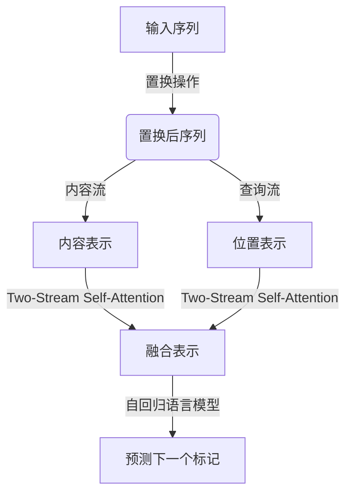

# XLNet原理与代码实例讲解

## 1.背景介绍

### 1.1 预训练语言模型的重要性

在自然语言处理(NLP)领域,预训练语言模型已经成为一种非常有效的技术,它能够从大规模语料库中学习通用的语言表示,从而为下游的NLP任务提供强大的语义表示能力。经典的预训练语言模型包括Word2Vec、GloVe、ELMo、GPT和BERT等,它们极大地推动了NLP技术的发展。

### 1.2 BERT模型的局限性

尽管BERT模型取得了巨大的成功,但它仍然存在一些局限性。BERT采用的是基于Transformer的编码器结构,在训练过程中使用了Masked Language Model(MLM)和Next Sentence Prediction(NSP)两个预训练任务。然而,MLM任务通过随机掩码的方式破坏了原始输入序列的自然语义连续性,而NSP任务则过于简单,无法很好地捕捉句子之间的关系。

### 1.3 XLNet的提出

为了解决BERT模型的上述缺陷,XLNet(XL nets)被提出。XLNet是由Carnegie Mellon University与Google Brain团队于2019年6月联合提出的一种新型的自回归语言模型,旨在更好地捕捉双向语境信息,并保持输入序列的自然语义连续性。

## 2.核心概念与联系

### 2.1 自回归语言模型

自回归语言模型(Autoregressive Language Model)是一种基于序列的生成模型,它将语句或文本序列建模为一个标记的条件概率序列。在自回归模型中,每个标记的概率都依赖于之前所有标记的条件概率,用数学公式表示为:

$$P(x) = \prod_{t=1}^{T}P(x_t|x_{<t})$$

其中$x$表示输入序列,长度为$T$。自回归语言模型的关键在于,它能够自然地捕捉输入序列的上下文语义信息,而不会破坏原始序列的连续性。

### 2.2 Transformer-XL

XLNet的设计灵感来源于Transformer-XL模型。Transformer-XL是一种改进版的Transformer模型,它引入了一种新的注意力机制,称为"Segment Recurrence",允许在较长的上下文依赖中捕获位置信息。这种注意力机制使得Transformer-XL能够更好地处理长期依赖关系,从而提高了语言模型的性能。

### 2.3 Permutation Language Modeling

XLNet的核心创新是提出了一种新的预训练目标,称为Permutation Language Modeling(PLM)。与BERT的MLM不同,PLM不会破坏输入序列的连续性,而是通过对输入序列进行有序的置换(Permutation)操作,从而最大化保留原始序列的上下文信息。具体来说,XLNet将输入序列$x$置换为$\hat{x}$,然后最大化置换后序列的概率:

$$\max_{\theta}\mathbb{E}_{{\hat{x}} \sim P_{perm}(x)}[\log P_{\theta}(\hat{x})]$$

其中$P_{perm}(x)$表示置换操作的概率分布,$\theta$是模型参数。通过这种方式,XLNet能够在预训练阶段同时利用上下文信息,从而更好地捕捉双向语境依赖关系。

### 2.4 Two-Stream Self-Attention

为了更高效地整合内容和位置信息,XLNet采用了一种新颖的注意力机制,称为Two-Stream Self-Attention。这种注意力机制将内容流(Content Stream)和查询流(Query Stream)分开,内容流负责编码实际的标记表示,而查询流则负责编码相对位置信息。通过这种分离,XLNet能够更好地融合内容和位置信息,提高语言表示的质量。

## 3.核心算法原理具体操作步骤

### 3.1 输入序列的置换

XLNet的第一步是对输入序列进行置换操作。具体来说,对于长度为$n$的输入序列$x=(x_1,x_2,...,x_n)$,XLNet会生成一个置换序列$\hat{x}=(\hat{x}_1,\hat{x}_2,...,\hat{x}_n)$,其中$\hat{x}_i=x_{\pi(i)}$,$\pi$是一个从$\{1,2,...,n\}$到$\{1,2,...,n\}$的排列(Permutation)。

置换操作的目的是为了最大化保留输入序列的上下文信息,同时避免像BERT中MLM任务那样破坏序列的自然连续性。XLNet采用了一种基于因子分解的置换策略,即先对输入序列进行分块,然后在每个块内进行置换。这种分块置换策略能够更好地保留长程依赖关系。

### 3.2 内容流和查询流

在完成置换操作后,XLNet将置换后的序列$\hat{x}$输入到Transformer的编码器中。不同于标准的Transformer,XLNet采用了Two-Stream Self-Attention机制,将内容流和查询流分开。

内容流负责编码实际的标记表示,它与标准的Transformer编码器类似,通过多头自注意力机制捕捉标记之间的依赖关系。而查询流则专门用于编码相对位置信息,它通过学习一个可训练的位置编码矩阵,为每个标记生成一个位置表示向量。

在自注意力计算过程中,内容流和查询流的表示将被结合起来,从而融合内容和位置信息。具体来说,对于每个标记$\hat{x}_i$,其注意力计算公式为:

$$\text{Attention}(\hat{x}_i) = \text{softmax}\left(\frac{Q(\hat{x}_i)K(\hat{x})^T}{\sqrt{d_k}}\right)V(\hat{x})$$

其中$Q(\hat{x}_i)$是查询向量(来自查询流),$K(\hat{x})$和$V(\hat{x})$分别是键向量和值向量(来自内容流),$d_k$是缩放因子。通过这种方式,XLNet能够同时利用内容和位置信息,从而更好地捕捉双向语境依赖关系。

### 3.3 自回归语言模型训练

在完成内容和位置信息的融合后,XLNet将置换后的序列$\hat{x}$输入到自回归语言模型中进行训练。自回归语言模型的目标是最大化置换后序列的概率:

$$\max_{\theta}\mathbb{E}_{{\hat{x}} \sim P_{perm}(x)}[\log P_{\theta}(\hat{x})]$$

其中$P_{perm}(x)$表示置换操作的概率分布,$\theta$是模型参数。在训练过程中,XLNet会对所有可能的置换序列$\hat{x}$进行求和,从而最大化原始序列$x$的边缘似然。

由于置换操作的存在,XLNet能够在预训练阶段同时利用上下文信息,从而更好地捕捉双向语境依赖关系。与BERT的MLM任务不同,XLNet不会破坏输入序列的自然语义连续性,因此能够更好地学习到语言的真实分布。

## 4.数学模型和公式详细讲解举例说明

### 4.1 自回归语言模型

自回归语言模型是XLNet的核心组成部分,它将语句或文本序列建模为一个标记的条件概率序列。对于一个长度为$T$的输入序列$x=(x_1,x_2,...,x_T)$,自回归语言模型的目标是最大化序列的概率:

$$P(x) = \prod_{t=1}^{T}P(x_t|x_{<t})$$

其中$x_{<t}$表示序列$x$中位于$t$之前的所有标记。这种建模方式能够自然地捕捉输入序列的上下文语义信息,而不会破坏原始序列的连续性。

在实际应用中,自回归语言模型通常采用神经网络的形式,例如循环神经网络(RNN)或Transformer等。对于XLNet,它使用了基于Transformer的编码器-解码器架构,其中编码器负责捕捉输入序列的上下文信息,解码器则根据编码器的输出预测下一个标记的概率分布。

### 4.2 Permutation Language Modeling

Permutation Language Modeling(PLM)是XLNet的核心创新,它通过对输入序列进行有序的置换操作,从而最大化保留原始序列的上下文信息。具体来说,对于一个长度为$n$的输入序列$x=(x_1,x_2,...,x_n)$,XLNet会生成一个置换序列$\hat{x}=(\hat{x}_1,\hat{x}_2,...,\hat{x}_n)$,其中$\hat{x}_i=x_{\pi(i)}$,$\pi$是一个从$\{1,2,...,n\}$到$\{1,2,...,n\}$的排列(Permutation)。

XLNet的目标是最大化置换后序列$\hat{x}$的概率:

$$\max_{\theta}\mathbb{E}_{{\hat{x}} \sim P_{perm}(x)}[\log P_{\theta}(\hat{x})]$$

其中$P_{perm}(x)$表示置换操作的概率分布,$\theta$是模型参数。在训练过程中,XLNet会对所有可能的置换序列$\hat{x}$进行求和,从而最大化原始序列$x$的边缘似然。

通过这种方式,XLNet能够在预训练阶段同时利用上下文信息,从而更好地捕捉双向语境依赖关系。与BERT的MLM任务不同,PLM不会破坏输入序列的自然语义连续性,因此能够更好地学习到语言的真实分布。

### 4.3 Two-Stream Self-Attention

为了更高效地整合内容和位置信息,XLNet采用了一种新颖的注意力机制,称为Two-Stream Self-Attention。这种注意力机制将内容流(Content Stream)和查询流(Query Stream)分开,内容流负责编码实际的标记表示,而查询流则负责编码相对位置信息。

具体来说,对于每个标记$\hat{x}_i$,其注意力计算公式为:

$$\text{Attention}(\hat{x}_i) = \text{softmax}\left(\frac{Q(\hat{x}_i)K(\hat{x})^T}{\sqrt{d_k}}\right)V(\hat{x})$$

其中$Q(\hat{x}_i)$是查询向量(来自查询流),$K(\hat{x})$和$V(\hat{x})$分别是键向量和值向量(来自内容流),$d_k$是缩放因子。

通过这种分离的方式,XLNet能够更好地融合内容和位置信息,提高语言表示的质量。同时,查询流中的可训练位置编码矩阵也能够更好地捕捉相对位置信息,从而提升模型的性能。

### 4.4 举例说明

为了更好地理解XLNet的工作原理,我们来看一个具体的例子。假设输入序列为"The quick brown fox jumps over the lazy dog"。

1. **输入序列的置换**

   首先,XLNet会对输入序列进行置换操作。假设置换后的序列为"fox brown quick The over jumps lazy the dog"。

2. **内容流和查询流**

   置换后的序列将被输入到Transformer的编码器中。内容流负责编码实际的标记表示,例如"fox"、"brown"等。而查询流则负责编码相对位置信息,例如"fox"在序列中的位置、"brown"相对于"fox"的位置等。

3. **Two-Stream Self-Attention**

   在自注意力计算过程中,内容流和查询流的表示将被结合起来。对于标记"fox",其注意力计算公式为:

   $$\text{Attention}("fox") = \text{softmax}\left(\frac{Q("fox")K(\hat{x})^T}{\sqrt{d_k}}\right)V(\hat{x})$$

   其中$Q("fox")$是"fox"的查询向量(来自查询流),$K(\hat{x})$和$V(\hat{x})$分别是整个序列的键向量和值向量(来自内容流)。通过这种方式,XLNet能够同时利用内容和位置信息,从而更好地捕捉双向语境依赖关系。

4. **自回归语言模型训练**

   最后,XLNet将融合了内容和位置信息的置换后序列输入到自回归语言模型中进行训练,