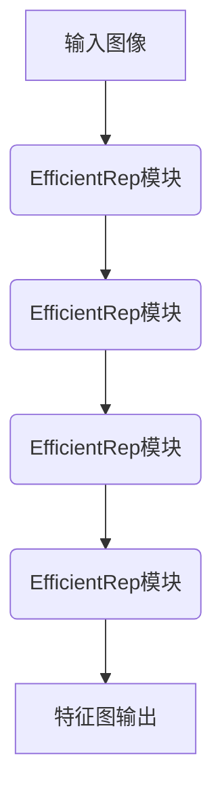
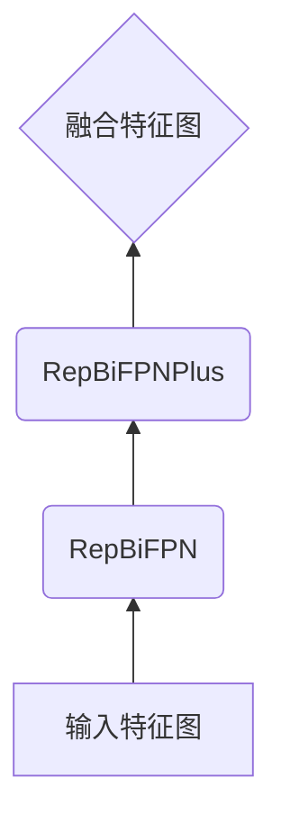
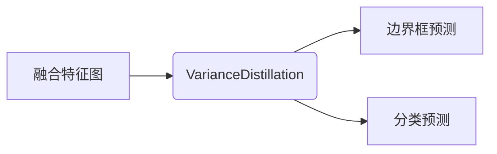

# YOLOv6原理与代码实例讲解

## 1.背景介绍

目标检测是计算机视觉领域的一个核心任务,它旨在从图像或视频中定位并识别出感兴趣的目标。随着深度学习技术的不断发展,基于卷积神经网络(CNN)的目标检测算法取得了巨大进展,在精度和速度方面都有了显著提升。

在这些算法中,YOLO(You Only Look Once)系列模型因其高效和准确而备受关注。最新的YOLOv6作为YOLO系列的最新版本,在保持高精度的同时进一步提高了推理速度,使其在各种应用场景下都表现出色。本文将深入探讨YOLOv6的核心原理、算法细节以及代码实现,帮助读者全面了解这一领先的目标检测模型。

## 2.核心概念与联系

### 2.1 YOLO系列模型概览

YOLO是一种基于端到端的目标检测方法,它将目标检测任务转化为回归问题。与传统的基于候选区域的目标检测算法不同,YOLO直接对整个图像进行预测,预测包括边界框位置和目标类别概率。

YOLO系列模型主要包括以下几个版本:

- YOLOv1(2015年)
- YOLOv2(2016年)
- YOLOv3(2018年)
- YOLOv4(2020年)
- YOLOv5(2020年)
- YOLOv6(2022年)

每个新版本都在精度、速度和鲁棒性等方面有所改进和优化。

### 2.2 YOLOv6的关键创新点

相比前几代YOLO模型,YOLOv6在以下几个方面进行了创新:

1. **骨干网络(Backbone)**: 采用了全新设计的高效EfficientRep模块,显著提升了骨干网络的表现力。

2. **注意力机制(Attention)**: 引入了RepBiFPN和RepBiFPNPlus等注意力模块,增强了特征表示能力。

3. **检测头(Head)**: 使用了Anchor-free的VarianceDistillation策略,简化了训练过程。

4. **自监督训练(Self-Supervised)**: 采用了Self-Supervised方法进行预训练,提高了模型的泛化能力。

5. **模型压缩(Model Compression)**: 通过知识蒸馏和量化等技术,实现了模型的高效压缩。

6. **推理优化(Inference Optimization)**: 使用了CUDA Kernel级别的优化,提升了推理速度。

这些创新使得YOLOv6在精度、速度和鲁棒性等多个维度上都达到了新的高度。

## 3.核心算法原理具体操作步骤 

### 3.1 输入预处理

YOLOv6的输入是一个固定尺寸的RGB图像,通常会对输入图像进行一些预处理操作,如归一化、调整尺寸等。这些操作可以提高模型的稳定性和精度。

### 3.2 骨干网络(Backbone)

骨干网络用于从输入图像中提取特征,YOLOv6采用了全新设计的高效EfficientRep模块作为骨干网络的基础组件。EfficientRep模块通过深度可分离卷积和注意力机制,实现了高效的特征提取。



### 3.3 特征金字塔(FPN)

为了融合不同尺度的特征,YOLOv6使用了RepBiFPN和RepBiFPNPlus等注意力增强的特征金字塔结构。这些模块可以有效地整合来自不同层次的特征,提高目标检测的精度。



### 3.4 检测头(Head)

检测头负责根据特征图预测边界框和目标类别。YOLOv6采用了Anchor-free的VarianceDistillation策略,通过知识蒸馏的方式简化了训练过程,提高了检测精度。



### 3.5 后处理

对于检测头的输出,需要进行一些后处理操作,如非极大值抑制(NMS)、阈值过滤等,以获得最终的检测结果。

## 4.数学模型和公式详细讲解举例说明

### 4.1 损失函数

YOLOv6采用了一种新的复合损失函数,包括分类损失、边界框回归损失和目标置信度损失等多个部分。具体形式如下:

$$
\begin{aligned}
L_{total} &= L_{cls} + L_{box} + L_{obj} \\
L_{cls} &= -\sum_{i=0}^{S^2}\sum_{j=0}^{B}\mathbb{1}_{ij}^{obj}\sum_{c\in classes}[p_{ij}(c)\log(\hat{p}_{ij}(c)) + (1-p_{ij}(c))\log(1-\hat{p}_{ij}(c))] \\
L_{box} &= \lambda_{coord}\sum_{i=0}^{S^2}\sum_{j=0}^{B}\mathbb{1}_{ij}^{obj}[(1-\hat{w}_{ij})^\alpha\log(1-w_{ij}) + (1-\hat{h}_{ij})^\beta\log(1-h_{ij})] \\
L_{obj} &= \lambda_{noobj}\sum_{i=0}^{S^2}\sum_{j=0}^{B}\mathbb{1}_{ij}^{noobj}[\hat{c}_{ij}\log(\hat{c}_{ij}) + (1-\hat{c}_{ij})\log(1-\hat{c}_{ij})]
\end{aligned}
$$

其中:

- $L_{cls}$是分类损失,使用交叉熵损失函数
- $L_{box}$是边界框回归损失,采用了一种新的参数化方式
- $L_{obj}$是目标置信度损失,用于区分目标和背景
- $\lambda_{coord}$和$\lambda_{noobj}$是平衡不同损失项的超参数

通过这种复合损失函数,YOLOv6可以同时优化分类、检测和回归任务,提高整体性能。

### 4.2 注意力模块

YOLOv6中的RepBiFPN和RepBiFPNPlus模块采用了一种新颖的注意力机制,可以有效地融合不同层次的特征。其中的关键是通道注意力(Channel Attention)和空间注意力(Spatial Attention)的交替使用。

对于通道注意力,公式如下:

$$
\begin{aligned}
f_{ca}(x) &= \sigma(W_2\delta(W_1x)) \\
y &= f_{ca}(x) \otimes x
\end{aligned}
$$

其中$\sigma$是Sigmoid激活函数,$\delta$是ReLU激活函数,$W_1$和$W_2$是可学习的权重矩阵,$ \otimes $表示元素wise乘积。

对于空间注意力,公式如下:

$$
\begin{aligned}
f_{sa}(x) &= \sigma(W_4\delta(W_3\text{AvgPool}(x))) \\
y &= f_{sa}(x) \otimes x
\end{aligned}
$$

其中$\text{AvgPool}$表示平均池化操作,其他符号含义类似。

通过交替使用通道注意力和空间注意力,RepBiFPN和RepBiFPNPlus可以自适应地选择和增强不同的特征,提高了特征表示的质量。

## 5.项目实践:代码实例和详细解释说明

以下是YOLOv6的PyTorch实现代码示例,包括骨干网络、特征金字塔和检测头等核心模块。

### 5.1 EfficientRep模块

```python
import torch
import torch.nn as nn

class EfficientRep(nn.Module):
    def __init__(self, in_channels, out_channels, stride=1):
        super(EfficientRep, self).__init__()
        self.stride = stride
        self.conv1 = nn.Conv2d(in_channels, out_channels, kernel_size=3, stride=stride, padding=1, groups=in_channels, bias=False)
        self.bn1 = nn.BatchNorm2d(out_channels)
        self.act1 = nn.SiLU(inplace=True)
        self.conv2 = nn.Conv2d(out_channels, out_channels, kernel_size=3, stride=1, padding=1, groups=out_channels, bias=False)
        self.bn2 = nn.BatchNorm2d(out_channels)
        self.act2 = nn.SiLU(inplace=True)
        self.shortcut = nn.Identity() if in_channels == out_channels and stride == 1 else nn.Conv2d(in_channels, out_channels, kernel_size=1, stride=stride, bias=False)
        self.bn3 = nn.BatchNorm2d(out_channels)
        self.act3 = nn.SiLU(inplace=True)

    def forward(self, x):
        shortcut = self.shortcut(x)
        x = self.conv1(x)
        x = self.bn1(x)
        x = self.act1(x)
        x = self.conv2(x)
        x = self.bn2(x)
        x = self.act2(x)
        x = x + shortcut
        x = self.bn3(x)
        x = self.act3(x)
        return x
```

EfficientRep模块是YOLOv6骨干网络的基础组件,它采用了深度可分离卷积和残差连接的设计,可以高效地提取特征。

### 5.2 RepBiFPN模块

```python
import torch
import torch.nn as nn
import torch.nn.functional as F

class RepBiFPN(nn.Module):
    def __init__(self, in_channels, out_channels, num_repeats=2):
        super(RepBiFPN, self).__init__()
        self.num_repeats = num_repeats
        self.conv_up = nn.Conv2d(out_channels, out_channels, kernel_size=3, stride=1, padding=1, groups=out_channels, bias=True)
        self.conv_down = nn.Conv2d(out_channels, out_channels, kernel_size=3, stride=1, padding=1, groups=out_channels, bias=True)
        self.conv_cross = nn.Conv2d(out_channels, out_channels, kernel_size=3, stride=1, padding=1, groups=out_channels, bias=True)
        self.bn = nn.BatchNorm2d(out_channels)
        self.act = nn.SiLU(inplace=True)

    def forward(self, inputs):
        p_out = [inputs[-1]]
        for i in range(self.num_repeats):
            p_in = p_out[-1]
            p_up = F.interpolate(inputs[-2], size=p_in.shape[-2:], mode='nearest')
            p_up = self.conv_up(p_up)
            p_down = F.max_pool2d(p_in, kernel_size=2, stride=2)
            p_down = self.conv_down(p_down)
            p_out.append(self.act(self.bn(p_in + p_up + p_down)))

        p_out = p_out[::-1]
        for i in range(self.num_repeats):
            p_in = p_out[-1]
            p_up = F.interpolate(p_out[-2], size=p_in.shape[-2:], mode='nearest')
            p_up = self.conv_up(p_up)
            p_cross = self.conv_cross(p_in)
            p_out.append(self.act(self.bn(p_up + p_cross)))

        return p_out[-1]
```

RepBiFPN模块是YOLOv6中用于构建特征金字塔的关键组件,它通过双向传播和注意力机制,实现了不同尺度特征的有效融合。

### 5.3 检测头

```python
import torch
import torch.nn as nn

class YOLOv6Head(nn.Module):
    def __init__(self, in_channels, num_anchors, num_classes):
        super(YOLOv6Head, self).__init__()
        self.num_anchors = num_anchors
        self.num_classes = num_classes
        self.conv_cls = nn.Conv2d(in_channels, num_anchors * num_classes, kernel_size=1, stride=1, padding=0)
        self.conv_box = nn.Conv2d(in_channels, num_anchors * 4, kernel_size=1, stride=1, padding=0)
        self.conv_obj = nn.Conv2d(in_channels, num_anchors * 1, kernel_size=1, stride=1, padding=0)

    def forward(self, x):
        cls_pred = self.conv_cls(x).permute(0, 2, 3, 1).contiguous().sigmoid()
        box_pred = self.conv_box(x).permute(0, 2, 3, 1).contiguous()
        obj_pred = self.conv_obj(x).permute(0, 2, 3, 1).contiguous().sigmoid()
        return cls_pred, box_pred, obj_pred
```

YOLOv6Head模块是检测头的实现,它