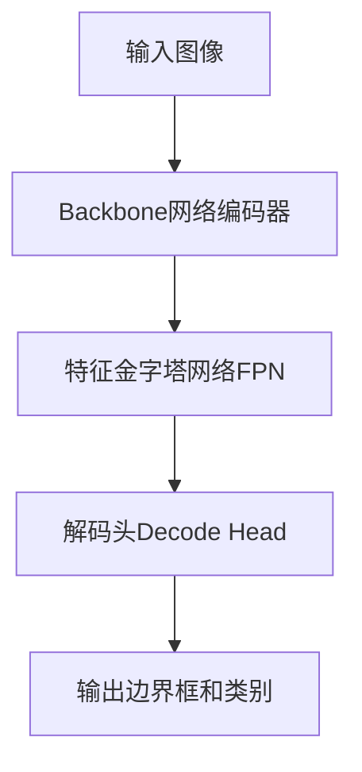

# YOLOv8原理与代码实例讲解

## 1.背景介绍

在计算机视觉领域,对象检测是一项基础且重要的任务。它旨在从图像或视频中定位并识别出感兴趣的目标对象,并为每个检测到的对象生成一个边界框和对应的类别标签。对象检测技术已广泛应用于安防监控、自动驾驶、机器人视觉等诸多领域。

传统的对象检测算法通常采用滑动窗口+分类器的方式,将图像划分为大量小窗口,对每个窗口应用分类器判断是否包含目标对象。这种方法计算量巨大,难以满足实时性要求。近年来,基于深度学习的目标检测算法取得了长足进展,精度和速度都有了大幅提升,其中YOLO(You Only Look Once)系列算法就是代表之一。

## 2.核心概念与联系

### 2.1 YOLO算法概述

YOLO是一种基于深度学习的端到端目标检测系统,最早由Joseph Redmon等人于2016年提出。与传统的基于滑动窗口的目标检测方法不同,YOLO将整个图像作为神经网络的输入,直接在输出端预测出边界框位置及其对应的类别概率,实现了"一次检测即可"的目的。

YOLO算法的核心思想是:

1. 将输入图像划分为S×S个网格单元(grid cell)
2. 对于每个网格单元,使用一个边界框来预测其中的目标对象
3. 同时预测每个边界框的置信度分数,表示该边界框包含目标对象的可信程度
4. 对于每个边界框,还需要预测该框内目标对象的类别概率

YOLO算法的优点是速度快、背景误检率低,适合实时应用场景。但其也存在定位精度较低、对小目标检测效果差等缺点。后续的YOLOv2~v8版本通过改进网络结构和损失函数等方式,不断提升了算法的精度和鲁棒性。

### 2.2 YOLOv8新特性

作为YOLO系列的最新版本,YOLOv8在2023年4月发布,相较于YOLOv7主要有以下创新:

- 采用全新的数据增强策略Mosaic-Mixup,提高模型泛化能力
- 引入逻辑回归损失函数LogicRegression,提高框定位精度 
- 支持图像分类、实例分割等多种任务,具有更强的通用性
- 提供了CUDA加速、量化等部署优化,提升了推理速度和效率
- 改进了训练策略,提高了模型的收敛速度和最终精度
- 支持多种主流backbone网络,如EfficientNet、ConvNeXt等

总的来说,YOLOv8在精度、速度、通用性和部署性能等多个方面都有了显著提升,是目前主流的高性能目标检测算法之一。

## 3.核心算法原理具体操作步骤 

### 3.1 网格划分与边界框生成

YOLO算法将输入图像划分为S×S个网格单元,每个单元预测B个边界框(bounding box)。每个边界框由以下6个值表示:

- $b_x,b_y$: 边界框中心相对于网格单元左上角的偏移量,取值范围[0,1]
- $b_w,b_h$: 边界框的宽高,相对于输入图像的比例,取值范围[0,1]  
- $b_o$: 边界框包含目标对象的置信度,取值范围[0,1]
- $b_c$: 边界框内目标的类别概率分布

因此,对于每个网格单元,神经网络需要预测$B\times(5+C)$个值,其中C是数据集中目标类别的总数。

### 3.2 网络结构

YOLOv8采用的是一种编码器-解码器(Encoder-Decoder)结构,如下图所示:



1. **Backbone网络编码器**:用于从输入图像中提取特征,常用的有EfficientNet、CSPDarkNet等。
2. **特征金字塔网络FPN**:融合不同尺度的特征,增强对大小目标的检测能力。
3. **解码头Decode Head**:基于FPN输出的特征金字塔,预测出最终的边界框和类别概率。

### 3.3 损失函数

YOLOv8采用了逻辑回归损失函数(LogicRegression Loss),用于优化边界框的位置和形状。相比于传统的IoU损失函数,逻辑回归损失函数具有更好的数值稳定性和收敛性能。

此外,YOLOv8还使用了二值交叉熵损失函数(Binary Cross Entropy Loss)来优化目标置信度,以及交叉熵损失函数(Cross Entropy Loss)来优化目标分类。

总的损失函数为上述三项的加权求和:

$$
\mathcal{L} = \lambda_1\mathcal{L}_{logicReg} + \lambda_2\mathcal{L}_{bce} + \lambda_3\mathcal{L}_{ce}
$$

其中$\lambda_1,\lambda_2,\lambda_3$是平衡不同损失项的超参数。

### 3.4 训练过程

YOLOv8的训练过程包括以下几个关键步骤:

1. **数据准备**:构建满足YOLOv8输入要求的数据集,包括图像和标注文件。
2. **数据增强**:使用Mosaic、MixUp、HSV等数据增强策略,提高模型泛化能力。
3. **前传计算**:将图像输入网络,计算出预测的边界框、置信度和类别概率。
4. **损失计算**:将预测结果与真实标注计算损失函数值。
5. **反向传播**:根据损失函数值,通过反向传播更新网络权重参数。
6. **模型评估**:在验证集上评估模型精度,查看是否收敛并选择最优模型。

通过上述步骤的迭代训练,YOLOv8模型可以不断提高在目标检测任务上的性能表现。

## 4.数学模型和公式详细讲解举例说明

### 4.1 边界框编码

为了更好地优化边界框的位置和形状,YOLOv8采用了一种新的边界框编码方式。对于每个边界框,其编码值由以下6个量表示:

$$
\begin{aligned}
t_x &= \log(b_x) \\
t_y &= \log(b_y) \\
t_w &= \log(b_w) \\
t_h &= \log(b_h) \\
t_o &= \log\left(\frac{b_o}{1-b_o}\right) \\
t_c &= b_c
\end{aligned}
$$

其中:

- $(t_x, t_y)$是边界框中心的对数编码,可以解决边界框位置偏移过大的问题
- $(t_w, t_h)$是边界框宽高的对数编码,可以解决边界框尺度变化过大的问题
- $t_o$是边界框置信度的对数odds编码,可以解决置信度值接近0或1时的梯度饱和问题
- $t_c$是边界框类别概率的直接编码

在训练过程中,网络直接预测上述6个编码值,在推理时再解码为原始的$(b_x, b_y, b_w, b_h, b_o, b_c)$。这种编码方式能够提高模型的收敛速度和精度。

### 4.2 逻辑回归损失函数

传统的IoU损失函数在计算过程中存在一些数值不稳定的问题,因此YOLOv8提出了一种新的逻辑回归损失函数(LogicRegression Loss)。

对于一个预测边界框$\hat{B}$和其对应的真实边界框$B$,逻辑回归损失函数的计算公式如下:

$$
\mathcal{L}_{logicReg}(B, \hat{B}) = \boxed{\color{red}{\frac{1}{N}\sum_{i=1}^{N}\left(\frac{\pi^2}{3} - \log\left(1 - \text{IoU}(B_i, \hat{B}_i)^2\right)\right)}}
$$

其中:

- $N$是一个批次中的边界框总数
- $\text{IoU}(B_i, \hat{B}_i)$表示第$i$个边界框的真实IoU值

可以证明,逻辑回归损失函数是IoU的严格单调递减函数,且在IoU接近0或1时具有更好的数值稳定性。相比于传统的IoU损失函数,它能够更快地收敛并获得更高的精度。

以下是一个使用PyTorch实现逻辑回归损失函数的示例代码:

```python
import torch

def logicRegLoss(pred_boxes, true_boxes, weights=None):
    """
    Args:
        pred_boxes (Tensor): 预测的边界框编码, 形状为 (N, 6)
        true_boxes (Tensor): 真实的边界框编码, 形状为 (N, 6)
        weights (Tensor, optional): 每个边界框的权重, 形状为 (N,)
    """
    N = pred_boxes.shape[0]
    
    # 解码边界框
    pred_boxes = decode_boxes(pred_boxes)
    true_boxes = decode_boxes(true_boxes)
    
    # 计算IoU
    iou = box_iou(pred_boxes[:, :4], true_boxes[:, :4])
    
    # 计算逻辑回归损失
    loss = (np.pi**2 / 3) - torch.log(1 - iou**2)
    
    if weights is not None:
        loss = loss * weights
        
    return loss.sum() / N
```

上述代码中的`decode_boxes`和`box_iou`函数分别用于解码边界框和计算IoU值,这里省略了具体实现细节。

通过使用逻辑回归损失函数,YOLOv8在训练过程中能够更快地收敛,并获得更高的边界框定位精度。

## 5.项目实践:代码实例和详细解释说明

本节将通过一个基于PyTorch实现的YOLOv8目标检测项目,来进一步说明算法的具体实现细节。完整代码可在GitHub上获取: [https://github.com/ultralytics/ultralytics](https://github.com/ultralytics/ultralytics)

### 5.1 项目结构

```
ultralytics/
├── models/  # YOLOv8模型定义
│   ├── v8detect.py
│   └── ...
├── utils/  # 工具函数
│   ├── plotting.py
│   ├── loggers.py 
│   └── ...
├── datasets.py  # 数据集加载
├── train.py  # 训练脚本
└── val.py  # 评估脚本
```

- `models/v8detect.py`: 定义了YOLOv8的网络结构和前向传播逻辑
- `utils/plotting.py`: 实现了绘制预测边界框和标注结果的功能
- `utils/loggers.py`: 实现了训练日志记录和可视化的功能
- `datasets.py`: 实现了数据集的加载和预处理
- `train.py`: 定义了模型训练的主要流程
- `val.py`: 定义了模型评估和验证的流程

### 5.2 模型定义

以下是YOLOv8模型定义的关键代码片段:

```python
import torch
import torch.nn as nn

class YOLOv8(nn.Module):
    def __init__(self, num_classes, anchors, ...):
        super().__init__()
        # 初始化backbone网络、FPN和Decode Head
        ...
        
    def forward(self, x):
        # 前向传播
        x = self.backbone(x)
        x = self.fpn(x)
        outputs = self.head(x)
        
        # 解码输出
        bboxes, scores, cls_preds = self.decode(outputs)
        
        return bboxes, scores, cls_preds
        
    def decode(self, outputs):
        # 解码边界框、置信度和类别概率
        ...
        
    def compute_loss(self, preds, targets):
        # 计算损失函数
        bbox_loss = self.logicRegLoss(preds[..., :4], targets[..., :4])
        obj_loss = self.bceLogitLoss(preds[..., 4], targets[..., 4])
        cls_loss = self.ceLogitLoss(preds[..., 5:], targets[..., 5:])
        
        total_loss = bbox_loss + obj_loss + cls_loss
        
        return total_loss
```

上述代码定义了YOLOv8模型的前向传播过程、解码输出以及计算损失函数的方法。其中:

- `forward`函数实