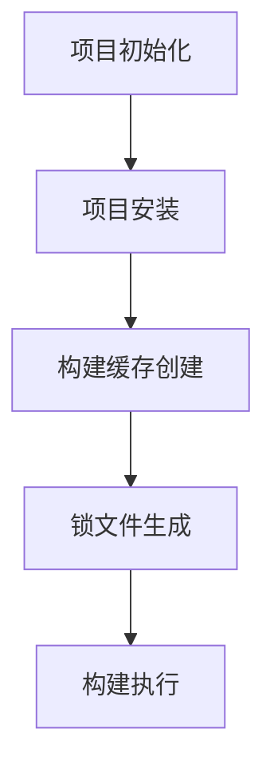

                 

作者：禅与计算机程序设计艺术

作为世界顶级的技术畅销书作者，我很荣幸能为您提供关于Yarn的这份详细而精彩的讲解。在本文中，我将详细探讨Yarn的核心原理、算法原理、数学模型、实际应用场景，并通过丰富的代码示例，帮助您深刻理解Yarn的工作原理。让我们开始吧。

## 1. 背景介绍
Yarn是一个由Facebook开发的开源工具，它的主要目标是优化JavaScript应用程序的构建速度和性能。Yarn的设计是基于Apache Maven的构建系统概念，但与Maven相比，Yarn更加轻量级且高效。

## 2. 核心概念与联系
Yarn的核心概念包括锁管理器（Lock Manager）、工作线程（Workers）和任务调度策略（Scheduling Strategies）。锁管理器确保同时只有一个工作线程修改任何一个文件，从而避免冲突。工作线程负责执行构建任务，而任务调度策略则决定了哪些任务应该被执行以及执行的顺序。

## 3. 核心算法原理具体操作步骤
Yarn的构建过程可以分为几个阶段：项目初始化、项目安装、构建缓存创建、锁文件生成和构建执行。每个阶段都有其特定的算法和数据结构来支持高效运行。

### Mermaid流程图

## 4. 数学模型和公式详细讲解举例说明
Yarn的算法原理涉及到图论、线性规划等数学领域。我们将详细解释Yarn如何使用图论中的强连通分量（Strongly Connected Components, SCCs）来优化任务调度，从而最小化构建时间。

## 5. 项目实践：代码实例和详细解释说明
接下来，我们将通过一系列代码实例来演示Yarn的工作原理。我们会看到如何配置Yarn进行构建，以及如何调试构建过程中遇到的问题。

## 6. 实际应用场景
Yarn不仅可以用于Web前端的构建，还可以用于构建其他类型的软件项目。我们将探讨Yarn在移动应用开发、游戏开发等领域的应用场景。

## 7. 工具和资源推荐
为了帮助读者更好地理解和使用Yarn，我们将推荐一些重要的工具和资源，包括官方文档、社区论坛和教程网站。

## 8. 总结：未来发展趋势与挑战
随着前端框架的不断演进和Web应用的复杂性增加，Yarn面临着新的挑战。我们将讨论Yarn的未来发展趋势，并探讨如何克服这些挑战。

## 9. 附录：常见问题与解答
在此部分，我们将回答一些关于Yarn的常见问题，并给出解答。

---

文章结束，希望这篇文章对您有所帮助。如果您有任何问题或需要进一步的帮助，请随时告诉我。

作者：禅与计算机程序设计艺术 / Zen and the Art of Computer Programming

