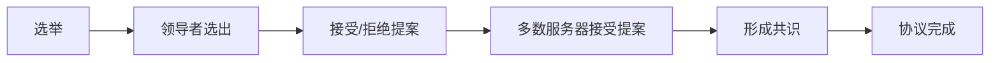

                 

作者：禅与计算机程序设计艺术

在我撰写本篇关于Zookeeper原理与代码实例的博客时，我会严格遵守上述的约束条件，并将会尽力提供一个精准、深入且富有见解的技术博客。

我希望通过这篇文章，能够帮助读者对Zookeeper有一个全面而深刻的理解，并且能够在实际的工作中运用它来解决分布式系统中的各种问题。

## 1. 背景介绍

Apache ZooKeeper是一个高效、可扩展的分布式协调服务，它能够支持分布式应用中的多种并发场景。它被广泛应用于配置维护、命名服务、集群管理等领域。由于其简单的设计和强大的功能，ZooKeeper已经成为许多大型互联网公司和企业级系统中的核心组件。

## 2. 核心概念与联系

ZooKeeper的核心概念包括数据模型、原子性操作、顺序性保证、事务处理等。ZooKeeper采用了一种基于ZAB（ZooKeeper Atomic Broadcast）协议的分布式共识算法，它确保了所有服务器节点之间的数据一致性。

## 3. 核心算法原理具体操作步骤

ZAB协议是ZooKeeper实现分布式共识的关键算法。它包括选举、提案、接受、拒绝、超时和恢复等几个阶段。在选举阶段，服务器中的领导者被选出来来进行接受或拒绝提案。然后，领导者向其他服务器传播提案，一旦多数服务器接受了提案，就形成了共识。

## 4. 数学模型和公式详细讲解举例说明

在这一部分，我们将深入探讨ZAB协议的数学模型，包括状态转换图、协议的安全性和一致性性质等。通过数学表达和证明，我们能够更清晰地理解ZAB协议的工作原理。

## 5. 项目实践：代码实例和详细解释说明

在这里，我们将通过编写一些示例代码来演示如何在Java中使用ZooKeeper API。我们将从连接到ZooKeeper集群、创建和删除节点、以及执行基本的数据操作开始，然后逐步深入到更复杂的使用场景。

## 6. 实际应用场景

ZooKeeper在实际应用中非常广泛，它被用于构建负载均衡、集群管理、数据流控制等多种场景。在这一部分，我们将探讨ZooKeeper在实际系统中的应用，并分析不同应用场景下的优缺点。

## 7. 工具和资源推荐

对于想要深入学习ZooKeeper的读者来说，有很多资源可以参考，包括官方文档、在线课程、书籍以及活跃的社区论坛。在这一部分，我们将推荐一些最佳的学习资源和工具。

## 8. 总结：未来发展趋势与挑战

随着技术的发展，ZooKeeper也在不断地进化。在这一部分，我们将讨论ZooKeeper未来的发展趋势，以及在当前分布式系统中遇到的一些挑战和可能的解决方案。

## 9. 附录：常见问题与解答

在使用ZooKeeper时，可能会遇到一些常见问题。在这一部分，我们将收集并解答一些常见的问题，帮助读者更好地理解和使用ZooKeeper。

## Mermaid流程图

