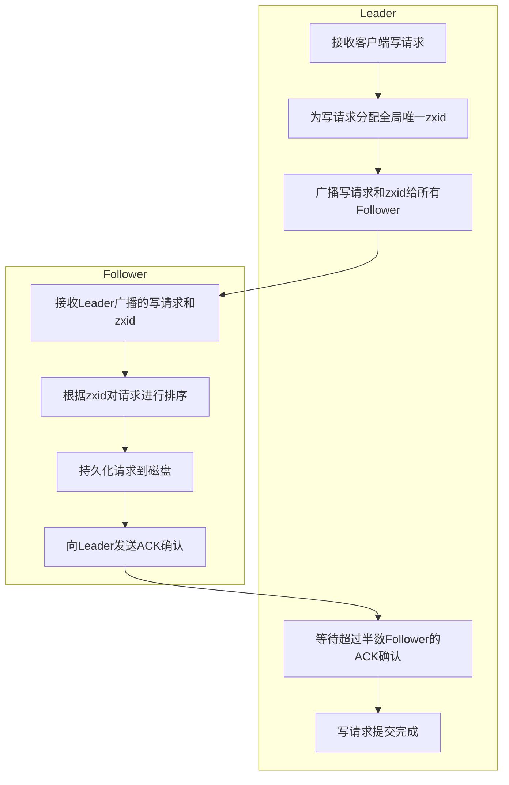

# Zookeeper原理与代码实例讲解

## 1.背景介绍

在分布式系统中,需要有一种服务来确保整个集群的数据一致性、提供集中式的系统协调服务,这就是Zookeeper的主要作用。Zookeeper是一个开源的分布式协调服务,为分布式应用提供高性能的分布式服务。它可以用于实现诸如数据发布/订阅、负载均衡、命名服务、分布式通知/协调、集群管理、Master选举、分布式锁和分布式队列等功能。

Zookeeper本身是一个分布式的、开源的分布式应用程序协调服务,是Google的Chubby的开源实现。它是一个为分布式应用提供一致性服务的软件,提供的功能包括:配置维护、域名服务、分布式同步、组服务等。

### 1.1 Zookeeper设计目标

Zookeeper的设计目标是:

- **简单的数据模型** - 使用文件系统目录树结构作为数据模型,方便数据浏览和理解。
- **可伸缩性** - 支持大数据量的存储,并能自动对数据进行分片和复制。
- **健壮性** - 使用了经过充分测试和使用的复制技术,能够很好地确保数据安全。
- **高性能** - 在读取数据方面性能非常高,能支持每秒数以万计的更新操作。
- **顺序访问** - 能够以高效、有序的方式实现消息传递。

### 1.2 Zookeeper应用场景

Zookeeper常见的应用场景包括:

- **统一命名服务** - 分布式应用中,通过使用顺序节点,很容易就可以实现全局唯一的ID生成。
- **配置管理** - 可将配置信息保存在Zookeeper的目录节点中,实现动态获取配置。
- **集群管理** - 可临时节点实现集群成员的入场和退出的通知。
- **分布式锁** - 可利用Zookeeper的临时顺序节点实现分布式锁。
- **队列管理** - 可利用节点的有序性来实现分布式队列管理。

## 2.核心概念与联系

### 2.1 Zookeeper数据模型

Zookeeper将所有数据存储在内存中,以树形层次命名空间的方式进行组织。树中的每个节点都被称为znode,并且其有一个与之关联的路径。Znode可以有子节点,并且每个znode可以存储数据,这些数据被当作znode的属性。

Znode有两种类型:

- **持久节点(PERSISTENT)** - 一旦创建就一直存在,直到主动删除。
- **临时节点(EPHEMERAL)** - 只有在客户端与Zookeeper保持连接时才存在,一旦断开连接则自动删除。

除了节点类型之外,Znode还具有其他一些特性:

- **顺序节点** - 顺序节点在创建时会自动根据创建顺序被编号。
- **只读节点** - 客户端无法修改只读节点的数据内容。
- **访问控制列表(ACL)** - 用于控制对znode的访问权限。

### 2.2 Zookeeper会话

Zookeeper为客户端维护了一个叫做会话(session)的概念。当客户端第一次连接到服务器时,会建立一个会话。通过会话,客户端能够发出心跳(heart beats)来与服务器保持有效的通信。只要会话一直保持有效,客户端就可以进行所有请求。

会话有一个关联的超时时间,如果服务器在该时间内没有检测到客户端的心跳,就会认为会话失效。之后客户端的所有临时节点都会被删除。

### 2.3 Zookeeper Watch机制

Watch(监视器)是Zookeeper非常重要的一个特性。客户端可以在指定的znode上设置Watch,一旦该znode发生变化(数据改变、节点删除或子节点发生变化),则Watch就会被触发,服务端会向指定的客户端发送通知。

Watch只会触发一次,如果需要继续监视,必须重新注册新的Watch。

### 2.4 Zookeeper版本

Zookeeper会为每个znode维护一个数据版本号(dataVersion)和子节点版本号(childrenVersion)。一旦数据或子节点发生变化,相应的版本号就会自增。版本号可用于实现数据的条件更新。

## 3.核心算法原理具体操作步骤

### 3.1 Zookeeper原子广播协议

Zookeeper使用原子广播协议来实现分布式系统状态的复制。它要求所有的写操作必须由一个服务器决定其顺序,这个决定写操作顺序的服务器被称为领导者(Leader)。

原子广播协议的基本工作流程如下:

1. 领导者从客户端获取写请求; 
2. 领导者为写请求分配一个全局唯一的递增事务ID(zxid);
3. 领导者将写请求和zxid广播给所有的跟随者(Follower);
4. 当跟随者收到写请求,会根据zxid对请求进行排序;
5. 跟随者将排序后的请求持久化到磁盘;
6. 跟随者完成请求持久化后,向领导者发送ACK确认消息;
7. 一旦领导者收到超过半数的ACK确认消息,则写请求被提交。

如果领导者崩溃,则会触发新一轮的领导者选举。新选举出的领导者必须确保所有未决的写请求被正确处理,才能开始接受新的写请求。

### 3.2 Zookeeper原子广播协议流程图



### 3.3 Zookeeper数据同步

Zookeeper采用主备模式,一个领导者(Leader)多个跟随者(Follower)。所有写请求都需要经过领导者处理,然后将结果同步给跟随者。

数据同步的基本流程:

1. 客户端发送写请求给领导者;
2. 领导者将写请求广播给所有跟随者;
3. 跟随者将写请求持久化到磁盘;
4. 跟随者向领导者发送ACK确认;
5. 当领导者收到超过半数的ACK确认,则提交写请求。

如果跟随者与领导者失去联系,则会尝试重新连接。如果重连失败,则会进入领导者选举状态。

## 4.数学模型和公式详细讲解举例说明

### 4.1 Zab协议

Zookeeper使用了一种叫做Zab(Zookeeper Atomic Broadcast)的原子广播协议,来保证分布式系统状态的最终一致性。

Zab协议的核心思想是,对于每个事务请求,都由一个服务器(Leader)为其分配一个全局唯一的递增编号(zxid),然后广播给集群中的其他服务器(Follower)。当超过半数的Follower接收到该请求并持久化后,才认为该请求被成功处理。

设有N个服务器,则Zab协议可以表述为:

$$
\begin{cases}
\text{Leader将请求广播给所有Follower} \\
\text{当收到大于}\frac{N}{2}\text{个Follower的ACK确认时,提交请求}
\end{cases}
$$

这样可以保证,如果有新的Leader被选举出来,它能够继续处理之前未完成的请求。

### 4.2 Leader选举

当Zookeeper集群启动或者Leader崩溃退出时,就需要进行新一轮的Leader选举。Zookeeper使用了一种基于投票的Leader选举算法。

算法步骤:

1. 服务器投票选举Leader;
2. 统计投票结果,得票数最多的服务器成为Leader;
3. 如果出现票数相同的情况,则选择服务器ID最大的作为Leader。

设有N个服务器,每个服务器的ID为$S_i(0 \le i < N)$,则Leader选举算法可以用数学归纳法表示为:

$$
\begin{cases}
\text{初始状态:} \forall i \in \{0, 1, ..., N-1\}, \text{票数} V_i = 1 \\
\text{选举阶段:} \forall i \in \{0, 1, ..., N-1\}, \text{投票给} \max\{S_j | V_j = \max\limits_{0 \le k < N} V_k\} \\
\text{结果:} \text{票数最多的} S_i \text{当选Leader}
\end{cases}
$$

这样可以保证最终只有一个Leader被选举出来。

## 5.项目实践：代码实例和详细解释说明

本节将通过一个简单的Java示例来演示如何使用Zookeeper客户端API创建、读取和更新znode。

### 5.1 Maven依赖

首先在Maven项目中添加Zookeeper客户端的依赖:

```xml
<dependency>
    <groupId>org.apache.zookeeper</groupId>
    <artifilId>zookeeper</artifilId>
    <version>3.6.3</version>
</dependency>
```

### 5.2 连接Zookeeper服务器

```java
import org.apache.zookeeper.WatchedEvent;
import org.apache.zookeeper.Watcher;
import org.apache.zookeeper.ZooKeeper;

public class ZookeeperDemo implements Watcher {

    private static final String ZOOKEEPER_ADDRESS = "localhost:2181";
    private static final int SESSION_TIMEOUT = 3000;
    private ZooKeeper zookeeper;

    public static void main(String[] args) throws Exception {
        ZookeeperDemo demo = new ZookeeperDemo();
        demo.connectToZookeeper();
        // 其他操作...
    }

    private void connectToZookeeper() throws Exception {
        this.zookeeper = new ZooKeeper(ZOOKEEPER_ADDRESS, SESSION_TIMEOUT, this);
    }

    @Override
    public void process(WatchedEvent event) {
        // 监听器回调方法
    }
}
```

这段代码创建了一个ZookeeperDemo类,实现了Watcher接口。在main方法中,首先调用connectToZookeeper()方法连接到Zookeeper服务器。

Zookeeper构造函数的三个参数分别是:

- Zookeeper服务器地址
- 会话超时时间(毫秒)
- 监听器实现(用于处理来自Zookeeper的监听事件)

### 5.3 创建znode

```java
import org.apache.zookeeper.CreateMode;

public void createZNode(String path, byte[] data) throws Exception {
    String result = this.zookeeper.create(path, data, ZooDefs.Ids.OPEN_ACL_UNSAFE, CreateMode.PERSISTENT);
    System.out.println("Created znode: " + result);
}
```

这段代码定义了一个createZNode方法,用于在指定路径创建一个新的持久znode。方法参数包括:

- path - znode路径
- data - 要存储在znode中的数据
- acl - 访问控制列表
- createMode - 创建模式,这里使用PERSISTENT表示创建持久节点

create方法返回实际创建的znode路径。

### 5.4 读取znode数据

```java
public void readZNodeData(String path) throws Exception {
    byte[] data = this.zookeeper.getData(path, false, null);
    String str = new String(data, StandardCharsets.UTF_8);
    System.out.println("Read data: " + str);
}
```

这段代码定义了一个readZNodeData方法,用于读取指定znode路径上的数据。方法参数包括:

- path - 要读取的znode路径
- watcher - 是否设置监听器,这里传false表示不设置
- stat - 用于存储znode状态的对象,这里传null

getData方法返回一个字节数组,表示znode中存储的数据。

### 5.5 更新znode数据

```java  
import org.apache.zookeeper.data.Stat;

public void updateZNodeData(String path, byte[] data) throws Exception {
    Stat stat = this.zookeeper.setData(path, data, -1);
    System.out.println("Updated znode data, version: " + stat.getVersion());
}
```

这段代码定义了一个updateZNodeData方法,用于更新指定znode路径上的数据。方法参数包括:

- path