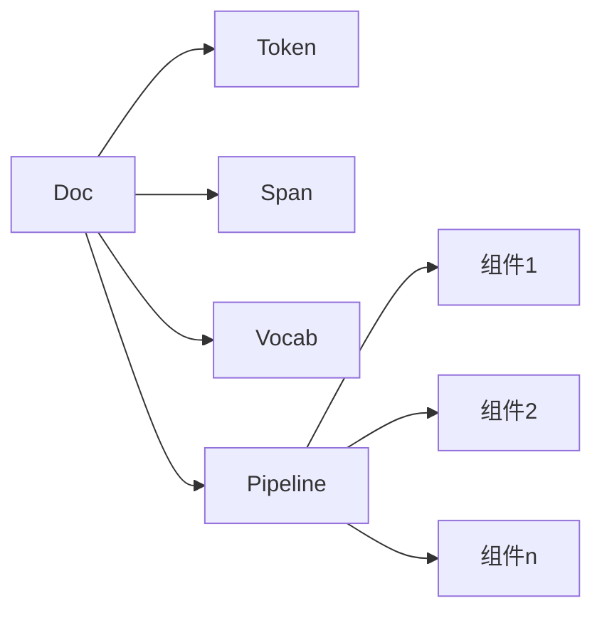

# spaCy 原理与代码实战案例讲解

## 1. 背景介绍

### 1.1 自然语言处理的重要性

在当今的数字时代,自然语言处理(NLP)已经成为人工智能领域中最重要和最具挑战性的研究方向之一。随着海量非结构化文本数据的快速增长,有效地处理和理解自然语言数据对于各种应用领域(如信息检索、文本挖掘、机器翻译、对话系统等)都具有极其重要的意义。

### 1.2 spaCy 简介

spaCy 是一个用 Python 编写的开源自然语言处理库,旨在构建用于深度学习的软件产品。它可以执行诸如命名实体识别、依存关系解析、词性标注等常见的 NLP 任务,并且具有出色的性能和可扩展性。spaCy 的设计理念是提供生产级别的系统,能够以最小的复杂性和内存占用运行在 CPU 上。

## 2. 核心概念与联系

### 2.1 NLP 基本概念

1. **语料库(Corpus)**: 指用于自然语言处理任务的大量文本数据集合。

2. **标记(Token)**: 文本被分割成一个个最小有意义的单元,每个这样的单元称为一个标记。

3. **词性(Part-of-Speech)**: 词性是指单词在句子中所扮演的语法角色,如名词、动词、形容词等。

4. **命名实体识别(Named Entity Recognition, NER)**: 从文本中识别出人名、地名、组织机构名等实体名称。

5. **依存关系解析(Dependency Parsing)**: 确定句子中词与词之间的依存关系,如主语、宾语等语法关系。

### 2.2 spaCy 核心数据结构

1. **Doc**: 表示一个文档对象,包含了被处理文本的所有标记。

2. **Token**: 表示文档中的一个单词标记,包含了该标记的文本内容、词性等信息。

3. **Span**: 表示文档中一个连续的标记序列,常用于表示命名实体等。

4. **Vocab**: 表示文档所使用的词汇集合,存储了每个单词的哈希值。

5. **Pipeline**: 表示一系列按顺序执行的组件,用于执行不同的 NLP 任务。



## 3. 核心算法原理具体操作步骤

### 3.1 标记化(Tokenization)

标记化是 NLP 任务的第一步,将原始文本按照一定规则分割成一个个最小有意义的单元(Token)。spaCy 的标记化算法采用了基于前缀和后缀规则的方法,并内置了多种语言的规则。

1. 加载英文语言模型: `nlp = spacy.load("en_core_web_sm")`
2. 对文本进行标记化: `doc = nlp("This is a sentence.")`
3. 遍历每个 Token: `for token in doc: print(token.text)`

### 3.2 词性标注(Part-of-Speech Tagging)

词性标注是确定每个单词在句子中的语法角色,如名词、动词、形容词等。spaCy 使用基于统计模型的序列标注算法进行词性标注。

```python
doc = nlp("Apple is looking at buying U.K. startup for $1 billion")
for token in doc:
    print(f"{token.text:{12}} {token.pos_:{6}} {spacy.explain(token.pos_)}")
```

### 3.3 命名实体识别(Named Entity Recognition)

命名实体识别是从文本中识别出人名、地名、组织机构名等实体名称的过程。spaCy 使用基于神经网络的序列标注模型进行 NER。

```python
doc = nlp("Apple is looking at buying U.K. startup for $1 billion")
for ent in doc.ents:
    print(f"{ent.text:{16}} {ent.label_}")
```

### 3.4 依存关系解析(Dependency Parsing)

依存关系解析是确定句子中词与词之间的依存关系,如主语、宾语等语法关系。spaCy 使用基于过渡的神经网络依存解析器。

```python
doc = nlp("Apple is looking at buying U.K. startup for $1 billion")
for token in doc:
    print(f"{token.text:{12}} {token.dep_:{10}} {spacy.explain(token.dep_)}")
```

## 4. 数学模型和公式详细讲解举例说明

### 4.1 条件随机场(Conditional Random Field, CRF)

条件随机场是一种用于序列标注任务(如词性标注、命名实体识别等)的概率无向图模型。CRF 模型的目标是给定观测序列 $X$,求条件概率 $P(Y|X)$ 最大的标记序列 $Y$。

令 $X=(x_1, x_2, ..., x_n)$ 表示输入观测序列, $Y=(y_1, y_2, ..., y_n)$ 表示对应的标记序列,那么 CRF 的条件概率可以表示为:

$$P(Y|X) = \frac{1}{Z(X)}\exp\left(\sum_{i=1}^{n}\sum_{k}\lambda_kt_k(y_{i-1},y_i,X,i) + \sum_{i=1}^{n}\sum_{l}\mu_ls_l(y_i,X,i)\right)$$

其中:
- $Z(X)$ 是归一化因子
- $t_k$ 是转移特征函数,用于得分 $y_{i-1}$ 到 $y_i$ 的转移
- $s_l$ 是状态特征函数,用于得分 $y_i$ 本身
- $\lambda_k$ 和 $\mu_l$ 是对应的权值

通过训练数据学习 $\lambda$ 和 $\mu$ 的值,从而最大化条件概率,得到最优的标记序列。

### 4.2 双向 LSTM CRF

传统的 CRF 模型使用的是基于人工设计的特征函数,而神经网络 CRF 模型可以自动从数据中学习特征。spaCy 使用了双向 LSTM 与 CRF 相结合的模型进行序列标注任务。


该模型结构包括:

1. **字符级 BiLSTM 编码**: 将每个单词的字符序列输入到 BiLSTM,获得字符级别的表示。
2. **词级 BiLSTM 编码**: 将词向量与上一步的字符级表示拼接,输入到另一个 BiLSTM,获得词级别的上下文表示。
3. **CRF 解码层**: 将 BiLSTM 的输出传递给 CRF 层,进行序列标注预测。

通过端到端的训练,该模型能够同时学习字符和词级别的特征表示,提高了标注的准确性。

## 5. 项目实践: 代码实例和详细解释说明

### 5.1 加载语言模型

```python
import spacy

# 加载英文语言模型
nlp = spacy.load("en_core_web_sm")
```

spaCy 提供了针对多种语言的预训练模型,可以根据需求选择合适的模型。`en_core_web_sm` 是一个较小的英文模型,包含了标记化、词性标注等常用功能。

### 5.2 基本文本处理

```python
doc = nlp("Apple is looking at buying U.K. startup for $1 billion")

# 遍历每个 Token
for token in doc:
    print(token.text, token.pos_, token.dep_)

# 获取命名实体
for ent in doc.ents:
    print(ent.text, ent.label_)
```

输出:

```
Apple PROPN nsubj
is VERB aux
looking VERB ROOT
at ADP prep
buying VERB pcomp
U.K. PROPN compound
startup NOUN dobj
for ADP prep
$ SYM quantmod
1 NUM compound
billion NUM pobj
for ADP prep

U.K. GPE
$ MONEY
1 MONEY
billion MONEY
```

可以看到,spaCy 能够对文本进行标记化、词性标注、命名实体识别等基本处理。

### 5.3 依存关系解析

```python
doc = nlp("The brown fox didn't eat the lazy dog because it was full.")
svg = spacy.displacy.render(doc, style="dep")
output_path = Path("sentence_dependency.svg")
output_path.open("w", encoding="utf-8").write(svg)
```

以上代码将依存关系解析的结果输出到一个 SVG 文件中,如下所示:


可以清晰地看到每个单词的依存关系,如 `fox` 是 `brown` 的修饰语,`eat` 是句子的核心动词,`because` 引导原因状语从句等。

### 5.4 自定义组件

spaCy 允许用户自定义组件并添加到管道中,以满足特定的需求。下面是一个将所有单词大写的简单组件示例:

```python
import spacy
from spacy.language import Language

@Language.component("uppercase")
def uppercase(doc):
    # 创建一个新的 Doc 对象,并修改所有 Token 的文本为大写
    new_doc = doc.copy()
    for token in new_doc:
        token.text = token.text.upper()
    return new_doc

# 加载语言模型并添加自定义组件
nlp = spacy.load("en_core_web_sm")
nlp.add_pipe("uppercase", last=True)

doc = nlp("Hello world!")
print(doc.text)  # 输出 "HELLO WORLD!"
```

通过自定义组件,可以实现各种定制化的文本处理功能,并集成到 spaCy 的管道中。

## 6. 实际应用场景

spaCy 作为功能强大的 NLP 库,可以应用于多个领域:

1. **信息检索**: 通过命名实体识别和关系抽取,提高搜索引擎的检索质量。

2. **文本挖掘**: 对大规模文本数据进行结构化处理,发现有价值的信息和模式。

3. **知识图谱构建**: 从非结构化文本中抽取实体、关系等知识元素,构建知识图谱。

4. **问答系统**: 利用 NLP 技术从文本中理解问题的语义,给出准确的答案。

5. **自动文摘**: 对文档进行语义分析,提取出关键信息并生成文摘。

6. **情感分析**: 通过分析文本的情感倾向,了解用户对产品或服务的反馈。

7. **智能写作辅助**: 基于 NLP 技术提供语法纠错、自动续写等辅助功能。

## 7. 工具和资源推荐

1. **spaCy 官方文档**: https://spacy.io/
2. **spaCy 课程**: https://course.spacy.io/
3. **spaCy Universe**: https://spacy.io/universe (spaCy 生态系统中的各种预训练模型、可视化工具等)
4. **Prodigy**: https://prodi.gy/ (spaCy 开发的数据标注工具)
5. **AllenNLP**: https://allennlp.org/ (另一个流行的 NLP 库)
6. **HuggingFace Transformers**: https://huggingface.co/transformers/ (涵盖多种 NLP 预训练模型)
7. **NLP Progress**: https://nlpprogress.com/ (NLP 领域的最新研究进展跟踪)

## 8. 总结: 未来发展趋势与挑战

### 8.1 未来发展趋势

1. **预训练语言模型**: 像 BERT、GPT 等基于 Transformer 的预训练语言模型将继续主导 NLP 领域,并在下游任务中取得更好的表现。

2. **多模态学习**: 将视觉、语音等其他模态的信息融合到 NLP 系统中,实现多模态学习和理解。

3. **少样本学习**: 减少对大量标注数据的依赖,通过元学习、微调等技术实现少样本或零样本学习。

4. **可解释性**: 提高 NLP 模型的可解释性,使预测结果更加透明和可信。

5. **知识图谱增强**: 利用知识图谱作为外部知识源,增强 NLP 模型的理解和推理能力。

6. **生成式任务**: 在文本生成、对话系统、问答等生成式任务上取得重大突破。

### 8.2 挑战与难题

1. **长期依赖建模**: 如何更好地捕捉文本中的长距离依赖关系。