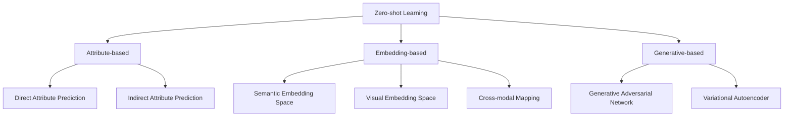

# zero-shot原理与代码实战案例讲解

## 1.背景介绍
### 1.1 人工智能的发展历程
### 1.2 机器学习的局限性
### 1.3 zero-shot learning的提出

## 2.核心概念与联系
### 2.1 zero-shot learning的定义
#### 2.1.1 传统机器学习与zero-shot learning的区别
#### 2.1.2 zero-shot learning的特点
### 2.2 zero-shot learning的分类
#### 2.2.1 Attribute-based方法
#### 2.2.2 Embedding-based方法 
#### 2.2.3 Generative-based方法
### 2.3 zero-shot learning与few-shot learning、one-shot learning的关系

## 3.核心算法原理具体操作步骤
### 3.1 基于属性的zero-shot learning
#### 3.1.1 Direct Attribute Prediction (DAP)
#### 3.1.2 Indirect Attribute Prediction (IAP)
### 3.2 基于嵌入的zero-shot learning  
#### 3.2.1 语义嵌入空间
#### 3.2.2 可视化嵌入空间
#### 3.2.3 跨模态转换
### 3.3 基于生成的zero-shot learning
#### 3.3.1 生成式对抗网络(GAN)
#### 3.3.2 变分自编码器(VAE) 

## 4.数学模型和公式详细讲解举例说明
### 4.1 基于属性的zero-shot learning数学模型
#### 4.1.1 DAP模型推导与证明
#### 4.1.2 IAP模型推导与证明
### 4.2 基于嵌入的zero-shot learning数学模型  
#### 4.2.1 跨模态转换的数学原理
#### 4.2.2 语义到视觉嵌入的映射函数
### 4.3 基于生成的zero-shot learning数学模型
#### 4.3.1 GAN的数学原理与目标函数
#### 4.3.2 VAE的数学原理与证明

## 5.项目实践：代码实例和详细解释说明
### 5.1 基于属性的zero-shot learning代码实践
#### 5.1.1 DAP算法Pytorch代码实现
#### 5.1.2 IAP算法Pytorch代码实现
### 5.2 基于嵌入的zero-shot learning代码实践
#### 5.2.1 语义-视觉嵌入映射网络Pytorch实现  
#### 5.2.2 跨模态转换网络Pytorch实现
### 5.3 基于生成的zero-shot learning代码实践  
#### 5.3.1 zero-shot GAN网络Pytorch实现
#### 5.3.2 zero-shot VAE网络Pytorch实现

## 6.实际应用场景
### 6.1 zero-shot learning在计算机视觉中的应用
#### 6.1.1 zero-shot图像分类
#### 6.1.2 zero-shot目标检测 
### 6.2 zero-shot learning在自然语言处理中的应用
#### 6.2.1 zero-shot文本分类
#### 6.2.2 zero-shot关系抽取
### 6.3 zero-shot learning在多模态学习中的应用
#### 6.3.1 zero-shot图像描述生成
#### 6.3.2 zero-shot视频动作识别

## 7.工具和资源推荐
### 7.1 主流的zero-shot learning数据集
### 7.2 主流的zero-shot learning开源代码框架
### 7.3 zero-shot learning相关学习资源

## 8.总结：未来发展趋势与挑战
### 8.1 zero-shot learning未来的研究方向 
### 8.2 zero-shot learning面临的挑战
### 8.3 zero-shot learning与其他领域结合的前景

## 9.附录：常见问题与解答
### 9.1 zero-shot learning与传统监督学习的区别是什么？
### 9.2 zero-shot learning的优缺点分别是什么？
### 9.3 zero-shot learning在实际应用中会遇到哪些问题？



zero-shot learning是人工智能和机器学习领域的一个新兴研究方向，它旨在解决传统监督学习的局限性，即模型只能识别训练集中出现过的类别。与之相比，zero-shot learning希望模型能够识别训练时未曾见过的新类别，这对于现实世界中长尾分布的数据和不断涌现的新概念具有重要意义。

zero-shot learning的核心思想是利用已知类别的知识来预测未知类别。具体来说，它通过学习已知类别的语义属性或特征表示，建立起语义空间与视觉空间的映射关系，从而将未知类别的视觉样本映射到语义空间中进行分类。根据建模方式的不同，zero-shot learning可以分为基于属性、基于嵌入和基于生成三大类。

基于属性的方法显式地建模类别与属性之间的关联，代表工作有DAP和IAP。DAP通过属性分类器直接预测图像的属性，再利用属性到类别的映射关系得到图像所属的类别。而IAP先利用属性分类器预测每个训练类别的属性，再学习属性到类别的映射函数，最后将其应用到未知类别。数学上，DAP和IAP可以表示为:

$$
\begin{aligned}
\hat{y} &= \mathop{\arg\max}_{y \in \mathcal{Y}} p(y|x) \\
&= \mathop{\arg\max}_{y \in \mathcal{Y}} \prod_{m=1}^{M} p(a_m|x)^{\mathbbm{1}(a_m,y)}
\end{aligned}
$$

其中$\mathcal{Y}$是候选类别集合，$\mathbbm{1}(a_m,y)$表示类别$y$是否拥有属性$a_m$。

基于嵌入的方法旨在学习视觉特征空间到语义嵌入空间的映射函数。首先利用预训练的CNN提取图像特征，然后通过最近邻搜索、线性映射、多层感知机等方式学习特征空间到语义空间的映射。测试时，将图像特征映射到语义空间，再通过最近邻分类或阈值比较得到图像的类别。著名的基于嵌入的模型有DeViSE、ConSE、SAE等。

基于生成的方法利用生成式模型如GAN和VAE来合成未知类别的样本，将zero-shot learning转化为传统的监督学习问题。通过生成大量的未知类别训练数据，可以提升模型的泛化能力。代表工作有GAZSL、cycle-(U)WGAN等。数学上，GAN和VAE的目标函数可以表示为:

$$
\begin{aligned}
\min_{G} \max_{D} \mathbb{E}_{x \sim p_{data}(x)}[\log D(x)] + \mathbb{E}_{z \sim p_{z}(z)}[\log (1-D(G(z)))] \\
\mathcal{L}(\theta, \phi) = -\mathbb{E}_{z \sim q_{\phi}(z|x)}[\log p_{\theta}(x|z)] + \text{KL}(q_{\phi}(z|x) \| p(z))
\end{aligned}
$$

其中$G$和$D$分别表示生成器和判别器，$p_{data}$和$p_z$分别表示真实数据分布和隐变量先验分布，$\theta$和$\phi$是VAE的解码器和编码器参数。

在代码实现方面，主流的深度学习框架如Pytorch和TensorFlow都对zero-shot learning提供了很好的支持。以基于属性的DAP算法为例，我们可以用Pytorch实现如下：

```python
import torch
import torch.nn as nn

class DAP(nn.Module):
    def __init__(self, num_attrs, num_classes):
        super(DAP, self).__init__()
        self.attr_classifier = nn.Sequential(
            nn.Linear(512, 1024), 
            nn.ReLU(True),
            nn.Linear(1024, num_attrs)  
        )
        self.attr_to_class = nn.Parameter(torch.rand(num_classes, num_attrs))
        
    def forward(self, x):
        attr_pred = torch.sigmoid(self.attr_classifier(x))
        class_score = torch.prod(self.attr_to_class ** attr_pred, dim=1) 
        return class_score
```

其中`attr_classifier`是属性分类器，`attr_to_class`是属性到类别的映射矩阵。前向传播时，先预测样本的属性，再通过属性到类别的映射关系得到最终的类别评分。

zero-shot learning在计算机视觉、自然语言处理、多模态学习等领域都有广泛应用。比如在图像分类任务中，利用zero-shot learning可以识别出训练时未曾见过的新物体类别；在文本分类任务中，zero-shot learning能够对新的主题或领域进行分类；在图像描述生成任务中，zero-shot learning使得模型能够描述出训练时未曾见过的新场景。

尽管zero-shot learning取得了长足进展，但它仍然面临着语义空间与视觉空间的异构鸿沟、类别蔓延等挑战。如何缩小跨模态的语义差异，如何避免将属性过度泛化到不相关的类别，是zero-shot learning需要攻克的难题。此外，将zero-shot learning与持续学习、主动学习、强化学习等方向结合，探索更加智能、高效、鲁棒的学习范式，也是今后的重要研究方向。

总的来说，zero-shot learning是一个充满想象力和创新性的研究领域，为人工智能走向通用化、常识化提供了新的思路。展望未来，zero-shot learning有望在更多实际场景中得到应用，让机器具备更强的学习迁移和知识泛化能力，真正成为智能时代的关键使能技术。

作者：禅与计算机程序设计艺术 / Zen and the Art of Computer Programming