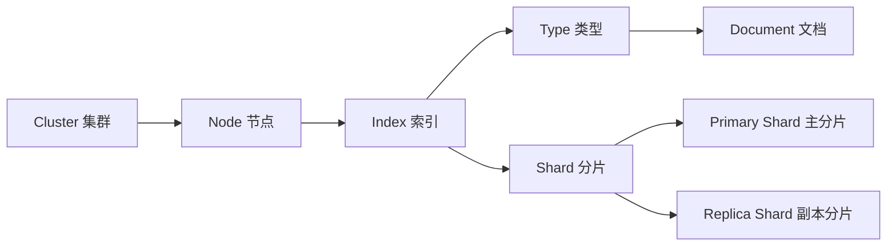
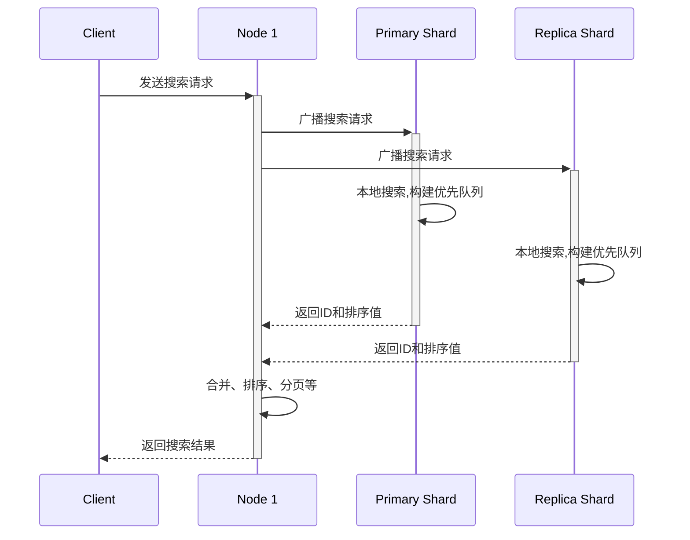

# 【AI大数据计算原理与代码实例讲解】ElasticSearch

## 1. 背景介绍

### 1.1 大数据时代的数据处理挑战

在当今大数据时代,我们面临着海量数据的处理和分析挑战。传统的关系型数据库已经无法满足实时性、可扩展性和高并发等需求。因此,急需一种高效、可扩展的分布式搜索和分析引擎。

### 1.2 ElasticSearch 的诞生

ElasticSearch 应运而生,它是一个基于 Lucene 的开源分布式搜索和分析引擎。ElasticSearch 提供了一个分布式多用户能力的全文搜索引擎,基于 RESTful Web 接口,能够达到实时搜索、稳定可靠、快速、安装使用方便。

### 1.3 ElasticSearch 的应用场景

ElasticSearch 在很多场景中得到广泛应用,例如:

- 海量日志数据分析
- 电商网站商品搜索
- 企业员工信息检索
- 金融风控实时监控
- 地理位置信息检索

ElasticSearch 凭借其卓越的性能和灵活性,已成为大数据领域不可或缺的利器。

## 2. 核心概念与联系

### 2.1 Near Realtime (NRT) 

ElasticSearch 是一个近实时搜索平台。这意味着,从索引一个文档到这个文档可被搜索只需要很小的延迟,通常是1秒。

### 2.2 Cluster 集群

集群是一个或多个节点(服务器)的集合,它们共同保存整个数据,并提供跨所有节点的联合索引和搜索功能。每个集群都有一个唯一的名称标识,默认是"elasticsearch"。

### 2.3 Node 节点

节点是指属于集群的单个服务器,存储数据,并参与集群的索引和搜索功能。节点通过配置集群名称的方式来加入一个指定的集群。

### 2.4 Index 索引

索引是具有某种相似特征的文档集合。比如,可以有一个客户数据的索引,一个产品目录的索引,以及一个订单数据的索引。索引由一个名称标识,并通过这个名称引用索引。

### 2.5 Type 类型

在索引中,可以定义一个或多个类型。类型是索引的一个逻辑类别/分区,其语义完全取决于用户。一般来说,类型定义了文档的字段。

### 2.6 Document 文档 

文档是可以被索引的基本信息单位。比如,可以拥有某一个客户的文档,某一个产品的一个文档,当然,也可以拥有某个订单的一个文档。文档以 JSON 格式来表示。

### 2.7 Shards & Replicas 分片与副本

索引可能存储大量数据,这些数据可能超出单个节点的硬件限制。为了解决这个问题,ElasticSearch 提供了将索引细分为多个分片的能力。创建索引时,可以简单地定义所需的分片数量。每个分片本身就是一个功能完善并且独立的"索引",可以托管在集群中的任何节点上。

分片的一个重要性质是,它们能够支持水平扩展。分片机制使得可以将分片分布到集群中所有的节点上,从而让索引的大小不再受单机的限制。

为了确保高可用,索引的分片可以使用一个或多个副本。复制分片就是所谓的"副本分片",它们是主分片的完整副本。副本分片由两个重要作用:

1. 在硬件故障时提供高可用性。因此,需要注意到,一个副本分片永远不会与原/主要分片置于同一节点。
2. 扩展搜索量/吞吐量,因为搜索可以在所有副本上并行运行。

### 2.8 核心概念之间的关系

下面是 ElasticSearch 核心概念之间的关系图:



从图中可以看出:

- 集群包含多个节点
- 节点存储了索引的数据
- 索引包含了多个类型
- 类型包含了多个文档
- 索引的数据被分成多个分片
- 每个分片有主分片和副本分片

理解了这些核心概念之间的关系,对于深入学习 ElasticSearch 非常有帮助。

## 3. 核心算法原理具体操作步骤

### 3.1 倒排索引

ElasticSearch 使用一种称为"倒排索引"的数据结构,它适合于快速的全文搜索。

一个倒排索引由文档中所有不重复词的列表构成,对于其中每个词,有一个包含它的文档列表。 

例如,假设我们有两个文档,每个文档的内容如下:

```
Study every day, good good up to forever # 文档1包含的内容
To forever, study every day, good good up # 文档2包含的内容
```

为了创建倒排索引,我们首先将每个文档的内容分成单独的词(或称为词条或者tokens),创建一个包含所有不重复词条的排序列表,然后列出每个词条出现在哪个文档。结果如下:

```
单词ID  单词      文档ID列表
1       Study     1,2
2       To        2
3       every     1,2
4       forever   1,2
5       day       1,2
6       good      1,2
7       up        1,2
```

这就是一个倒排索引。

### 3.2 分析

分析包含下面的过程:

- 将一块文本分成适合于倒排索引的独立的词条
- 将这些词条统一化为标准格式以提高它们的"可搜索性",或者 recall

分析器执行上面的工作。分析器实际上是将三个功能封装到了一个包里:

- 字符过滤器:首先,字符串按顺序通过每个字符过滤器。他们的任务是在分词前整理字符串。一个字符过滤器可以用来去掉HTML,或者将 & 转化成 and。
- 分词器:其次,字符串被分词器分为单个的词条。一个简单的分词器遇到空格和标点的时候,可能会将文本拆分成词条。
- Token 过滤器:最后,词条按顺序通过每个 token 过滤器。这个过程可能会改变词条(例如,小写化 Quick ),删除词条(例如,像 a,and,the 等无用词),或者增加词条(例如,像 jump 和 leap 这种同义词)。

### 3.3 搜索的过程

搜索的过程如下:

1. 客户端向 Node 1 发送搜索请求。 
2. 节点 1 接收到请求后,会先将查询请求广播到所有的 Primary Shard 以及 Replica Shard。
3. 每个分片在本地执行搜索并构建一个匹配文档的优先队列。
4. 每个分片返回各自优先队列中所有文档的 ID 和排序值给协调节点,由协调节点进行数据的合并、排序、分页等操作,产出最终结果。
5. 接着由协调节点返回结果给客户端。



## 4. 数学模型和公式详细讲解举例说明

### 4.1 相关性评分模型 TF-IDF

ElasticSearch 使用的默认相关性评分模型是 TF-IDF,即 Term Frequency-Inverse Document Frequency。

TF-IDF 是一种统计方法,用以评估一个词条对于一个文件集或一个语料库中的其中一份文件的重要程度。一个词条的重要性随着它在文件中出现的次数成正比增加,但同时会随着它在语料库中出现的频率成反比下降。

TF-IDF 的主要思想是:如果某个词或短语在一篇文章中出现的频率高,并且在其他文章中很少出现,则认为此词或者短语具有很好的类别区分能力,适合用来分类。

TF-IDF 的数学公式如下:

$$ tfidf(t, d, D) = tf(t, d) \times idf(t, D) $$

其中:

- $t$ 表示词条
- $d$ 表示文档
- $D$ 表示文档集合
- $tf(t, d)$ 表示词条 $t$ 在文档 $d$ 中的词频
- $idf(t, D)$ 表示词条 $t$ 在文档集合 $D$ 中的逆文档频率

$idf$ 的计算公式如下:

$$ idf(t, D) = log \frac{N}{|\{d \in D: t \in d\}|} $$

其中:

- $N$ 表示文档集合 $D$ 中的文档总数
- $|\{d \in D: t \in d\}|$ 表示包含词条 $t$ 的文档数

例如,假设我们有一个文档集合,包含1000个文档。其中,词条 "ElasticSearch" 在100个文档中出现过。那么,"ElasticSearch" 这个词的 $idf$ 计算如下:

$$ idf("ElasticSearch", D) = log \frac{1000}{100} = 1 $$

如果另一个词条 "Lucene" 在1000个文档中出现过,那么它的 $idf$ 就是:

$$ idf("Lucene", D) = log \frac{1000}{1000} = 0 $$

可以看出,"ElasticSearch" 这个词比 "Lucene" 更能区分文档,因为它的 $idf$ 值更高。

### 4.2 BM25 相关性算法

除了 TF-IDF,ElasticSearch 还支持其他的相关性评分算法,如 BM25。

BM25 考虑了文档长度对相关性的影响。它的基本思想是,对于一个给定的查询,包含查询中大部分词条的文档应该比包含较少词条的文档更相关。但是,如果两个文档包含相同数量的查询词条,那么较短的文档可能比较长的文档更相关。

BM25 的数学公式如下:

$$
score(D,Q) = \sum_{i=1}^n IDF(q_i) \cdot \frac{f(q_i, D) \cdot (k_1 + 1)}{f(q_i, D) + k_1 \cdot (1 - b + b \cdot \frac{|D|}{avgdl})}
$$

其中:

- $IDF(q_i)$ 是查询词条 $q_i$ 的逆文档频率
- $f(q_i, D)$ 是词条 $q_i$ 在文档 $D$ 中的频率
- $|D|$ 是文档 $D$ 的长度(即文档中词条的个数)
- $avgdl$ 是文档集合中文档的平均长度
- $k_1$ 和 $b$ 是自由参数,通常 $k_1$ 取值在 1.2 到 2.0 之间,$b$ 的取值在 0.5 到 0.8 之间

## 5. 项目实践:代码实例和详细解释说明

下面我们通过一个实际的 Python 代码例子,来演示如何使用 ElasticSearch 进行数据的索引和搜索。

### 5.1 安装和启动 ElasticSearch

首先,我们需要安装 ElasticSearch。可以从官网下载适合你操作系统的版本并解压。

然后,我们可以通过命令行启动 ElasticSearch:

```bash
./bin/elasticsearch
```

### 5.2 安装 Python 客户端

我们需要安装 Python 的 ElasticSearch 客户端库:

```bash
pip install elasticsearch
```

### 5.3 建立连接

```python
from elasticsearch import Elasticsearch

# 默认连接本地的 9200 端口
es = Elasticsearch() 
```

### 5.4 创建索引

```python
# 定义索引的 Mapping
mapping = {
    'properties': {
        'title': {
            'type': 'text',
            'analyzer': 'ik