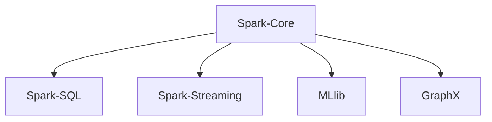

# 【AI大数据计算原理与代码实例讲解】MLlib

## 1. 背景介绍

### 1.1 大数据时代的机遇与挑战

随着互联网、物联网、云计算等技术的快速发展,人类社会已经进入了大数据时代。海量的数据每时每刻都在被生成和累积,这些数据蕴含着巨大的价值,如何有效地存储、处理和分析这些大数据,已经成为各行各业亟待解决的问题。大数据为人工智能的发展提供了前所未有的机遇,但同时也带来了诸多技术挑战。

### 1.2 大数据计算框架概述

为了应对大数据处理的需求,学术界和工业界都在积极探索和实践各种大数据计算框架和工具。其中,Hadoop 作为开源的分布式计算平台,以其良好的可扩展性、容错性和易用性,已经成为大数据处理事实上的标准。Spark 是专为大规模数据处理而设计的快速通用的计算引擎,相比 Hadoop MapReduce,Spark 基于内存计算,可以提供更高的性能和效率。

### 1.3 机器学习库 MLlib 简介

MLlib 是 Spark 的机器学习库,旨在使实用的机器学习变得简单和可扩展。它由一些常见的机器学习算法和实用程序组成,包括分类、回归、聚类、协同过滤、降维以及底层优化原语。MLlib 可以有效利用 Spark 的分布式内存计算能力,实现高性能的机器学习和数据挖掘。

## 2. 核心概念与联系

### 2.1 机器学习基本概念

机器学习是人工智能的一个重要分支,旨在让计算机系统从数据中自动分析获得规律,并利用规律对未知数据进行预测。机器学习主要包括监督学习、无监督学习和强化学习三大类别。监督学习是从标注数据中学习预测模型,代表算法有决策树、支持向量机等。无监督学习是从无标注数据中发现数据的内在结构和规律,代表算法有聚类、降维等。强化学习是智能体通过与环境的交互获得奖赏,不断优化策略以获得最大化的累积奖赏。

### 2.2 分布式计算与机器学习

传统的机器学习算法大多是单机版的,难以应对海量数据的处理需求。分布式计算为机器学习算法的并行化提供了有力支撑。通过将数据和计算任务分配到多个节点,可以显著提升机器学习的执行效率。同时,分布式机器学习还需要考虑如何最小化节点间的通信开销,以及如何容错和负载均衡。

### 2.3 MLlib 的系统架构

MLlib 基于 Spark 的分布式计算引擎,充分利用了 Spark 的 RDD(弹性分布式数据集)编程模型。MLlib 中的算法和模型都是基于 RDD 构建的,可以实现高效的分布式执行。下图展示了 MLlib 在 Spark 生态系统中的位置:

MLlib 目前支持四种常见的机器学习问题:分类、回归、聚类和协同过滤。同时还提供了相关的特征处理、模型评估等辅助工具。未来,MLlib 还将持续扩展新的算法,完善机器学习工作流程。

## 3. 核心算法原理与具体步骤

本节将详细介绍 MLlib 中几种常用的机器学习算法的原理和具体步骤,包括逻辑回归、决策树、K-means 聚类和交替最小二乘法。

### 3.1 逻辑回归

逻辑回归是监督学习中的一种常用分类算法,用于二分类问题。给定一组训练样本 $(x_i,y_i)$,其中 $x_i$ 是特征向量,$y_i \in {0,1}$ 是二元标签,逻辑回归希望学习一个线性模型:

$$f(x) = \frac{1}{1+e^{-w^Tx}}$$

使得 $f(x)$ 逼近 $y$ 的概率分布。这里 $w$ 是待学习的权重参数。逻辑回归采用极大似然估计来求解 $w$,即最小化负对数似然损失:

$$\min_w \sum_i \left[ -y_i \log f(x_i) - (1-y_i) \log (1-f(x_i)) \right]$$

MLlib 中实现了两种逻辑回归优化算法:梯度下降法和 L-BFGS。梯度下降法通过迭代计算损失函数的梯度并更新权重,直到收敛。L-BFGS 是拟牛顿法的一种,利用梯度的一阶信息和海森矩阵的近似二阶信息,可以更快速地收敛到最优解。

### 3.2 决策树

决策树是一种基本的分类和回归方法。直观地看,决策树模型就是一个树形结构,其中每个内部节点表示一个属性上的判断,每个分支代表一个判断结果的输出,最后每个叶节点对应一种分类或回归结果。学习决策树的过程,就是根据训练数据,选择最优属性划分的过程。

MLlib 支持决策树的两种常见算法:ID3 和 CART。ID3 采用信息增益作为属性选择度量,生成的是多叉树。CART 采用 GINI 系数作为属性选择度量,生成的是二叉树。决策树的生成过程如下:

1. 如果训练集中所有实例属于同一类,则返回该类的单节点树;
2. 如果属性集为空,则返回实例数最多的类;
3. 否则,选择最优划分属性,根据该属性的每个取值,将训练集分割成子集,递归地构建子树。

决策树容易过拟合,因此通常需要对生成的树进行剪枝。MLlib 中实现了预剪枝和后剪枝两种策略。

### 3.3 K-means聚类

K-means 是最为经典的聚类算法之一。给定数据集 $D = {x_1,\dots,x_n}$,K-means 的目标是将 $D$ 划分为 $K$ 个簇 $C = {C_1,\dots,C_K}$,使得每个簇内的样本尽可能相似,不同簇之间的样本尽可能不同。这可以形式化为最小化平方误差:

$$\min_{C} \sum_{k=1}^K \sum_{x_i \in C_k} \lVert x_i - \mu_k \rVert^2$$

其中 $\mu_k$ 是簇 $C_k$ 的中心点。K-means 采用迭代优化的策略,交替执行以下两个步骤直到收敛:

1. 簇分配:对每个样本 $x_i$,找到距离最近的簇中心 $\mu_k$,将 $x_i$ 分配到该簇。
2. 簇中心更新:对每个簇 $C_k$,重新计算簇中心 $\mu_k$ 为簇内所有样本的均值。

MLlib 中实现了两种 K-means 的变体:K-means|| 和 Streaming K-means。前者通过并行化减少迭代次数,后者支持在数据流上增量聚类。

### 3.4 交替最小二乘法

交替最小二乘法(ALS)是推荐系统中的重要算法,常用于基于模型的协同过滤。给定 $m$ 个用户和 $n$ 个物品的评分矩阵 $R$,ALS 将其分解为用户特征矩阵 $U$ 和物品特征矩阵 $V$,使得 $R \approx U^TV$。$U$ 和 $V$ 通过最小化平方误差得到:

$$\min_{U,V} \sum_{i,j} (r_{ij} - u_i^T v_j)^2 + \lambda (\lVert U \rVert^2 + \lVert V \rVert^2)$$

这里 $\lambda$ 是正则化系数。ALS 的基本思想是,通过固定一个未知矩阵求解另一个未知矩阵,交替迭代直到收敛。MLlib 实现了并行化的 ALS,可以处理大规模的评分数据。

## 4. 数学模型和公式详细讲解举例说明

本节将通过具体的例子来讲解 MLlib 中涉及的一些关键数学模型和公式。

### 4.1 逻辑回归的似然函数推导

在逻辑回归中,我们假设样本的标签 $y$ 服从 Bernoulli 分布,即:

$$P(y=1|x;w) = f(x) = \frac{1}{1+e^{-w^Tx}}$$
$$P(y=0|x;w) = 1 - f(x) = \frac{e^{-w^Tx}}{1+e^{-w^Tx}}$$

对于训练样本 $(x_i,y_i)$,其似然函数为:

$$P(y_i|x_i;w) = f(x_i)^{y_i} (1-f(x_i))^{1-y_i}$$

假设样本独立同分布,则训练集 $D = {(x_1,y_1),\dots,(x_n,y_n)}$ 的似然函数为:

$$\begin{aligned}
L(w) &= \prod_{i=1}^n P(y_i|x_i;w) \\
&= \prod_{i=1}^n f(x_i)^{y_i} (1-f(x_i))^{1-y_i}
\end{aligned}$$

取对数得到对数似然函数:

$$\begin{aligned}
\log L(w) &= \sum_{i=1}^n \left[ y_i \log f(x_i) + (1-y_i) \log (1-f(x_i)) \right] \\
&= \sum_{i=1}^n \left[ y_i \log \frac{1}{1+e^{-w^Tx_i}} + (1-y_i) \log \frac{e^{-w^Tx_i}}{1+e^{-w^Tx_i}} \right]
\end{aligned}$$

最大化对数似然函数等价于最小化负对数似然损失:

$$\min_w \sum_{i=1}^n \left[ -y_i \log f(x_i) - (1-y_i) \log (1-f(x_i)) \right]$$

这就是逻辑回归的目标函数。可以通过梯度下降法或者牛顿法求解最优的权重参数 $w$。

### 4.2 决策树的信息增益计算

ID3 决策树学习的关键是在每个节点选择最优划分属性。直观上,我们希望选择一个属性,使得划分后的子节点尽可能纯净。信息增益就是用来衡量一个属性对训练数据集的纯净度贡献大小。

假设当前节点包含的样本集合为 $D$,类别数为 $K$,第 $k$ 类样本所占的比例为 $p_k$,则 $D$ 的信息熵定义为:

$$H(D) = -\sum_{k=1}^K p_k \log p_k$$

直观理解,熵越大,数据集的纯度越低。现在考虑按照属性 $a$ 划分 $D$ 为 $V$ 个子集 ${D_1,\dots,D_V}$,则划分后的信息熵为:

$$H(D|a) = \sum_{v=1}^V \frac{|D_v|}{|D|} H(D_v)$$

属性 $a$ 对数据集 $D$ 的信息增益定义为:

$$g(D,a) = H(D) - H(D|a)$$

一般地,信息增益越大,意味着使用属性 $a$ 划分所获得的纯度提升越大。因此,ID3 决策树学习算法总是选择具有最大信息增益的属性作为当前节点的划分属性。

举个例子,假设有如下训练数据集:

| 天气   | 温度   | 湿度   | 风     | 是否外出 |
|--------|--------|--------|--------|----------|
| 晴     | 高     | 高     | 无     | 否       |
| 晴     | 高     | 高     | 有     | 否       |
| 阴     | 高     | 高     | 无     | 是       |
| 雨     | 中     | 高     | 无     | 是       |
| 雨     | 低     | 正常   | 无     | 是       |
| 雨     | 低     | 正常   | 有     | 否       |
| 阴     | 低     | 正常   | 有     | 是       |