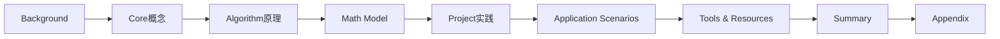

                 

作者：禅与计算机程序设计艺术

Spark 在大数据领域的应用

## 1.背景介绍
大数据时代，数据的量和速度以前所未有的速度增长，传统的批处理计算方式已经无法满足实时分析和处理数据的需求。Apache Spark 作为一个开源的、高效的数据处理引擎，它通过其灵活的编程模型支持多种编程语言（包括Scala, Java, Python和R），能够快速地执行数据处理任务，特别是在大规模数据集上。此外，Spark支持SQL查询，Streaming API，Machine Learning库，以及GraphX图处理库，使得Spark成为了处理大数据的强大工具。

## 2.核心概念与联系
Apache Spark的核心概念包括Resilient Distributed Datasets (RDD)和Directed Acyclic Graph (DAG). RDD是一种分布式存储的抽象，它允许数据在集群中并行计算而不会丢失数据。DAG则是一个无环图，它描述了数据处理过程中的依赖关系。Spark通过将数据和操作组合成一个单一的物理计划来优化执行。

## 3.核心算法原理具体操作步骤
Spark的核心算法包括Shuffle、Sort、Join等。这些算法在大数据处理中非常关键，但同时也是效率低下的瓶颈。Spark通过其内置的优化器来改善这些算法的性能，例如通过减少网络消耗，减少数据传输次数。

## 4.数学模型和公式详细讲解举例说明
对于Spark中的数学模型，我们需要考虑数据的分布、聚集策略和负载均衡等因素。例如，在进行排序操作时，Spark会使用一种称为“sort skew”的技术来减少排序的开销。

## 5.项目实践：代码实例和详细解释说明
在本节中，我们将通过一个具体的案例分析Spark的使用流程。例如，我们可以使用Python进行编程，来演示如何加载数据到RDD，执行各种转换操作，并最终进行数据的分析。

## 6.实际应用场景
Spark在各个行业都有广泛的应用，从金融分析到社交媒体分析，再到生物信息学研究，Spark都能够提供强大的处理能力。

## 7.工具和资源推荐
对于希望深入学习Spark的读者，有许多资源可以利用，包括官方文档、在线课程、教科书和论坛。这些资源能帮助用户更好地理解和运用Spark。

## 8.总结：未来发展趋势与挑战
随着AI和机器学习技术的发展，Spark在数据处理方面的重要性将继续增加。然而，随着数据量的不断增长，如何进一步优化Spark的性能，以及如何确保数据的安全性和隐私性将是未来的主要挑战之一。

## 9.附录：常见问题与解答
在此部分，我们将回顾一些Spark使用过程中常见的问题，并给出相应的解答。

### Mermaid 流程图 ###

