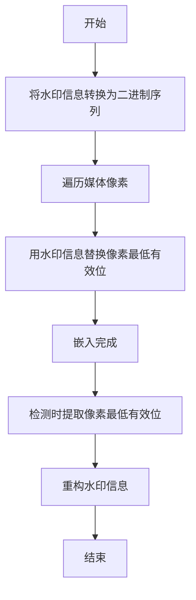
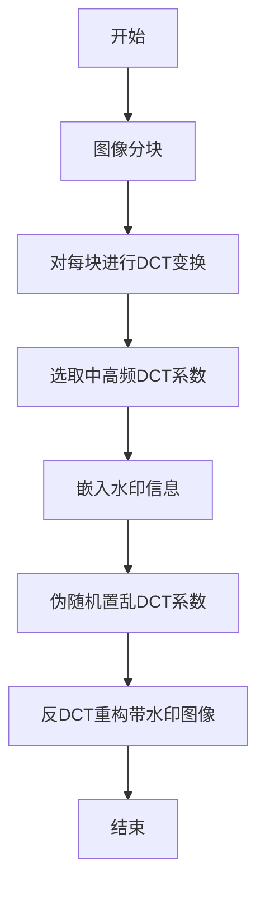
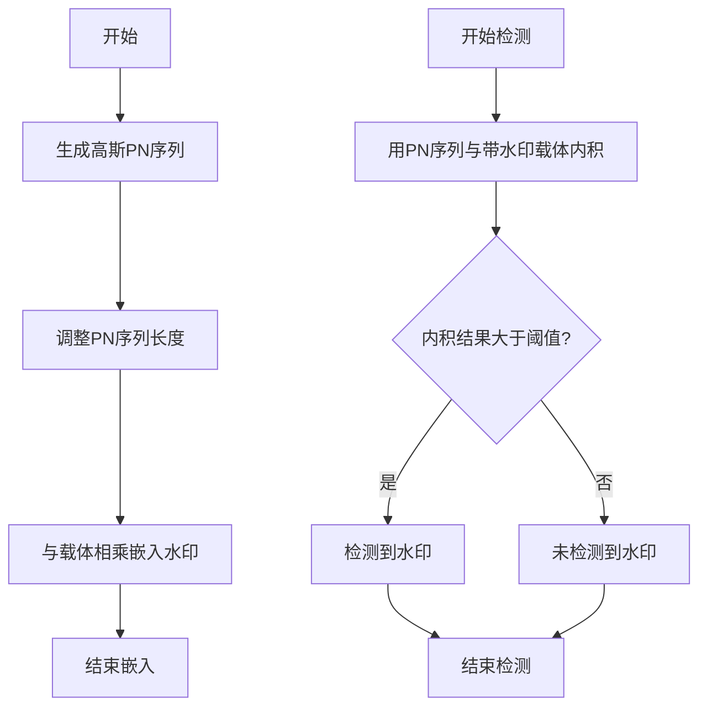

# 【AI大数据计算原理与代码实例讲解】Watermark

## 1. 背景介绍

### 1.1 数字水印的重要性

在当今数字时代,信息安全和版权保护已经成为一个极其重要的课题。随着互联网的快速发展,数字媒体的传播变得前所未有的便捷,但同时也带来了数字版权被侵犯的风险。为了保护数字媒体的知识产权,数字水印技术应运而生。

数字水印是一种将某些标记信息隐藏在数字媒体(如图像、视频、音频等)中的技术,这些标记信息可用于识别版权所有者、追踪非法传播途径等。与传统的可见水印不同,数字水印是隐形的,不会影响媒体的质量和用户体验。

### 1.2 水印在大数据时代的应用

随着大数据时代的到来,海量的数字媒体数据被广泛应用于各个领域,数字水印技术也面临新的挑战和机遇。一方面,大数据环境下的数字媒体传播更加复杂,版权保护的难度加大;另一方面,大数据技术为水印算法的优化和应用提供了新的思路。

本文将重点探讨数字水印在大数据环境下的应用,介绍水印算法的原理、实现方式以及在实际场景中的应用,并对未来的发展趋势进行展望。

## 2. 核心概念与联系

### 2.1 数字水印的基本概念

数字水印技术主要包括以下三个核心概念:

1. **水印嵌入(Watermark Embedding)**: 将标记信息隐藏在数字媒体中的过程。
2. **水印检测(Watermark Detection)**: 从被嵌入水印的数字媒体中提取出水印信息的过程。
3. **鲁棒性(Robustness)**: 水印算法对各种攻击(如压缩、滤波、几何变换等)的抗性能。

### 2.2 水印算法分类

根据嵌入域的不同,数字水印算法可分为:

1. **空域水印(Spatial Domain Watermarking)**: 直接在像素域对媒体进行修改。
2. **变换域水印(Transform Domain Watermarking)**: 先将媒体转换到变换域(如DCT、DWT等),然后在变换系数上嵌入水印。

根据应用场景的不同,水印算法又可分为:

1. **盲水印(Blind Watermarking)**: 不需要原始媒体,只利用水印信息和密钥进行检测。
2. **半盲水印(Semi-Blind Watermarking)**: 需要原始媒体的部分信息进行检测。
3. **非盲水印(Non-Blind Watermarking)**: 需要完整的原始媒体进行检测。

### 2.3 水印算法评价指标

评价一个水印算法的好坏,通常需要考虑以下几个指标:

1. **鲁棒性**: 对各种攻击的抗性能。
2. **无失真性**: 嵌入水印后,原始媒体质量的损失程度。
3. **容量**: 可嵌入的水印信息量。
4. **安全性**: 防止水印被恶意删除或伪造的能力。
5. **计算复杂度**: 嵌入和检测过程的时间和空间开销。

## 3. 核心算法原理具体操作步骤

### 3.1 空域水印算法

空域水印算法直接在像素域对媒体进行修改,操作简单,计算开销小。但鲁棒性较差,容易被常见的信号处理操作破坏。

最典型的空域水印算法是**最小置换编码(LSB)**。其基本思路是:将水印信息的每一位二进制值替换掉媒体像素的最低有效位,从而实现水印嵌入。

LSB算法的具体步骤如下:

1. 将水印信息转换为二进制序列。
2. 依次遍历媒体像素,用水印信息替换像素的最低有效位。
3. 检测时,提取出所有像素的最低有效位,即可获得水印信息。



### 3.2 变换域水印算法

相比空域算法,变换域水印算法具有更好的鲁棒性和无失真性,是当前研究的主流方向。

**离散余弦变换(DCT)** 和 **离散小波变换(DWT)** 是两种常用的变换域。DCT主要应用于JPEG压缩图像,而DWT则更适合于多分辨率分析。

以DCT域算法为例,其嵌入步骤如下:

1. 将载体图像分块,对每个块进行DCT变换。
2. 根据人眼对低频分量的敏感程度,选取中高频系数嵌入水印。
3. 对嵌入水印的DCT系数进行伪随机置乱。
4. 应用反DCT变换,重构加入水印的图像。

检测时,按相反的步骤提取出水印信息。



### 3.3 盲水印算法

盲水印算法不需要原始载体,只利用水印信息和密钥即可进行检测,在内容分发和版权认证场景中有广泛应用。

**高斯分布伪随机扩频序列(PN序列)**是一种常用的盲水印算法。其基本思路是:将水印信息通过PN序列扩频后嵌入载体,检测时利用相同的PN序列和检测统计量进行相关性检测。

具体步骤如下:

1. 生成一个服从高斯分布的PN序列作为水印。
2. 将PN序列调整至所需长度,与载体相乘得到带水印载体。
3. 检测时,用同一PN序列与带水印载体进行内积运算。
4. 若内积结果超过预设阈值,则检测到水印存在。



## 4. 数学模型和公式详细讲解举例说明

### 4.1 图像分块和DCT变换

在DCT域水印算法中,首先需要将载体图像分块,并对每个块进行DCT变换。

假设图像块的大小为 $N \times N$ 像素,则二维DCT变换可表示为:

$$
F(u,v) = \frac{1}{4}C(u)C(v)\sum_{x=0}^{N-1}\sum_{y=0}^{N-1}f(x,y)\cos\left[\frac{(2x+1)u\pi}{2N}\right]\cos\left[\frac{(2y+1)v\pi}{2N}\right]
$$

其中:
- $f(x,y)$ 是图像像素值
- $C(u)$和$C(v)$是DCT系数,当 $u=0$ 或 $v=0$ 时取 $\frac{1}{\sqrt{2}}$,否则取1
- $F(u,v)$是DCT变换后的系数

反DCT变换公式为:

$$
f(x,y) = \frac{1}{4}\sum_{u=0}^{N-1}\sum_{v=0}^{N-1}C(u)C(v)F(u,v)\cos\left[\frac{(2x+1)u\pi}{2N}\right]\cos\left[\frac{(2y+1)v\pi}{2N}\right]
$$

通常取 $N=8$,将图像划分为 $8\times 8$ 的小块进行DCT变换,这也是JPEG压缩标准采用的做法。

### 4.2 盲水印检测统计量

在盲水印算法中,需要设计一个检测统计量,用于判断水印是否存在。最常用的检测统计量是**归一化相关值(Normalized Correlation, NC)**。

假设原始载体为 $X$,嵌入水印后的载体为 $X'$,水印序列为 $W$,则NC可表示为:

$$
NC = \frac{\sum_{i=1}^{N}X'_iW_i}{\sqrt{\sum_{i=1}^{N}X'^2_i}\sqrt{\sum_{i=1}^{N}W^2_i}}
$$

其中 $N$ 是载体的长度。

如果 $NC$ 大于预设阈值,则判定水印存在,否则判定水印不存在。阈值的选取需要权衡误检率和漏检率。

### 4.3 图像质量评价指标

评价带水印图像的质量,通常使用**峰值信噪比(Peak Signal-to-Noise Ratio, PSNR)**作为无失真性的度量标准。

PSNR的计算公式为:

$$
PSNR = 10\log_{10}\left(\frac{MAX_I^2}{MSE}\right)
$$

其中:
- $MAX_I$是图像的最大像素值,对于8位灰度图像,取255
- $MSE$是原始图像 $I$ 与带水印图像 $I'$ 之间的均方误差,计算公式为:

$$
MSE = \frac{1}{mn}\sum_{i=0}^{m-1}\sum_{j=0}^{n-1}\left[I(i,j)-I'(i,j)\right]^2
$$

PSNR的值越大,说明带水印图像与原始图像的失真程度越小。一般认为,PSNR大于30dB时,人眼很难分辨出图像的差异。

## 5. 项目实践:代码实例和详细解释说明

接下来,我们将通过一个实际的项目案例,演示如何使用Python实现一个简单的DCT域水印算法。

### 5.1 导入所需库

```python
import numpy as np
from PIL import Image
import pywt # 小波变换库
```

### 5.2 DCT变换函数

```python
def dct2(block):
    return np.transpose(np.transpose(block) * np.sqrt(2 / 8) * np.cos(np.pi * (2 * np.transpose(np.reshape([x for x in range(8)], (8, 1))) + 1) / 16))

def idct2(block):
    a = np.transpose(np.transpose(block) * np.sqrt(2 / 8) * np.cos(np.pi * (2 * np.transpose(np.reshape([x for x in range(8)], (8, 1))) + 1) / 16))
    return np.transpose(np.transpose(a) * np.sqrt(2 / 8) * np.cos(np.pi * (2 * np.transpose(np.reshape([x for x in range(8)], (8, 1))) + 1) / 16))
```

这里实现了二维DCT变换和逆DCT变换的函数。

### 5.3 图像分块函数

```python
def img_split(img):
    row, col = img.shape
    row_num = row // 8
    col_num = col // 8
    blocks = []
    for i in range(row_num):
        for j in range(col_num):
            block = img[i * 8:(i + 1) * 8, j * 8:(j + 1) * 8]
            blocks.append(block)
    return blocks

def img_combine(blocks, row, col):
    row_num = row // 8
    col_num = col // 8
    img = np.zeros((row, col))
    for i in range(row_num):
        for j in range(col_num):
            img[i * 8:(i + 1) * 8, j * 8:(j + 1) * 8] = blocks[i * col_num + j]
    return img
```

这里实现了将图像划分为 $8\times 8$ 的小块,以及将小块重新组合成图像的函数。

### 5.4 水印嵌入函数

```python
def embed_watermark(img, watermark):
    blocks = img_split(img)
    w_blocks = []
    for block in blocks:
        dct_block = dct2(block)
        dct_block[-1, -1] = watermark  # 嵌入水印
        w_block = idct2(dct_block)
        w_blocks.append(w_block)
    w_img