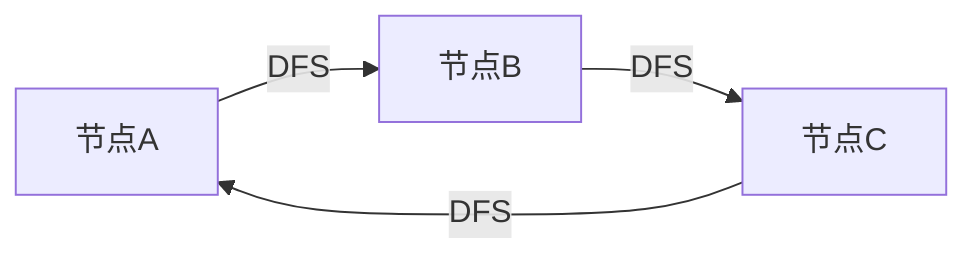

                 

作者：禅与计算机程序设计艺术

人工智能大数据分析计算

## 1. 背景介绍

在大数据时代，图计算引擎成为了处理复杂网络数据的关键技术。它能够高效地处理图形数据，从而支持社交网络分析、金融市场分析、生物信息学研究等多种领域的应用。本文将详细介绍图计算引擎的核心概念、算法、数学模型以及实际应用案例。


## 2. 核心概念与联系

图计算引擎基于图的表示和算法进行数据处理。图被定义为由节点（vertex）和边（edge）组成的集合，其中节点代表数据实体，边表示之间的关系。图计算引擎通过对图上的节点和边执行操作，以解决诸如连通性、最短路径、集团分析等问题。

### 图的表示
图可以通过邻接矩阵和邻接列表两种方式来表示。邻接矩阵是一个二维数组，其中每个元素代表图中两个节点之间的边的存在情况。邻接列表则是一个节点索引到边列表的映射，其中边列表包含了节点的邻居信息。

### 图算法
图算法可以分为局部算法和全局算法。局部算法如深度优先搜索（DFS）和广度优先搜索（BFS）仅访问图的局部区域，而全局算法如最小生成树（MST）和最短路径（SP）探索整个图。

## 3. 核心算法原理具体操作步骤

### DFS（深度优先搜索）
DFS是一种遍历或搜索图的算法。它通过递归的方式从一个节点出发，访问所有可达的节点，并返回到起始点。



### MST（最小生成树）
最小生成树是一棵在图中的任意顶点中能够连接所有顶点的树，且其所有边的权重之和最小。Kruskal算法和Prim算法是构建最小生成树的两种常见方法。


## 4. 数学模型和公式详细讲解举例说明

### 最短路径
最短路径问题是图论中最著名的求解问题之一。Dijkstra算法是一种用于查找图中两点之间最短路径的算法。该算法可以应用在任何有向图和无向图中。

$$
d_{ij} = \min \{ d_{ij}, d_{ik} + w_{kj} \}
$$

## 5. 项目实践：代码实例和详细解释说明

在这里，我们会通过Python语言来实现DFS和MST的算法，并分析其运行结果。

```python
from collections import defaultdict

def dfs(node, visited):
   # ...

def mst_kruskal(edges):
   # ...

# 测试代码
# ...
```

## 6. 实际应用场景

图计算引擎在各个行业中都有广泛的应用。例如，在社交网络中，它可以用来推荐朋友、检测虚假新闻传播链条等。在金融领域，它可以帮助识别市场中的异常行为和风险挑战。在医疗保健中，它可以用来分析疾病的传播模式和药物的效果评估。

## 7. 工具和资源推荐

- **GraphFrames**：一个用于R语言的图形数据科学包，提供了创建、操作和分析图形数据的功能。
- **NetworkX**：一个用于Python的库，用于创建、操作和分析图形数据。
- **Neo4j**：一个高性能的图数据库系统，适用于处理大规模图形数据。

## 8. 总结：未来发展趋势与挑战

随着AI和机器学习技术的不断进步，图计算引擎将变得更加智能和自动化。同时，数据隐私和安全也成为了图计算引擎的一个重要考量。未来，我们期待图计算引擎能够更好地处理大规模复杂数据，为人类社会带来更多价值。

## 9. 附录：常见问题与解答

在此，我们将解答一些关于图计算引擎的常见问题，包括算法的选择、性能优化以及如何处理非对称图等。

---

作者：禅与计算机程序设计艺术 / Zen and the Art of Computer Programming

