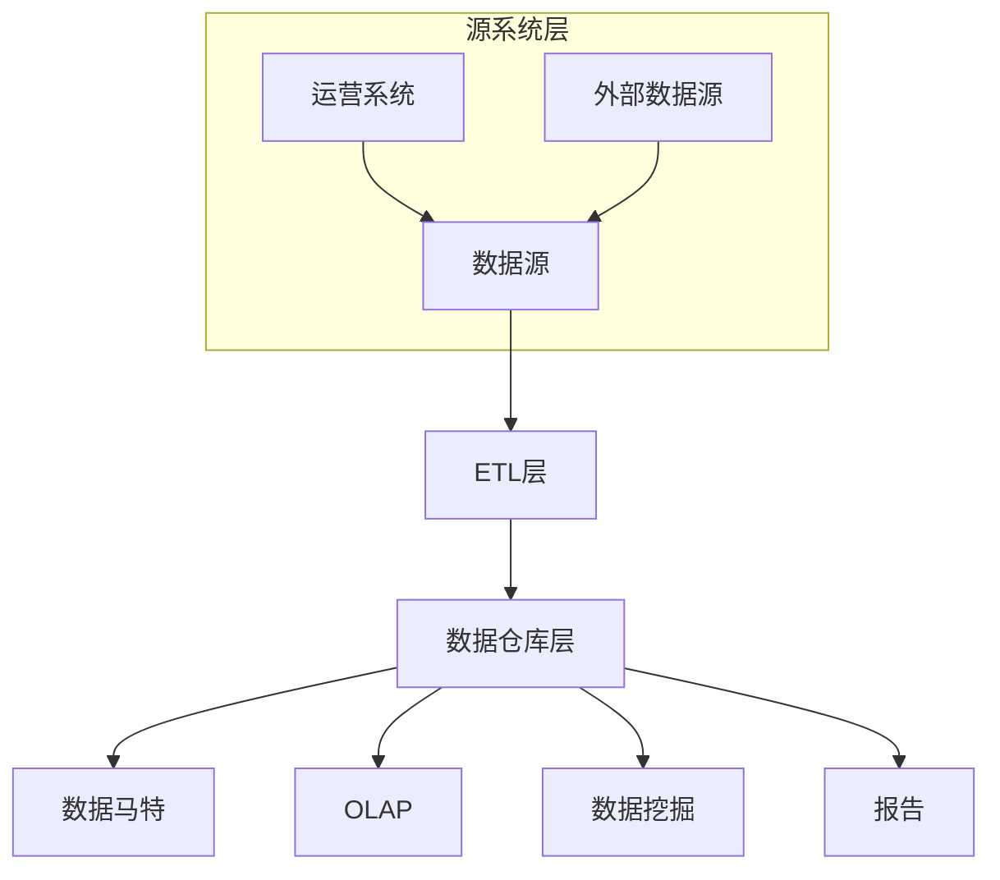
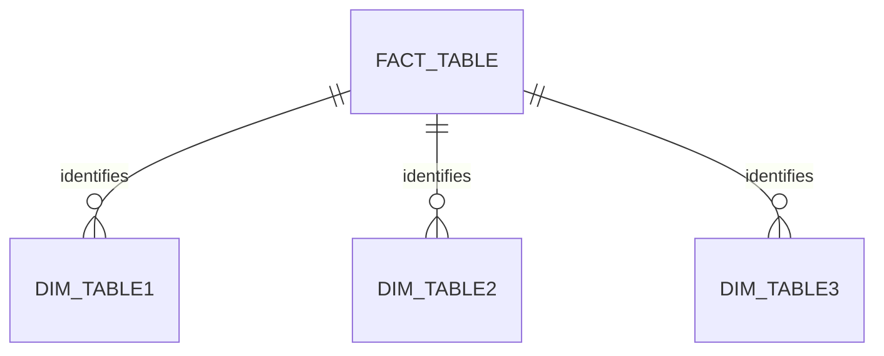
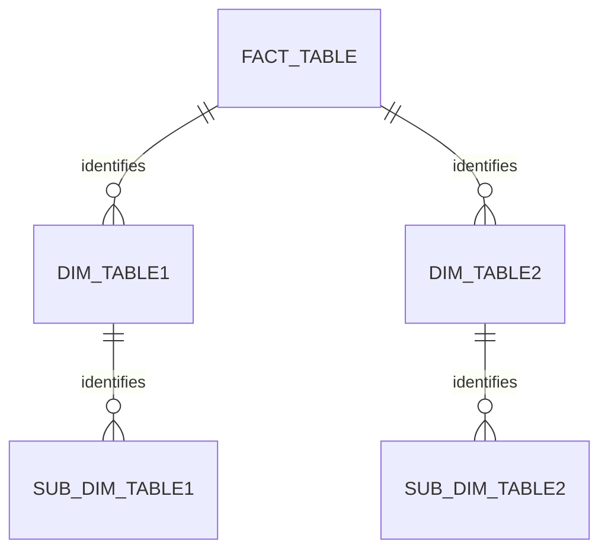

# 【AI大数据计算原理与代码实例讲解】数据仓库

## 1. 背景介绍

### 1.1 数据爆炸时代

在当今的数字时代,数据无疑成为了最宝贵的资源之一。随着物联网、社交媒体和各种在线服务的兴起,海量的数据被不断产生和收集。这种前所未有的数据爆炸给企业带来了巨大的机遇和挑战。一方面,这些数据蕴含着宝贵的商业洞见,可以帮助企业做出更明智的决策、优化业务流程、提高客户体验。另一方面,有效管理和分析这些海量数据也成为了一个艰巨的任务。

### 1.2 数据仓库的重要性

为了解决数据管理和分析的挑战,数据仓库(Data Warehouse)应运而生。数据仓库是一种专门为分析和决策支持而设计的数据存储和管理系统。它将来自不同来源的数据集成到一个统一的存储库中,并对数据进行清理、转换和优化,为分析和报告提供高性能的查询支持。

数据仓库的主要目标是为企业提供一个可靠、一致和集中的数据视图,支持各种分析需求,如报告、数据挖掘、商业智能等。它通过将操作数据与分析数据分离,减轻了运营系统的负担,同时提供了更好的数据质量和性能。

## 2. 核心概念与联系

### 2.1 数据仓库架构

数据仓库通常采用三层架构,包括源系统层、ETL(提取、转换、加载)层和数据仓库层。



1. **源系统层**:包括企业内部的运营系统(如ERP、CRM等)和外部数据源(如第三方数据提供商)。这些系统是数据的来源。

2. **ETL层**:从源系统提取数据,对数据进行清理、转换和加载到数据仓库中。ETL过程是数据仓库建设的关键环节。

3. **数据仓库层**:存储经过ETL处理的数据,为各种分析需求提供支持,如数据马特(Data Mart)、在线分析处理(OLAP)、数据挖掘和报告等。

### 2.2 数据建模

在数据仓库中,数据通常采用维度建模(Dimensional Modeling)的方式进行组织和存储。维度建模将数据分为事实表(Fact Table)和维度表(Dimension Table)两种类型。

- **事实表**:存储度量值(Measures),如销售额、成本等。
- **维度表**:存储描述事实的上下文信息,如时间、地点、产品等。

通过将事实表与相关的维度表进行连接,可以支持多维分析和高效的查询。这种建模方式与传统的范式建模不同,更适合分析型查询。

### 2.3 数据立方体

基于维度建模,数据仓库中的数据可以被视为一个多维数据立方体(Data Cube)。每个维度表示一个分析角度,事实表存储在立方体的单元格中。通过对立方体进行切片(Slicing)、切块(Dicing)、钻取(Drilling)和旋转(Pivoting)等操作,用户可以从不同角度探索和分析数据。

```mermaid
cube
    style cube fill:#f9f,stroke:#333,stroke-width:4px
```

## 3. 核心算法原理具体操作步骤

### 3.1 ETL过程

ETL(提取、转换、加载)是数据仓库建设的核心环节,其目的是将来自不同源系统的数据集成到数据仓库中,并进行必要的清理和转换,以确保数据的一致性、完整性和质量。ETL过程通常包括以下步骤:

1. **提取(Extract)**:从源系统中提取所需的数据,可以是全量提取或增量提取。

2. **转换(Transform)**:对提取的数据进行清理、转换和规范化处理,如去重、格式转换、数据类型转换、缺失值处理等。此外,还可能需要进行数据质量检查、数据加密等操作。

3. **加载(Load)**:将转换后的数据加载到数据仓库中,可以采用全量加载或增量加载的方式。加载过程中可能需要进行索引创建、分区等优化操作。

ETL过程可以使用专门的ETL工具(如Informatica、DataStage等)或编程语言(如Python、Java等)来实现。ETL过程的设计和优化对于确保数据质量和性能至关重要。

### 3.2 数据建模算法

在维度建模中,常用的算法包括星型模式(Star Schema)和雪花模式(Snowflake Schema)。

#### 3.2.1 星型模式

星型模式是最常见的维度建模方式,它将事实表与维度表直接连接,形成一个星型结构。



星型模式的优点是查询效率高,缺点是可能会导致维度表中出现重复数据。

#### 3.2.2 雪花模式

雪花模式是星型模式的扩展,它将维度表进一步规范化,形成一个层次结构。



雪花模式的优点是减少了维度表中的冗余数据,缺点是查询效率相对较低。在实践中,通常需要根据具体情况选择合适的建模方式,或采用两种模式的混合。

### 3.3 数据立方体操作算法

对数据立方体进行切片、切块、钻取和旋转等操作,需要使用相应的算法。以下是一些常见的算法:

1. **切片(Slicing)**:根据某个维度的特定值进行筛选,相当于在立方体上切出一个二维平面。可以使用简单的SQL查询或OLAP引擎来实现。

2. **切块(Dicing)**:根据多个维度的值进行筛选,相当于在立方体上切出一个子立方体。可以使用多维度的SQL查询或OLAP引擎来实现。

3. **钻取(Drilling)**:沿着维度层次结构进行上下钻取,查看更详细或更概括的数据。可以使用OLAP引擎中的钻取操作或递归SQL查询来实现。

4. **旋转(Pivoting)**:将维度和度量值之间的关系进行交换,以不同的视角查看数据。可以使用CASE语句或PIVOT/UNPIVOT操作来实现。

此外,还有一些高级算法,如数据立方体聚合、数据立方体选择等,用于优化查询性能和存储空间利用率。

## 4. 数学模型和公式详细讲解举例说明

在数据仓库中,常见的数学模型和公式包括:

### 4.1 数据压缩算法

为了节省存储空间和提高查询性能,数据仓库通常会对数据进行压缩。常用的压缩算法包括:

1. **RLE(Run-Length Encoding)**:对于连续重复的值,使用一个计数值和一个实际值来表示。适用于低基数(低唯一值数量)的列。

   压缩公式: $C = \begin{cases} (n, v) & \text{if } n \geq 2\\ v & \text{otherwise} \end{cases}$

   其中,n表示重复次数,v表示实际值。

2. **字典编码(Dictionary Encoding)**:将值映射到一个短的代码,通常使用位图索引来加速查询。适用于高基数的列。

   压缩公式: $C(v) = code(v)$

   其中,code(v)是值v对应的代码。

3. **比特向量编码(Bit-Vector Encoding)**:使用位向量来表示布尔值或有限状态值。适用于低基数的列。

   压缩公式: $C(v_1, v_2, \dots, v_n) = \sum_{i=1}^n v_i \times 2^{i-1}$

   其中,v_i是第i个值的布尔值(0或1)。

这些压缩算法可以单独使用,也可以组合使用,以获得最佳的压缩效果。

### 4.2 数据分区算法

为了提高查询性能,数据仓库通常会对数据进行分区。常用的分区算法包括:

1. **范围分区(Range Partitioning)**:根据某个列的值范围将数据划分到不同的分区中。

   分区公式: $P(v) = \begin{cases} p_1 & \text{if } v \in [a_1, b_1)\\ p_2 & \text{if } v \in [a_2, b_2)\\ \vdots & \vdots\\ p_n & \text{if } v \in [a_n, b_n) \end{cases}$

   其中,v是分区键的值,[a_i, b_i)是第i个分区的范围,p_i是第i个分区的标识符。

2. **哈希分区(Hash Partitioning)**:根据某个列的哈希值将数据划分到不同的分区中。

   分区公式: $P(v) = hash(v) \bmod n$

   其中,v是分区键的值,hash(v)是v的哈希值,n是分区数量。

3. **列表分区(List Partitioning)**:根据某个列的值是否属于一个列表将数据划分到不同的分区中。

   分区公式: $P(v) = \begin{cases} p_1 & \text{if } v \in L_1\\ p_2 & \text{if } v \in L_2\\ \vdots & \vdots\\ p_n & \text{if } v \in L_n \end{cases}$

   其中,v是分区键的值,L_i是第i个分区的值列表,p_i是第i个分区的标识符。

通过合理的分区策略,可以减少扫描的数据量,提高查询效率。

### 4.3 数据采样算法

在数据挖掘和探索性数据分析中,常常需要从大量数据中抽取一个代表性的样本进行分析。常用的采样算法包括:

1. **简单随机采样(Simple Random Sampling)**:从总体中随机抽取n个样本,每个样本被抽中的概率相等。

   采样公式: $P(S) = \binom{N}{n} \times \left(\frac{1}{N}\right)^n \times \left(1 - \frac{1}{N}\right)^{N-n}$

   其中,S是样本集合,N是总体大小,n是样本大小。

2. **分层采样(Stratified Sampling)**:根据某个特征将总体划分为若干层,然后在每一层中进行简单随机采样。

   采样公式: $P(S) = \prod_{i=1}^L \binom{N_i}{n_i} \times \left(\frac{n_i}{N_i}\right)^{n_i} \times \left(1 - \frac{n_i}{N_i}\right)^{N_i-n_i}$

   其中,L是层的数量,N_i是第i层的总体大小,n_i是第i层的样本大小。

3. **系统采样(Systematic Sampling)**:从总体中按照固定间隔抽取样本,第一个样本随机选取。

   采样公式: $P(S) = \frac{N!}{(N-n)!N^n}$

   其中,N是总体大小,n是样本大小。

通过合理的采样方法,可以获得代表性的样本,从而提高分析的效率和准确性。

## 5. 项目实践:代码实例和详细解释说明

在本节中,我们将通过一个实际项目案例,展示如何使用Python构建一个简单的数据仓库系统。

### 5.1 项目概述

假设我们有一家零售公司,需要构建一个数据仓库系统来存储和分析销售数据。我们将使用Python和SQLite数据库来实现这个项目。

### 5.2 数据源

我们的数据源包括两个CSV文件:

1. `orders.csv`:包含订单信息,如订单ID、客户ID、订单日期、订单总额等。
2. `products.csv`:包含产品信息