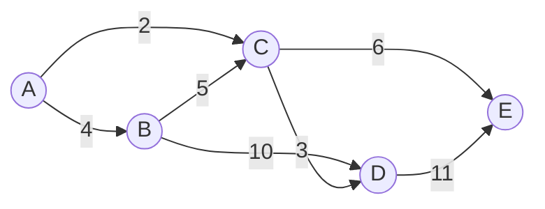

# 【AI大数据计算原理与代码实例讲解】最短路径

## 1. 背景介绍

在现实世界中,我们经常会遇到寻找最短路径的问题,如导航系统中寻找从起点到终点的最短路径,网络路由中寻找传输延迟最小的路径等。在图论和算法领域,最短路径问题是一个经典的优化问题,旨在寻找图中两个顶点之间的最短路径。本文将深入探讨最短路径问题的相关概念、经典算法、数学模型以及代码实现,并分析其在实际场景中的应用。

### 1.1 最短路径问题定义
最短路径问题可以用图论中的术语来描述。给定一个带权有向图 G=(V,E),其中 V 表示顶点集合,E 表示边集合。每条边 (u,v)∈E 都有一个相关的权重 w(u,v),表示从顶点 u 到顶点 v 的距离或成本。最短路径问题就是要在图 G 中找到从源顶点 s 到目标顶点 t 的路径,使得该路径上所有边的权重之和最小。

### 1.2 最短路径问题的分类
根据问题的不同形式,最短路径问题可以分为以下几类:

1. 单源最短路径问题(Single-Source Shortest Path,SSSP):给定图 G 和源顶点 s,找到从 s 到图中所有其他顶点的最短路径。
2. 全源最短路径问题(All-Pairs Shortest Path,APSP):对于图 G 中的每对顶点 u 和 v,找到它们之间的最短路径。
3. 单目标最短路径问题(Single-Destination Shortest Path):给定图 G 和目标顶点 t,找到从图中所有其他顶点到 t 的最短路径。

不同类型的最短路径问题可以使用不同的算法来解决,如 Dijkstra 算法、Floyd-Warshall 算法、Bellman-Ford 算法等。

## 2. 核心概念与联系

在讨论最短路径算法之前,我们需要了解一些核心概念及其之间的联系。

### 2.1 图的表示
图可以用邻接矩阵或邻接表来表示。邻接矩阵是一个二维数组,其中 `graph[i][j]` 表示从顶点 i 到顶点 j 的边的权重,如果不存在这样的边,则值为无穷大。邻接表是一个列表数组,其中 `graph[i]` 包含与顶点 i 相邻的所有顶点以及相应的边权重。

### 2.2 松弛操作
松弛操作是最短路径算法中的一个重要概念。对于一条边 (u,v),如果通过 u 到达 v 的距离比当前已知的 v 的距离更短,则更新 v 的距离。松弛操作可以表示为:

```
if dist[u] + w(u,v) < dist[v]:
    dist[v] = dist[u] + w(u,v)
```

其中,`dist[u]` 表示从源顶点到顶点 u 的当前最短距离,`w(u,v)` 表示边 (u,v) 的权重。

### 2.3 最短路径的性质
最短路径问题满足以下性质:

1. 子路径最优性:如果 P 是从顶点 u 到顶点 v 的最短路径,那么 P 的任何子路径也是相应顶点之间的最短路径。
2. 最短路径的不可加性:两条最短路径的拼接不一定是最短路径。
3. 最短路径的可达性:如果从顶点 u 到顶点 v 存在一条最短路径,那么从 u 到 v 一定是可达的。

## 3. 核心算法原理与具体操作步骤

### 3.1 Dijkstra 算法
Dijkstra 算法是解决单源最短路径问题的经典算法之一。它适用于边权重非负的加权有向图。算法的基本思想是维护一个距离数组 `dist`,其中 `dist[v]` 表示从源顶点到顶点 v 的当前最短距离。初始时,源顶点的距离为 0,其他顶点的距离为无穷大。算法重复选择当前距离最小的未访问顶点,并通过松弛操作更新其邻居的距离,直到所有顶点都被访问为止。

Dijkstra 算法的具体操作步骤如下:

1. 初始化距离数组 `dist`,将源顶点的距离设为 0,其他顶点的距离设为无穷大。
2. 创建一个优先队列 `pq`,将源顶点加入队列。
3. 当 `pq` 不为空时,重复以下步骤:
   - 从 `pq` 中取出具有最小距离的顶点 u。
   - 对于 u 的每个邻居 v,执行松弛操作:
     ```
     if dist[u] + w(u,v) < dist[v]:
         dist[v] = dist[u] + w(u,v)
         pq.push(v)
     ```
4. 算法结束后,`dist` 数组中的值即为从源顶点到每个顶点的最短距离。

Dijkstra 算法的时间复杂度为 O((V+E)logV),其中 V 是顶点数,E 是边数。

### 3.2 Floyd-Warshall 算法
Floyd-Warshall 算法用于解决全源最短路径问题。它基于动态规划的思想,通过逐步考虑中间顶点来更新任意两个顶点之间的最短距离。

Floyd-Warshall 算法的具体操作步骤如下:

1. 初始化距离矩阵 `dist`,其中 `dist[i][j]` 表示从顶点 i 到顶点 j 的初始距离。对于存在的边 (i,j),`dist[i][j]` 等于边的权重,否则为无穷大。`dist[i][i]` 设为 0。
2. 对于每个中间顶点 k,更新任意两个顶点 i 和 j 之间的最短距离:
   ```
   for k in range(V):
       for i in range(V):
           for j in range(V):
               dist[i][j] = min(dist[i][j], dist[i][k] + dist[k][j])
   ```
3. 算法结束后,`dist` 矩阵中的值即为任意两个顶点之间的最短距离。

Floyd-Warshall 算法的时间复杂度为 O(V^3),其中 V 是顶点数。

### 3.3 Bellman-Ford 算法
Bellman-Ford 算法是另一种解决单源最短路径问题的算法。与 Dijkstra 算法不同,Bellman-Ford 算法可以处理边权重为负的图。算法的基本思想是对所有边执行 V-1 次松弛操作,其中 V 是图中的顶点数。

Bellman-Ford 算法的具体操作步骤如下:

1. 初始化距离数组 `dist`,将源顶点的距离设为 0,其他顶点的距离设为无穷大。
2. 对于 V-1 次迭代,执行以下步骤:
   - 对于图中的每条边 (u,v),执行松弛操作:
     ```
     if dist[u] + w(u,v) < dist[v]:
         dist[v] = dist[u] + w(u,v)
     ```
3. 检查图中是否存在负权重环:
   - 对于图中的每条边 (u,v),执行以下检查:
     ```
     if dist[u] + w(u,v) < dist[v]:
         报告图中存在负权重环并终止算法
     ```
4. 算法结束后,`dist` 数组中的值即为从源顶点到每个顶点的最短距离。

Bellman-Ford 算法的时间复杂度为 O(VE),其中 V 是顶点数,E 是边数。

## 4. 数学模型和公式详细讲解举例说明

### 4.1 最短路径的数学模型
最短路径问题可以用以下数学模型来表示:

给定一个带权有向图 $G=(V,E)$,其中 $V$ 表示顶点集合,$E$ 表示边集合。每条边 $(u,v)\in E$ 都有一个相关的权重 $w(u,v)$,表示从顶点 $u$ 到顶点 $v$ 的距离或成本。我们的目标是找到从源顶点 $s$ 到目标顶点 $t$ 的最短路径,使得该路径上所有边的权重之和最小。

设 $dist(u,v)$ 表示从顶点 $u$ 到顶点 $v$ 的最短距离。最短路径问题可以表示为以下优化问题:

$$
\min_{P} \sum_{(u,v)\in P} w(u,v)
$$

其中 $P$ 是从源顶点 $s$ 到目标顶点 $t$ 的路径。

### 4.2 Dijkstra 算法的数学描述
Dijkstra 算法可以用以下数学描述来表示:

设 $dist[v]$ 表示从源顶点 $s$ 到顶点 $v$ 的当前最短距离。初始时,$dist[s]=0$,对于所有其他顶点 $v$,$dist[v]=\infty$。

算法重复执行以下松弛操作,直到所有顶点都被访问:

$$
dist[v] = \min(dist[v], dist[u] + w(u,v))
$$

其中 $(u,v)$ 是图中的一条边。

### 4.3 Floyd-Warshall 算法的数学描述
Floyd-Warshall 算法可以用以下数学描述来表示:

设 $dist[i][j]$ 表示从顶点 $i$ 到顶点 $j$ 的最短距离。初始时,对于存在的边 $(i,j)$,$dist[i][j]=w(i,j)$,否则 $dist[i][j]=\infty$。$dist[i][i]=0$。

算法通过以下递推公式更新最短距离:

$$
dist[i][j] = \min(dist[i][j], dist[i][k] + dist[k][j])
$$

其中 $i,j,k$ 是图中的顶点。

### 4.4 举例说明
考虑以下带权有向图:



假设我们要找到从顶点 A 到其他所有顶点的最短路径。

使用 Dijkstra 算法,我们可以得到以下结果:

- A 到 B 的最短距离:4
- A 到 C 的最短距离:2
- A 到 D 的最短距离:5
- A 到 E 的最短距离:8

使用 Floyd-Warshall 算法,我们可以得到以下距离矩阵:

|   | A | B | C | D | E |
|---|---|---|---|---|---|
| A | 0 | 4 | 2 | 5 | 8 |
| B | ∞ | 0 | 5 | 10 | 11 |
| C | ∞ | ∞ | 0 | 3 | 6 |
| D | ∞ | ∞ | ∞ | 0 | 11 |
| E | ∞ | ∞ | ∞ | ∞ | 0 |

## 5. 项目实践:代码实例和详细解释说明

### 5.1 Dijkstra 算法的 Python 实现

```python
import heapq

def dijkstra(graph, start):
    n = len(graph)
    dist = [float('inf')] * n
    dist[start] = 0
    pq = [(0, start)]
    
    while pq:
        curr_dist, curr_node = heapq.heappop(pq)
        
        if curr_dist > dist[curr_node]:
            continue
        
        for neighbor, weight in graph[curr_node]:
            new_dist = curr_dist + weight
            
            if new_dist < dist[neighbor]:
                dist[neighbor] = new_dist
                heapq.heappush(pq, (new_dist, neighbor))
    
    return dist
```

解释:
- `graph` 是一个邻接表,其中 `graph[i]` 包含与顶点 `i` 相邻的所有顶点以及相应的边权重。
- `start` 是源顶点。
- 函数返回一个列表 `dist`,其中 `dist[i]` 表示从源顶点到顶点 `i` 的最短距离。
- 我们使用优先队列(这里使用了 Python 的 `heapq` 模块)来选择具有最小距离的顶点。
- 在主循环中,我们从优先队列中取出具有最小距离的顶点,并通过松弛操作更新