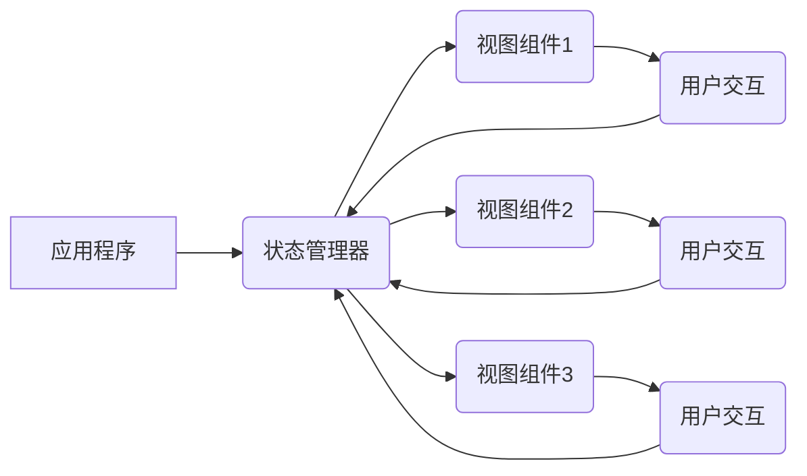
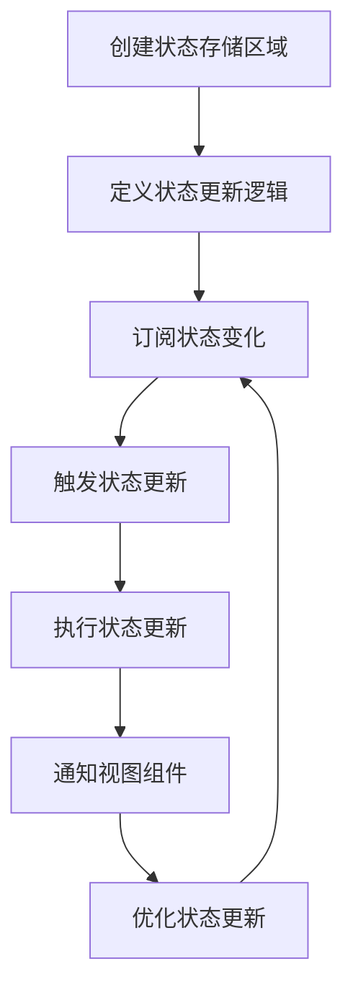

# 【AI大数据计算原理与代码实例讲解】状态管理

## 1.背景介绍

在现代软件开发中,状态管理是一个至关重要的概念。随着应用程序变得越来越复杂,有效地管理和维护应用程序的状态变得更加困难。传统的状态管理方式往往会导致代码的复杂性和可维护性降低,因此需要一种更加系统化和结构化的方法来解决这个问题。

状态管理的核心思想是将应用程序的状态从组件中抽象出来,集中存储和管理。这样可以使得状态的变化更加可预测和可控,同时也方便了状态的共享和重用。在大型应用程序中,状态管理可以帮助开发人员更好地理解和控制应用程序的行为,从而提高代码的可维护性和可扩展性。

## 2.核心概念与联系

### 2.1 状态(State)

状态是指应用程序在某个时间点的数据快照。它可以是一个简单的变量,也可以是一个复杂的数据结构。状态通常会随着用户的交互或其他事件而发生变化。

### 2.2 状态管理(State Management)

状态管理是指管理和维护应用程序状态的过程。它包括了状态的创建、更新、删除、共享和访问等操作。有效的状态管理可以帮助开发人员更好地控制应用程序的行为,提高代码的可维护性和可扩展性。

### 2.3 单向数据流(Unidirectional Data Flow)

单向数据流是一种状态管理的设计模式,它规定了状态只能单向流动,即从一个中央存储区域流向视图组件。这种模式可以使状态的变化更加可预测和可控,同时也方便了状态的共享和重用。

### 2.4 Mermaid 流程图



上图展示了状态管理的基本流程。应用程序中的状态由状态管理器集中管理,视图组件从状态管理器获取状态并渲染界面。当用户与视图组件交互时,视图组件会将交互事件传递给状态管理器,状态管理器根据事件更新状态,然后将新的状态传递给相关的视图组件,从而实现界面的更新。

## 3.核心算法原理具体操作步骤

状态管理的核心算法原理可以概括为以下几个步骤:

1. **创建状态存储区域**:首先需要创建一个集中的状态存储区域,用于存储应用程序的状态。这个存储区域可以是一个简单的对象,也可以是一个更加复杂的数据结构,如Redux中的store。

2. **定义状态更新逻辑**:接下来需要定义状态的更新逻辑,即当发生特定事件时,状态应该如何变化。这个逻辑通常被封装在一个纯函数中,称为reducer。reducer函数接收当前的状态和一个描述事件的action作为输入,并返回新的状态。

3. **订阅状态变化**:视图组件需要订阅状态的变化,以便在状态发生变化时及时更新界面。这通常是通过某种观察者模式或发布-订阅模式实现的。

4. **触发状态更新**:当用户与视图组件交互或发生其他事件时,视图组件会触发一个action,将事件传递给状态管理器。

5. **执行状态更新**:状态管理器接收到action后,会调用相应的reducer函数,计算出新的状态。

6. **通知视图组件**:状态管理器将新的状态传递给已订阅的视图组件,视图组件根据新的状态更新界面。

7. **优化状态更新**:为了提高性能,状态管理器通常会采用一些优化策略,如浅层对比、记忆化等,以避免不必要的状态更新和重渲染。

### 3.1 Mermaid 流程图



上图展示了状态管理的核心算法原理流程。首先创建状态存储区域,然后定义状态更新逻辑。视图组件订阅状态变化,当用户交互或其他事件触发状态更新时,执行状态更新逻辑,计算出新的状态。状态管理器将新的状态通知给已订阅的视图组件,视图组件根据新的状态更新界面。在这个过程中,状态管理器会采用一些优化策略,以提高性能。

## 4.数学模型和公式详细讲解举例说明

在状态管理中,我们可以使用一些数学模型和公式来描述和优化状态的变化。

### 4.1 状态转移函数

状态转移函数是一种描述系统状态变化的数学模型。在状态管理中,我们可以将状态转移函数表示为:

$$
s' = f(s, a)
$$

其中,$ s $表示当前状态,$ a $表示触发的action,$ s' $表示新的状态,$ f $是状态转移函数。

状态转移函数实际上就是reducer函数,它接收当前状态和action作为输入,并计算出新的状态。

### 4.2 记忆化

记忆化是一种优化技术,它可以避免重复计算相同的输入,从而提高性能。在状态管理中,我们可以使用记忆化来优化reducer函数的执行。

假设我们有一个reducer函数$ f(s, a) $,我们可以定义一个记忆化版本的函数$ g(s, a) $:

$$
g(s, a) = \begin{cases}
f(s, a) & \text{if } (s, a) \notin M \\
M[(s, a)] & \text{otherwise}
\end{cases}
$$

其中,$ M $是一个映射表,用于存储已经计算过的$ (s, a) $对和对应的结果$ s' $。

当我们需要计算$ f(s, a) $时,首先检查$ (s, a) $是否在映射表$ M $中。如果存在,直接返回映射表中的结果;否则,计算$ f(s, a) $,并将结果存储在映射表中。

这种技术可以避免重复计算相同的输入,从而提高性能。但是,它也会占用额外的内存空间,因此在实际应用中需要权衡空间和时间的trade-off。

### 4.3 浅层对比

浅层对比是另一种优化状态更新的技术。它的思想是,只有当新的状态与旧的状态不同时,才需要更新视图组件。

假设我们有一个函数$ diff(s, s') $,用于比较两个状态是否相同:

$$
diff(s, s') = \begin{cases}
true & \text{if } s \neq s' \\
false & \text{otherwise}
\end{cases}
$$

在更新视图组件之前,我们可以先调用$ diff(s, s') $函数,如果返回$ false $,则说明状态没有发生变化,可以跳过更新;否则,需要更新视图组件。

浅层对比通常只比较对象的引用,而不会深入比较对象的每个属性。这种方式可以提高性能,但是也可能导致一些细微的变化被忽略。在实际应用中,需要根据具体情况选择合适的对比策略。

## 5.项目实践:代码实例和详细解释说明

为了更好地理解状态管理的概念和实现,我们将通过一个简单的计数器示例来演示如何使用React和Redux进行状态管理。

### 5.1 安装依赖

首先,我们需要安装React和Redux相关的依赖:

```bash
npm install react react-dom redux react-redux
```

### 5.2 创建状态存储区域

在Redux中,我们使用store来存储应用程序的状态。我们可以使用`createStore`函数来创建store:

```javascript
import { createStore } from 'redux';

// 定义初始状态
const initialState = {
  count: 0
};

// 定义reducer函数
function counterReducer(state = initialState, action) {
  switch (action.type) {
    case 'INCREMENT':
      return { ...state, count: state.count + 1 };
    case 'DECREMENT':
      return { ...state, count: state.count - 1 };
    default:
      return state;
  }
}

// 创建store
const store = createStore(counterReducer);

export default store;
```

在上面的代码中,我们首先定义了初始状态`initialState`和reducer函数`counterReducer`。reducer函数根据不同的action类型(`INCREMENT`或`DECREMENT`)来更新状态。最后,我们使用`createStore`函数创建了store,并将reducer函数作为参数传递给它。

### 5.3 定义视图组件

接下来,我们定义视图组件。在React中,我们可以使用函数组件或类组件。这里我们使用函数组件:

```javascript
import React from 'react';
import { useSelector, useDispatch } from 'react-redux';

function Counter() {
  const count = useSelector(state => state.count);
  const dispatch = useDispatch();

  const handleIncrement = () => {
    dispatch({ type: 'INCREMENT' });
  };

  const handleDecrement = () => {
    dispatch({ type: 'DECREMENT' });
  };

  return (
    <div>
      <h1>Counter</h1>
      <p>Count: {count}</p>
      <button onClick={handleIncrement}>Increment</button>
      <button onClick={handleDecrement}>Decrement</button>
    </div>
  );
}

export default Counter;
```

在上面的代码中,我们使用`useSelector`钩子从store中获取当前的状态,并使用`useDispatch`钩子获取dispatch函数,用于触发状态更新。

当用户点击"Increment"或"Decrement"按钮时,我们分别调用`handleIncrement`或`handleDecrement`函数,这些函数会分别dispatch一个`INCREMENT`或`DECREMENT`的action,从而触发状态的更新。

### 5.4 连接Redux和React

最后,我们需要将Redux和React应用程序连接起来:

```javascript
import React from 'react';
import ReactDOM from 'react-dom';
import { Provider } from 'react-redux';
import store from './store';
import Counter from './Counter';

ReactDOM.render(
  <Provider store={store}>
    <Counter />
  </Provider>,
  document.getElementById('root')
);
```

在上面的代码中,我们使用`Provider`组件将store传递给React应用程序。这样,所有的子组件都可以访问store中的状态和dispatch函数。

### 5.5 运行示例

现在,我们可以运行这个示例了。在浏览器中,你应该能看到一个计数器界面,点击"Increment"和"Decrement"按钮可以分别增加或减少计数器的值。

通过这个简单的示例,我们可以看到如何使用React和Redux进行状态管理。Redux提供了一种结构化和可预测的方式来管理应用程序的状态,而React则提供了一种声明式的方式来构建用户界面。两者结合起来,可以帮助我们更好地构建大型和复杂的应用程序。

## 6.实际应用场景

状态管理在各种应用场景中都扮演着重要的角色,尤其是在构建大型和复杂的应用程序时。以下是一些常见的应用场景:

### 6.1 单页应用(SPA)

在单页应用中,整个应用程序的状态都存在于浏览器中。有效的状态管理可以帮助我们更好地组织和维护应用程序的状态,提高代码的可维护性和可扩展性。

### 6.2 移动应用

在移动应用中,状态管理也是一个重要的概念。由于移动设备的资源有限,有效的状态管理可以帮助我们优化应用程序的性能和内存使用。

### 6.3 大型企业级应用

在大型企业级应用中,状态管理可以帮助我们更好地管理复杂的业务逻辑和数据流。通过将状态从组件中抽象出来,我们可以更容易地理解和维护应用程序的行为。

### 6.4 实时协作应用

在实时协作应用中,多个用户同时操作同一份数据。状态管理可以帮助我们同步和共享状态,确保所有用户都看到最新的数据。

### 6.