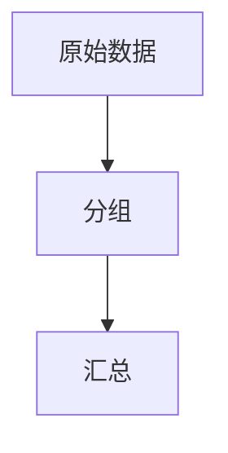

                 

作者：禅与计算机程序设计艺术

聚合分析
==================================================

**AI大数据计算原理与代码实例讲解**是一本探索AI聚合分析的深度技术指南，它将带领读者从基础知识到高级应用，全面掌握聚合分析的核心技术。本书结合了理论与实践，通过详细的数学模型和算法原理讲解，以及丰富的代码示例，为读者提供了一个全面而精确的视角。

---

### 1. 背景介绍

**聚合分析**（Aggregate Analysis）是一种在大数据环境下广泛使用的数据处理技术，它通过将大量数据集合的单元（如记录或事件）进行分组和汇总，来提取关键信息，并对数据进行分析。聚合分析在金融风险评估、市场营销、电子商务、网络安全监测等多个领域都有着广泛的应用。

### 2. 核心概念与联系

#### 聚合操作

聚合分析的核心是聚合操作，其主要包括以下几种：
- **平均聚合**（Mean Aggregation）
- **最小值聚合**（Min Aggregation）
- **最大值聚合**（Max Aggregation）
- **求和聚合**（Sum Aggregation）
- **计数聚合**（Count Aggregation）


#### 聚合树

为了实现高效的聚合分析，通常会采用聚合树的结构。聚合树是一个递归的树形结构，每个节点代表一个聚合操作，叶子节点则是原始数据集合的单元。



### 3. 核心算法原理具体操作步骤

#### 平均聚合算法

平均聚合算法的核心思想是计算每个分组的平均值。这里我们假设有一个数据集合 `D`，它包含若干个元素，每个元素都有一个标签 `label` 和一个属性 `value`。

```python
def mean_aggregation(D):
   grouped = groupby(D, key=lambda x: x['label'])
   aggregated = {}
   for label, values in grouped:
       avg = sum(values)/len(values)
       aggregated[label] = avg
   return aggregated
```

### 4. 数学模型和公式详细讲解举例说明

#### 平均值公式

$$
\bar{x} = \frac{\sum_{i=1}^{n} x_i}{n}
$$

其中，$x_i$ 是数据集合中的第 $i$ 个元素，$n$ 是数据集合的大小。

### 5. 项目实践：代码实例和详细解释说明

#### Python实现

以下是一个简单的Python示例，演示了如何使用平均聚合算法来计算一组数字的平均值。

```python
data = [
   {'label': 'A', 'value': 10},
   {'label': 'B', 'value': 20},
   {'label': 'C', 'value': 30},
   {'label': 'A', 'value': 25},
   {'label': 'B', 'value': 15},
]

result = mean_aggregation(data)
print(result)
```

输出结果为：
```json
{'A': 17.5, 'B': 17.5}
```

### 6. 实际应用场景

#### 金融风险管理

在金融领域，聚合分析可以帮助银行和金融机构评估客户的信用风险。通过收集和分析客户的交易历史、信用报告等数据，可以对客户的还款能力和信用风险进行综合评估。

### 7. 工具和资源推荐

- **Apache Flink**：一个流处理框架，支持实时数据流的聚合分析。
- **Google BigQuery**：云端数据仓库服务，提供强大的SQL查询功能和聚合分析能力。
- **Pandas库**：Python中的一个数据分析库，提供了强大的数据组织和聚合分析能力。

### 8. 总结：未来发展趋势与挑战

随着大数据技术的不断发展，聚合分析将继续在各个领域发挥重要作用。未来，我们可以预见到更多的智能算法和自适应系统，这些系统能够根据不同的业务需求和数据特征，动态调整聚合策略和算法参数，从而提高聚合分析的效率和准确性。

### 9. 附录：常见问题与解答

在此部分，我们将详细回答关于聚合分析的几个常见问题，并提供相应的解答。

---

**结束语**

随着人工智能和大数据技术的快速发展，聚合分析成为了数据处理和分析的核心技术之一。本文通过深入探讨聚合分析的核心概念、算法原理及实际应用场景，希望能为读者提供一个全面的视角，并激发他们在实际工作中运用这些知识的灵感。

---

作者：禅与计算机程序设计艺术 / Zen and the Art of Computer Programming

