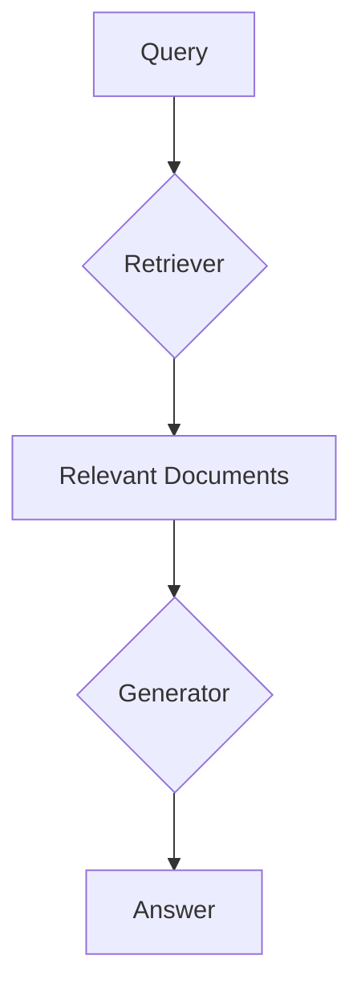

# 【LangChain编程：从入门到实践】RAG技术的关键挑战

## 1. 背景介绍
### 1.1 RAG技术的起源与发展
#### 1.1.1 RAG技术的诞生背景
#### 1.1.2 RAG技术的发展历程
#### 1.1.3 RAG技术的现状与趋势

### 1.2 RAG技术在LangChain中的应用
#### 1.2.1 LangChain框架简介  
#### 1.2.2 RAG在LangChain中的集成
#### 1.2.3 RAG在LangChain中的优势

## 2. 核心概念与联系
### 2.1 RAG的核心概念
#### 2.1.1 检索(Retrieval)
#### 2.1.2 增强(Augmented) 
#### 2.1.3 生成(Generation)

### 2.2 RAG与其他技术的联系
#### 2.2.1 RAG与传统信息检索的区别
#### 2.2.2 RAG与知识图谱的结合
#### 2.2.3 RAG与预训练语言模型的关系

### 2.3 RAG的系统架构


## 3. 核心算法原理具体操作步骤
### 3.1 Dense Passage Retrieval(DPR)
#### 3.1.1 编码查询和文档
#### 3.1.2 最大内积搜索(MIPS) 
#### 3.1.3 DPR的训练过程

### 3.2 Fusion-in-Decoder(FiD)
#### 3.2.1 将文档和查询拼接
#### 3.2.2 T5 Encoder-Decoder结构
#### 3.2.3 FiD的训练与推理

### 3.3 Retrieval-Augmented Generation(RAG) 
#### 3.3.1 检索top-k个相关文档
#### 3.3.2 查询-文档交叉编码
#### 3.3.3 基于交叉编码的答案生成

## 4. 数学模型和公式详细讲解举例说明
### 4.1 DPR中的相关度计算
#### 4.1.1 余弦相似度
$$ \text{sim}(q,d) = \frac{E_Q(q) \cdot E_D(d)}{\lVert E_Q(q) \rVert \lVert E_D(d) \rVert} $$

#### 4.1.2 内积相似度 
$$ \text{sim}(q,d) = E_Q(q)^T \cdot E_D(d) $$

### 4.2 FiD中的生成概率建模
$$ P(y|x,z) = \prod_{i=1}^n P(y_i|x,z,y_{<i}) $$

其中$y$为答案序列，$x$为查询，$z$为检索到的文档。

### 4.3 RAG中的边际似然 
$$ P(y|x) = \sum_{z \in \text{top-k}(x)} P(y,z|x) = \sum_{z \in \text{top-k}(x)} P(y|x,z)P(z|x) $$

其中$\text{top-k}(x)$表示给定查询$x$检索到的前k个文档。

## 5. 项目实践：代码实例和详细解释说明
### 5.1 使用DPR进行文档检索
```python
from transformers import DPRQuestionEncoder, DPRContextEncoder 

query_encoder = DPRQuestionEncoder.from_pretrained("facebook/dpr-question_encoder-single-nq-base")
doc_encoder = DPRContextEncoder.from_pretrained("facebook/dpr-ctx_encoder-single-nq-base")

query_embeds = query_encoder(queries)
doc_embeds = doc_encoder(docs)

scores = torch.matmul(query_embeds, doc_embeds.T)
```

### 5.2 使用FiD进行问答
```python
from transformers import T5ForConditionalGeneration

model = T5ForConditionalGeneration.from_pretrained('t5-base')
tokenizer = T5Tokenizer.from_pretrained('t5-base')

input_ids = tokenizer.encode("Query: " + query + " Documents: " + docs, return_tensors="pt")
outputs = model.generate(input_ids)
answer = tokenizer.decode(outputs[0])
```

### 5.3 使用RAG进行问答
```python
from transformers import RagTokenizer, RagRetriever, RagSequenceForGeneration

tokenizer = RagTokenizer.from_pretrained("facebook/rag-sequence-nq")
retriever = RagRetriever.from_pretrained("facebook/rag-sequence-nq", index_name="exact", use_dummy_dataset=True)
model = RagSequenceForGeneration.from_pretrained("facebook/rag-sequence-nq")

input_ids = tokenizer.encode(query, return_tensors="pt")
with retriever.capture_index_kwargs(input_ids) as index_kwargs:
    outputs = model.generate(input_ids, **index_kwargs)
answer = tokenizer.decode(outputs[0])
```

## 6. 实际应用场景
### 6.1 开放域问答系统
#### 6.1.1 基于Wikipedia的问答
#### 6.1.2 基于新闻文章的问答
#### 6.1.3 基于医疗知识库的问答

### 6.2 对话系统中的知识问答
#### 6.2.1 闲聊机器人中的知识问答
#### 6.2.2 任务型对话系统中的知识问答

### 6.3 语义搜索与推荐
#### 6.3.1 电商平台中的相关商品推荐
#### 6.3.2 学术文献检索与推荐

## 7. 工具和资源推荐
### 7.1 预训练模型
- DPR: facebook/dpr-question_encoder-single-nq-base, facebook/dpr-ctx_encoder-single-nq-base
- FiD: fid-t5-base, fid-t5-large 
- RAG: facebook/rag-sequence-nq, facebook/rag-token-nq

### 7.2 开源工具包
- Haystack: 端到端问答系统框架
- Pyserini: 支持dense retrieval的信息检索工具包
- LangChain: 支持RAG的LLM应用开发框架

### 7.3 相关数据集
- Natural Questions(NQ): 基于Wikipedia的问答数据集
- TriviaQA: 基于Web的开放域问答数据集
- MS MARCO: 大规模机器阅读理解数据集

## 8. 总结：未来发展趋势与挑战
### 8.1 检索质量与效率的平衡
#### 8.1.1 更强大的dense retriever
#### 8.1.2 retrieval过程的加速优化

### 8.2 更加鲁棒和可解释的答案生成
#### 8.2.1 减少幻觉现象
#### 8.2.2 支持答案来源的追溯

### 8.3 多模态RAG系统
#### 8.3.1 结合视觉信息的RAG
#### 8.3.2 语音问答中的RAG

## 9. 附录：常见问题与解答
### Q1: RAG相比传统的信息检索有何优势？
A1: RAG能够更好地捕捉查询和文档的语义关系，生成更加自然、连贯的答案。传统的关键词匹配往往无法处理语义相似但字面不同的情况。

### Q2: RAG对检索库的规模和质量有什么要求？  
A2: RAG需要在海量的文档集合上进行检索，因此对检索库的规模和覆盖度要求较高。同时，检索库的质量也直接影响RAG的效果，需要对文档进行预处理和过滤。

### Q3: RAG的训练需要哪些计算资源？
A3: RAG的训练对计算资源要求较高，需要大规模的GPU集群和分布式训练框架的支持。但推理阶段所需的资源相对较少，可以在单机环境下运行。

### Q4: RAG生成的答案是否可解释和可信？
A4: RAG生成的答案虽然流畅自然，但有时会出现幻觉现象，即生成与文档无关或错误的内容。提高可解释性和可信性是RAG未来的重要发展方向。

作者：禅与计算机程序设计艺术 / Zen and the Art of Computer Programming