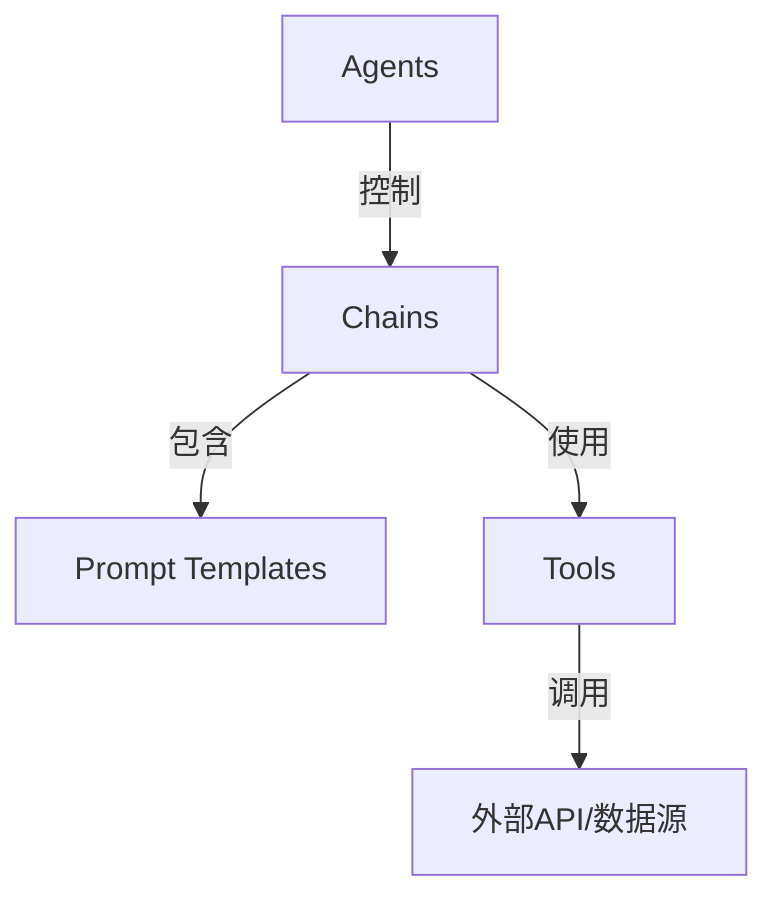
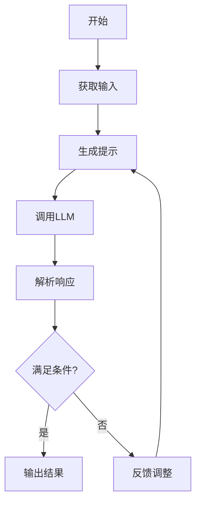

# 【LangChain编程：从入门到实践】RunnableParallel

## 1.背景介绍

在当今数据时代,我们面临着海量数据和复杂任务的挑战。传统的软件开发方式已经难以满足快速迭代和高效处理的需求。因此,一种新的编程范式应运而生——LangChain。

LangChain是一个强大的Python库,旨在简化人工智能(AI)和大语言模型(LLM)的开发和应用。它提供了一种模块化和可组合的方式来构建智能应用程序,使开发人员能够轻松地将不同的AI模型、数据源和工具集成到一个统一的工作流程中。

LangChain的核心理念是将复杂的AI任务分解为一系列简单的链式操作,每个操作都可以独立执行,并将结果传递给下一个操作。这种方法不仅提高了代码的可读性和可维护性,而且还促进了AI模型和工具的可重用性和可扩展性。

## 2.核心概念与联系

LangChain的核心概念包括代理(Agents)、链(Chains)、提示模板(Prompt Templates)和工具(Tools)。这些概念相互关联,共同构建了一个强大的AI应用程序开发框架。



### 2.1 代理(Agents)

代理是LangChain中最高级别的抽象,它充当智能系统的大脑,负责协调和控制整个任务流程。代理可以根据当前状态和目标,决定执行哪些操作,并将结果传递给下一个适当的组件。

### 2.2 链(Chains)

链是LangChain中的核心概念,它将一系列独立的组件(如LLM、数据处理工具等)连接在一起,形成一个有序的执行流程。每个链都有一个明确的目的,例如问答、文本生成或数据处理。

### 2.3 提示模板(Prompt Templates)

提示模板是与LLM进行交互的关键。它定义了如何将输入数据格式化为LLM可以理解的提示,以及如何解析LLM的响应。提示模板可以是静态的或动态生成的,并且可以包含变量和指令。

### 2.4 工具(Tools)

工具是LangChain中的一种特殊组件,它代表了外部的API、数据源或功能模块。工具可以被链或代理调用,以执行特定的任务,如查询数据库、调用Web API或执行数据处理操作。

## 3.核心算法原理具体操作步骤

LangChain的核心算法原理基于反馈循环和迭代改进。它遵循以下基本步骤:



1. **获取输入**: 从用户或其他数据源获取任务的输入数据。

2. **生成提示**: 使用提示模板将输入数据转换为LLM可以理解的提示。

3. **调用LLM**: 将生成的提示发送给LLM,获取其响应。

4. **解析响应**: 根据预定义的规则和期望,解析LLM的响应。

5. **满足条件?**: 评估解析后的响应是否满足任务的要求。

6. **输出结果**: 如果满足条件,则将响应作为最终结果输出。

7. **反馈调整**: 如果不满足条件,则根据反馈和评估结果调整提示或其他参数,并重新进入循环。

这种反馈循环允许LangChain在每次迭代中逐步改进结果,直到达到预期的目标。同时,它还提供了灵活性,可以根据需要调整算法的各个组件,如提示模板、评估规则或LLM模型。

## 4.数学模型和公式详细讲解举例说明

在LangChain中,数学模型和公式通常用于评估和优化LLM的响应。以下是一些常见的数学模型和公式:

### 4.1 文本相似度

文本相似度度量用于比较两个文本之间的相似程度。常用的相似度度量包括余弦相似度、Jaccard相似度和编辑距离等。

余弦相似度公式:

$$\text{cosine\_similarity}(A, B) = \frac{A \cdot B}{\|A\| \|B\|}$$

其中$A$和$B$分别表示文本$A$和$B$的向量表示。

### 4.2 序列到序列模型

序列到序列模型是一种常用的LLM架构,它将输入序列映射到输出序列。常见的序列到序列模型包括Transformer、LSTM和GRU等。

Transformer模型的注意力机制公式:

$$\text{Attention}(Q, K, V) = \text{softmax}\left(\frac{QK^T}{\sqrt{d_k}}\right)V$$

其中$Q$、$K$和$V$分别表示查询(Query)、键(Key)和值(Value)矩阵,$d_k$是缩放因子。

### 4.3 语言模型评估指标

评估语言模型的性能通常使用各种指标,如困惑度(Perplexity)、BLEU分数和ROUGE分数等。

困惑度公式:

$$\text{Perplexity}(W) = \sqrt[N]{\prod_{i=1}^{N} \frac{1}{P(w_i|w_1, \dots, w_{i-1})}}$$

其中$W$是长度为$N$的单词序列,$P(w_i|w_1, \dots, w_{i-1})$是在给定前$i-1$个单词的情况下,预测第$i$个单词的概率。

这些数学模型和公式为LangChain提供了评估和优化LLM响应的基础,从而提高整体系统的性能和准确性。

## 5.项目实践:代码实例和详细解释说明

为了更好地理解LangChain的使用,让我们通过一个简单的问答系统示例来演示其核心功能。

### 5.1 安装LangChain

首先,我们需要安装LangChain库:

```bash
pip install langchain
```

### 5.2 导入必要的模块

```python
from langchain.llms import OpenAI
from langchain.chains import ConversationalRetrievalChain
from langchain.document_loaders import TextLoader
from langchain.indexes import VectorstoreIndexCreator
from langchain.vectorstores import Chroma
```

在这个示例中,我们将使用OpenAI的语言模型作为LLM,并使用Chroma作为向量存储。我们还需要导入`ConversationalRetrievalChain`用于构建问答系统。

### 5.3 加载文档数据

```python
loader = TextLoader('data/state_of_the_union.txt')
documents = loader.load()
```

我们使用`TextLoader`从本地文件加载文本数据。在这个示例中,我们使用了一份国情咨文文本。

### 5.4 创建向量存储索引

```python
vector_store = Chroma.from_documents(documents, embedding=OpenAI())
vectorstore_index = VectorstoreIndexCreator().from_vectorstore(vector_store)
```

我们使用Chroma创建一个向量存储,并将文档数据存储在其中。然后,我们创建一个`VectorstoreIndex`对象,用于在问答时检索相关文档。

### 5.5 构建问答链

```python
qa_chain = ConversationalRetrievalChain.from_llm(OpenAI(), vectorstore_index.vectorstore)
```

我们使用`ConversationalRetrievalChain`构建一个问答链,它将OpenAI的LLM和我们创建的向量存储索引结合在一起。

### 5.6 运行问答系统

```python
chat_history = []
while True:
    query = input("请输入您的问题(输入'exit'退出): ")
    if query.lower() == 'exit':
        break
    result = qa_chain({"question": query, "chat_history": chat_history})
    chat_history.append((query, result["answer"]))
    print(f"Answer: {result['answer']}")
```

我们进入一个循环,不断接收用户的问题并将其传递给问答链。问答链将根据问题从向量存储中检索相关文档,并使用LLM生成答案。最后,我们将问题和答案添加到聊天历史记录中,并打印出答案。

通过这个示例,我们可以看到LangChain如何简化了问答系统的构建过程。它将复杂的任务分解为模块化的组件,使开发人员能够轻松地集成不同的LLM、数据源和工具,并根据需要进行定制和扩展。

## 6.实际应用场景

LangChain的应用场景非常广泛,包括但不限于:

1. **问答系统**: 利用LangChain构建智能问答系统,可以回答各种领域的问题,如客户支持、知识库查询等。

2. **文本生成**: 使用LangChain生成各种类型的文本内容,如新闻报道、营销文案、故事情节等。

3. **数据处理**: 利用LangChain进行数据清理、转换、聚合等操作,简化数据处理流程。

4. **任务自动化**: 将LangChain与其他工具和API集成,实现各种任务的自动化,如自动化报告生成、电子邮件响应等。

5. **智能助手**: 构建智能虚拟助手,可以回答问题、执行任务、提供建议等。

6. **知识图谱构建**: 利用LangChain从非结构化数据中提取实体和关系,构建知识图谱。

7. **情感分析**: 使用LangChain对文本进行情感分析,了解用户情绪和态度。

8. **内容摘要**: 使用LangChain自动生成文本摘要,提高信息消化效率。

9. **机器翻译**: 将LangChain与翻译模型结合,实现高质量的机器翻译。

10. **代码生成**: 利用LangChain生成代码片段或完整的程序,提高开发效率。

总的来说,LangChain为各种AI应用程序的开发提供了一个统一的框架,简化了复杂任务的实现,促进了AI技术的广泛应用。

## 7.工具和资源推荐

在使用LangChain进行开发时,以下工具和资源可能会很有用:

1. **LangChain文档**: LangChain的官方文档提供了详细的API参考、教程和示例代码,是学习和使用LangChain的重要资源。

2. **Hugging Face模型Hub**: Hugging Face提供了一个庞大的预训练语言模型库,可以在LangChain中轻松集成和使用这些模型。

3. **Anthropic模型API**: Anthropic是一家专注于开发安全和可解释的AI系统的公司,其模型API可以与LangChain集成。

4. **OpenAI模型API**: OpenAI的语言模型API,如GPT-3,是LangChain中常用的LLM选择之一。

5. **Chroma向量存储**: Chroma是一个高效的向量存储数据库,可以与LangChain无缝集成,用于存储和检索向量化的文档数据。

6. **LangChain社区**: LangChain拥有一个活跃的开源社区,你可以在GitHub上提出问题、贡献代码或参与讨论。

7. **AI课程和教程**:学习AI基础知识和相关技术,如自然语言处理、机器学习等,有助于更好地理解和使用LangChain。

8. **AI开发工具**:使用集成开发环境(IDE)、版本控制系统和调试工具等,可以提高LangChain应用程序的开发效率。

9. **云计算平台**:利用云计算平台,如AWS、GCP或Azure,可以轻松部署和扩展LangChain应用程序。

10. **AI社区和会议**:参与AI相关的社区活动、会议和聚会,可以与其他开发者交流经验,了解最新趋势和技术。

通过利用这些工具和资源,你可以更高效地开发和优化LangChain应用程序,并保持对最新技术和实践的了解。

## 8.总结:未来发展趋势与挑战

LangChain代表了AI编程领域的一个重要发展方向,它为构建智能应用程序提供了一种模块化和可组合的方式。然而,随着AI技术的不断进步,LangChain也面临着一些挑战和发展趋势:

1. **模型安全性和可解释性**: 随着AI系统在越来越多的领域得到应用,确保模