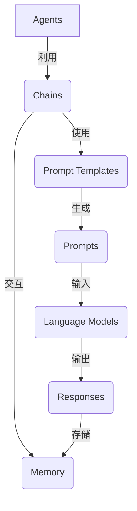

# 【LangChain编程：从入门到实践】RunnablePassthrough

## 1. 背景介绍

在当今数据驱动的世界中,人工智能(AI)和机器学习(ML)已经成为不可或缺的技术。随着数据量的快速增长,有效地处理和利用这些数据变得越来越重要。然而,构建智能系统并将其集成到现有应用程序中仍然是一个巨大的挑战。这就是LangChain的用武之地。

LangChain是一个强大的Python库,旨在帮助开发人员快速构建应用程序,并将最新的AI和ML模型集成到其中。它提供了一种标准化的方式来构建和组合各种组件,如语言模型、知识库和其他数据源,从而创建复杂的工作流程。无论是构建智能助手、问答系统还是自动化任务,LangChain都可以为您提供强大的功能。

## 2. 核心概念与联系

LangChain的核心概念包括代理(Agents)、链(Chains)、提示模板(Prompt Templates)和内存(Memory)。这些概念相互关联,共同构建了LangChain的基础架构。



### 2.1 代理(Agents)

代理是LangChain中最高级别的抽象,它决定如何利用其他组件(如链和工具)来完成特定的任务。代理可以是基于规则的、基于反馈的或基于其他策略的。它们负责协调整个工作流程,并根据需要调用适当的链或工具。

### 2.2 链(Chains)

链是LangChain中的核心构建块,它将多个组件(如提示模板、语言模型和工具)链接在一起,形成一个有序的序列。链可以是简单的(如只包含一个语言模型)或复杂的(如包含多个步骤和条件逻辑)。它们提供了一种标准化的方式来组合和管理不同的组件。

### 2.3 提示模板(Prompt Templates)

提示模板是用于生成输入语言模型的提示(Prompts)的模板。它们允许开发人员定义提示的结构和内容,并在运行时动态插入变量和上下文信息。提示模板可以是简单的文本字符串或更复杂的结构化对象。

### 2.4 内存(Memory)

内存是一个可选的组件,用于存储和检索与当前对话或任务相关的信息。它可以是简单的向量存储或更复杂的知识库。内存可以帮助代理和链保持上下文,并在需要时检索相关信息。

## 3. 核心算法原理具体操作步骤

LangChain的核心算法原理是将各种组件(如语言模型、知识库和工具)组合在一起,形成一个有序的工作流程。这个过程可以分为以下几个步骤:

1. **定义提示模板**:首先,开发人员需要定义一个或多个提示模板,用于生成输入语言模型的提示。提示模板可以包含静态文本和动态变量。

2. **创建链**:接下来,开发人员需要创建一个或多个链,将提示模板与语言模型、工具和其他组件链接在一起。链可以是简单的(如只包含一个语言模型)或复杂的(如包含多个步骤和条件逻辑)。

3. **初始化代理(可选)**:如果需要,开发人员可以创建一个代理来协调整个工作流程。代理可以根据特定的策略(如基于规则或基于反馈)来调用适当的链或工具。

4. **运行时执行**:在运行时,LangChain会根据定义的链和提示模板生成输入语言模型的提示。语言模型会根据提示生成响应,该响应可能会被进一步处理或用于调用其他工具或链。

5. **内存管理(可选)**:如果使用了内存组件,LangChain会将相关信息存储在内存中,以供后续使用。

6. **结果输出**:最终,LangChain会输出最终的结果,该结果可能是一个简单的文本响应或更复杂的结构化数据。

这个过程可以重复执行,直到完成所需的任务。LangChain的灵活性允许开发人员根据需要定制和扩展工作流程,以满足各种需求。

## 4. 数学模型和公式详细讲解举例说明

虽然LangChain本身不涉及复杂的数学模型,但它可以与各种语言模型集成,这些语言模型可能基于不同的数学模型和公式。在这一节中,我们将简要介绍一些常见的语言模型背后的数学原理。

### 4.1 Transformer模型

许多现代语言模型(如GPT和BERT)都基于Transformer架构。Transformer模型使用了自注意力(Self-Attention)机制,它允许模型捕捉输入序列中任意两个位置之间的依赖关系。自注意力的计算可以用以下公式表示:

$$\text{Attention}(Q, K, V) = \text{softmax}\left(\frac{QK^T}{\sqrt{d_k}}\right)V$$

其中 $Q$ 表示查询(Query)矩阵, $K$ 表示键(Key)矩阵, $V$ 表示值(Value)矩阵, $d_k$ 是缩放因子。

### 4.2 生成式预训练转移器(GPT)

GPT是一种基于Transformer的语言模型,它被训练用于生成任务,如文本生成和机器翻译。GPT模型使用了掩码自回归语言建模(Masked Autoregressive Language Modeling)技术,其目标是最大化下一个标记的条件概率:

$$P(x_t | x_1, x_2, \ldots, x_{t-1}) = \text{softmax}(h_t^T W_e)$$

其中 $x_t$ 是当前标记, $x_1, x_2, \ldots, x_{t-1}$ 是先前的标记序列, $h_t$ 是Transformer的隐藏状态, $W_e$ 是嵌入矩阵。

### 4.3 BERT

BERT(Bidirectional Encoder Representations from Transformers)是一种基于Transformer的双向编码器模型,它被广泛用于各种自然语言处理任务,如文本分类、问答和序列标注。BERT使用了掩码语言建模(Masked Language Modeling)和下一句预测(Next Sentence Prediction)两种预训练任务。掩码语言建模的目标是预测被掩码的标记:

$$\log P(x_i | x_1, \ldots, x_{i-1}, x_{i+1}, \ldots, x_n) = \text{softmax}(h_i^T W_e)$$

其中 $x_i$ 是被掩码的标记, $x_1, \ldots, x_{i-1}, x_{i+1}, \ldots, x_n$ 是其他标记, $h_i$ 是Transformer的隐藏状态, $W_e$ 是嵌入矩阵。

这些只是语言模型背后数学原理的一小部分。不同的模型可能使用不同的技术和公式,具体取决于模型的架构和训练目标。

## 5. 项目实践:代码实例和详细解释说明

在这一节中,我们将通过一个简单的示例来展示如何使用LangChain构建一个问答系统。我们将使用OpenAI的GPT-3语言模型,并将其与LangChain集成。

### 5.1 安装和导入所需的库

首先,我们需要安装LangChain和OpenAI库:

```python
!pip install langchain openai
```

然后,我们导入所需的模块:

```python
from langchain.llms import OpenAI
from langchain.chains import ConversationalRetrievalChain
from langchain.document_loaders import TextLoader
from langchain.indexes import VectorstoreIndexCreator
from langchain.vectorstores import Chroma
```

### 5.2 加载数据

在这个示例中,我们将使用一个简单的文本文件作为知识库。我们使用`TextLoader`加载文件内容:

```python
loader = TextLoader('data.txt')
documents = loader.load()
```

### 5.3 创建向量存储索引

接下来,我们需要创建一个向量存储索引,以便高效地检索相关文档。我们使用`VectorstoreIndexCreator`和`Chroma`来创建索引:

```python
index = VectorstoreIndexCreator().from_loaders([loader])
```

### 5.4 初始化语言模型

我们使用`OpenAI`类初始化GPT-3语言模型,并提供必要的API密钥:

```python
llm = OpenAI(openai_api_key="YOUR_API_KEY")
```

### 5.5 创建问答链

现在,我们可以创建一个`ConversationalRetrievalChain`,它将语言模型与向量存储索引结合在一起,形成一个问答系统:

```python
qa = ConversationalRetrievalChain.from_llm(llm, index.vectorstore)
```

### 5.6 与问答系统交互

最后,我们可以与问答系统进行交互,提出问题并获取答复:

```python
query = "What is the capital of France?"
result = qa({"question": query})
print(result["answer"])
```

这个示例只是LangChain功能的一个简单演示。在实际应用中,您可以根据需要定制和扩展工作流程,例如添加更多的数据源、工具和条件逻辑。

## 6. 实际应用场景

LangChain可以应用于各种场景,包括但不限于:

1. **智能助手**: 构建智能助手系统,如客户服务聊天机器人、个人助理等。

2. **问答系统**: 开发基于知识库的问答系统,用于各种领域,如医疗、法律、技术支持等。

3. **自动化任务**: 使用LangChain自动化各种任务,如数据处理、文本生成、内容摘要等。

4. **决策支持系统**: 构建智能决策支持系统,通过分析数据和知识库提供建议和洞见。

5. **教育和学习**: 开发智能教育系统,提供个性化学习路径和反馈。

6. **科研和发现**: 利用LangChain进行科学研究和发现,如文献分析、假设生成等。

7. **创意和艺术**: 探索LangChain在创意写作、艺术创作等领域的应用。

8. **企业应用**: 将LangChain集成到各种企业应用中,如客户关系管理、文档处理、知识管理等。

总的来说,LangChain为开发人员提供了一种灵活且强大的方式,将最新的AI和ML技术集成到各种应用程序中,极大地扩展了这些应用程序的功能和智能化水平。

## 7. 工具和资源推荐

如果您想进一步学习和使用LangChain,以下是一些推荐的工具和资源:

1. **LangChain官方文档**: LangChain的官方文档(https://python.langchain.com/en/latest/index.html)提供了详细的API参考、教程和示例代码。

2. **LangChain GitHub仓库**: LangChain的GitHub仓库(https://github.com/hwchase17/langchain)包含了最新的源代码、问题跟踪和社区贡献。

3. **Hugging Face Spaces**: Hugging Face Spaces(https://huggingface.co/spaces)提供了一个在线环境,您可以在其中尝试和共享LangChain应用程序。

4. **LangChain课程和教程**: 网上有许多优质的LangChain课程和教程,如Coursera、Udemy和YouTube上的视频教程。

5. **AI社区和论坛**:加入AI社区和论坛,如Reddit的r/MachineLearning和r/LangChain,与其他开发者交流和分享经验。

6. **AI会议和活动**:参加AI相关的会议和活动,如NeurIPS、ICML和ICLR,了解最新的研究和发展趋势。

7. **AI书籍和期刊**:阅读AI相关的书籍和期刊,如"人工智能:一种现代方法"和"自然语言处理期刊"。

8. **在线课程和认证**:考虑参加在线课程或获得AI相关的认证,如Coursera的"深度学习专业证书"和Google的"机器学习工程师专业证书"。

通过利用这些工具和资源,您可以更好地掌握LangChain,并将其应用于各种实际场景中。

## 8. 总结:未来发展趋势与挑战

LangChain为开发人员提供了一种强大的方式,将最新的AI和ML技术集成到各种应用