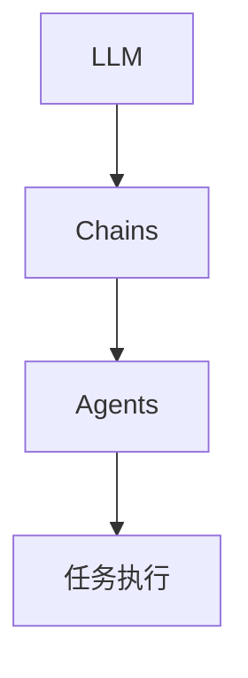

# 【LangChain编程：从入门到实践】专用Chain

## 1.背景介绍

### 1.1 什么是LangChain?

LangChain是一个用于构建应用程序的框架,这些应用程序利用大型语言模型(LLM)和其他源来协助人类并增强他们的能力。LangChain的目标是使开发人员能够轻松地构建基于人工智能的应用程序,同时保持可维护性和可扩展性。

### 1.2 LangChain的优势

LangChain提供了一种模块化和可组合的方式来构建应用程序。它允许开发人员利用各种组件,如LLM、数据加载器、文本拆分器、文本嵌入等,并将它们组合在一起形成复杂的工作流程。这种模块化设计使得开发人员可以轻松地试验不同的组件组合,并根据需要进行自定义。

### 1.3 Chains在LangChain中的作用

Chains是LangChain中的一个关键概念。它们是一系列可组合的组件,用于定义LLM与其他工具和数据源的交互方式。Chains可以是简单的,例如只包含一个LLM,也可以是复杂的,包含多个步骤和条件逻辑。

## 2.核心概念与联系

### 2.1 LLM(大型语言模型)

LLM是LangChain的核心组件。它是一种基于深度学习的自然语言处理模型,能够理解和生成人类可读的文本。常见的LLM包括GPT-3、BERT、XLNet等。LangChain支持多种LLM提供商,如OpenAI、Anthropic、Cohere等。

### 2.2 Prompts(提示)

Prompts是向LLM提供的指令或上下文,用于指导模型生成所需的输出。在LangChain中,Prompts可以是简单的文本字符串,也可以是更复杂的模板或函数。

### 2.3 Agents

Agents是LangChain中的高级概念,它们是一种自主的智能系统,能够根据提供的工具和数据源执行复杂的任务。Agents可以利用LLM来规划和决策,并将任务分解为一系列可操作的步骤。

### 2.4 Chains、Agents和LLM的关系

Chains、Agents和LLM是LangChain中密切相关的概念。Chains定义了LLM与其他组件的交互方式,而Agents则利用Chains来执行复杂的任务。LLM是这些概念的核心,为整个系统提供智能和语言理解能力。



## 3.核心算法原理具体操作步骤

### 3.1 创建LLM实例

首先,我们需要创建一个LLM实例。LangChain支持多种LLM提供商,例如OpenAI的GPT-3:

```python
from langchain.llms import OpenAI

llm = OpenAI(model_name="text-davinci-003", temperature=0.7)
```

### 3.2 定义Prompt

接下来,我们需要定义一个Prompt,用于指导LLM生成所需的输出。Prompt可以是简单的文本字符串:

```python
prompt = "Write a short story about a curious cat."
```

或者是更复杂的模板或函数:

```python
from langchain.prompts import PromptTemplate

prompt_template = PromptTemplate(
    input_variables=["topic"],
    template="Write a short story about {topic}.",
)

prompt = prompt_template.format(topic="a curious cat")
```

### 3.3 创建Chain

现在,我们可以创建一个Chain,将LLM和Prompt组合在一起。LangChain提供了多种预定义的Chain,如`LLMChain`、`ConversationalRetrievalChain`等。

```python
from langchain.chains import LLMChain

chain = LLMChain(llm=llm, prompt=prompt)
```

### 3.4 运行Chain

最后,我们可以运行Chain并获取输出:

```python
output = chain.run()
print(output)
```

这将输出一个由LLM生成的关于好奇猫的短篇故事。

### 3.5 自定义Chain

除了使用预定义的Chain,我们还可以自定义Chain以满足特定需求。例如,我们可以创建一个包含多个步骤的Chain:

```python
from langchain.chains import SimpleSequentialChain
from langchain.prompts import PromptTemplate

prompt_template1 = PromptTemplate(
    input_variables=["topic"],
    template="Write a short introduction about {topic}.",
)

prompt_template2 = PromptTemplate(
    input_variables=["introduction", "topic"],
    template="Here is an introduction: {introduction}\n\nNow write a detailed story about {topic}.",
)

chain1 = LLMChain(llm=llm, prompt=prompt_template1)
chain2 = LLMChain(llm=llm, prompt=prompt_template2)

overall_chain = SimpleSequentialChain(chains=[chain1, chain2], verbose=True)

output = overall_chain.run(topic="a curious cat")
print(output)
```

在这个例子中,我们创建了一个`SimpleSequentialChain`,它包含两个步骤:首先生成一个关于主题的简介,然后基于该简介生成一个详细的故事。

## 4.数学模型和公式详细讲解举例说明

虽然LangChain主要关注自然语言处理,但它也可以用于处理数学公式和模型。在这一节中,我们将探讨如何使用LangChain来解释和操作数学公式。

### 4.1 LaTeX公式渲染

LangChain支持使用LaTeX语法来表示数学公式。我们可以使用`LatexVisualizeChain`来渲染和显示这些公式。

```python
from langchain.chains import LatexVisualizeChain

latex = r"$$ f(x) = x^2 $$"
chain = LatexVisualizeChain(llm=llm)
output = chain.run(latex)
print(output)
```

这将输出一个渲染后的公式图像,以及LLM对该公式的解释。

### 4.2 数学问题求解

我们还可以使用LangChain来解决数学问题。`MathSolutionChain`可以帮助我们实现这一目标。

```python
from langchain.chains import MathSolutionChain

problem = "If x + y = 5 and x - y = 3, what are the values of x and y?"
chain = MathSolutionChain(llm=llm)
output = chain.run(problem)
print(output)
```

在这个例子中,LLM将尝试解析给定的数学问题,并提供解决方案。

### 4.3 符号计算

LangChain还支持符号计算,这对于处理复杂的数学表达式非常有用。我们可以使用`SymbolicMathChain`来实现这一目的。

```python
from langchain.chains import SymbolicMathChain
from sympy import symbols

x, y = symbols("x y")
expression = x**2 + 2*x*y + y**2
chain = SymbolicMathChain(llm=llm)
output = chain.run(expression, question="Factor the expression.")
print(output)
```

在这个例子中,LLM将尝试对给定的数学表达式进行因式分解。

## 5.项目实践:代码实例和详细解释说明

在本节中,我们将通过一个实际项目来演示如何使用LangChain构建一个基于LLM的应用程序。我们将构建一个简单的问答系统,它可以从给定的文本中提取相关信息并回答用户的问题。

### 5.1 准备数据

首先,我们需要准备一些文本数据作为知识库。在这个例子中,我们将使用一些关于Python编程语言的文本。

```python
text = """
Python is a high-level, general-purpose programming language. Its design philosophy emphasizes code readability with the use of significant indentation. Python is dynamically-typed and garbage-collected. It supports multiple programming paradigms, including structured, object-oriented and functional programming.

Python was created by Guido van Rossum and first released in 1991. Python's name is derived from the British comedy group Monty Python, a favourite of the creator. Python 2.0 was released in 2000 and introduced new features like list comprehensions, and a garbage collection system with reference counting.

Python 3.0 was released in 2008 and was a major revision of the language that is not completely backward-compatible with previous versions. Python 2 was discontinued with version 2.7.18 in 2020.

Some of Python's notable features include:
- Dynamic typing and dynamic binding
- Proper handling of Unicode
- Exception handling
- Automatic memory management
- Extensive standard library
- Object-oriented programming support

Python is used in a wide range of application domains including web development, scientific computing, data analysis, artificial intelligence, and more. Some well-known projects that use Python include Django (web framework), Flask (micro web framework), NumPy (numerical computing), SciPy (scientific computing), Matplotlib (data visualization), Pandas (data analysis), and TensorFlow (machine learning).
"""
```

### 5.2 创建向量存储

为了能够从文本中检索相关信息,我们需要创建一个向量存储。向量存储是一种高效的数据结构,用于存储文本的向量表示。在这个例子中,我们将使用基于内存的简单向量存储。

```python
from langchain.vectorstores import FAISS

vectorstore = FAISS.from_texts([text], embeddings)
```

### 5.3 创建检索器

接下来,我们需要创建一个检索器,它将使用向量存储来查找与用户查询相关的文本片段。

```python
from langchain.chains.question_answering import stuff
retriever = stuff.load_retriever(vectorstore.as_retriever())
```

### 5.4 创建问答链

现在,我们可以创建一个问答链,将LLM、检索器和文本拆分器组合在一起。

```python
from langchain.chains import RetrievalQA

qa = RetrievalQA.from_chain_type(
    llm=llm,
    chain_type="stuff",
    retriever=retriever,
    return_source_documents=True,
)
```

### 5.5 运行问答系统

最后,我们可以向问答系统提出问题,并获取答案。

```python
query = "What is Python used for?"
result = qa({"query": query})
print(result["result"])
```

这将输出一个由LLM生成的答案,基于从文本中检索到的相关信息。

## 6.实际应用场景

LangChain提供了广泛的应用场景,可以用于构建各种基于LLM的应用程序。以下是一些常见的应用场景:

### 6.1 问答系统

如前一节所示,LangChain可以用于构建问答系统。这种系统可以从给定的知识库中检索相关信息,并使用LLM生成自然语言答案。问答系统在客户服务、知识管理和教育领域都有广泛的应用。

### 6.2 文本摘要

LangChain可以用于自动生成文本摘要。通过组合LLM和文本拆分器,我们可以创建一个系统,能够识别文本中的关键信息并生成简洁的摘要。这对于处理大量文本数据非常有用,例如新闻文章、研究论文等。

### 6.3 代码生成

LangChain还可以用于代码生成。通过提供适当的Prompt和示例,LLM可以学习编程语言的语法和逻辑,并生成新的代码片段。这对于自动化编程任务、代码补全和代码解释等场景非常有用。

### 6.4 自动化工作流程

LangChain的Agents概念使其成为构建自动化工作流程的理想选择。Agents可以利用LLM来规划和决策,并将复杂的任务分解为一系列可操作的步骤。这种能力可以应用于各种领域,如客户服务、数据处理和业务流程自动化。

### 6.5 个性化助手

通过结合LLM和其他组件,LangChain可以用于构建个性化的虚拟助手。这些助手可以根据用户的偏好和需求提供个性化的响应和建议。个性化助手在电子商务、健康和教育等领域都有潜在的应用。

## 7.工具和资源推荐

在使用LangChain进行开发时,以下工具和资源可能会派上用场:

### 7.1 LangChain文档

LangChain的官方文档(https://python.langchain.com/en/latest/index.html)提供了详细的API参考、教程和示例。这是学习和使用LangChain的绝佳资源。

### 7.2 LangChain示例库

LangChain提供了一个示例库(https://github.com/hwchase17/langchain-examples),其中包含了各种用例的代码示例。这些示例可以帮助您快速入门并了解LangChain的功能。

### 7.3 Hugging Face Spaces

Hugging Face Spaces(https://huggingface.co/spaces)是一个在线平台,用于共享和发现基于LLM的应用程序。您可以在这里找到许多使用LangChain构建的示例应用程序。

### 7.4 LangChain Discord社区

LangChain维护了一个活跃的Discord社区(https://discord.gg/langchain),您可以在