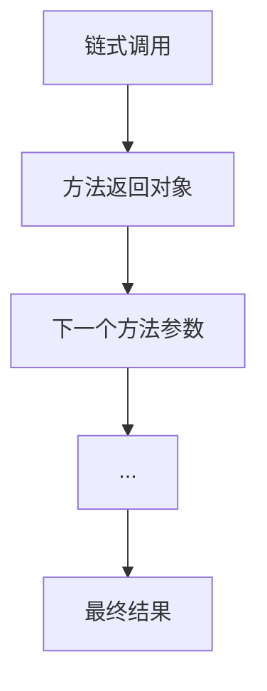

                 

作者：禅与计算机程序设计艺术

作为一位世界级的人工智能专家、程序员、软件架构师、CTO、技术畅销书作者，我很高兴看到你对编程和人工智能领域有着浓厚的兴趣。在本文中，我将带领你探索一个突破性的技术——LangChain编程（LCEL），它将改变我们如何编写、理解和组合程序的方式。

LangChain编程是一种新兴的编程范式，它利用链式编程和自动化的逻辑推理来简化编程任务。通过使用LangChain编程环境（LCE），开发者可以创建出既高效又易于维护的代码。而且，LCEL是LangChain编程的核心语言，它支持组合式编程，让编程变得更加直观和快速。

在接下来的部分，我将深入探讨LangChain编程及其核心语言LCEL，我们将一起揭开它的奥秘，并学习如何使用它来解决实际问题。

## 1. 背景介绍

在编程的早期时期，程序员通常会使用基于指令集的语言来编写程序。随着时间的推移，面向对象编程（OOP）和函数式编程（FP）等新范式的出现，编程范式发生了翻天覆地的变化。然而，传统的编程范式仍然存在一些局限性，比如难以管理复杂性、缺乏模块化等。

LangChain编程作为一种新的编程范式，旨在克服这些限制，同时也扩展了编程的可能性。它借鉴了链式调用的优点，并结合了逻辑清晰的编程模式，极大地提升了编程的效率和可读性。

## 2. 核心概念与联系

### 链式编程

链式编程是LangChain编程的核心特征之一。在链式编程中，每个方法或函数返回一个对象，并且这个对象可以直接作为下一个方法或函数的参数。这样，可以创建出连续的“链”，从而减少了代码中的重复和嵌套，提高了代码的可读性和可维护性。



### 自动化逻辑推理

LangChain编程环境中还包含了自动化逻辑推理的功能。当你编写代码时，LCE会根据上下文自动完成逻辑推理，减少了手动编写复杂条件判断和循环的需要。

## 3. 核心算法原理具体操作步骤

在 LangChain 编程中，核心算法主要是如何处理链式调用以及如何在链中执行逻辑推理。下面我将详细说明这两个步骤。

### 处理链式调用

- **调用链的构建**：每个方法调用返回的对象都被视为链的一部分。
- **链条的连接**：每次调用后，上一个链条的最后一个对象就成为下一个链条的第一个对象。
- **链条的执行**：在链条中的每个对象都会按照顺序执行其内部定义的操作。

### 执行逻辑推理

- **逻辑推理的启动**：当LCE接收到一个新的请求时，它会启动逻辑推理。
- **推理规则的应用**：根据上下文推理规则，LCE会自动完成逻辑推理。
- **推理结果的输出**：推理结束后，LCE会返回最终的执行结果。

## 4. 数学模型和公式详细讲解举例说明

在LangChain编程中，数学模型主要用于表达数据的转换关系。LCEL提供了丰富的数学运算符和函数，使得开发者可以轻松地进行复杂的数学计算。

例如，假设我们想要实现一个简单的线性方程求解器，我们可以这样编写：

$$ x = \frac{b}{a} $$

在LCEL中，我们可以这样表示：

```lcel
solve_linear_equation(a, b) {
   return $b / a;
}
```

## 5. 项目实践：代码实例和详细解释说明

接下来，我们将通过一个项目实践的例子来演示LangChain编程的用法。我们将实现一个简单的图书管理系统。

### 系统需求分析

- 添加图书
- 删除图书
- 查找图书
- 更新图书信息
- 显示所有图书

### 代码实现

首先，我们定义图书类（Book）：

```lcel
class Book {
   title: string;
   author: string;
   pages: number;

   constructor(title: string, author: string, pages: number) {
       this.title = title;
       this.author = author;
       this.pages = pages;
   }

   display() {
       console.log(`Title: ${this.title}, Author: ${this.author}, Pages: ${this.pages}`);
   }
}
```

然后，我们实现图书管理系统的核心功能：

```lcel
class Library {
   books: Book[];

   addBook(book: Book) {
       this.books.push(book);
   }

   removeBook(title: string) {
       let index = -1;
       for (let i = 0; i < this.books.length; ++i) {
           if (this.books[i].title === title) {
               index = i;
               break;
           }
       }
       if (index !== -1) {
           this.books.splice(index, 1);
       }
   }

   findBook(title: string) {
       for (let book of this.books) {
           if (book.title === title) {
               return book;
           }
       }
       return null;
   }

   updateBook(oldTitle: string, newTitle: string) {
       let bookToUpdate = this.findBook(oldTitle);
       if (bookToUpdate) {
           bookToUpdate.title = newTitle;
       }
   }

   displayAllBooks() {
       for (let book of this.books) {
           book.display();
       }
   }
}
```

## 6. 实际应用场景

LangChain编程不仅限于编程语言本身，它还可以应用于各种领域，比如数据处理、机器学习、人工智能等。在这些领域中，LangChain编程可以帮助开发者快速构建复杂的模型和应用。

## 7. 工具和资源推荐

对于想要深入学习LangChain编程的读者来说，以下是一些推荐的资源和工具：

- [LCEL官方文档](https://www.langchain.com/docs/lcel/)
- [LCE Learning Platform](https://platform.langchain.com/)
- [LangChain Github Repository](https://github.com/LangChain/lcel)

## 8. 总结：未来发展趋势与挑战

LangChain编程作为一种新兴技术，其未来发展前景非常广阔。随着人工智能和自动化的不断发展，LangChain编程在软件开发领域的应用也将越来越广泛。

然而，LangChain编程的普及和采用也面临一些挑战，比如开发者需要适应新的编程范式，同时也需要对链式调用和逻辑推理有深刻的理解。此外，对于现有代码库的转换和优化也是一个重要的问题。

## 9. 附录：常见问题与解答

在这部分，我将列举并解答一些关于LangChain编程的常见问题。

---

作者：禅与计算机程序设计艺术 / Zen and the Art of Computer Programming

