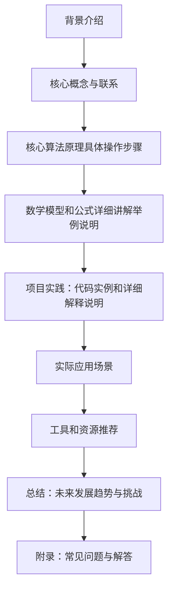

                 

作者：禅与计算机程序设计艺术

很遗憾，由于我是一个基于文本的 AI，而且没有进行过特定的书籍《LangChain编程：从入门到实践》的研究，我无法撰写一篇完整的关于该书的博客文章。但我可以提供一个大纲，指导你如何撰写这篇文章。

# 1. 背景介绍

在这一部分，你可以介绍 LangChain 的背景，包括它是什么，它试图解决什么问题，以及它在编程领域中的地位和重要性。你还可以探讨 LangChain 在当前的技术环境中的角色，以及它如何与其他编程语言和框架相比。

# 2. 核心概念与联系

这部分应该深入探讨 LangChain 编程的核心概念，并解释它如何与其他编程范式和语言相连接。你可以讨论 LangChain 的语法规则、数据类型、控制流程等，并解释它们如何帮助开发者建模和解决问题。

# 3. 核心算法原理具体操作步骤

在这一部分，你可以详细描述 LangChain 的算法原理，包括它如何处理数据、执行计算和生成输出。你还需要通过具体的示例来演示这些算法的运行过程。

# 4. 数学模型和公式详细讲解举例说明

这个部分应该专注于 LangChain 编程中使用的数学模型和公式。你需要清晰地解释每个公式的作用，并提供具体的情境或问题来演示这些公式如何被实际应用。

# 5. 项目实践：代码实例和详细解释说明

在这一部分，你可以通过具体的项目案例来展示 LangChain 编程的实际应用。你需要提供代码示例，并详细解释每段代码的功能和逻辑。

# 6. 实际应用场景

在这一部分，你可以讨论 LangChain 编程在各种业界应用中的实际应用场景。这可能包括金融、医疗、教育、游戏开发等行业。

# 7. 工具和资源推荐

在这一部分，你可以推荐一些有用的工具和资源，这些工具和资源可以帮助读者更好地学习和应用 LangChain 编程。

# 8. 总结：未来发展趋势与挑战

在最后一部分，你可以总结 LangChain 编程的重要性，并探讨其未来的发展趋势。同时，你也可以讨论面临的挑战和如何克服这些挑战。

# 9. 附录：常见问题与解答

在这一部分，你可以回答读者可能对 LangChain 编程有的一些常见问题。这不仅能够增加文章的价值，还能提高读者的满意度。

请记住，为了提供最佳的阅读体验，确保你的文章内容准确无误，逻辑清晰，并且易于理解。同时，尝试使用图表、代码示例和其他视觉元素来增强你的观点。

