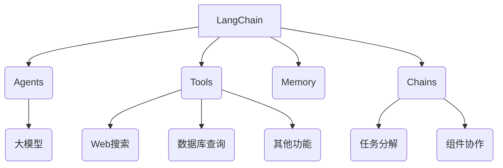
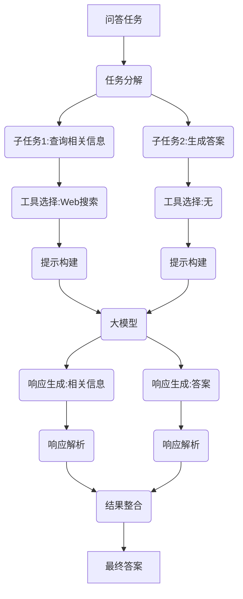

# 【LangChain编程：从入门到实践】大模型技术浪潮

## 1.背景介绍

近年来,大模型(Large Language Models,LLMs)在自然语言处理(NLP)领域掀起了一场技术革命。作为一种基于深度学习的语言模型,大模型能够从海量文本数据中学习语言模式和知识,并在各种NLP任务中表现出令人惊叹的能力。

随着计算能力的不断提升和训练数据的日益丰富,大模型的规模也在持续扩大。GPT-3、PaLM、ChatGPT等知名大模型,其参数量已经达到数十亿甚至上百亿的规模。这些大模型展现出了强大的语言理解、生成、推理和多任务能力,为各种语言智能应用带来了前所未有的机遇。

然而,如何高效地利用大模型的强大功能,并将其集成到实际应用程序中,是当前面临的一大挑战。LangChain就是为解决这一挑战而诞生的Python库,它提供了一种标准化和模块化的方式来构建大模型应用程序。

## 2.核心概念与联系

LangChain的核心思想是将大模型视为一种"工具",通过链式组合各种组件(如数据加载器、文本拆分器、提示模板等),实现对大模型的高效调用和复杂任务的分解。它的主要核心概念包括:

1. **Agents(智能体)**: 封装了大模型的功能,负责执行特定任务。
2. **Tools(工具)**: 代表可由智能体调用的各种功能,如Web搜索、数据库查询等。
3. **Memory(记忆)**: 用于存储智能体与用户的对话历史,以保持上下文一致性。
4. **Chains(链)**: 将多个组件(如智能体、工具、记忆等)链接在一起,实现复杂任务的分解和协作。

LangChain的设计理念是将大模型视为一种通用的"语言智能引擎",通过组合不同的组件,可以构建出各种语言智能应用,如问答系统、文本摘要、代码生成等。



## 3.核心算法原理具体操作步骤

LangChain的核心算法原理可以概括为以下几个步骤:

1. **任务分解**: 将复杂的语言智能任务分解为一系列较小的子任务。
2. **工具选择**: 根据子任务的性质,选择合适的工具(如Web搜索、数据库查询等)来执行。
3. **提示构建**: 将子任务和相关信息(如上下文、工具描述等)构建成适当的提示,以供大模型理解和生成响应。
4. **响应生成**: 将构建好的提示输入到大模型中,生成对应的响应。
5. **响应解析**: 解析大模型生成的响应,提取有用的信息或执行相应的操作。
6. **结果整合**: 将各个子任务的结果整合,得到最终的任务输出。

这一过程中,LangChain利用了大模型的强大语言理解和生成能力,将复杂任务分解为一系列人类可以理解的子任务,并通过提示的方式与大模型进行交互,最终实现了端到端的任务完成。

以下是一个使用LangChain构建问答系统的示例流程:



## 4.数学模型和公式详细讲解举例说明

大模型通常基于自注意力(Self-Attention)机制和Transformer架构,能够有效地捕捉长距离依赖关系。其核心数学模型是自注意力机制,用于计算输入序列中每个位置的表示向量。

自注意力机制的计算过程可以表示为:

$$\mathrm{Attention}(Q, K, V) = \mathrm{softmax}(\frac{QK^T}{\sqrt{d_k}})V$$

其中:

- $Q$是查询向量(Query)
- $K$是键向量(Key)
- $V$是值向量(Value)
- $d_k$是缩放因子,用于防止点积过大导致梯度消失

每个输入位置的表示向量$y_i$由其对应的值向量$V_i$和注意力权重$\alpha_{ij}$的加权和计算得到:

$$y_i = \sum_{j=1}^n \alpha_{ij}(V_j)$$

其中,注意力权重$\alpha_{ij}$表示查询向量$Q_i$对键向量$K_j$的注意力程度,由softmax函数计算得到:

$$\alpha_{ij} = \frac{\exp(e_{ij})}{\sum_{k=1}^n\exp(e_{ik})}, \quad e_{ij} = \frac{Q_iK_j^T}{\sqrt{d_k}}$$

自注意力机制允许模型在计算每个位置的表示向量时,动态地关注输入序列中的不同位置,从而有效地捕捉长距离依赖关系。

以下是一个使用PyTorch实现的简单自注意力层示例:

```python
import torch
import torch.nn as nn

class SelfAttention(nn.Module):
    def __init__(self, embed_size, heads):
        super(SelfAttention, self).__init__()
        self.embed_size = embed_size
        self.heads = heads
        self.head_dim = embed_size // heads

        self.values = nn.Linear(embed_size, embed_size)
        self.keys = nn.Linear(embed_size, embed_size)
        self.queries = nn.Linear(embed_size, embed_size)
        self.fc_out = nn.Linear(embed_size, embed_size)

    def forward(self, values, keys, query):
        N = query.shape[0]
        value_len, key_len, query_len = values.shape[1], keys.shape[1], query.shape[1]

        # Split embedding into self.heads pieces
        values = values.reshape(N, value_len, self.heads, self.head_dim)
        keys = keys.reshape(N, key_len, self.heads, self.head_dim)
        queries = query.reshape(N, query_len, self.heads, self.head_dim)

        values = values.permute(0, 2, 1, 3) # [N, head, value_len, head_dim]
        keys = keys.permute(0, 2, 1, 3) # [N, head, key_len, head_dim]
        queries = queries.permute(0, 2, 1, 3) # [N, head, query_len, head_dim]

        # Get attention scores
        energy = torch.matmul(queries, keys.permute(0, 1, 3, 2)) / self.head_dim**0.5

        # Get attention probabilities
        attention = torch.softmax(energy, dim=-1)

        # Get values weighted by attention probabilities
        out = torch.matmul(attention, values)

        out = out.permute(0, 2, 1, 3).contiguous()
        out = out.reshape(N, query_len, self.heads * self.head_dim)
        out = self.fc_out(out)

        return out
```

在这个示例中,我们定义了一个`SelfAttention`层,它接受三个输入:值向量`values`、键向量`keys`和查询向量`query`。在前向传播过程中,我们首先将输入embedding分割成多个头(heads),然后计算每个头的注意力分数和加权值向量。最后,我们将所有头的结果连接起来,并通过一个全连接层进行投影,得到最终的输出向量。

通过堆叠多个这样的自注意力层,以及引入其他机制(如残差连接、层归一化等),我们就可以构建出强大的大模型架构,如Transformer、GPT、BERT等。

## 5.项目实践:代码实例和详细解释说明

接下来,我们将通过一个实际的项目实践,演示如何使用LangChain构建一个简单的问答系统。

### 5.1 安装依赖

首先,我们需要安装LangChain及其依赖项:

```bash
pip install langchain openai wikipedia chromadb
```

### 5.2 导入必要的模块

```python
from langchain.agents import initialize_agent, Tool
from langchain.llms import OpenAI
from langchain.chains.conversation.memory import ConversationBufferMemory
from langchain import Wikipedia
```

在这里,我们导入了LangChain中的一些核心模块,包括:

- `initialize_agent`: 用于初始化智能体
- `Tool`: 用于定义可供智能体使用的工具
- `OpenAI`: 用于加载OpenAI的大模型(如GPT-3)
- `ConversationBufferMemory`: 用于存储对话历史
- `Wikipedia`: 用于访问Wikipedia的工具

### 5.3 定义工具

我们定义一个名为`WikipediaTool`的工具,它允许智能体从Wikipedia中搜索和检索相关信息:

```python
wiki = Wikipedia(top_k_results=3)
tools = [
    Tool(
        name="Wikipedia",
        func=wiki.run,
        description="Useful for searching Wikipedia for relevant information to answer queries"
    )
]
```

### 5.4 初始化智能体

接下来,我们初始化一个智能体,并为其提供大模型、工具和记忆组件:

```python
memory = ConversationBufferMemory(memory_key="chat_history")
llm = OpenAI(temperature=0)
agent = initialize_agent(tools, llm, agent="conversational-react-description", verbose=True, memory=memory)
```

在这里,我们使用`OpenAI`作为大模型,并将`WikipediaTool`作为可用工具提供给智能体。我们还设置了一个`ConversationBufferMemory`实例,用于存储对话历史。

### 5.5 与智能体交互

现在,我们可以与初始化好的智能体进行交互了:

```python
query = "What is the capital of France?"
response = agent.run(query)
print(response)
```

在这个示例中,我们向智能体提出了一个简单的问题:"法国的首都是什么?"。智能体会根据需要利用Wikipedia工具搜索相关信息,并基于大模型生成最终的答案。

运行这段代码,你应该能看到类似如下的输出:

```
> Entering new AgentExecutor chain...
Thought: I need to find information about the capital of France to answer this query.
Action: Wikipedia
Query: capital of France
Observation: According to Wikipedia, the capital of France is Paris. Paris is the capital and most populous city of France. It is situated on the river Seine, in the north of the country, and has an estimated population of 2,175,601 residents as of 2018.
Thought: The information from Wikipedia provides a clear answer that the capital of France is Paris.
Final Answer: The capital of France is Paris.

> Finished chain.

The capital of France is Paris.
```

在这个过程中,我们可以看到智能体是如何利用Wikipedia工具搜索相关信息,并基于搜索结果生成最终答案的。

### 5.6 进一步探索

上面的示例只是LangChain强大功能的一个简单体现。通过定义更多的工具(如Web搜索、数据库查询、文件读取等)和组合不同的链(如序列链、转换链等),你可以构建出更加复杂和强大的语言智能应用。

LangChain还提供了许多其他有用的功能,如代理(Agents)、内存管理、评估等,这些功能可以帮助你更好地控制和优化大模型的行为。

## 6.实际应用场景

LangChain为大模型在各种实际应用场景中的应用提供了强有力的支持,包括但不限于:

1. **问答系统**: 利用大模型的语言理解和生成能力,构建智能问答系统,为用户提供准确、相关的答复。
2. **文本摘要**: 使用大模型对长文本进行摘要,提取关键信息,方便快速浏览和理解。
3. **代码生成**: 基于大模型的自然语言到代码的转换能力,实现代码生成和自动化编程。
4. **数据分析**: 将大模型与数据处理工具相结合,实现自然语言驱动的数据分析和可视化。
5. **内容创作**: 利用大模型的文本生成能力,辅助内容创作,如新闻写作、故事创作等。
6. **机器翻译**: 使用大模型进行高质量的机器翻译,支持