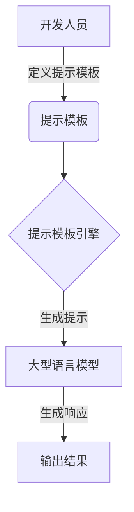

# 【LangChain编程：从入门到实践】提示模板组件

## 1. 背景介绍

随着人工智能和自然语言处理技术的快速发展,LangChain作为一个强大的框架,为开发人员提供了构建可扩展的AI应用程序的能力。其中,提示模板(Prompt Template)组件是LangChain中一个非常重要的概念和功能,它允许开发人员以结构化和可复用的方式管理和生成提示(Prompt)。

在与大型语言模型(如GPT-3)交互时,提示的质量直接影响了模型的输出结果。良好的提示不仅可以帮助模型更好地理解任务,还可以引导模型生成更加准确和相关的响应。然而,手动编写和管理提示可能是一项耗时且容易出错的过程,尤其是在处理复杂的任务或需要多个提示时。

LangChain的提示模板组件旨在简化这一过程,使开发人员能够以更加高效和可维护的方式管理和生成提示。通过提供一种声明式的方式来定义提示的结构和占位符,开发人员可以轻松地创建复杂的提示,并在需要时动态地插入数据。

### Mermaid 流程图



## 2. 核心概念与联系

在深入探讨LangChain的提示模板组件之前,让我们先了解一些核心概念:

1. **提示(Prompt)**: 提示是一段文本,用于向语言模型描述任务或问题,并引导模型生成所需的输出。良好的提示对于获得高质量的模型响应至关重要。

2. **提示模板(Prompt Template)**: 提示模板是一种结构化的方式来定义提示的格式和占位符。它允许开发人员使用变量和模板字符串来构建动态提示,并在运行时插入数据。

3. **提示模板引擎(Prompt Template Engine)**: 提示模板引擎是LangChain中的一个组件,负责将提示模板和输入数据结合起来,生成最终的提示字符串。

4. **大型语言模型(Large Language Model, LLM)**: 大型语言模型是一种基于深度学习的自然语言处理模型,能够理解和生成人类可读的文本。LangChain支持与多种LLM(如GPT-3、Claude等)集成。

这些概念密切相关,共同构成了LangChain提示模板组件的核心。开发人员首先定义提示模板,然后将其与输入数据一起传递给提示模板引擎。引擎会生成最终的提示字符串,并将其发送给大型语言模型。语言模型根据提示生成响应,开发人员可以在应用程序中使用这些响应。

## 3. 核心算法原理具体操作步骤

LangChain的提示模板组件基于一种称为"结构化提示"(Structured Prompt)的概念。结构化提示是一种将提示分解为多个部分的方法,每个部分都有特定的角色和功能。这种方法有助于提高提示的可读性、可维护性和可扩展性。

以下是使用LangChain提示模板组件的典型步骤:

1. **导入必要的模块**

```python
from langchain import PromptTemplate
```

2. **定义提示模板**

提示模板使用模板字符串语法,占位符用大括号`{}`包围。例如:

```python
prompt_template = PromptTemplate(
    input_variables=["product"],
    template="请为以下产品撰写一段营销文案: {product}"
)
```

在这个例子中,我们定义了一个包含一个占位符`{product}`的提示模板。`input_variables`参数指定了需要在运行时提供的输入变量。

3. **生成提示**

要生成最终的提示字符串,我们需要将输入数据传递给`format`方法:

```python
prompt = prompt_template.format(product="智能手机")
print(prompt)
# 输出: "请为以下产品撰写一段营销文案: 智能手机"
```

4. **使用提示与语言模型交互**

生成的提示字符串可以与LangChain支持的任何语言模型一起使用。例如,使用OpenAI的GPT-3:

```python
from langchain.llms import OpenAI

llm = OpenAI(model_name="text-davinci-003")
response = llm(prompt)
print(response)
```

这个示例展示了如何使用提示模板生成提示,并将其传递给OpenAI的GPT-3模型。您可以根据需要替换为其他支持的语言模型。

## 4. 数学模型和公式详细讲解举例说明

虽然提示模板组件主要用于生成自然语言提示,但它也可以用于生成包含数学表达式和公式的提示。LangChain支持使用LaTeX语法在提示中嵌入数学公式。

例如,假设我们想要生成一个包含数学表达式的提示,用于求解一个二次方程。我们可以定义以下提示模板:

```python
prompt_template = PromptTemplate(
    input_variables=["a", "b", "c"],
    template="求解以下二次方程的解: $$ax^2 + bx + c = 0$$"
)
```

在这个例子中,我们使用`$$`来包围LaTeX格式的数学表达式。当生成提示时,LangChain会自动将这些LaTeX表达式渲染为漂亮的数学公式。

```python
prompt = prompt_template.format(a=1, b=2, c=1)
print(prompt)
# 输出: "求解以下二次方程的解: $1x^2 + 2x + 1 = 0$"
```

您可以将生成的提示传递给语言模型,以获得求解二次方程的步骤和结果。

使用LaTeX语法嵌入数学公式不仅可以提高提示的可读性,还可以确保语言模型正确理解和处理数学表达式。这对于涉及数学计算或科学计算的任务特别有用。

## 5. 项目实践: 代码实例和详细解释说明

为了更好地理解LangChain提示模板组件的实际应用,让我们通过一个实际项目来探索它的使用方式。在这个项目中,我们将构建一个简单的问答系统,它可以根据提供的上下文信息回答相关问题。

### 5.1 项目设置

首先,我们需要导入必要的模块和库:

```python
from langchain import PromptTemplate, OpenAI
from langchain.chains import ConversationalRetrievalChain
from langchain.document_loaders import TextLoader
from langchain.indexes import VectorstoreIndexCreator
from langchain.vectorstores import Chroma
```

### 5.2 加载上下文数据

在这个示例中,我们将使用一个简单的文本文件作为上下文数据。您可以根据需要替换为其他数据源,如PDF文件、网页或数据库。

```python
loader = TextLoader("context.txt")
documents = loader.load()
```

### 5.3 创建向量存储和索引

为了高效地检索相关信息,我们需要创建一个向量存储和索引:

```python
index = VectorstoreIndexCreator().from_loaders([loader])
```

### 5.4 定义提示模板

接下来,我们定义一个提示模板,用于生成问答提示:

```python
template = """基于以下上下文信息,回答问题: 

上下文:
{context}

人类: {question}
助手:"""

prompt_template = PromptTemplate(
    input_variables=["context", "question"],
    template=template
)
```

在这个提示模板中,我们包含了上下文信息和问题占位符。模板的格式旨在引导语言模型根据提供的上下文信息回答问题。

### 5.5 创建问答链

现在,我们可以创建一个`ConversationalRetrievalChain`对象,它将提示模板、向量索引和语言模型结合在一起:

```python
chain = ConversationalRetrievalChain.from_llm(
    llm=OpenAI(),
    retriever=index.vectorstore.as_retriever(),
    prompt=prompt_template
)
```

### 5.6 与问答系统交互

最后,我们可以与问答系统进行交互,提出问题并获取回答:

```python
query = "什么是机器学习?"
result = chain({"question": query})
print(result["answer"])
```

这个示例展示了如何使用LangChain的提示模板组件构建一个简单的问答系统。您可以根据需要扩展和定制这个项目,例如添加更多上下文数据、优化提示模板或集成不同的语言模型。

## 6. 实际应用场景

LangChain的提示模板组件可以应用于各种场景,包括但不限于:

1. **问答系统**: 如上一节所示,提示模板可用于构建问答系统,根据提供的上下文信息回答用户的问题。

2. **自动化任务**: 提示模板可用于自动化各种任务,如数据处理、文本生成、代码生成等。通过定义适当的提示模板,您可以指导语言模型完成特定的任务。

3. **个性化助手**: 通过定制提示模板,您可以创建具有特定个性和风格的虚拟助手,用于客户服务、教育或娱乐等领域。

4. **内容生成**: 提示模板可用于生成各种类型的内容,如新闻文章、营销材料、故事情节等。通过精心设计的提示模板,您可以控制生成内容的质量和风格。

5. **科学计算和数据分析**: 如前所述,提示模板支持嵌入LaTeX格式的数学公式,因此可用于涉及科学计算和数据分析的任务。

6. **语言翻译**: 提示模板可用于指导语言模型进行语言翻译,并根据需要定制翻译风格和质量。

7. **情感分析和情绪检测**: 通过设计适当的提示模板,您可以训练语言模型识别和分析文本中的情感和情绪。

这些只是提示模板组件的一些应用场景。随着人工智能和自然语言处理技术的不断发展,提示模板组件的应用前景将变得更加广阔。

## 7. 工具和资源推荐

在使用LangChain的提示模板组件时,以下工具和资源可能会对您有所帮助:

1. **LangChain文档**: LangChain官方文档提供了详细的API参考和示例,是学习和使用提示模板组件的绝佳资源。网址: https://python.langchain.com/en/latest/

2. **LangChain示例库**: LangChain维护了一个示例库,展示了提示模板组件在各种场景下的应用。您可以在这里找到灵感和起点代码。网址: https://github.com/hwchase17/langchain-examples

3. **Prompt Engineering资源**: 提示工程(Prompt Engineering)是一个新兴的领域,旨在研究如何设计高质量的提示。以下资源可以帮助您提高提示工程技能:
   - "The Prompt Book" by Dair.ai: https://www.promptingguide.ai/
   - "Prompt Engineering for Developers" by Anthropic: https://www.anthropic.com/prompt-engineering-101

4. **社区论坛和聊天室**: LangChain拥有一个活跃的社区,您可以在论坛和聊天室中提出问题、分享经验或寻求帮助。
   - Discord: https://discord.gg/dair-ai
   - GitHub Discussions: https://github.com/hwchase17/langchain/discussions

5. **LangChain扩展库**: LangChain生态系统中有许多第三方扩展库,提供了额外的功能和集成。例如,`langchain-pdf`可用于从PDF文件中提取文本,而`langchain-serve`则提供了一种简单的方式来部署LangChain应用程序。

6. **集成开发环境(IDE)插件**: 一些IDE插件可以提高使用LangChain的效率,例如自动完成和代码片段。例如,Visual Studio Code有一个名为"LangChain AI"的插件。

利用这些工具和资源,您可以更好地掌握LangChain的提示模板组件,并将其应用于各种实际场景中。

## 8. 总结: 未来发展趋势与挑战

LangChain的提示模板组件为开发人员提供了一种结构化和可复用的方式来管理和生成提示,从而简化了与大型语言模型的交互过程。通过提示模板,开发人员可以更轻松地创建复杂的提示,并动态插入数据,提高了提示的质量和一致性。

然而,随着人工智能和自然语言处理技术的不断发展