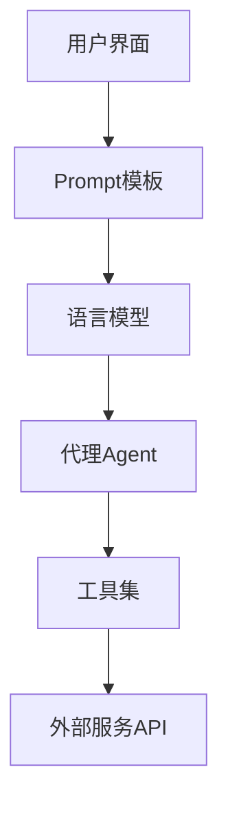

# 【LangChain编程：从入门到实践】构建多模态机器人

## 1. 背景介绍

### 1.1 人工智能与多模态交互

人工智能技术的快速发展正在深刻影响着我们的生活和工作方式。其中,多模态交互是人工智能领域的一个重要分支,旨在让机器能够像人一样理解和处理多种形式的信息,如文本、语音、图像和视频等。通过多模态交互,我们可以构建更加智能、自然、高效的人机交互系统。

### 1.2 LangChain的出现与发展

LangChain是一个强大的开源框架,专为构建多模态应用程序而设计。它提供了一套灵活、模块化的工具和组件,使开发者能够快速搭建和部署多模态机器人。LangChain的出现填补了多模态应用开发领域的空白,为开发者提供了一个统一、高效的开发平台。

### 1.3 本文的目的与结构

本文旨在通过LangChain框架,带领读者从入门到实践,一步步构建一个功能完备的多模态机器人。全文分为9个部分,依次介绍背景知识、核心概念、算法原理、数学模型、代码实践、应用场景、工具资源、未来展望以及常见问题解答。通过本文的学习,读者将掌握LangChain的基本原理和使用方法,并能够独立开发多模态应用。

## 2. 核心概念与联系

### 2.1 LangChain的核心概念

#### 2.1.1 Prompt模板

Prompt模板是LangChain的核心概念之一,它定义了人机对话的基本结构和流程。通过Prompt模板,我们可以设计多轮对话、上下文关联等复杂的交互逻辑。

#### 2.1.2 语言模型

语言模型是LangChain的基石,负责对文本数据进行理解和生成。LangChain支持多种主流的语言模型,如GPT、BERT、T5等,可以根据任务需求灵活选择。

#### 2.1.3 代理(Agent)

代理是LangChain中的智能执行单元,它接收用户的指令,调用相应的工具或服务完成任务,并将结果返回给用户。代理可以根据任务的复杂度,设计单个或多个步骤的执行流程。

### 2.2 LangChain的模块化设计

LangChain采用模块化的架构设计,各个组件之间松耦合、可插拔,使得开发者可以根据需求灵活组合和扩展。下图展示了LangChain的整体架构:



## 3. 核心算法原理与操作步骤

### 3.1 基于Prompt的任务分解

LangChain的核心算法之一是基于Prompt的任务分解。具体步骤如下:

1. 定义任务Prompt模板,描述任务的输入、输出和约束条件。
2. 将用户的指令填入Prompt模板,生成完整的任务描述。
3. 通过语言模型对任务描述进行理解和分析,提取关键信息。 
4. 根据任务的复杂度,将其分解为若干个子任务。
5. 对每个子任务递归执行步骤2-4,直到所有子任务都可以由代理直接执行。
6. 代理按照拓扑序依次执行子任务,并将中间结果传递。
7. 整合各个子任务的结果,生成最终的任务输出。

### 3.2 基于知识图谱的语义理解

为了增强语言模型的语义理解能力,LangChain引入了基于知识图谱的技术。具体步骤如下:

1. 根据任务领域,构建或导入相关的知识图谱。
2. 在语言模型的embedding中加入实体和关系的表示。
3. 在任务分解和执行过程中,利用知识图谱进行语义推理和消歧。
4. 将知识图谱的推理结果反馈给语言模型,动态调整其理解和生成。

## 4. 数学模型和公式详解

### 4.1 Transformer语言模型

LangChain采用Transformer作为底层的语言模型。Transformer的核心是自注意力机制(Self-Attention),可以捕捉文本中的长距离依赖关系。其数学公式为:

$$
Attention(Q,K,V) = softmax(\frac{QK^T}{\sqrt{d_k}})V
$$

其中,$Q$,$K$,$V$分别表示查询、键、值向量,$d_k$为向量维度。

### 4.2 知识图谱嵌入

为了将知识图谱引入语言模型,LangChain使用TransE等知识图谱嵌入算法。TransE的数学公式为:

$$
f_r(h,t) = ||h+r-t||
$$

其中,$h$,$r$,$t$分别表示头实体、关系、尾实体的嵌入向量。TransE通过最小化$f_r(h,t)$,使得在嵌入空间中,$h+r\approx t$。

## 5. 项目实践:构建多模态机器人

### 5.1 环境准备

首先,安装LangChain及其依赖:

```bash
pip install langchain openai faiss-cpu
```

### 5.2 定义Prompt模板

```python
from langchain import PromptTemplate

template = """
你是一个智能助理,请根据以下指令完成任务:
{instruction}

在执行过程中,你可以使用以下工具:
{tool_names}

任务输出需要满足以下要求:
{output_format}
"""

prompt = PromptTemplate(
    input_variables=["instruction", "tool_names", "output_format"],
    template=template
)
```

### 5.3 加载语言模型

```python
from langchain.llms import OpenAI

llm = OpenAI(model_name="text-davinci-002")
```

### 5.4 定义代理和工具

```python
from langchain.agents import initialize_agent
from langchain.tools import BaseTool

class SearchTool(BaseTool):
    name = "Search"
    description = "useful for searching information on the Internet"
    
    def _run(self, query):
        # 调用搜索引擎API
        return search_result
    
tools = [SearchTool()]

agent = initialize_agent(
    tools, 
    llm, 
    agent="zero-shot-react-description", 
    verbose=True
)
```

### 5.5 执行任务

```python
instruction = "帮我查找LangChain的官方文档,总结其主要特性和优势"
output_format = "以Markdown格式输出,字数在500字以内"

result = agent.run(prompt.format(
    instruction=instruction,
    tool_names=[tool.name for tool in tools],
    output_format=output_format
))

print(result)
```

## 6. 实际应用场景

LangChain可以应用于多种场景,例如:

- 智能客服:通过多轮对话理解用户意图,提供个性化服务。
- 智能文档助手:根据用户的问题,自动检索和总结文档内容。  
- 数据分析助手:通过自然语言交互,协助用户进行数据分析和可视化。
- 智能教学助手:根据学生的学习进度和问题,提供个性化的教学内容。

## 7. 工具和资源推荐

- [LangChain官方文档](https://docs.langchain.com/):提供了详尽的教程、API文档和最佳实践。
- [LangChain Github Repo](https://github.com/hwchase17/langchain):包含了LangChain的源码和示例项目。
- [OpenAI API](https://openai.com/api/):LangChain支持的主流语言模型服务。
- [Hugging Face Models](https://huggingface.co/models):LangChain支持的开源语言模型库。
- [Streamlit](https://streamlit.io/):一个用于快速构建交互式Web应用的工具包。

## 8. 总结:未来发展与挑战

LangChain为构建多模态应用提供了一个强大的框架,极大地降低了开发门槛。未来,LangChain有望进一步增强其多模态处理能力,支持更多类型的数据和任务。同时,LangChain也面临一些挑战:

- 提高语言模型的推理和常识理解能力。
- 优化任务分解和执行策略,提升处理效率。
- 引入更多的知识源,扩大应用领域。
- 探索人机协作的新模式,实现更自然的交互。

## 9. 附录:常见问题解答

### Q1:LangChain支持哪些语言模型?

LangChain支持主流的语言模型,如GPT、BERT、RoBERTa、T5等,同时也支持自定义模型。

### Q2:LangChain可以处理非文本形式的数据吗?

LangChain目前主要专注于文本数据的处理。对于图像、语音等其他形式的数据,可以通过预处理转换为文本,再交由LangChain处理。未来,LangChain计划提供更多的多模态处理组件。

### Q3:LangChain的任务执行是否支持并行?

LangChain支持异步执行,可以通过并行执行独立的子任务来提高效率。但是,对于有依赖关系的子任务,仍需按照拓扑序串行执行。

### Q4:如何为LangChain定制自己的工具集?

LangChain提供了一个基类BaseTool,用户可以通过继承该基类并实现_run方法来定制自己的工具。在初始化Agent时,将自定义的工具实例传入即可。

### Q5:LangChain的可扩展性如何?

得益于模块化的设计,LangChain具有很好的可扩展性。用户可以自由地添加或替换各个组件,如Prompt模板、语言模型、工具集等,以满足不同的任务需求。同时,LangChain也在不断地丰富其生态,引入更多的第三方服务和工具。

作者：禅与计算机程序设计艺术 / Zen and the Art of Computer Programming