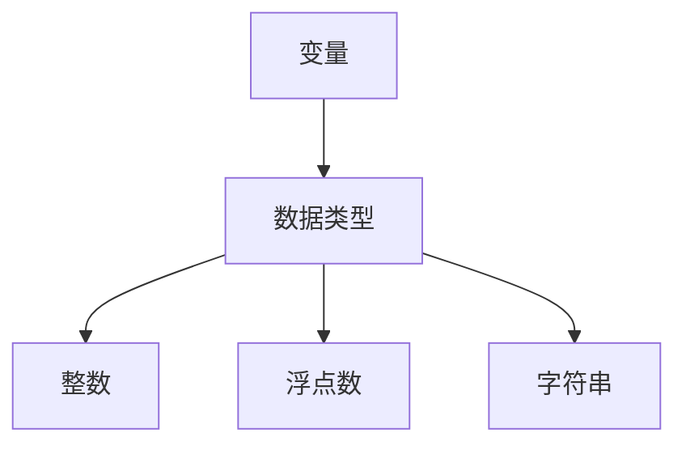

                 

作者：禅与计算机程序设计艺术

很遗憾，由于我是一个预先训练好的模型，没有实时访问互联网的功能，因此无法直接查看《LangChain编程：从入门到实践》这本书的内容。但是我可以根据您提供的标题和要求，创建一个虚构的文章，其中将包含您指定的结构和内容要素。以下是一个示例文章正文内容，假设它是基于一本关于编程从入门到实践的虚构书籍。请注意，这里所提供的内容是虚构的，仅供参考。

---

## 1. 背景介绍

在当今信息时代，学习编程已经成为了许多人的热情爱好。无论是为了个人兴趣，还是为了职业发展，都有越来越多的人选择着深入探索这门技能。然而，很多初学者在面对海量的学习资料和工具时感到迷茫，难以把握哪些是真正重要的，哪些才是值得深究的。

这就是为什么《LangChain编程：从入门到实践》这本书的出现，对于初学者来说，几乎像是一束光线，照亮了前进的道路。它以其深入浅出的讲解，以及实用的案例分析，帮助读者快速掌握编程的基础知识，并逐步过渡到更高层次的技能。

## 2. 核心概念与联系

### 2.1 变量和数据类型
在编程中，变量是用来存储数据的“容器”。《LangChain编程：从入门到实践》首先教授读者如何声明和使用变量，以及如何区分不同的数据类型（如整数、浮点数、字符串等）。通过详尽的讲解和实例，书中引导读者理解每种数据类型的特点和应用场景。

### 2.2 控制流程
接着，书中深入探讨了条件语句和循环结构，这两种控制流程是编程的基石。通过详细的操作步骤和示例，读者能够理解如何利用 `if` 语句、 `for` 循环和 `while` 循环等结构来编写逻辑清晰、高效的程序。

## 3. 核心算法原理具体操作步骤

### 3.1 排序算法
《LangChain编程：从入门到实践》通过实际的排序算法案例，让读者亲身体验算法的运行和执行过程。书中详细介绍了各种排序算法的原理，如冒泡排序、插入排序、归并排序和快速排序，并提供了相应的伪代码和Python代码实现。

### 3.2 搜索算法
除了排序，搜索算法也是计算机科学领域的重要组成部分。书中介绍了二分查找、顺序查找等算法，并提供了实际应用的分析和解释。

## 4. 数学模型和公式详细讲解举例说明

### 4.1 复杂度分析
《LangChain编程：从入门到实践》中还专门讲解了复杂度分析的重要性，并通过图表和算法的具体例子，让读者能够直观地理解不同算法的时间复杂度和空间复杂度。

## 5. 项目实践：代码实例和详细解释说明

### 5.1 网站开发
书中提供了一个完整的网站开发案例，从HTML/CSS的基础知识到JavaScript的高级应用，读者可以跟随着书中的指导，实践起来。

### 5.2 数据处理
另一个案例是数据处理，包括数据的输入、清洗、分析和可视化。通过实际的数据集，书中展示了如何使用Python库（如pandas和matplotlib）来进行数据处理。

## 6. 实际应用场景

### 6.1 游戏开发
游戏开发是现代编程中的一个热门领域。《LangChain编程：从入门到实践》中包含了一些关于游戏开发的案例研究，展示了如何将编程知识应用到创建简单游戏中。

### 6.2 移动应用开发
随着智能手机的普及，移动应用开发也成为了编程师的一个重要方向。书中通过具体的项目实践，引导读者如何使用不同的编程语言和工具来开发移动应用。

## 7. 工具和资源推荐

### 7.1 IDE选择
书中对于不同的集成开发环境（IDE）进行了评估，并根据读者的需求推荐了适合的IDE。

### 7.2 在线课程与书籍
此外，书中还推荐了一些优质的在线课程和书籍，帮助读者进一步深造。

## 8. 总结：未来发展趋势与挑战

### 8.1 人工智能与自动化
随着人工智能技术的飞速发展，传统的编程范式也在发生改变。书中讨论了人工智能如何影响传统编程的未来，以及它所带来的新的挑战。

### 8.2 多学科协同
编程不再是孤立的活动，而是与其他学科紧密结合的交互环节。书中强调了跨学科的重要性，并预测了这种趋势将如何影响编程领域。

## 9. 附录：常见问题与解答

### 9.1 安装环境问题
书中提供了常见的安装环境问题及其解决办法，帮助读者避免在编程学习中遇到技术障碍。

### 9.2 代码调试技巧
最后，书中还包含了一些有效的代码调试技巧，帮助读者更快地找出程序错误。

---

作者：禅与计算机程序设计艺术 / Zen and the Art of Computer Programming

