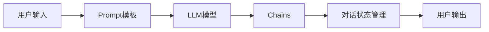

# 【LangChain编程：从入门到实践】消息处理框架

## 1. 背景介绍
### 1.1 人工智能对话系统的发展历程
#### 1.1.1 早期的基于规则的对话系统
#### 1.1.2 基于统计学习的对话系统
#### 1.1.3 基于深度学习的端到端对话系统

### 1.2 LangChain的诞生 
#### 1.2.1 LangChain的起源与发展
#### 1.2.2 LangChain的设计理念
#### 1.2.3 LangChain的主要特点

### 1.3 LangChain在对话系统中的应用前景
#### 1.3.1 简化对话系统的开发流程
#### 1.3.2 提升对话系统的性能表现
#### 1.3.3 拓展对话系统的应用场景

## 2. 核心概念与联系
### 2.1 LangChain的核心组件
#### 2.1.1 Prompt模板
#### 2.1.2 LLM模型接口
#### 2.1.3 Chains

### 2.2 LangChain中的数据流
#### 2.2.1 数据的输入与预处理
#### 2.2.2 数据在组件间的传递
#### 2.2.3 数据的输出与后处理

### 2.3 LangChain的工作原理
#### 2.3.1 Prompt填充与LLM调用
#### 2.3.2 Chains的串联执行
#### 2.3.3 对话状态的管理



## 3. 核心算法原理与具体操作步骤
### 3.1 Prompt模板的设计与优化
#### 3.1.1 Prompt的基本结构
#### 3.1.2 Few-shot Prompting技术
#### 3.1.3 Prompt模板的动态生成

### 3.2 LLM模型接口的调用与参数配置
#### 3.2.1 OpenAI API的使用
#### 3.2.2 LLM模型参数的调节
#### 3.2.3 LLM输出结果的解析

### 3.3 Chains的组合与嵌套
#### 3.3.1 顺序链(Sequential Chains)
#### 3.3.2 条件链(Conditional Chains)
#### 3.3.3 嵌套链(Nested Chains)

## 4. 数学模型和公式详细讲解举例说明
### 4.1 Transformer模型原理
#### 4.1.1 Self-Attention机制
$Attention(Q,K,V) = softmax(\frac{QK^T}{\sqrt{d_k}})V$
#### 4.1.2 Multi-Head Attention
$MultiHead(Q,K,V) = Concat(head_1,...,head_h)W^O$
$head_i = Attention(QW_i^Q, KW_i^K, VW_i^V)$
#### 4.1.3 Transformer的编码器-解码器结构

### 4.2 RLHF(Reinforcement Learning from Human Feedback)
#### 4.2.1 基于人类反馈的奖励函数设计
$r_t = f(s_t, a_t, h_t)$
#### 4.2.2 PPO算法的应用
$L^{CLIP}(\theta) = \hat{E}_t[min(r_t(\theta)\hat{A}_t, clip(r_t(\theta), 1-\epsilon, 1+\epsilon)\hat{A}_t)]$
#### 4.2.3 RLHF的训练流程

### 4.3 Prompt工程中的数学原理
#### 4.3.1 Prompt中的位置编码
$PE_{(pos,2i)} = sin(pos/10000^{2i/d_{model}})$
$PE_{(pos,2i+1)} = cos(pos/10000^{2i/d_{model}})$
#### 4.3.2 Prompt模板的相似度计算
$sim(P_1, P_2) = \frac{P_1 \cdot P_2}{||P_1|| \times ||P_2||}$
#### 4.3.3 Prompt模板的聚类与优化

## 5. 项目实践：代码实例和详细解释说明
### 5.1 使用LangChain构建问答系统
#### 5.1.1 加载Prompt模板与LLM模型
```python
from langchain.prompts import PromptTemplate
from langchain.llms import OpenAI

template = """
基于以下内容，回答最后的问题。如果无法从提供的内容中得出答案，请说"根据给定的信息无法回答该问题"。

{context}

问题：{question}
"""
prompt = PromptTemplate(
    input_variables=["context", "question"], 
    template=template
)

llm = OpenAI(temperature=0)
```
#### 5.1.2 定义问答Chain
```python
from langchain.chains import LLMChain

qa_chain = LLMChain(
    llm=llm, 
    prompt=prompt,
    output_key="answer"
)
```
#### 5.1.3 执行问答
```python
context = "LangChain是一个用于开发人工智能应用程序的框架。"
question = "LangChain是用来做什么的？"

result = qa_chain({"context": context, "question": question})
print(result["answer"])
```

### 5.2 使用LangChain实现多轮对话
#### 5.2.1 定义ConversationChain
```python
from langchain.chains import ConversationChain
from langchain.memory import ConversationBufferMemory

memory = ConversationBufferMemory()
conversation = ConversationChain(
    llm=llm, 
    memory = memory,
    verbose=True
)
```
#### 5.2.2 进行多轮对话
```python
conversation.predict(input="你好，请问LangChain是什么？")
conversation.predict(input="LangChain有哪些主要功能和特点？")
conversation.predict(input="LangChain适合用来开发什么样的应用？")
```

### 5.3 使用LangChain连接外部数据源
#### 5.3.1 加载CSV文件
```python
from langchain.document_loaders import CSVLoader

loader = CSVLoader(file_path="./example.csv")
data = loader.load()
```
#### 5.3.2 使用Retriever检索相关文档
```python
from langchain.indexes import VectorstoreIndexCreator

index = VectorstoreIndexCreator().from_loaders([loader])
query = "example的第二列平均值是多少？"
result = index.query(query)
print(result)
```

## 6. 实际应用场景
### 6.1 智能客服系统
#### 6.1.1 用户意图识别
#### 6.1.2 问题自动应答
#### 6.1.3 多轮对话服务

### 6.2 知识库问答
#### 6.2.1 知识库构建与检索
#### 6.2.2 问题生成与精炼
#### 6.2.3 答案抽取与生成

### 6.3 数据分析与报告生成
#### 6.3.1 数据集的自动分析
#### 6.3.2 洞察发现与总结
#### 6.3.3 报告撰写与格式化

## 7. 工具和资源推荐
### 7.1 LangChain官方文档与示例
#### 7.1.1 快速入门指南
#### 7.1.2 核心概念手册 
#### 7.1.3 API参考文档

### 7.2 配套的LLM模型与API
#### 7.2.1 OpenAI API
#### 7.2.2 Anthropic API
#### 7.2.3 Cohere API

### 7.3 LangChain社区资源
#### 7.3.1 GitHub仓库与贡献指南
#### 7.3.2 Discord交流群
#### 7.3.3 Twitter账号与博客

## 8. 总结：未来发展趋势与挑战
### 8.1 LangChain生态的不断完善
#### 8.1.1 覆盖更多LLM模型与数据源的接口
#### 8.1.2 引入更多功能强大的Chains
#### 8.1.3 发展配套的开发工具与平台

### 8.2 与其他AI技术的结合应用
#### 8.2.1 LangChain + 知识图谱
#### 8.2.2 LangChain + 语音交互
#### 8.2.3 LangChain + 计算机视觉

### 8.3 面临的挑战与未来展望
#### 8.3.1 提升语言模型的推理与常识能力
#### 8.3.2 实现更加个性化与上下文相关的交互
#### 8.3.3 探索更多创新性的应用场景

## 9. 附录：常见问题与解答
### 9.1 LangChain与其他对话系统框架的区别是什么？
### 9.2 LangChain是否支持多语言对话？
### 9.3 如何评估与优化基于LangChain构建的对话系统？
### 9.4 LangChain能否用于构建语音对话系统？
### 9.5 使用LangChain需要哪些前置技能和知识储备？

作者：禅与计算机程序设计艺术 / Zen and the Art of Computer Programming