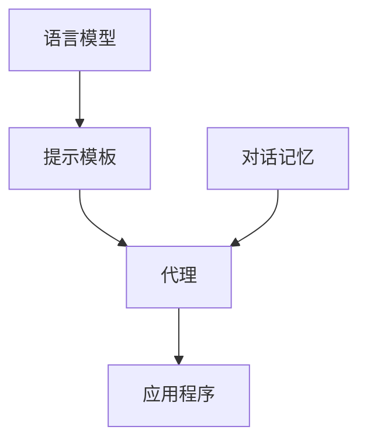

# 【LangChain编程：从入门到实践】源码安装

## 1. 背景介绍

LangChain是一个基于Python的框架,用于开发由语言模型驱动的应用程序。它可以帮助开发者更轻松地将大型语言模型集成到他们的应用中,实现智能对话、问答、文本摘要等功能。LangChain的目标是成为构建基于语言模型应用的标准工具。

### 1.1 LangChain的起源与发展

LangChain由Harrison Chase创建,最初的目的是为了方便在应用中集成语言模型。随着大型语言模型如GPT-3的出现,LangChain得到了快速发展,吸引了众多开发者的关注。

### 1.2 LangChain的主要特点

- 提供了丰富的接口,支持多种主流语言模型
- 内置了对话记忆、提示模板等实用功能
- 可扩展性强,易于与其他工具和框架集成
- 文档完善,社区活跃,学习成本低

## 2. 核心概念与联系

要理解LangChain的工作原理,需要了解其中的几个核心概念:

### 2.1 语言模型(Language Model) 

语言模型是LangChain的核心,负责自然语言的理解和生成。LangChain支持OpenAI GPT、Google PaLM等主流语言模型。

### 2.2 提示模板(Prompt Template)

提示模板用于构造发送给语言模型的输入文本。通过设计合理的提示模板,可以引导模型生成符合需求的回复。

### 2.3 对话记忆(Memory)

LangChain提供了对话记忆功能,可以在多轮对话中保持上下文信息,使对话更加自然流畅。常见的记忆类型有BufferMemory、ConversationBufferMemory等。

### 2.4 代理(Agent)

代理将语言模型、提示模板、对话记忆等组件组合在一起,负责整个对话流程的控制。LangChain提供了几种常用的代理,如ConversationalAgent、ZeroShotAgent等。

下图展示了LangChain的核心概念及其关系:



## 3. 核心算法原理与具体步骤

LangChain的工作流程可以概括为以下几个步骤:

### 3.1 选择语言模型

根据应用场景和需求,选择合适的语言模型作为基础。不同的语言模型在性能、速度、费用等方面各有特点。

### 3.2 设计提示模板 

根据具体任务,设计恰当的提示模板。提示模板应包含必要的指令和上下文信息,引导模型生成期望的输出。

### 3.3 初始化对话记忆

创建合适类型的对话记忆对象,用于存储对话历史。新对话可以使用空记忆,连续对话需要使用上一轮的记忆。

### 3.4 创建代理对象

选择合适的代理类型,将语言模型、提示模板、对话记忆等组件传入,创建代理对象。

### 3.5 开始对话

调用代理对象的相关方法,传入用户输入,开始与语言模型进行对话。代理会根据提示模板和记忆自动构造发送给语言模型的文本,并将回复返回给用户。

### 3.6 更新对话记忆

每一轮对话结束后,将最新的对话内容添加到记忆对象中,供下一轮对话使用。

## 4. 数学模型和公式详细讲解举例说明

LangChain本身并不涉及复杂的数学模型,但其中使用的语言模型如GPT-3依赖于复杂的深度学习算法。以GPT-3为例,其核心是Transformer模型中的自注意力机制和前馈神经网络。

### 4.1 Transformer模型

Transformer模型的核心思想是使用自注意力机制来捕捉输入序列中的长距离依赖关系。对于输入序列$X=(x_1,x_2,...,x_n)$,Transformer首先计算自注意力权重矩阵$A$:

$$
A = \text{softmax}(\frac{QK^T}{\sqrt{d_k}})
$$

其中$Q$、$K$、$V$分别是将输入$X$乘以三个权重矩阵$W_Q$、$W_K$、$W_V$得到的查询矩阵、键矩阵和值矩阵:

$$
Q = XW_Q, K = XW_K, V = XW_V
$$

然后将自注意力权重矩阵$A$乘以值矩阵$V$,得到自注意力输出$Z$:

$$
Z = AV
$$

最后,自注意力输出$Z$经过前馈神经网络和残差连接,得到Transformer编码器的输出。

### 4.2 GPT-3的改进

GPT-3在Transformer的基础上做了一些改进,主要包括:

- 增大模型规模,使用了175B的参数量
- 使用了稀疏注意力机制,减少了计算开销
- 在预训练阶段加入了更多的任务和数据,提高了模型的通用性

这些改进使得GPT-3在许多自然语言任务上取得了突破性的性能。

## 5. 项目实践：代码实例和详细解释说明

下面通过一个简单的例子,演示如何使用LangChain实现一个基于GPT-3的问答应用。

### 5.1 安装依赖库

首先需要安装LangChain及其依赖:

```bash
pip install langchain openai
```

### 5.2 导入必要的模块

```python
from langchain.llms import OpenAI
from langchain.prompts import PromptTemplate
from langchain.chains import LLMChain
```

### 5.3 配置OpenAI API密钥

```python
import os
os.environ["OPENAI_API_KEY"] = "your-api-key"
```

### 5.4 定义提示模板

```python
template = """
You are a helpful AI assistant. Please answer the following question:

{question}
"""

prompt = PromptTemplate(
    input_variables=["question"],
    template=template,
)
```

### 5.5 创建语言模型和问答链

```python
llm = OpenAI(temperature=0.9) 
qa_chain = LLMChain(llm=llm, prompt=prompt)
```

### 5.6 提问并获取回答

```python
question = "What is the capital of France?"
answer = qa_chain.run(question)
print(answer)
```

输出结果:

```
The capital of France is Paris.
```

以上就是一个基本的LangChain问答应用的实现。通过修改提示模板和语言模型的参数,可以进一步优化和定制应用的行为。

## 6. 实际应用场景

LangChain可以应用于各种需要语言理解和生成的场景,例如:

### 6.1 智能客服

利用LangChain构建智能客服系统,自动回答用户的常见问题,提供个性化的服务。

### 6.2 内容生成

使用LangChain自动生成文章、新闻、广告文案等内容,提高内容创作的效率。

### 6.3 语言翻译 

将LangChain与机器翻译模型结合,实现高质量的自动翻译功能。

### 6.4 数据分析

用LangChain处理非结构化的文本数据,提取关键信息,进行情感分析、主题聚类等。

### 6.5 代码生成

尝试将LangChain应用于代码生成领域,根据自然语言描述自动生成代码片段。

## 7. 工具和资源推荐

- 官方文档:https://langchain.readthedocs.io/
- GitHub仓库:https://github.com/hwchase17/langchain
- LangChain社区:https://community.langchain.com/
- OpenAI API文档:https://beta.openai.com/docs/
- Hugging Face模型库:https://huggingface.co/models

## 8. 总结：未来发展趋势与挑战

LangChain正处于快速发展的阶段,未来有望成为构建基于语言模型应用的标准工具。随着语言模型的不断进步,LangChain也将迎来更多的机遇和挑战:

- 支持更多先进的语言模型,如GPT-4、PaLM等
- 改进提示工程,提高语言模型的可控性和适应性
- 优化多轮对话功能,实现更加自然流畅的交互
- 探索更多垂直领域的应用,如医疗、法律、教育等
- 提高框架的易用性和可扩展性,吸引更多开发者加入

## 9. 附录：常见问题与解答

### 9.1 LangChain支持哪些语言模型?

LangChain支持OpenAI GPT、Google PaLM、Anthropic Claude等主流语言模型,并提供了统一的接口。用户也可以自定义语言模型。

### 9.2 使用LangChain需要付费吗?

LangChain本身是开源免费的,但其中使用的语言模型可能需要付费,如OpenAI的API。用户需要根据自己的需求选择合适的语言模型。

### 9.3 LangChain的性能如何?

LangChain的性能主要取决于所使用的语言模型。使用高性能的语言模型可以获得更好的效果,但也意味着更高的计算开销和费用。

### 9.4 如何处理LangChain生成的不恰当内容?

可以通过优化提示模板、调整语言模型参数等方式,引导模型生成更加恰当的内容。必要时还可以对生成的内容进行后处理和过滤。

### 9.5 LangChain适合新手学习吗?

LangChain的设计目标之一就是降低使用语言模型的门槛。新手可以从官方文档和示例代码入手,快速上手LangChain的基本用法。社区也提供了丰富的学习资源。

作者：禅与计算机程序设计艺术 / Zen and the Art of Computer Programming