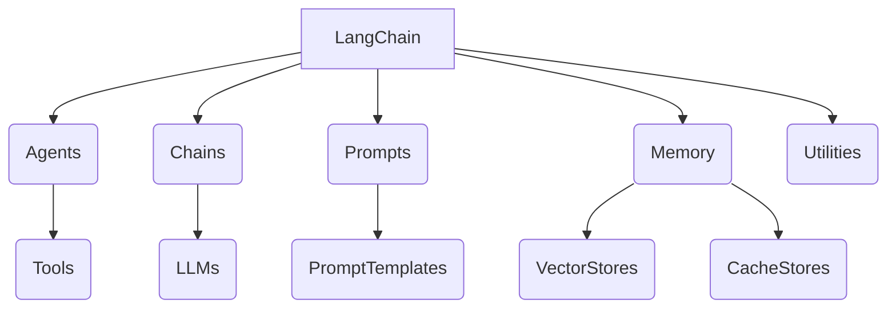

# 【LangChain编程：从入门到实践】管理工具安装

## 1. 背景介绍

在当今数字时代,人工智能(AI)和自然语言处理(NLP)技术已经渗透到各个领域,为我们带来了前所未有的机遇和挑战。作为一种强大的AI框架,LangChain正在帮助开发者和研究人员构建更智能、更人性化的应用程序。无论是智能助手、知识管理系统还是自动化任务流程,LangChain都提供了一种简单而灵活的方式来集成大型语言模型(LLM)和其他AI组件。

本文将深入探讨如何安装和配置LangChain及其相关工具,为后续的开发和实践奠定坚实的基础。我们将介绍LangChain的核心概念、架构原理,并通过实际示例帮助读者快速入门。无论您是AI开发新手还是资深从业者,本文都将为您提供宝贵的见解和实用技巧。

## 2. 核心概念与联系

在开始安装之前,让我们先了解一下LangChain的核心概念和架构。



1. **Agents**：智能代理,负责规划和执行复杂任务。
2. **Chains**：链式调用,将多个LLM调用串联在一起。
3. **Prompts**：提示模板,用于构建高质量的LLM输入。
4. **Memory**：存储上下文信息,支持向量数据库和缓存。
5. **Utilities**：实用程序,提供常用功能如Spinner(加载动画)等。
6. **Tools**：外部工具,如网页抓取、文件操作等。
7. **LLMs**：大型语言模型,如GPT-3、BERT等。
8. **PromptTemplates**：提示模板,用于格式化输入。
9. **VectorStores**：向量数据库,用于高效相似性搜索。
10. **CacheStores**：缓存存储,提高查询效率。

这些核心概念相互关联,共同构建了LangChain的强大功能。接下来,我们将详细介绍如何安装和配置这些组件。

## 3. 核心算法原理具体操作步骤

### 3.1 安装Python和pip

LangChain是一个Python库,因此首先需要安装Python和包管理器pip。您可以从官方网站(https://www.python.org/downloads/)下载适用于您操作系统的最新Python版本。安装过程中,请确保选中"Add Python to PATH"选项,以便在命令行中使用Python。

安装完成后,打开命令行窗口并输入以下命令,验证Python是否安装成功:

```
python --version
```

如果显示了Python版本号,则说明安装成功。

### 3.2 安装LangChain

使用pip安装LangChain及其依赖项:

```
pip install langchain
```

如果您需要使用特定的LLM提供商(如OpenAI的GPT-3),请安装相应的提供商包。例如,要使用OpenAI的GPT-3模型,请运行:

```
pip install openai
```

### 3.3 配置LLM提供商

不同的LLM提供商需要进行不同的配置。以OpenAI为例,您需要获取API密钥并设置环境变量:

1. 访问OpenAI网站(https://beta.openai.com/),注册或登录您的账户。
2. 在个人资料设置中,生成一个新的API密钥。
3. 在您的操作系统中,设置名为`OPENAI_API_KEY`的环境变量,并将其值设置为刚刚生成的API密钥。

在Windows上,您可以通过以下命令设置环境变量:

```
setx OPENAI_API_KEY "your_api_key_here"
```

在Linux或macOS上,您可以在shell配置文件(如`.bashrc`或`.zshrc`)中添加以下行:

```
export OPENAI_API_KEY="your_api_key_here"
```

### 3.4 验证安装

创建一个新的Python文件,并输入以下代码:

```python
from langchain.llms import OpenAI

llm = OpenAI(temperature=0.9)
text = "What would be a good company name for a company that makes green technology products?"
print(llm(text))
```

运行该文件,如果一切正常,您应该会看到LLM生成的建议公司名称。这意味着您已经成功安装并配置了LangChain和OpenAI的GPT-3模型。

## 4. 数学模型和公式详细讲解举例说明

虽然LangChain主要是一个应用框架,但它也与一些数学模型和公式密切相关。例如,在进行语义搜索时,LangChain使用向量空间模型(VSM)来表示文本,并基于余弦相似度计算相似性分数。

### 4.1 向量空间模型(VSM)

在VSM中,每个文档或查询都被表示为一个向量,其中每个维度对应于词汇表中的一个术语。向量的值通常是基于词频-逆文档频率(TF-IDF)计算得到的。

假设我们有一个包含两个文档的小型语料库:

- 文档1: "苹果是一种水果"
- 文档2: "香蕉也是一种水果"

我们可以构建一个包含四个术语("苹果"、"香蕉"、"是"、"水果")的词汇表。然后,每个文档可以表示为一个四维向量,其中每个维度对应于该术语在文档中出现的次数。

例如,文档1可以表示为向量(1, 0, 2, 1),而文档2可以表示为向量(0, 1, 2, 1)。

### 4.2 余弦相似度

在VSM中,我们通常使用余弦相似度来衡量两个向量之间的相似性。余弦相似度的范围是[-1, 1],其中1表示两个向量完全相同,0表示两个向量正交(即完全不相关),而-1表示两个向量完全相反。

给定两个向量$\vec{a}$和$\vec{b}$,它们的余弦相似度可以计算如下:

$$\text{sim}(\vec{a}, \vec{b}) = \cos(\theta) = \frac{\vec{a} \cdot \vec{b}}{\|\vec{a}\| \|\vec{b}\|}$$

其中$\theta$是$\vec{a}$和$\vec{b}$之间的夹角,$\vec{a} \cdot \vec{b}$表示两个向量的点积,而$\|\vec{a}\|$和$\|\vec{b}\|$分别表示$\vec{a}$和$\vec{b}$的$L_2$范数(即向量的长度)。

例如,对于文档1和文档2的向量(1, 0, 2, 1)和(0, 1, 2, 1),它们的余弦相似度为:

$$\begin{aligned}
\text{sim}((1, 0, 2, 1), (0, 1, 2, 1)) &= \frac{(1 \times 0) + (0 \times 1) + (2 \times 2) + (1 \times 1)}{\sqrt{1^2 + 0^2 + 2^2 + 1^2} \times \sqrt{0^2 + 1^2 + 2^2 + 1^2}} \\
&= \frac{5}{\sqrt{6} \times \sqrt{6}} \\
&= \frac{5}{6} \\
&\approx 0.83
\end{aligned}$$

这个相对较高的余弦相似度分数反映了两个文档在语义上是相关的,因为它们都描述了水果。

通过计算查询向量与语料库中每个文档向量之间的余弦相似度,LangChain可以找到与查询最相关的文档。这种基于向量空间模型的相似性搜索方法在信息检索和自然语言处理领域被广泛应用。

## 5. 项目实践:代码实例和详细解释说明

为了更好地理解LangChain的使用方式,让我们通过一个实际示例来探索其强大功能。在本节中,我们将构建一个简单的问答系统,能够基于上下文信息回答相关问题。

### 5.1 导入必要的模块

```python
from langchain.llms import OpenAI
from langchain.chains import ConversationalRetrievalChain
from langchain.document_loaders import TextLoader
from langchain.indexes import VectorstoreIndexCreator
from langchain.vectorstores import Chroma
```

在这里,我们导入了以下模块:

- `OpenAI`: OpenAI的LLM提供商
- `ConversationalRetrievalChain`: 用于构建问答系统的链式调用
- `TextLoader`: 加载文本文件
- `VectorstoreIndexCreator`: 创建向量索引
- `Chroma`: 一种基于Qdrant的向量存储

### 5.2 加载上下文文件

```python
loader = TextLoader('context.txt')
documents = loader.load()
```

我们使用`TextLoader`加载一个名为`context.txt`的文本文件,其中包含了问答系统的上下文信息。`loader.load()`方法将文件内容解析为一个`Document`对象列表。

### 5.3 创建向量索引

```python
vectorstore_index = VectorstoreIndexCreator().from_loaders([loader])
```

接下来,我们使用`VectorstoreIndexCreator`基于加载的文档创建一个向量索引。这个索引将用于高效的语义搜索。

### 5.4 初始化问答链

```python
llm = OpenAI()
qa = ConversationalRetrievalChain.from_llm(llm, vectorstore_index.vectorstore)
```

我们实例化一个`OpenAI`LLM对象,并使用它和之前创建的向量索引初始化一个`ConversationalRetrievalChain`对象。这个链将负责处理问答过程。

### 5.5 提问并获取答案

```python
query = "What is the capital of France?"
result = qa({"question": query})
print(result['answer'])
```

现在,我们可以向问答系统提出一个问题"法国的首都是什么?"。`qa`对象将基于上下文信息和LLM生成一个答案,并将其存储在`result['answer']`中。

如果上下文文件包含了相关信息,您应该能够获得一个合理的答案,例如"巴黎是法国的首都"。

通过这个示例,您可以看到LangChain如何简化了构建智能问答系统的过程。通过组合不同的组件(如LLM、文档加载器、向量索引和链式调用),您可以快速构建出功能强大的应用程序。

## 6. 实际应用场景

LangChain的应用场景非常广泛,包括但不限于:

1. **智能助手**: 构建具有问答、任务规划和执行等功能的智能助手。
2. **知识管理**: 从各种来源(如PDF、网页等)提取和组织知识,并支持高效检索和推理。
3. **自动化工作流**: 使用LLM和外部工具自动执行复杂的任务流程,如数据处理、报告生成等。
4. **内容生成**: 利用LLM生成高质量的文本内容,如新闻文章、营销材料等。
5. **代码理解和生成**: 通过LLM分析和生成代码,提高开发效率。
6. **科研辅助**: 利用LLM进行文献检索、实验设计和结果分析等科研工作。

无论您是在构建智能助手、优化业务流程,还是探索新的AI应用场景,LangChain都可以为您提供强大的支持。

## 7. 工具和资源推荐

在使用LangChain时,以下工具和资源可以为您提供宝贵的帮助:

1. **LangChain文档**: LangChain官方文档(https://python.langchain.com/en/latest/index.html)详细介绍了各种模块和用法示例,是入门和深入学习的绝佳资源。

2. **LangChain示例库**: GitHub上的LangChain示例库(https://github.com/hwchase17/langchain-examples)提供了各种实际应用场景的代码示例,可以帮助您快速上手。

3. **LangChain Discord社区**: LangChain官方Discord社区(https://discord.gg/6ggcsYjYJ3)是一个活跃的社区,您可以在这里与其他用户交流、提问并获得支持。

4. **Hugging Face Spaces**: Hugging Face Spaces(https://huggingface.co/spaces)提供了一个在线环境,您可以在其中运行和共享LangChain应用程序。

5. **AI研究论文**:阅读相关的AI研究论文可以帮助您深入理解LangChain背后的理论和算法,