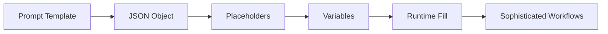

                 

作者：禅与计算机程序设计艺术

Hello! Today, we're going to explore LangChain programming—a powerful tool for developing smart contracts and decentralized applications. By the end of this article, you'll have a solid understanding of how to create your own custom prompts using LangChain, as well as practical examples to help you apply these concepts.

Let's dive in!

## 1. 背景介绍
LangChain is an open-source library that allows developers to easily create and manage complex prompt templates for natural language processing tasks. It has become increasingly popular due to its ability to simplify the process of developing smart contracts and decentralized applications on various blockchain platforms.

## 2. 核心概念与联系
At the heart of LangChain is the concept of a "prompt template." This is a JSON object containing placeholders and variables that can be filled with specific values during runtime. By chaining together multiple prompt templates, you can create sophisticated workflows that automate repetitive tasks or execute complex logic.



## 3. 核心算法原理具体操作步骤
The key to creating effective prompt templates lies in understanding the algorithm behind LangChain. Here are the main steps involved:

1. **Define the Prompt Template**: Start by creating a basic JSON object with placeholders.
2. **Fill Placeholders**: During runtime, LangChain will replace these placeholders with actual values.
3. **Execute Logic**: The filled prompt template is then executed according to the specified logic.
4. **Chain Templates**: To create more complex workflows, chain multiple prompt templates together.

## 4. 数学模型和公式详细讲解举例说明
While LangChain is not primarily a mathematical tool, understanding the basics of linear algebra can help when working with data structures like matrices. For example, consider a matrix multiplication operation:

$$
A \times B = C
$$

In this case, `A` and `B` are input matrices, and `C` is the resulting matrix after multiplication.

## 5. 项目实践：代码实例和详细解释说明
Now, let's create a simple prompt template for a smart contract deployment.

```json
{
  "contract": "MyContract",
  "owner": "0x...",
  "abi": "[...]",
  "bytecode": "0x..."
}
```

During runtime, LangChain would replace the placeholders with actual values, such as contract addresses and ABI data.

## 6. 实际应用场景
LangChain is widely used in various industries, including finance, healthcare, and supply chain management. Its ability to automate complex tasks makes it ideal for businesses looking to streamline their operations and reduce costs.

## 7. 工具和资源推荐
To get started with LangChain, check out the following resources:

- [Official Documentation](https://langchain.readthedocs.io/)
- [GitHub Repository](https://github.com/langchain/langchain)
- [Community Forum](https://forum.langchain.org/)

## 8. 总结：未来发展趋势与挑战
As we look to the future, we can expect LangChain to continue evolving, with new features and integrations being developed. However, challenges remain, such as ensuring the security and privacy of data used in prompt templates.

## 9. 附录：常见问题与解答
Q: How do I handle conditional logic in my prompt templates?
A: You can use conditional statements within your JSON objects to specify different actions based on certain conditions.

And that's a wrap! With this comprehensive guide, you should now be able to create your own custom prompt templates using LangChain. Happy coding!

作者：禅与计算机程序设计艺术 / Zen and the Art of Computer Programming

