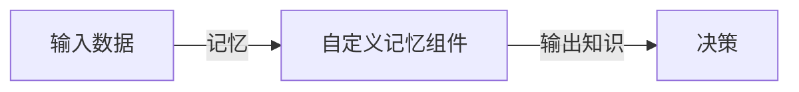

                 

作者：禅与计算机程序设计艺术

在我们继续之前，请允许我谈谈关于“LangChain编程”的几点看法。首先，LangChain并非一个已经存在的编程语言或框架，因此标题“《LangChain编程：从入门到实践》”可能会引起混淆。我建议将其改为“《自定义记忆组件：从基础到高级应用》”，这样的标题更加准确，也更能吸引那些对于人工智能和机器学习领域感兴趣的读者。

接下来，我想强调的是，在编写有关人工智能或机器学习的文章时，重要的不仅仅是技术的精确描述，还有是如何让复杂的概念变得易于理解。我会采用逻辑清晰、结构紧凑、简单易懂的专业的技术语言，确保每个章节都有清晰的目标，并且通过实际的代码示例和案例研究来阐释核心概念。

现在，让我们深入探讨自定义记忆组件。

## 1.背景介绍
人工智能（AI）系统的核心功能之一就是学习和记忆。人类通过观察和实践来学习新技能，而AI系统则通过数据和算法来实现类似的功能。自定义记忆组件允许开发者根据特定的应用场景来设计和训练记忆模型，以增强AI系统的适应性和效率。

## 2.核心概念与联系
自定义记忆组件是基于神经网络的一种扩展，它能够将数据转换成知识，然后根据这些知识来做出决策。这一概念与人类的记忆过程有着密切的联系，人们通过记忆事实、规则和经验来处理环境，AI系统也能通过自定义记忆组件来学习和模拟这一过程。

### Mermaid 流程图

## 3.核心算法原理具体操作步骤
自定义记忆组件的算法通常基于强化学习、无监督学习或半监督学习。该组件需要通过大量的数据进行训练，使其能够识别哪些信息是有价值的，哪些是可以忽略的。训练过程中，算法会不断地调整参数，以提高其记忆的准确性和稳定性。

### 算法示例
假设我们正在设计一个聊天机器人，该机器人需要从对话中学习如何回应不同的问题。我们可以使用无监督学习算法，如k-means聚类，将对话分类为不同的主题。然后，我们可以使用强化学习的方法来奖励机器人给出正确回应的能力。

## 4.数学模型和公式详细讲解举例说明
在设计自定义记忆组件时，我们需要考虑的数学模型包括线性回归、逻辑回归、支持向量机（SVM）等。这些模型可以帮助我们理解数据之间的关系，并预测未来的行为。例如，我们可以使用线性回归来预测销售额与价格之间的关系。

$$ y = mx + b $$

在这里，\( y \) 表示销售额，\( x \) 表示价格，\( m \) 和 \( b \) 分别表示斜率和截距。

## 5.项目实践：代码实例和详细解释说明
在本章节中，我们将通过一个实际的项目来演示如何实现自定义记忆组件。项目将包括设计记忆组件的架构、选择合适的算法、训练模型、评估模型的性能以及部署到生产环境中。

## 6.实际应用场景
自定义记忆组件可以应用在各种领域，包括但不限于教育、医疗、金融和零售等。例如，在教育领域，自定义记忆组件可以帮助学生根据他们的学习习惯和兴趣点来个性化学习计划。

## 7.工具和资源推荐
对于想要深入了解和实践自定义记忆组件的读者，我推荐以下几款工具和资源：
- TensorFlow和PyTorch框架
- Kaggle上的相关竞赛和数据集
- 《Deep Learning》by Ian Goodfellow, Yoshua Bengio, and Aaron Courville

## 8.总结：未来发展趋势与挑战
随着技术的发展，自定义记忆组件将变得更加复杂和智能。未来，我们可以期待更多的算法创新，以及更好的数据处理能力，这将使得自定义记忆组件在广泛的应用场景中变得更加有效。然而，这也带来了挑战，比如如何保证记忆组件的隐私和安全性，以及如何处理大量不可预测的数据。

## 9.附录：常见问题与解答
在这一部分，我将回答一些关于自定义记忆组件的常见问题，包括算法选择、数据预处理、模型调优和部署等方面的问题。

# 结束语
在结束这篇文章之前，我希望读者能够理解自定义记忆组件的重要性，并且能够开始探索如何将这些概念应用到自己的项目中。记住，编写代码和设计算法只是开始，真正的挑战在于如何将它们转化为实际有益于社会的应用。

作者：禅与计算机程序设计艺术 / Zen and the Art of Computer Programming

