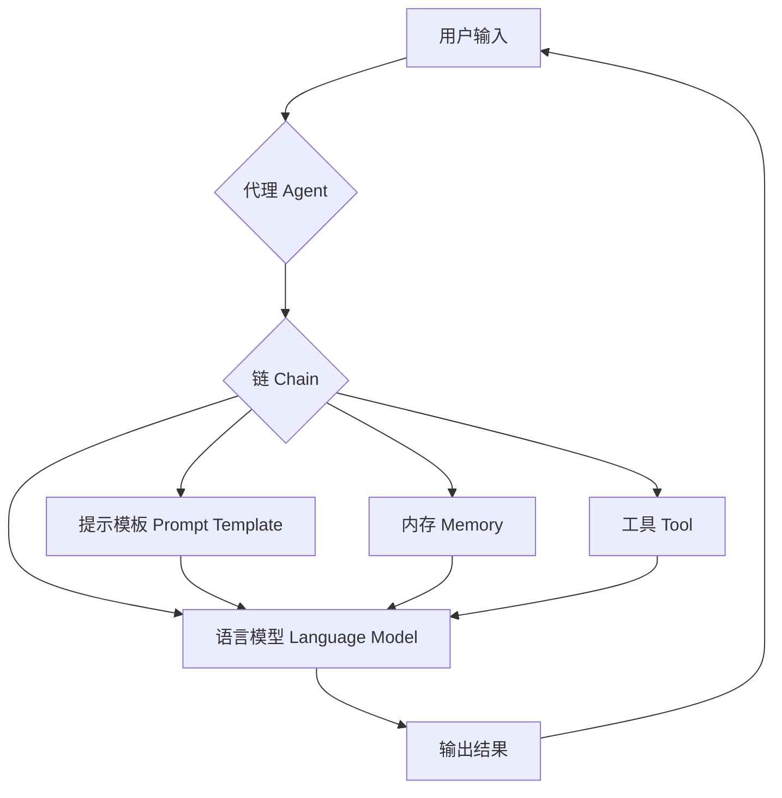

# 【LangChain编程：从入门到实践】资源和工具推荐

## 1. 背景介绍
### 1.1 LangChain的兴起 
近年来，随着大语言模型（LLM）和自然语言处理（NLP）技术的快速发展，构建智能对话系统和知识问答应用的需求日益增长。然而，开发这些应用通常需要集成多个不同的组件和服务，如语言模型、知识库、搜索引擎等，这对开发者来说是一个不小的挑战。

为了解决这个问题，LangChain应运而生。LangChain是一个用于开发由语言模型驱动的应用程序的开源框架。它提供了一套工具和组件，帮助开发者更轻松地构建和部署基于LLM的应用，如智能助手、知识问答系统、文本生成应用等。

### 1.2 LangChain的特点和优势
LangChain的主要特点包括：

1. 模块化设计：LangChain采用模块化的架构，将不同的功能组件如提示模板、语言模型、知识库等解耦，方便开发者灵活组合和扩展。

2. 支持多种LLM：LangChain支持集成多种主流的语言模型，如OpenAI GPT系列、Anthropic Claude、Cohere等，开发者可以根据需要选择合适的模型。

3. 知识库集成：LangChain提供了与向量数据库如Chroma、Pinecone等的无缝集成，方便构建基于知识库的问答系统。

4. 工具集成：LangChain支持集成各种外部工具和API，如搜索引擎、计算器、数据库等，扩展了语言模型的能力。

5. 异步支持：LangChain支持异步编程，可以方便地构建高性能的应用程序。

6. 可扩展性：LangChain提供了清晰的接口和扩展点，开发者可以方便地添加自定义组件和功能。

这些特点使得LangChain成为开发LLM应用的一个强大而灵活的工具。它大大降低了开发门槛，加速了应用的开发和迭代过程。

### 1.3 LangChain的应用场景
LangChain可以应用于多种场景，包括但不限于：

1. 智能客服/助手：利用LangChain构建智能客服系统，根据用户问题给出相关答案，提供自动化服务。

2. 知识问答系统：通过LangChain将知识库与LLM结合，构建领域特定的知识问答系统。

3. 文本生成应用：使用LangChain开发文本生成应用，如文章写作助手、代码生成器等。

4. 语义搜索引擎：利用LangChain的语义向量搜索能力，构建更智能的搜索引擎。

5. 数据分析工具：通过LangChain集成数据分析工具和模型，实现智能化的数据分析功能。

下面我们将深入探讨LangChain的核心概念和原理，并提供实践指南和资源推荐，帮助你快速上手LangChain开发。

## 2. 核心概念与联系
### 2.1 LangChain的核心组件
LangChain主要由以下几个核心组件构成：

1. 提示模板（Prompt Template）：定义与LLM交互的输入提示，支持变量注入。

2. 语言模型（Language Model）：集成各种LLM，如OpenAI GPT、Anthropic Claude等。

3. 链（Chain）：将多个组件组合成一个工作流，支持顺序链、分支链等。

4. 代理（Agent）：根据用户输入，自动选择和执行相关的工具或链。

5. 内存（Memory）：存储对话历史，支持会话状态管理。

6. 索引（Index）：将文档数据转换为语义向量，支持相似度搜索。

7. 工具（Tool）：集成外部工具和API，如搜索引擎、计算器等。

### 2.2 组件之间的关系
下图展示了LangChain中各个组件之间的关系：



用户通过代理（Agent）输入请求，代理会根据请求选择合适的链（Chain）来处理。链由多个组件组成，包括提示模板、语言模型、内存和工具等。提示模板定义了与语言模型的交互方式，语言模型负责生成回复。内存组件存储对话历史，工具组件提供外部功能扩展。最终，处理结果通过代理返回给用户。

### 2.3 LangChain的工作原理
LangChain的工作原理可以概括为以下几个步骤：

1. 接收用户输入：用户通过界面或API向LangChain应用提交请求。

2. 代理选择链：代理根据用户请求的内容和意图，选择合适的链来处理请求。

3. 提示模板渲染：选定的链使用提示模板生成与LLM交互的输入提示，并注入必要的变量。

4. 语言模型推理：语言模型接收渲染后的提示，并生成相应的回复或输出。

5. 工具和内存交互：如果链中包含工具或内存组件，则在语言模型推理过程中与它们进行交互，获取额外的信息或功能。

6. 结果返回：推理结果通过代理返回给用户，完成一次请求-响应流程。

通过组合不同的组件和链，LangChain可以灵活地支持各种LLM应用场景。

## 3. 核心算法原理与具体操作步骤
### 3.1 提示模板算法
提示模板是定义与LLM交互的输入提示的关键组件。LangChain使用f-string格式来定义提示模板，支持变量注入。下面是一个简单的提示模板示例：

```python
from langchain import PromptTemplate

template = """
你是一个AI助手，专门帮助用户解答问题。
用户问题：{question}
"""

prompt = PromptTemplate(
    input_variables=["question"],
    template=template,
)

question = "什么是LangChain？"
formatted_prompt = prompt.format(question=question)
print(formatted_prompt)
```

输出结果：
```
你是一个AI助手，专门帮助用户解答问题。
用户问题：什么是LangChain？
```

提示模板算法的具体步骤如下：

1. 定义模板字符串，使用`{variable}`语法标记变量位置。
2. 创建`PromptTemplate`实例，指定输入变量和模板字符串。
3. 调用`prompt.format()`方法，传入变量值，生成最终的提示字符串。

### 3.2 链算法
链是将多个组件组合成一个工作流的关键抽象。LangChain支持顺序链、分支链等多种类型的链。下面是一个简单的顺序链示例：

```python
from langchain.chains import LLMChain
from langchain.llms import OpenAI
from langchain.prompts import PromptTemplate

llm = OpenAI(temperature=0.9)

prompt = PromptTemplate(
    input_variables=["product"],
    template="What is a good name for a company that makes {product}?",
)

chain = LLMChain(llm=llm, prompt=prompt)

product = "colorful socks"
response = chain.run(product)
print(response)
```

输出结果（示例）：
```
Prismatic Footwear
```

链算法的具体步骤如下：

1. 创建语言模型实例，如`OpenAI`。
2. 创建提示模板实例，定义输入变量和模板字符串。
3. 创建链实例，如`LLMChain`，传入语言模型和提示模板。
4. 调用`chain.run()`方法，传入输入变量值，执行链并获取结果。

LangChain还支持更复杂的链类型，如`SequentialChain`、`MapReduceChain`等，可以根据需求进行组合和扩展。

### 3.3 代理算法
代理是根据用户输入自动选择和执行相关工具或链的组件。LangChain提供了基于规则和基于LLM的代理实现。下面是一个基于规则的代理示例：

```python
from langchain.agents import initialize_agent, load_tools
from langchain.llms import OpenAI

llm = OpenAI(temperature=0)
tools = load_tools(["serpapi", "llm-math"], llm=llm)

agent = initialize_agent(tools, llm, agent="zero-shot-react-description", verbose=True)

response = agent.run("What is the capital of France? What is the population of that city?")
print(response)
```

输出结果（示例）：
```
Paris is the capital of France.
According to Wikipedia, as of January 2022, the population of the city of Paris was 2,165,423.
```

代理算法的具体步骤如下：

1. 创建语言模型实例。
2. 加载需要使用的工具，如搜索引擎、计算器等。
3. 创建代理实例，指定工具、语言模型和代理类型。
4. 调用`agent.run()`方法，传入用户输入，代理会自动选择合适的工具或链来处理请求并返回结果。

LangChain提供了多种代理类型，如`zero-shot-react-description`、`conversational-react-description`等，可以根据需求选择合适的代理。

## 4. 数学模型和公式详细讲解举例说明
### 4.1 语义向量搜索模型
LangChain中的语义向量搜索模型用于将文本转换为语义向量，并支持相似度搜索。常用的语义向量化模型包括：

1. TF-IDF：基于词频-逆文档频率的经典向量化方法。
2. Word2Vec：基于神经网络的词嵌入模型，学习词语的分布式表示。
3. BERT：基于Transformer的预训练语言模型，可以生成上下文相关的词向量。

以TF-IDF为例，其数学公式如下：

$$ w_{i,j} = tf_{i,j} \times \log(\frac{N}{df_i}) $$

其中，$w_{i,j}$表示词语$i$在文档$j$中的权重，$tf_{i,j}$表示词语$i$在文档$j$中的频率，$N$表示文档总数，$df_i$表示包含词语$i$的文档数。

通过计算文档中每个词语的TF-IDF权重，可以得到文档的向量表示。然后，可以使用余弦相似度等度量方法计算文档之间的相似度：

$$ \cos(\theta) = \frac{\mathbf{A} \cdot \mathbf{B}}{\|\mathbf{A}\| \|\mathbf{B}\|} = \frac{\sum_{i=1}^n A_i B_i}{\sqrt{\sum_{i=1}^n A_i^2} \sqrt{\sum_{i=1}^n B_i^2}} $$

其中，$\mathbf{A}$和$\mathbf{B}$是两个文档的向量表示，$\cos(\theta)$表示它们之间的余弦相似度。

### 4.2 语言模型评估指标
语言模型的评估指标用于衡量模型生成文本的质量和相关性。常用的评估指标包括：

1. Perplexity（困惑度）：衡量语言模型在测试集上的预测能力。公式如下：

$$ PPL = \exp(-\frac{1}{N}\sum_{i=1}^N \log p(x_i|x_{<i})) $$

其中，$N$表示测试集中的词语总数，$p(x_i|x_{<i})$表示模型在给定前$i-1$个词的情况下预测第$i$个词的概率。

2. BLEU（Bilingual Evaluation Understudy）：衡量生成文本与参考文本之间的n-gram重叠程度。公式如下：

$$ BLEU = \min(1, \frac{output\_length}{reference\_length}) \times \prod_{i=1}^4 precision_i^{\frac{1}{4}} $$

其中，$output\_length$表示生成文本的长度，$reference\_length$表示参考文本的长度，$precision_i$表示生成文本中的i-gram与参考文本中的i-gram的重叠程度。

3. ROUGE（Recall-Oriented Understudy for Gisting Evaluation）：衡量生成文本与参考文本之间的重叠程度，侧重于召回率。公式如下：

$$ ROUGE-N = \frac{\sum_{S\in\{Reference\}} \sum_{gram_n \in S} Count_{match}(gram_n)}{\sum_{S\in\{Reference\}} \sum_{gram_n \in S} Count(gram_n)} $$

其中，$S$表示参考文本集合，