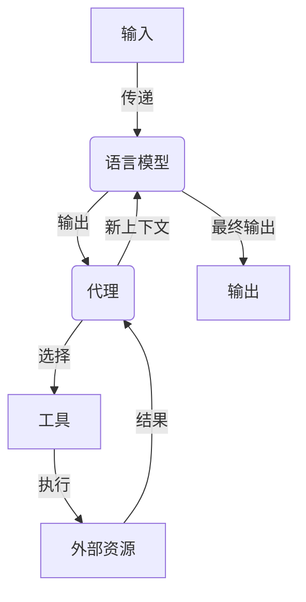

# 【LangChain编程：从入门到实践】输入对输出的影响

## 1.背景介绍

在当今数字时代,人工智能(AI)已经渗透到我们生活的方方面面。作为AI领域的一个重要分支,自然语言处理(NLP)正在帮助我们更好地理解和处理人类语言。LangChain是一个强大的Python库,旨在帮助开发人员构建基于NLP的应用程序。它提供了一种标准化的方式来组合不同的语言模型、数据源和其他组件,从而实现复杂的自然语言任务。

LangChain的核心思想是将输入数据(例如文本、图像或其他格式)传递给语言模型,然后根据模型的输出执行相应的操作。这种输入到输出的映射过程对于构建智能系统至关重要,因为它决定了系统如何理解和响应用户的请求。本文将探讨LangChain中输入对输出的影响,并提供实际案例和最佳实践,帮助读者更好地掌握这个强大的库。

## 2.核心概念与联系

在深入探讨LangChain的输入和输出之前,我们需要了解一些核心概念。

### 2.1 语言模型(Language Model)

语言模型是NLP领域的基础,它是一种概率模型,用于预测给定上下文中下一个单词或标记的可能性。LangChain支持多种语言模型,包括GPT-3、BERT、RoBERTa等。这些模型经过大规模训练,可以理解和生成人类语言。

### 2.2 代理(Agent)

代理是LangChain中的一个重要概念,它充当语言模型和外部世界之间的中介。代理接收输入,将其传递给语言模型,然后根据模型的输出执行相应的操作,例如查询数据库、调用API或执行其他任务。

### 2.3 工具(Tool)

工具是代理可以使用的功能,例如搜索引擎、计算器或任何其他可以执行特定任务的组件。代理根据语言模型的输出选择合适的工具,并将工具的输出作为新的上下文传递回语言模型。

### 2.4 链(Chain)

链是LangChain中的另一个关键概念,它定义了输入如何流经语言模型、代理和工具。链可以是简单的(例如,直接将输入传递给语言模型),也可以是复杂的(例如,涉及多个代理和工具的序列)。

这些核心概念相互关联,共同构成了LangChain的基础架构。输入数据流经这个系统,经过多次迭代和转换,最终产生期望的输出。



## 3.核心算法原理具体操作步骤

LangChain的核心算法原理可以概括为以下几个步骤:

1. **输入预处理**: 根据输入数据的格式和类型,对其进行适当的预处理,例如分词、标记化或特征提取。这个步骤可以确保语言模型能够正确理解输入数据。

2. **语言模型推理**: 将预处理后的输入数据传递给语言模型,让模型根据其训练数据和内部参数生成相应的输出。这个步骤是LangChain的核心,因为它决定了系统如何理解和响应输入数据。

3. **输出后处理**: 对语言模型的输出进行后处理,例如格式化、过滤或解析。这个步骤可以确保输出数据符合预期的格式和要求。

4. **代理决策**: 代理根据语言模型的输出和当前上下文,决定是直接返回输出还是选择合适的工具执行特定任务。

5. **工具执行**: 如果代理选择了一个工具,则执行该工具的操作,并将结果作为新的上下文传递回语言模型。

6. **迭代**: 根据需要,重复步骤2到5,直到达到预期的输出或满足终止条件。

7. **输出返回**: 将最终输出返回给用户或下游系统。

这个过程可以通过链的方式进行组合和定制,以满足不同的应用场景和需求。LangChain提供了多种预定义的链,同时也支持用户自定义链。

## 4.数学模型和公式详细讲解举例说明

在LangChain中,语言模型是核心组件之一。虽然LangChain支持多种语言模型,但它们都基于一些共同的数学原理和模型。本节将介绍一些常见的语言模型及其数学基础。

### 4.1 N-gram语言模型

N-gram语言模型是最早也是最简单的语言模型之一。它基于马尔可夫假设,即一个单词的出现概率只依赖于前面的 N-1 个单词。数学上,我们可以用条件概率来表示:

$$P(w_n|w_1,w_2,...,w_{n-1}) \approx P(w_n|w_{n-N+1},...,w_{n-1})$$

其中,$ w_i $表示第 i 个单词。我们可以从大量文本数据中统计 N-gram 的频率,并使用平滑技术(如加法平滑)来估计未见 N-gram 的概率。

虽然 N-gram 模型简单且高效,但它们无法捕捉长距离依赖关系,并且受限于数据稀疏性问题。

### 4.2 神经网络语言模型

为了解决 N-gram 模型的局限性,研究人员引入了基于神经网络的语言模型。这些模型使用神经网络来学习单词的分布式表示(即词向量),并根据上下文预测下一个单词的概率。

常见的神经网络语言模型包括循环神经网络(RNN)和transformer模型。RNN可以通过隐藏状态来捕捉长距离依赖关系,但它们存在梯度消失/爆炸的问题。Transformer模型则使用自注意力机制来直接建模单词之间的关系,从而避免了RNN的缺陷。

以transformer模型为例,给定输入序列 $X = (x_1, x_2, ..., x_n)$,我们希望预测下一个单词 $y$。transformer模型首先将输入序列映射为向量表示:

$$Z_0 = (z_1, z_2, ..., z_n) = embed(X)$$

然后,transformer使用多头自注意力层和前馈神经网络层对这些向量进行编码,得到最终的隐藏状态表示 $Z_L$。预测概率可以通过softmax函数计算:

$$P(y|X) = \text{softmax}(W_o Z_L + b_o)$$

其中,$ W_o $和$ b_o $是可训练参数。通过最大似然估计,我们可以在大量文本数据上训练transformer模型,使其学习到单词之间的关系和语言的统计规律。

虽然神经网络语言模型比 N-gram 模型更强大,但它们也存在一些缺陷,例如需要大量计算资源进行训练,并且可解释性较差。

### 4.3 Few-shot学习

除了上述模型之外,LangChain还支持一种称为 few-shot 学习的技术。few-shot 学习的思想是,通过向语言模型提供少量的示例输入和输出,来指导模型生成期望的输出。

数学上,我们可以将 few-shot 学习视为一种条件概率建模问题。给定一个任务 $\mathcal{T}$,一组示例输入输出对 $\mathcal{D} = \{(x_i, y_i)\}$,以及新的输入 $x^*$,我们希望模型能够预测合适的输出 $y^*$:

$$P(y^*|x^*, \mathcal{T}, \mathcal{D}) = \text{模型}(x^*, \mathcal{T}, \mathcal{D})$$

通过在训练过程中暴露模型于各种任务和示例,模型可以学习到如何根据少量示例快速适应新任务,从而实现 few-shot 学习。

few-shot 学习的优点是可以快速适应新任务,并且不需要大量的标注数据。但它也存在一些挑战,例如示例质量对模型性能的影响较大,并且缺乏理论保证。

通过结合上述不同的语言模型和技术,LangChain可以为各种自然语言任务提供强大的支持。选择合适的模型和技术取决于具体的应用场景和需求。

## 5.项目实践:代码实例和详细解释说明

为了更好地理解LangChain的输入和输出处理,我们将通过一个实际案例来演示如何使用LangChain构建一个简单的问答系统。

在这个示例中,我们将使用LangChain的`ConversationChain`来管理对话状态,并将用户的输入传递给一个预训练的语言模型(在本例中为`text-davinci-003`)。然后,我们将模型的输出作为最终结果返回给用户。

### 5.1 安装依赖项

首先,我们需要安装LangChain和OpenAI的Python库:

```bash
pip install langchain openai
```

### 5.2 设置OpenAI API密钥

为了使用OpenAI的语言模型,我们需要设置API密钥。你可以从OpenAI的网站上获取密钥,然后在代码中设置:

```python
import os
import openai

openai.api_key = os.environ.get("OPENAI_API_KEY")
```

### 5.3 创建问答链

接下来,我们将创建一个`ConversationChain`对象,并指定要使用的语言模型:

```python
from langchain.chains import ConversationChain
from langchain.llms import OpenAI

llm = OpenAI(temperature=0.9)
conversation = ConversationChain(llm=llm, verbose=True)
```

`temperature`参数控制语言模型的输出多样性。较高的温度会产生更多样化的输出,而较低的温度会产生更加确定的输出。

### 5.4 接收用户输入并获取模型输出

现在,我们可以接收用户的输入,并将其传递给`ConversationChain`对象。`predict`方法将返回模型的输出:

```python
while True:
    user_input = input("Human: ")
    if user_input.lower() == "exit":
        break
    output = conversation.predict(input=user_input)
    print("AI:", output)
```

这个循环将持续运行,直到用户输入"exit"。每次迭代,用户的输入都会被传递给语言模型,并将模型的输出打印到控制台。

### 5.5 运行示例

让我们运行这个示例,并与问答系统进行交互:

```
Human: 你好,我是一名程序员,想了解一下LangChain是什么?
AI: 你好!LangChain是一个Python库,旨在帮助开发人员构建基于自然语言处理(NLP)的应用程序。它提供了一种标准化的方式来组合不同的语言模型、数据源和其他组件,从而实现复杂的自然语言任务。

LangChain的核心思想是将输入数据(例如文本、图像或其他格式)传递给语言模型,然后根据模型的输出执行相应的操作。这种输入到输出的映射过程对于构建智能系统至关重要,因为它决定了系统如何理解和响应用户的请求。

LangChain支持多种流行的语言模型,如GPT-3、BERT和RoBERTa,并提供了一系列工具和代理来执行各种任务,如查询知识库、调用API和执行计算。通过链的概念,您可以灵活地组合这些组件,构建出复杂的NLP应用程序。

总的来说,LangChain为开发人员提供了一个强大的框架,简化了基于NLP的应用程序的开发过程。它的模块化设计和丰富的功能使其成为构建对话系统、问答系统、文本summarization等应用的理想选择。