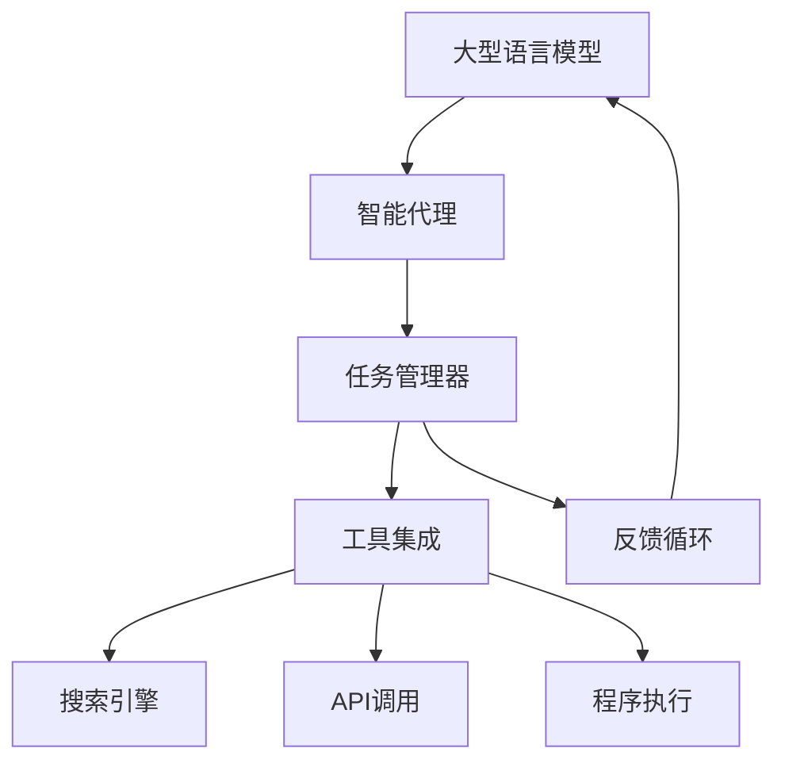

# 【大模型应用开发 动手做AI Agent】AutoGPT简介

## 1.背景介绍

### 1.1 人工智能的发展历程

人工智能(Artificial Intelligence, AI)是一门探索如何使机器模拟人类智能行为的科学与技术。自20世纪50年代AI概念被正式提出以来,经历了起起伏伏的发展历程。早期的AI系统主要集中在专家系统、机器学习等领域,但受限于计算能力和数据量,效果一般。

近年来,benefitting from大数据、高性能计算和深度学习算法的飞速发展,AI迎来了新的春天。以GPT(Generative Pre-trained Transformer)为代表的大型语言模型展现出了惊人的文本生成能力,掀起了AI的新浪潮。

### 1.2 大模型的兴起

大模型(Large Language Model, LLM)是指具有数十亿甚至上万亿参数的巨型神经网络模型。这些模型通过消化海量文本数据,学习文本的语义和生成规律,从而获得出色的自然语言理解和生成能力。

典型的大模型有OpenAI的GPT系列、DeepMind的Chinchilla、Google的PaLM、OpenAI的GPT-3等。这些模型不仅在自然语言处理领域表现出色,而且还展现出了跨领域的泛化能力,可应用于代码生成、问答系统、智能写作辅助等多个领域。

### 1.3 AutoGPT的诞生

AutoGPT是一个由Anthropic公司发布的开源项目,旨在探索如何使用大型语言模型构建通用人工智能(Artificial General Intelligence, AGI)。AGI是AI领域的终极目标,即创造出与人类智能相当或超过的通用智能系统。

AutoGPT的核心思想是让大模型自主执行任务,不断学习、规划和完成更复杂的任务。它基于大模型的强大生成能力,结合反馈循环、搜索引擎等功能,逐步发展出更高级的认知和推理能力。

## 2.核心概念与联系

### 2.1 大模型与AGI

大模型是实现AGI的关键基础。AGI需要系统具备广博的知识、强大的推理能力、持续学习的能力等,而大模型正是满足这些需求的有力工具。

大模型通过吸收海量数据,获得了丰富的知识基础。同时,它们擅长从文本中捕捉语义和上下文关联,展现出了初步的推理和学习能力。因此,大模型为AGI系统提供了知识和认知的基础。

### 2.2 大模型的局限性

尽管大模型表现出色,但它们也存在一些明显的局限性:

1. **缺乏长期记忆和持续学习能力**:大模型无法持久记住上下文信息,也无法从新数据中持续学习。
2. **缺乏因果推理和规划能力**:大模型难以建立因果关系,缺乏对复杂任务的规划和分解能力。
3. **缺乏常识和物理世界知识**:大模型主要从文本中学习,缺乏对物理世界的直接理解。
4. **缺乏自我意识和情感**:大模型无法产生真正的自我意识和情感体验。

### 2.3 AutoGPT的创新之处

AutoGPT旨在弥补大模型的上述不足,为AGI系统的发展探索新路径。它的核心创新包括:

1. **反馈循环与持续学习**:AutoGPT通过与外部世界交互获取反馈,并基于反馈持续优化自身。
2. **任务分解与规划**:AutoGPT能够将复杂任务分解为可管理的子任务,并制定执行计划。
3. **搜索引擎集成**:AutoGPT与搜索引擎相结合,不断从互联网获取新知识。
4. **开放域对话**:AutoGPT可以进行开放域对话,模拟人类的交互方式。

这些创新有望帮助大模型逐步获得AGI所需的各项能力。AutoGPT是朝着这一目标迈出的重要一步。

## 3.核心算法原理具体操作步骤

### 3.1 AutoGPT系统架构

AutoGPT的核心是一个基于大型语言模型的智能代理(Agent),它与外部世界进行交互并执行任务。AutoGPT的系统架构如下所示:



1. **大型语言模型**:AutoGPT使用的是GPT-3.5等大型语言模型,作为系统的核心推理引擎。
2. **智能代理**:代理负责与用户交互,理解任务需求,并将任务分解为可执行的步骤。
3. **任务管理器**:管理任务的执行流程,协调各个模块的工作。
4. **工具集成**:集成了多种外部工具,如搜索引擎、API调用和程序执行等,为代理执行任务提供支持。
5. **反馈循环**:代理根据任务执行的反馈,对自身的策略和知识进行持续优化。

### 3.2 任务执行流程

AutoGPT执行任务的核心流程如下:

1. **理解任务需求**:代理首先通过与用户交互,理解任务的具体需求和目标。
2. **任务分解**:将整体任务分解为多个可执行的子任务,并制定执行计划。
3. **子任务执行**:依次执行子任务,调用相应的工具完成具体操作。
4. **结果整合**:将各子任务的结果整合,形成最终的任务输出。
5. **反馈与优化**:根据任务执行的反馈,优化代理的策略和知识库。

在执行过程中,代理会根据需要查询搜索引擎获取新知识,调用API执行特定功能,或直接运行程序代码。这种灵活的工具集成赋予了代理强大的执行能力。

### 3.3 关键算法

AutoGPT的核心算法包括:

1. **自然语言理解**:使用大型语言模型对用户输入进行语义理解和表示。
2. **任务规划**:将复杂任务分解为可执行的子任务序列,并制定执行计划。
3. **程序合成**:根据任务需求,自动生成可执行的程序代码。
4. **知识获取**:通过搜索引擎和API调用获取新知识,不断扩充知识库。
5. **反馈优化**:基于强化学习等方法,根据任务执行反馈优化代理策略。

这些算法相互配合,赋予了AutoGPT较强的认知、规划和学习能力。

## 4.数学模型和公式详细讲解举例说明

### 4.1 大型语言模型

大型语言模型的核心是Transformer架构,它由多层编码器(Encoder)和解码器(Decoder)组成。编码器将输入序列编码为向量表示,解码器则根据编码器的输出生成目标序列。

Transformer的关键创新是**自注意力机制(Self-Attention)**,它允许模型捕捉输入序列中任意两个位置之间的关系,大大提高了模型的表示能力。自注意力机制的计算公式如下:

$$Attention(Q, K, V) = softmax(\frac{QK^T}{\sqrt{d_k}})V$$

其中$Q$、$K$、$V$分别代表Query、Key和Value,它们都是通过线性变换得到的向量。$d_k$是缩放因子,用于防止点积的值过大导致梯度消失。

除了自注意力机制,Transformer还引入了残差连接(Residual Connection)和层归一化(Layer Normalization)等技术,进一步提升了模型的性能和收敛速度。

### 4.2 强化学习

强化学习(Reinforcement Learning)是AutoGPT用于优化策略的关键算法。它将代理与环境的交互过程建模为马尔可夫决策过程(Markov Decision Process, MDP),目标是找到一个最优策略,使代理在环境中获得最大的累积奖励。

强化学习的核心思想是**价值迭代(Value Iteration)**,通过不断更新状态价值函数或动作价值函数,逐步逼近最优策略。状态价值函数$V(s)$和动作价值函数$Q(s,a)$的更新公式如下:

$$V(s) \leftarrow \sum_{a\in A} \pi(a|s)(R_s^a + \gamma V(S'))$$
$$Q(s,a) \leftarrow R_s^a + \gamma \sum_{s'\in S} P_{ss'}^a V(s')$$

其中$\pi(a|s)$是策略,即在状态$s$下选择动作$a$的概率;$R_s^a$是在状态$s$执行动作$a$获得的即时奖励;$\gamma$是折现因子,用于权衡即时奖励和未来奖励;$P_{ss'}^a$是状态转移概率,即从状态$s$执行动作$a$转移到状态$s'$的概率。

通过不断更新价值函数,代理可以逐步优化自身的策略,提高在环境中获得奖励的能力。

### 4.3 程序合成

程序合成(Program Synthesis)是AutoGPT自动生成可执行代码的关键技术。它将自然语言描述转换为可执行的程序,从而实现代理对任务的自动化执行。

程序合成的核心是**语法制导解码(Syntax-Guided Decoding)**,即在解码过程中,模型不仅需要生成正确的token序列,还需要满足目标语言的语法约束。这可以通过构建语法解析树(Abstract Syntax Tree, AST)来实现。

给定一个自然语言描述$x$和目标语言的语法$\mathcal{G}$,程序合成的目标是找到一个最优程序$y^*$,使得:

$$y^* = \arg\max_{y \in \mathcal{L}(\mathcal{G})} P(y|x)$$

其中$\mathcal{L}(\mathcal{G})$表示语法$\mathcal{G}$定义的所有合法程序的集合。通过结合语言模型和语法约束,程序合成可以高效地搜索最优程序。

## 5.项目实践:代码实例和详细解释说明

为了更好地理解AutoGPT的工作原理,我们来看一个简单的示例。假设我们的任务是"编写一个Python函数,计算给定列表中所有偶数的平方和"。

### 5.1 任务理解

代理首先需要理解这个任务的具体需求。它可以将任务分解为以下几个关键点:

1. 编写一个Python函数
2. 输入是一个列表
3. 需要计算列表中所有偶数的平方
4. 将所有偶数的平方求和,作为函数的输出

### 5.2 任务分解

接下来,代理需要将任务分解为可执行的子任务序列。一种可能的分解方式如下:

1. 定义一个空函数
2. 遍历输入列表
3. 判断当前元素是否为偶数
4. 如果是偶数,计算它的平方
5. 将平方值累加到总和中
6. 返回总和

### 5.3 子任务执行

现在,代理可以逐步执行上述子任务,生成相应的Python代码。

```python
def sum_even_squares(lst):
    """
    计算给定列表中所有偶数的平方和
    """
    total = 0
    for num in lst:
        if num % 2 == 0:
            square = num ** 2
            total += square
    return total
```

这段代码首先定义了一个名为`sum_even_squares`的函数,接受一个列表`lst`作为输入。然后,它使用一个`for`循环遍历列表中的每个元素`num`。对于每个偶数`num`,它计算其平方`square`,并将结果累加到`total`中。最后,函数返回`total`作为所有偶数平方的总和。

### 5.4 结果验证

为了验证代码的正确性,我们可以进行一些测试:

```python
print(sum_even_squares([1, 2, 3, 4, 5]))  # 输出: 20
print(sum_even_squares([2, 4, 6, 8, 10]))  # 输出: 220
print(sum_even_squares([1, 3, 5, 7, 9]))  # 输出: 0
```

测试结果显示,函数`sum_even_squares`能够正确计算给