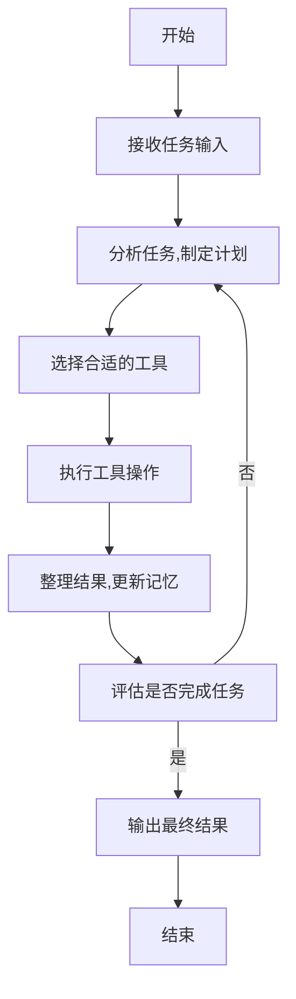

# 【大模型应用开发 动手做AI Agent】BabyAGI实战

## 1. 背景介绍

### 1.1 人工智能的发展历程

人工智能(Artificial Intelligence, AI)是当代科技发展的热点领域之一,它致力于模拟人类智能,使机器能够像人一样思考和行动。自20世纪50年代AI概念被正式提出以来,经历了几个重要的发展阶段。

早期的AI系统主要采用符号主义方法,通过规则和逻辑推理来解决问题。随着计算能力和数据量的不断增长,机器学习和神经网络等技术开始崛起,使AI系统能够从大量数据中自动学习模式和规律。近年来,深度学习算法的出现进一步推动了AI的发展,使得AI在图像识别、自然语言处理等领域取得了突破性进展。

### 1.2 大模型的兴起

随着算力和数据的持续增长,训练大规模神经网络模型成为可能。这些拥有数十亿甚至上万亿参数的巨大模型被称为"大模型"(Large Language Model, LLM)。代表性的大模型包括GPT-3、PaLM、ChatGPT等,它们展现出惊人的语言理解和生成能力,可以应对广泛的任务,从而被视为通用人工智能(Artificial General Intelligence, AGI)的重要里程碑。

### 1.3 BabyAGI: 迈向AGI的尝试

BabyAGI是一个基于大模型的AI Agent框架,旨在探索通用人工智能的可能性。它由Anthropic公司提出,灵感来自于"宝宝学习"的过程。BabyAGI通过对话式交互,逐步学习新知识并完成复杂任务,展现出一定程度的推理和计划能力。尽管BabyAGI距离真正的AGI还有很长的路要走,但它为开发更智能、更通用的AI系统提供了有益的探索和尝试。

## 2. 核心概念与联系

### 2.1 BabyAGI的核心概念

BabyAGI的核心概念包括:

1. **Agent(智能体)**: 指具有一定智能和自主性的实体,能够感知环境、做出决策并采取行动。在BabyAGI中,Agent是一个基于大模型的对话系统,可以根据用户的指令执行各种任务。

2. **Task(任务)**: 指Agent需要完成的具体目标或工作。任务可以是简单的问题回答,也可以是复杂的多步骤过程。

3. **Tool(工具)**: 指Agent可以利用的各种资源和功能,如搜索引擎、计算器、文本编辑器等。Agent需要学会选择和使用合适的工具来完成任务。

4. **Memory(记忆)**: 指Agent在执行任务过程中积累的信息和知识。记忆可以帮助Agent更好地理解任务背景、跟踪执行进度、避免重复工作等。

5. **Reasoning(推理)**: 指Agent根据已有知识和信息,进行逻辑分析和推理,以得出新的结论或决策。推理能力是Agent完成复杂任务的关键。

### 2.2 BabyAGI与其他AI系统的联系

BabyAGI与传统的问答系统、语音助手等AI系统有所不同,它更侧重于通用智能和自主学习能力。与此同时,BabyAGI也与追求AGI的其他系统(如DeepMind的AlphaGo、OpenAI的GPT等)有着密切联系,都是在探索AI系统如何获得更强大的认知和推理能力。

BabyAGI的设计思路与人类智能发展过程有某种相似之处,即通过不断学习和实践,逐步积累知识和经验,提高解决问题的能力。这种"启发式学习"方式或许能为开发AGI系统提供有益的启示。

## 3. 核心算法原理具体操作步骤

BabyAGI的核心算法原理可以概括为以下几个关键步骤:



### 3.1 接收任务输入

BabyAGI通过与用户的自然语言对话,获取需要执行的任务描述。这一步需要对用户的输入进行语义理解和任务提取。

### 3.2 分析任务,制定计划

根据任务的性质和复杂程度,BabyAGI需要对任务进行分解,制定一系列有条理的步骤来完成任务。这个过程需要综合运用推理、规划和决策等认知能力。

### 3.3 选择合适的工具

BabyAGI需要从可用的工具集合中,选择最合适的工具来执行每个计划步骤。这需要对工具的功能和适用场景有深入的理解。

### 3.4 执行工具操作

使用选定的工具执行具体操作,如搜索信息、进行计算、编辑文本等。每个工具操作的结果都需要被记录下来,为后续步骤提供支持。

### 3.5 整理结果,更新记忆

将工具操作的中间结果进行整理和融合,并更新到BabyAGI的记忆中。良好的记忆管理有助于避免重复工作,保持任务执行的连贯性。

### 3.6 评估是否完成任务

根据任务目标和当前的执行进度,评估是否已经完成了任务。如果尚未完成,则需要重新制定下一步计划。

### 3.7 输出最终结果

如果评估认为任务已经完成,则将最终结果输出给用户,结束本次任务流程。

## 4. 数学模型和公式详细讲解举例说明

在BabyAGI的实现中,并没有涉及太多复杂的数学模型。但是,作为其基础的大模型通常采用了transformer等深度学习架构,使用了一些重要的数学原理和公式。

### 4.1 Transformer模型

Transformer是一种广泛应用于自然语言处理任务的深度学习模型,它的核心思想是使用自注意力(Self-Attention)机制来捕捉输入序列中的长距离依赖关系。自注意力机制可以用下式表示:

$$\mathrm{Attention}(Q, K, V) = \mathrm{softmax}\left(\frac{QK^T}{\sqrt{d_k}}\right)V$$

其中,Q(Query)、K(Key)和V(Value)分别表示查询向量、键向量和值向量,它们都是通过线性变换得到的。$d_k$是缩放因子,用于防止点积过大导致梯度消失。softmax函数用于将注意力分数归一化为概率分布。

通过计算查询向量与所有键向量的相似性(点积),自注意力机制可以自适应地为每个位置分配不同的注意力权重,从而更好地捕捉长距离依赖关系。

### 4.2 掩码自注意力

为了在训练过程中避免看到未来的信息(违反因果关系),transformer decoder中采用了掩码自注意力(Masked Self-Attention)机制。其公式如下:

$$\mathrm{MaskedAttention}(Q, K, V) = \mathrm{softmax}\left(\frac{QK^T}{\sqrt{d_k}} + M\right)V$$

其中,M是一个掩码张量,用于将未来位置的注意力分数设置为负无穷,以确保这些位置的注意力权重为0。这样可以保证模型在生成序列时,只依赖于当前和过去的信息。

### 4.3 多头注意力

为了捕捉不同的位置和表示子空间之间的关系,transformer还引入了多头注意力(Multi-Head Attention)机制。它将注意力计算过程分成多个并行的"头"(head),每个头对应一个注意力子空间,最后将所有头的结果拼接起来。多头注意力的公式如下:

$$\mathrm{MultiHead}(Q, K, V) = \mathrm{Concat}(\mathrm{head}_1, \ldots, \mathrm{head}_h)W^O$$
$$\mathrm{head}_i = \mathrm{Attention}(QW_i^Q, KW_i^K, VW_i^V)$$

其中,$W_i^Q$、$W_i^K$、$W_i^V$和$W^O$都是可学习的线性变换矩阵,用于将Q、K、V和多头结果进行投影。通过多头注意力,transformer可以同时关注不同的表示子空间,提高模型的表达能力。

以上是transformer模型中一些核心的数学公式和原理。虽然BabyAGI本身没有直接使用这些公式,但是作为其基础的大模型都采用了类似的注意力机制和深度学习架构。理解这些数学模型有助于更好地把握大模型的工作原理和性能特点。

## 5. 项目实践: 代码实例和详细解释说明

虽然BabyAGI是一个概念性的框架,但已有一些开源的实现可供参考和实践。以下是一个使用Python和OpenAI的GPT-3模型实现BabyAGI的简化版本示例:

```python
import openai
import re

# 设置OpenAI API密钥
openai.api_key = "YOUR_API_KEY"

# 定义可用的工具列表
tools = [
    {"name": "搜索", "description": "使用搜索引擎查找相关信息", "operation": lambda query: openai.Completion.create(engine="text-davinci-003", prompt=f"搜索: {query}", max_tokens=1024).choices[0].text},
    {"name": "计算", "description": "执行数学计算", "operation": lambda expression: str(eval(expression))},
    {"name": "总结", "description": "对给定文本进行总结", "operation": lambda text: openai.Completion.create(engine="text-davinci-003", prompt=f"总结: {text}", max_tokens=1024).choices[0].text},
]

# BabyAGI主循环
def baby_agi(task):
    # 初始化记忆
    memory = [f"任务: {task}"]
    
    while True:
        # 获取当前状态
        current_state = "\n".join(memory)
        
        # 生成响应
        response = openai.Completion.create(
            engine="text-davinci-003",
            prompt=f"当前状态: {current_state}\n\n可用工具: {', '.join([tool['name'] for tool in tools])}\n\n操作: ",
            max_tokens=1024,
            temperature=0.7,
            stop=["\n\n"]
        ).choices[0].text
        
        # 解析响应
        match = re.match(r"(\w+)\s*:\s*(.+)", response.strip())
        if match:
            tool_name, tool_input = match.groups()
            
            # 执行选定的工具
            tool = next((tool for tool in tools if tool["name"].lower() == tool_name.lower()), None)
            if tool:
                try:
                    tool_output = tool["operation"](tool_input)
                    memory.append(f"操作: {tool_name.lower()}: {tool_input}")
                    memory.append(f"结果: {tool_output}")
                except Exception as e:
                    memory.append(f"错误: {str(e)}")
            else:
                memory.append(f"无效操作: {response.strip()}")
        else:
            memory.append(f"无效响应: {response.strip()}")
        
        # 检查任务是否完成
        if any(re.search(r"任务完成", line) for line in memory):
            break
    
    # 输出最终结果
    final_result = "\n".join(memory)
    print(final_result)

# 示例用法
baby_agi("计算圆周率的前10位数字")
```

上述代码实现了一个简化版本的BabyAGI,它可以与OpenAI的GPT-3模型进行交互,执行搜索、计算和总结等基本操作。代码的主要流程如下:

1. 定义可用的工具列表,包括搜索、计算和总结三种工具。
2. 在`baby_agi`函数中,初始化记忆列表,存储任务描述。
3. 进入主循环,每次迭代都会根据当前状态(记忆)生成一个响应。
4. 解析响应,识别出要执行的工具名称和输入。
5. 执行选定的工具操作,将结果添加到记忆中。
6. 检查任务是否完成,如果发现"任务完成"的字样,则退出循环。
7. 输出最终结果(记忆的全部内容)。

需要注意的是,这只是一个简化示例,