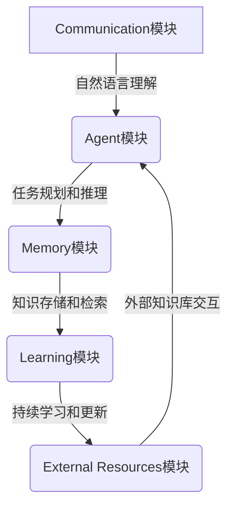

# 【大模型应用开发 动手做AI Agent】CAMEL

## 1.背景介绍

### 1.1 人工智能的发展历程

人工智能(Artificial Intelligence, AI)是当代科技领域最具革命性和颠覆性的技术之一。自20世纪50年代AI概念被正式提出以来,经历了几个重要的发展阶段。早期的AI系统主要基于规则和逻辑推理,如专家系统、决策树等。随后,机器学习和深度学习的兴起,使AI系统能够从大量数据中自主学习,在语音识别、图像处理、自然语言处理等领域取得了突破性进展。

### 1.2 大模型的崛起

近年来,benefiting from算力、数据和算法的快速发展,大型神经网络模型(大模型)成为AI发展的新引擎。大模型通过预训练海量数据,学习丰富的知识和语义表示,然后可以通过微调(fine-tuning)等方式快速适应各种下游任务。代表性的大模型包括GPT-3、BERT、DALL-E等,展现出惊人的泛化能力,可以执行多种任务,如文本生成、问答、代码生成、图像生成等。

### 1.3 AI Agent的兴起

AI Agent是一种新兴的AI系统形态,旨在模拟人类智能助手的工作方式。AI Agent能够理解和回应自然语言指令,执行各种复杂任务,如信息检索、分析决策、内容创作等。AI Agent的核心是大型语言模型,通过对话交互的方式,帮助人们高效获取所需信息和服务。著名的AI Agent包括OpenAI的ChatGPT、Anthropic的Claude、Google的Bard等。

## 2.核心概念与联系

### 2.1 CAMEL架构

CAMEL(Communicative Agents for "Minds" Enhancing Learning)是一种用于构建AI Agent的通用架构框架。它由斯坦福大学AI实验室提出,旨在促进大模型与人类的高效协作。CAMEL架构包含五个关键组件:



1. **Communication模块**:负责自然语言理解和生成,实现人机对话交互。
2. **Agent模块**:是CAMEL的核心,负责任务规划、推理和决策。
3. **Memory模块**:用于存储和检索相关知识,支持Agent的决策过程。
4. **Learning模块**:通过持续学习,不断扩充和更新Agent的知识库。
5. **External Resources模块**:与外部知识库交互,获取补充信息。

### 2.2 大模型在CAMEL中的作用

大模型在CAMEL架构中扮演着关键角色,主要体现在以下几个方面:

1. **通信模块**:大模型能够实现高质量的自然语言理解和生成,支持流畅的人机对话交互。
2. **Agent模块**:大模型具备强大的推理和决策能力,可以作为Agent模块的核心,执行复杂的任务规划。
3. **Memory模块**:大模型在预训练过程中学习了丰富的知识,可以作为Agent的初始知识库。
4. **Learning模块**:大模型具有持续学习的能力,可以从新数据中不断扩充和优化知识库。

通过将大模型融入CAMEL架构,我们可以构建出功能强大、知识丰富、持续学习的AI Agent系统。

## 3.核心算法原理具体操作步骤  

### 3.1 大模型预训练

大模型的强大能力源自于预训练(Pre-training)过程。预训练旨在从海量无标注数据中学习通用的语义知识表示,为后续的微调奠定基础。常见的预训练算法包括:

1. **Masked Language Modeling(MLM)**:随机掩盖部分词元,模型需要预测被掩盖的词元。
2. **Next Sentence Prediction(NSP)**:判断两个句子之间是否存在连贯性。
3. **Permutation Language Modeling(PLM)**:预测打乱顺序的词元序列的原始顺序。
4. **Causal Language Modeling(CLM)**:基于前文预测下一个词元。

通过上述自监督学习任务,大模型可以从大量文本数据中学习语义、语法和世界知识的表示。

### 3.2 微调和提示学习

预训练完成后,大模型需要针对特定任务进行微调(Fine-tuning)或提示学习(Prompting),以获得所需的功能。

**微调**是在预训练模型的基础上,使用有标注的任务数据继续训练模型参数,使其适应目标任务。微调过程通常需要大量的计算资源。

**提示学习**则是通过为模型提供特定格式的文本提示,引导模型生成所需的输出,无需修改模型参数。提示学习的优点是高效、灵活,但生成质量往往不如微调。

以下是一个提示学习的示例,引导模型执行文本摘要任务:

```
文本: [输入待摘要的文本]
指令: 请对上述文本进行摘要,摘要不超过100字。
摘要:
```

模型将根据提示生成对应的摘要文本。通过设计不同的提示,可以指导大模型执行多种任务。

### 3.3 RLHF训练

除了上述常规的微调和提示学习方法外,一些最新的大模型还采用了RLHF(Reinforcement Learning from Human Feedback,人类反馈强化学习)训练,以提高模型的安全性和可控性。

RLHF的基本思路是:首先通过标准的监督学习训练出一个初始模型,然后让人类评价员对模型生成的输出进行打分,将人类反馈作为奖赏信号,通过强化学习算法(如PPO)优化模型,使其生成更符合人类期望的输出。

RLHF训练可以有效缓解大模型中存在的一些不当行为,如有害输出、事实错误等,提高模型的可靠性和安全性。但RLHF训练的成本很高,需要大量的人力资源。

## 4.数学模型和公式详细讲解举例说明

### 4.1 Transformer模型

Transformer是当前主流大模型的核心架构,其数学原理值得深入探讨。Transformer完全基于注意力(Attention)机制,摒弃了传统序列模型中的递归和卷积结构,大大提高了并行计算能力。

Transformer的主要组成部分是**多头注意力(Multi-Head Attention)**和**前馈神经网络(Feed-Forward Network)**。多头注意力用于捕捉输入序列中不同位置元素之间的关系,前馈神经网络则对每个位置的表示进行非线性变换。

多头注意力的计算过程如下:

$$\begin{aligned}
\text{MultiHead}(Q, K, V) &= \text{Concat}(\text{head}_1, \ldots, \text{head}_h)W^O\\
\text{where\ head}_i &= \text{Attention}(QW_i^Q, KW_i^K, VW_i^V)
\end{aligned}$$

其中 $Q$、$K$、$V$ 分别表示查询(Query)、键(Key)和值(Value)。$W_i^Q$、$W_i^K$、$W_i^V$、$W^O$ 是可学习的权重矩阵。注意力分数的计算公式为:

$$\text{Attention}(Q, K, V) = \text{softmax}(\frac{QK^T}{\sqrt{d_k}})V$$

$d_k$ 是缩放因子,用于防止较深层次的注意力值过小而导致梯度消失。

通过堆叠多个编码器(Encoder)和解码器(Decoder)层,Transformer可以高效地建模输入和输出序列之间的依赖关系,并通过自注意力(Self-Attention)机制捕捉序列内部的长程依赖关系。

以上是Transformer的核心数学原理。在实际应用中,还需要结合各种正则化技术(如残差连接、层归一化等)来提高模型的性能和收敛速度。

### 4.2 生成式对抗网络(GAN)

生成式对抗网络(Generative Adversarial Networks, GAN)是一种用于生成式建模的框架,在图像生成、语音合成等领域有广泛应用。GAN由两个对抗的神经网络组成:生成器(Generator)和判别器(Discriminator)。

生成器 $G$ 的目标是从潜在空间 $z$ 中采样,生成逼真的数据样本 $G(z)$,以欺骗判别器。判别器 $D$ 则需要区分生成数据 $G(z)$ 和真实数据 $x$ 的真伪。生成器和判别器通过下面的对抗过程进行训练:

$$\begin{aligned}
\min_G \max_D V(D,G) &= \mathbb{E}_{x \sim p_\text{data}(x)}[\log D(x)] + \mathbb{E}_{z \sim p_z(z)}[\log (1-D(G(z)))]\\
&= \mathbb{E}_{x \sim p_\text{data}(x)}[\log D(x)] + \mathbb{E}_{x \sim p_g(x)}[\log (1-D(x))]
\end{aligned}$$

其中 $p_\text{data}$ 是真实数据分布, $p_z$ 是潜在变量 $z$ 的分布(通常为高斯分布), $p_g$ 是生成器 $G$ 生成的数据分布。

在训练过程中,判别器 $D$ 努力最大化 $V(D,G)$,以更好地区分真实数据和生成数据;而生成器 $G$ 则努力最小化 $V(D,G)$,以生成更逼真的数据欺骗判别器。当生成器足够强大时,生成数据分布 $p_g$ 将与真实数据分布 $p_\text{data}$ 一致,此时判别器将无法区分真伪。

GAN的训练过程是一个动态的对抗博弈,需要精心设计网络结构和超参数,以确保训练稳定性和生成质量。GAN及其变体在图像、语音、文本等多个领域均取得了优异的生成效果。

## 5.项目实践:代码实例和详细解释说明

为了更好地理解大模型在实践中的应用,我们将基于Hugging Face的Transformers库,构建一个简单的文本摘要系统。这个系统使用BART(Bidirectional and Auto-Regressive Transformers)预训练模型,通过微调的方式完成文本摘要任务。

### 5.1 安装依赖库

```python
!pip install transformers datasets
```

### 5.2 加载数据集

我们使用Hugging Face的`datasets`库加载CNN/DailyMail数据集,这是一个常用的文本摘要基准数据集。

```python
from datasets import load_dataset

dataset = load_dataset("cnn_dailymail", "3.0.0")
```

### 5.3 数据预处理

对原始数据进行一些基本的预处理,如截断过长文本、添加特殊标记等。

```python
from transformers import BartTokenizer

tokenizer = BartTokenizer.from_pretrained("facebook/bart-large")
max_input_length = 1024
max_target_length = 142

def preprocess_data(sample):
    inputs = [" ".join(sample["highlight"])]
    model_inputs = tokenizer(sample["article"], max_length=max_input_length, truncation=True, return_tensors="pt")
    
    labels = tokenizer(inputs, max_length=max_target_length, truncation=True, return_tensors="pt")["input_ids"]
    
    model_inputs["labels"] = labels
    return model_inputs

tokenized_datasets = dataset.map(preprocess_data, batched=True, remove_columns=dataset["train"].column_names)
```

### 5.4 微调BART模型

使用Hugging Face的`Trainer`进行模型微调。

```python
from transformers import BartForConditionalGeneration, Trainer, TrainingArguments

model = BartForConditionalGeneration.from_pretrained("facebook/bart-large")

training_args = TrainingArguments(
    output_dir="./results",
    num_train_epochs=2,
    per_device_train_batch_size=4,
    per_device_eval_batch_size=4,
    eval_accumulation_steps=8,
    evaluation_strategy="epoch",
    save_total_limit=3,
    load_best_model_at_end=True,
)

trainer = Trainer(
    model=model,
    args=training_args,
    train_dataset=tokenized_datasets["train"],
    eval_dataset=tokenized_datasets["validation"],
)

trainer.train()
```

### 5.5 模型评估和推理

在测试集上评估模型性能,并对示例文本进行摘要生成。

```python
trainer