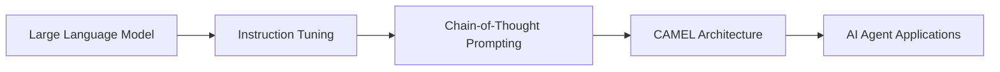

# 【大模型应用开发 动手做AI Agent】CAMEL实战

## 1. 背景介绍
### 1.1 大语言模型的发展历程
#### 1.1.1 从GPT-1到GPT-3的演进
#### 1.1.2 InstructGPT的提出与应用
#### 1.1.3 ChatGPT的爆火与影响
### 1.2 大模型应用开发的意义
#### 1.2.1 降低AI应用开发门槛
#### 1.2.2 加速AI产品落地
#### 1.2.3 推动AI技术普及
### 1.3 CAMEL的诞生
#### 1.3.1 CAMEL的定位与目标
#### 1.3.2 CAMEL的技术特点
#### 1.3.3 CAMEL的应用前景

## 2. 核心概念与联系
### 2.1 大语言模型(LLM)
#### 2.1.1 LLM的定义与原理
#### 2.1.2 LLM的训练方法
#### 2.1.3 LLM的应用场景
### 2.2 指令微调(Instruction Tuning) 
#### 2.2.1 指令微调的概念
#### 2.2.2 指令微调的优势
#### 2.2.3 指令微调的实现流程
### 2.3 思维链(Chain-of-Thought)
#### 2.3.1 思维链的提出背景
#### 2.3.2 思维链的技术原理
#### 2.3.3 思维链的效果提升
### 2.4 CAMEL的架构设计
#### 2.4.1 CAMEL的整体架构
#### 2.4.2 CAMEL的关键模块
#### 2.4.3 CAMEL的工作流程

## 3. 核心算法原理具体操作步骤
### 3.1 指令微调算法
#### 3.1.1 指令数据构建
#### 3.1.2 微调训练过程
#### 3.1.3 效果评估与分析
### 3.2 思维链提示算法
#### 3.2.1 思维链数据构建
#### 3.2.2 思维链推理过程
#### 3.2.3 思维链效果评估
### 3.3 CAMEL实现流程
#### 3.3.1 基础模型选择
#### 3.3.2 指令微调与思维链集成
#### 3.3.3 Agent功能开发

## 4. 数学模型和公式详细讲解举例说明
### 4.1 Transformer模型
#### 4.1.1 自注意力机制
$Attention(Q,K,V) = softmax(\frac{QK^T}{\sqrt{d_k}})V$
#### 4.1.2 多头注意力
$$MultiHead(Q,K,V) = Concat(head_1,...,head_h)W^O$$
$$head_i = Attention(QW_i^Q, KW_i^K, VW_i^V)$$
#### 4.1.3 前馈神经网络
$$FFN(x) = max(0, xW_1 + b_1)W_2 + b_2$$
### 4.2 微调损失函数
#### 4.2.1 交叉熵损失
$$L_{CE} = -\sum_{i=1}^{N} y_i \log(\hat{y}_i)$$
#### 4.2.2 Kullback-Leibler散度
$$D_{KL}(P||Q) = \sum_{i=1}^{N} P(x_i) \log \frac{P(x_i)}{Q(x_i)}$$

## 5. 项目实践：代码实例和详细解释说明
### 5.1 CAMEL模型训练
#### 5.1.1 数据准备与预处理
#### 5.1.2 模型微调训练
#### 5.1.3 模型效果评估
### 5.2 基于CAMEL构建AI Agent
#### 5.2.1 任务定义与分解
#### 5.2.2 提示工程设计 
#### 5.2.3 Agent交互实现
### 5.3 CAMEL应用案例
#### 5.3.1 智能客服Agent
#### 5.3.2 个人助理Agent
#### 5.3.3 知识问答Agent

## 6. 实际应用场景
### 6.1 智能客服
#### 6.1.1 客户意图理解
#### 6.1.2 多轮对话交互
#### 6.1.3 个性化回复生成
### 6.2 智能写作助手  
#### 6.2.1 写作素材推荐
#### 6.2.2 文章结构优化
#### 6.2.3 语法错误检查
### 6.3 行业知识问答
#### 6.3.1 医疗领域问答
#### 6.3.2 法律领域问答
#### 6.3.3 金融领域问答

## 7. 工具和资源推荐
### 7.1 开源CAMEL实现
#### 7.1.1 CAMEL官方仓库
#### 7.1.2 CAMEL社区贡献
#### 7.1.3 CAMEL衍生项目
### 7.2 大模型训练平台
#### 7.2.1 OpenAI API
#### 7.2.2 HuggingFace
#### 7.2.3 Google Colab
### 7.3 数据资源
#### 7.3.1 Wikipedia
#### 7.3.2 Common Crawl
#### 7.3.3 Reddit Comments

## 8. 总结：未来发展趋势与挑战
### 8.1 大模型应用趋势
#### 8.1.1 模型规模持续增长
#### 8.1.2 模型适用领域扩展 
#### 8.1.3 模型性能不断提升
### 8.2 CAMEL的发展方向  
#### 8.2.1 多模态信息融合
#### 8.2.2 few-shot学习能力
#### 8.2.3 推理解释与可解释性
### 8.3 面临的挑战
#### 8.3.1 计算资源瓶颈
#### 8.3.2 数据隐私与安全
#### 8.3.3 伦理道德考量

## 9. 附录：常见问题与解答
### 9.1 如何选择合适的预训练模型？
### 9.2 指令微调需要多少训练数据？
### 9.3 思维链提示对模型有什么要求？ 
### 9.4 CAMEL可以应用于哪些场景？
### 9.5 如何提高CAMEL的few-shot学习能力？

作者：禅与计算机程序设计艺术 / Zen and the Art of Computer Programming