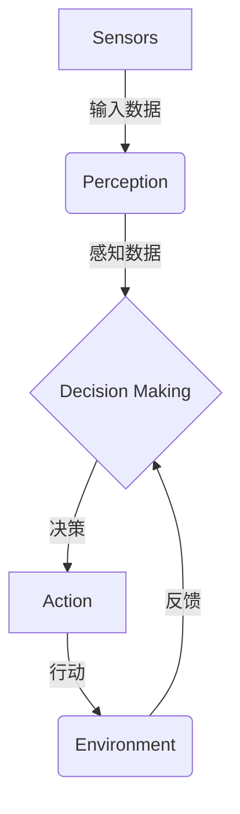

# 【大模型应用开发 动手做AI Agent】CAMEL简介

## 1. 背景介绍

### 1.1 人工智能的崛起

近年来,人工智能(AI)技术取得了长足的进步,尤其是在自然语言处理(NLP)和计算机视觉(CV)等领域。大型神经网络模型,如GPT-3、BERT和DALL-E等,展现出了惊人的能力,可以生成逼真的文本、图像和视频。这些突破性的进展为人工智能系统在各个领域的应用奠定了坚实的基础。

### 1.2 AI Agent的兴起

随着人工智能技术的不断发展,AI Agent(智能代理)的概念应运而生。AI Agent是一种能够感知环境、处理信息、做出决策并执行行动的自主系统。它们可以被用于广泛的应用场景,如智能助手、游戏AI、机器人控制等。

### 1.3 CAMEL:开源AI Agent框架

针对AI Agent的开发需求,一个名为CAMEL的开源框架应运而生。CAMEL是一个用于构建AI Agent的模块化框架,它提供了一系列工具和组件,使开发人员能够快速构建和部署AI Agent应用。

## 2. 核心概念与联系

### 2.1 AI Agent的定义

AI Agent是一种能够感知环境、处理信息、做出决策并执行行动的自主系统。它们通常由以下几个核心组件构成:

- **感知器(Sensors)**: 用于从环境中获取数据和信息
- **决策引擎(Decision Engine)**: 基于感知器获取的数据做出决策
- **执行器(Actuators)**: 根据决策引擎的指令执行相应的行动

### 2.2 CAMEL框架概述

CAMEL是一个模块化的AI Agent框架,它将AI Agent的构建过程分解为多个可重用的组件,使开发人员能够轻松地组合和扩展这些组件来创建定制的AI Agent。CAMEL框架的核心组件包括:

- **Sensors**: 用于从各种数据源(如文本、图像、视频等)获取输入数据
- **Perception**: 对输入数据进行预处理和特征提取
- **Decision Making**: 基于感知数据做出决策,包括规划、推理和学习等模块
- **Action**: 根据决策执行相应的行动,如生成文本、图像或控制机器人等
- **Environment**: 模拟AI Agent所处的环境,用于训练和测试

### 2.3 CAMEL与其他AI框架的区别

与其他AI框架相比,CAMEL的独特之处在于它专注于构建AI Agent,而不是单一的任务,如NLP或CV。它提供了一个统一的框架,将不同的AI组件集成在一起,使开发人员能够构建端到端的AI Agent应用。

此外,CAMEL还具有高度的模块化和可扩展性,允许开发人员根据需求轻松地插入或替换不同的组件。这使得CAMEL不仅适用于构建通用的AI Agent,也可以用于特定领域的定制化应用。

## 3. 核心算法原理具体操作步骤

### 3.1 CAMEL的工作流程

CAMEL框架的工作流程可以概括为以下几个步骤:



1. **Sensors**: 从环境中获取原始数据,如文本、图像、视频等。
2. **Perception**: 对原始数据进行预处理和特征提取,将其转换为AI模型可以理解的形式。
3. **Decision Making**: 基于感知数据,通过规划、推理和学习等模块做出决策。
4. **Action**: 根据决策执行相应的行动,如生成文本、图像或控制机器人等。
5. **Environment**: 模拟AI Agent所处的环境,用于训练和测试。环境还会提供反馈,供Decision Making模块进一步优化决策。

### 3.2 CAMEL的模块化设计

CAMEL框架采用了模块化设计,每个核心组件都可以独立开发和替换。这种设计使得开发人员能够根据具体需求灵活地组合不同的模块。

例如,在Perception模块中,开发人员可以选择使用不同的预处理和特征提取算法,如对于文本数据,可以使用BERT或GPT等语言模型;对于图像数据,可以使用CNN或ViT等视觉模型。

在Decision Making模块中,开发人员可以根据任务的性质选择合适的算法,如规划算法(A*、STRIPS等)、推理算法(逻辑推理、概率图模型等)或强化学习算法(DQN、PPO等)。

### 3.3 CAMEL的扩展性

除了核心模块之外,CAMEL还提供了一系列可扩展的功能,使开发人员能够根据需求定制和扩展AI Agent的能力。

- **多模态支持**: CAMEL支持多种数据模态的输入和输出,如文本、图像、视频、音频等,使AI Agent能够在多模态场景下工作。
- **并行处理**: CAMEL支持并行处理,可以同时处理多个任务或多个数据流,提高AI Agent的响应速度和效率。
- **分布式部署**: CAMEL支持在分布式环境中部署,如云计算或边缘设备,使AI Agent能够在不同的硬件和环境中运行。
- **插件系统**: CAMEL提供了一个插件系统,允许开发人员轻松地集成第三方库和工具,扩展AI Agent的功能。

通过这些扩展功能,CAMEL可以应对更加复杂和多样化的应用场景,满足不同领域的需求。

## 4. 数学模型和公式详细讲解举例说明

在AI Agent的开发过程中,数学模型和公式扮演着重要的角色。以下是一些常见的数学模型和公式,以及它们在CAMEL框架中的应用。

### 4.1 马尔可夫决策过程(MDP)

马尔可夫决策过程(Markov Decision Process, MDP)是一种广泛应用于强化学习和决策理论的数学框架。它描述了一个智能体在一个随机环境中做出决策的过程。

在MDP中,智能体的状态转移过程可以用以下公式表示:

$$
P(s' | s, a) = \mathbb{P}(S_{t+1}=s' | S_t=s, A_t=a)
$$

其中,$$s$$和$$s'$$分别表示当前状态和下一个状态,$$a$$表示智能体在当前状态下采取的行动。$$P(s' | s, a)$$表示在当前状态$$s$$下采取行动$$a$$后,转移到状态$$s'$$的概率。

此外,MDP还定义了奖励函数$$R(s, a, s')$$,表示在状态$$s$$下采取行动$$a$$并转移到状态$$s'$$时获得的即时奖励。

在CAMEL框架中,MDP可以用于建模AI Agent与环境之间的交互,并通过强化学习算法(如Q-Learning、Policy Gradient等)优化AI Agent的决策策略。

### 4.2 贝叶斯网络

贝叶斯网络(Bayesian Network)是一种基于概率论的图形模型,用于表示随机变量之间的条件独立性和因果关系。它广泛应用于推理、决策和机器学习等领域。

在贝叶斯网络中,每个节点表示一个随机变量,边表示变量之间的条件依赖关系。给定观测数据$$\mathbf{e}$$,我们可以使用贝叶斯公式计算目标变量$$X$$的后验概率:

$$
P(X | \mathbf{e}) = \frac{P(X, \mathbf{e})}{P(\mathbf{e})} = \frac{P(X)P(\mathbf{e}|X)}{P(\mathbf{e})}
$$

其中,$$P(X)$$是先验概率,$$P(\mathbf{e}|X)$$是似然函数,$$P(\mathbf{e})$$是证据概率。

在CAMEL框架中,贝叶斯网络可以用于建模AI Agent的决策过程,尤其是在存在不确定性和缺失数据的情况下。它还可以用于概率推理和规划,帮助AI Agent做出更加合理的决策。

### 4.3 深度神经网络

深度神经网络(Deep Neural Network, DNN)是一种强大的机器学习模型,广泛应用于计算机视觉、自然语言处理等领域。它通过多层非线性变换来学习数据的复杂特征,从而实现高精度的预测和决策。

在深度神经网络中,每一层的输出可以表示为:

$$
\mathbf{h}^{(l+1)} = f\left(\mathbf{W}^{(l)}\mathbf{h}^{(l)} + \mathbf{b}^{(l)}\right)
$$

其中,$$\mathbf{h}^{(l)}$$和$$\mathbf{h}^{(l+1)}$$分别表示第$$l$$层和第$$l+1$$层的输出,$$\mathbf{W}^{(l)}$$和$$\mathbf{b}^{(l)}$$是第$$l$$层的权重和偏置参数,$$f(\cdot)$$是非线性激活函数,如ReLU、Sigmoid等。

通过反向传播算法,我们可以优化神经网络的参数,使其在训练数据上达到最小化损失函数的目标。

在CAMEL框架中,深度神经网络可以用于构建Perception模块中的特征提取器,以及Decision Making模块中的决策模型。例如,我们可以使用CNN提取图像特征,使用Transformer提取文本特征,并将这些特征输入到决策模型中进行推理和决策。

### 4.4 强化学习算法

强化学习(Reinforcement Learning)是一种基于奖惩机制的机器学习范式,旨在训练智能体在给定环境中采取最优策略以maximiz 累积奖励。

一种常见的强化学习算法是Q-Learning,它通过更新Q值函数来逼近最优策略。Q值函数$$Q(s, a)$$表示在状态$$s$$下采取行动$$a$$的长期累积奖励,其更新公式为:

$$
Q(s_t, a_t) \leftarrow Q(s_t, a_t) + \alpha \left[r_t + \gamma \max_{a'} Q(s_{t+1}, a') - Q(s_t, a_t)\right]
$$

其中,$$\alpha$$是学习率,$$\gamma$$是折现因子,$$r_t$$是即时奖励,$$\max_{a'} Q(s_{t+1}, a')$$是下一状态下的最大Q值。

在CAMEL框架中,强化学习算法可以用于训练Decision Making模块,使AI Agent能够学习最优的决策策略。此外,强化学习还可以与其他机器学习技术相结合,如深度神经网络、贝叶斯网络等,以构建更加复杂和智能的AI Agent。

## 5. 项目实践:代码实例和详细解释说明

为了更好地理解CAMEL框架的使用,我们将通过一个简单的示例项目来演示如何使用CAMEL构建一个AI Agent。在这个示例中,我们将创建一个文本生成AI Agent,它可以根据给定的提示生成相关的文本内容。

### 5.1 安装CAMEL

首先,我们需要安装CAMEL框架。您可以使用Python的包管理器pip来安装:

```bash
pip install camel-ai
```

### 5.2 定义Sensors

我们首先需要定义一个Sensor来获取输入数据。在这个示例中,我们将使用TextSensor来接收文本提示。

```python
from camel.sensors import TextSensor

text_sensor = TextSensor()
```

### 5.3 定义Perception模块

接下来,我们需要定义一个Perception模块来预处理和提取输入数据的特征。在这个示例中,我们将使用BERT模型作为文本特征提取器。

```python
from camel.perception import BERTEncoder

text_encoder = BERTEncoder()
```

### 5.4 定义Decision Making模块

现在,我们需要定义一个Decision Making模块来生成文本输出。在这个示例中,我们将使用GPT-2模型作为文本生成器。

```python
from camel.decision import GPT2Generator

text_generator = GPT2Generator()
```

### 5.5 定义Action模块

最后,我们需要定义一个Action模块来执行文本生成的行动。

```python
from camel.actions import TextAction

text_action = TextAction()
```

### 5.6 构建AI Agent

现在,我们可以将上述模块组合起来,构建一个完整的AI Agent。

```python
from camel.agent import Agent

agent = Agent(sensors=[text_sensor],
              perception=[text_encoder],
              decision=[text_generator],
              actions=[text_