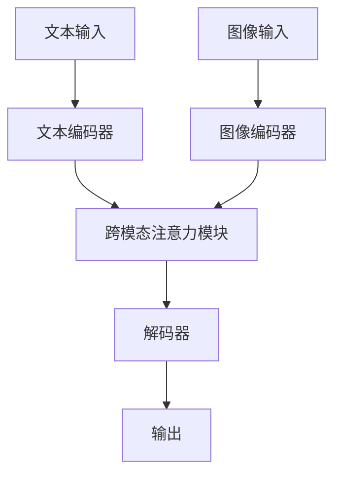

# 【大模型应用开发 动手做AI Agent】MetaGPT实战

## 1. 背景介绍

### 1.1 人工智能的崛起

人工智能(Artificial Intelligence, AI)已经成为当今科技领域最炙手可热的话题之一。随着计算能力的不断提升和算法的日益复杂,AI系统正在展现出前所未有的能力,在多个领域取得了令人瞩目的成就。其中,大型语言模型(Large Language Model, LLM)的出现,标志着AI发展进入了一个新的里程碑。

### 1.2 大型语言模型的兴起

大型语言模型是一种基于深度学习的自然语言处理(Natural Language Processing, NLP)模型,能够从海量文本数据中学习语言知识和模式。这些模型通过对大量文本进行训练,获得了广博的知识储备和强大的语言理解与生成能力。代表性的大型语言模型包括GPT-3、PaLM、ChatGPT等,它们在文本生成、问答、翻译、总结等任务上表现出色,引发了学术界和工业界的广泛关注。

### 1.3 MetaGPT: 一款开源的大型语言模型

在这些大型语言模型中,MetaGPT是一款值得关注的开源项目。它是由Meta(Facebook)公司开发和发布的,基于GPT-3模型进行了优化和改进。MetaGPT不仅继承了GPT-3强大的语言能力,还增强了对多模态数据(如图像、视频等)的处理能力,使其能够在更广泛的场景中发挥作用。

本文将深入探讨MetaGPT的核心概念、算法原理、实现细节,并介绍如何基于MetaGPT开发智能应用程序。我们将通过实际案例和代码示例,帮助读者掌握MetaGPT的使用方法,并了解其在实际应用中的潜力和挑战。

## 2. 核心概念与联系

在深入探讨MetaGPT之前,我们需要先了解一些核心概念,这些概念是MetaGPT的基础,也是理解其工作原理的关键。

### 2.1 自然语言处理(NLP)

自然语言处理(Natural Language Processing, NLP)是人工智能的一个重要分支,旨在使计算机能够理解和生成人类语言。NLP技术广泛应用于机器翻译、问答系统、情感分析、文本摘要等领域。

### 2.2 深度学习与神经网络

深度学习(Deep Learning)是机器学习的一个子领域,它基于人工神经网络(Artificial Neural Network, ANN)的概念,通过对大量数据进行训练,自动学习特征表示和模式。深度神经网络能够有效地处理复杂的非线性问题,在图像识别、语音识别、自然语言处理等领域取得了卓越的成绩。

### 2.3 Transformer架构

Transformer是一种革命性的神经网络架构,它完全基于注意力机制(Attention Mechanism)来捕捉输入序列中的长程依赖关系。Transformer架构在机器翻译、语言模型等任务中表现出色,成为当前主流的NLP模型架构。

### 2.4 预训练与微调

预训练(Pre-training)是一种常见的深度学习技术,它在大量通用数据上对模型进行初始化训练,使模型获得一定的通用知识和能力。然后,我们可以在特定任务的数据上对预训练模型进行微调(Fine-tuning),使其适应特定任务的需求。大型语言模型通常采用预训练+微调的范式,先在海量文本数据上进行预训练,再根据具体任务进行微调。

### 2.5 多模态学习

传统的NLP模型主要关注文本数据,而多模态学习(Multimodal Learning)则旨在让模型同时处理多种模态数据,如文本、图像、视频等。多模态学习能够捕捉不同模态之间的关联,提高模型的理解和生成能力。MetaGPT就是一款支持多模态学习的大型语言模型。

### 2.6 MetaGPT架构概览

MetaGPT的核心架构基于Transformer,但在此基础上进行了多项改进和扩展。它采用了多流(Multi-Stream)架构,能够并行处理不同模态的输入数据。同时,MetaGPT引入了新的注意力机制和融合机制,以更好地捕捉不同模态之间的关联。此外,MetaGPT还支持多任务学习(Multi-Task Learning),使其能够在多个任务上进行联合训练,提高泛化能力。

下面是MetaGPT的基本架构流程图:



## 3. 核心算法原理具体操作步骤

### 3.1 Transformer编码器

Transformer编码器是MetaGPT的核心组件之一,它负责对输入数据进行编码和表示。对于文本输入,Transformer编码器会将文本序列转换为一系列向量表示,捕捉单词之间的上下文关系。对于图像输入,则需要先将图像转换为一系列patch(图像块),然后由Transformer编码器对这些patch进行编码。

Transformer编码器的工作原理可以概括为以下几个步骤:

1. **输入嵌入(Input Embedding)**: 将输入数据(如单词或图像patch)映射为向量表示。
2. **位置编码(Positional Encoding)**: 为每个输入向量添加位置信息,使模型能够捕捉序列的顺序关系。
3. **多头注意力(Multi-Head Attention)**: 计算每个输入向量与其他向量之间的注意力权重,捕捉长程依赖关系。
4. **前馈神经网络(Feed-Forward Neural Network)**: 对注意力输出进行非线性变换,提取更高级的特征表示。
5. **层归一化(Layer Normalization)**: 对每一层的输出进行归一化,提高模型的稳定性和收敛速度。
6. **残差连接(Residual Connection)**: 将每一层的输出与输入相加,以缓解梯度消失问题。

通过多个编码器层的堆叠,Transformer编码器能够逐步提取输入数据的高级语义表示,为后续的跨模态融合和解码过程提供基础。

### 3.2 跨模态注意力模块

MetaGPT的一大创新之处在于引入了跨模态注意力模块(Cross-Modal Attention Module),用于捕捉不同模态输入之间的关联。这个模块的工作原理如下:

1. **模态融合(Modal Fusion)**: 将不同模态的编码器输出进行融合,生成一个统一的表示序列。
2. **跨模态注意力(Cross-Modal Attention)**: 在融合的表示序列上应用多头注意力机制,捕捉不同模态之间的交互关系。
3. **门控融合(Gated Fusion)**: 使用门控机制(Gating Mechanism)动态调节不同模态的重要性,获得更加精确的融合表示。

通过这一模块,MetaGPT能够有效地整合来自不同模态的信息,提高对复杂场景的理解能力。

### 3.3 解码器与生成

MetaGPT的解码器模块基于标准的Transformer解码器架构,用于根据编码器的输出生成目标序列(如文本或图像描述)。解码器的工作步骤如下:

1. **输入嵌入(Input Embedding)**: 将目标序列的前缀(如问题描述)映射为向量表示。
2. **掩码多头注意力(Masked Multi-Head Attention)**: 在目标序列上应用掩码多头注意力,捕捉已生成token之间的依赖关系。
3. **编码器-解码器注意力(Encoder-Decoder Attention)**: 将解码器的输出与编码器的输出进行注意力计算,融合编码器的信息。
4. **前馈神经网络(Feed-Forward Neural Network)**: 对注意力输出进行非线性变换,提取更高级的特征表示。
5. **层归一化(Layer Normalization)** 和 **残差连接(Residual Connection)**: 与编码器中的操作相同,提高模型的稳定性和收敛速度。
6. **生成(Generation)**: 根据解码器的输出,使用贪婪搜索或beam search算法生成下一个token,直到生成完整的目标序列。

通过解码器模块,MetaGPT能够将编码器提取的多模态表示转换为目标输出,实现各种下游任务,如文本生成、图像描述、问答等。

## 4. 数学模型和公式详细讲解举例说明

为了更好地理解MetaGPT的核心算法原理,我们需要深入探讨一些关键的数学模型和公式。

### 4.1 注意力机制(Attention Mechanism)

注意力机制是Transformer架构的核心,它允许模型在计算目标向量的表示时,动态地关注输入序列中的不同部分。注意力机制的数学表达式如下:

$$
\text{Attention}(Q, K, V) = \text{softmax}\left(\frac{QK^T}{\sqrt{d_k}}\right)V
$$

其中:

- $Q$ 是查询向量(Query)
- $K$ 是键向量(Key)
- $V$ 是值向量(Value)
- $d_k$ 是缩放因子,用于防止内积过大导致梯度消失

多头注意力(Multi-Head Attention)则是将注意力机制应用于多个子空间,然后将结果拼接起来,公式如下:

$$
\text{MultiHead}(Q, K, V) = \text{Concat}(head_1, \dots, head_h)W^O
$$
$$
\text{where } head_i = \text{Attention}(QW_i^Q, KW_i^K, VW_i^V)
$$

其中 $W_i^Q$、$W_i^K$、$W_i^V$ 和 $W^O$ 是可学习的线性变换矩阵。

### 4.2 门控融合机制(Gated Fusion Mechanism)

MetaGPT中的门控融合机制用于动态调节不同模态的重要性,公式如下:

$$
\mathbf{h}_t = \mathbf{g}_t \odot \mathbf{h}_t^v + (1 - \mathbf{g}_t) \odot \mathbf{h}_t^a
$$
$$
\mathbf{g}_t = \sigma(\mathbf{W}_g[\mathbf{h}_t^v; \mathbf{h}_t^a] + \mathbf{b}_g)
$$

其中:

- $\mathbf{h}_t^v$ 和 $\mathbf{h}_t^a$ 分别是视觉模态和语音模态的隐藏状态
- $\mathbf{g}_t$ 是门控向量,通过sigmoid函数计算得到
- $\mathbf{W}_g$ 和 $\mathbf{b}_g$ 是可学习的参数
- $\odot$ 表示元素级别的乘积操作

通过门控融合机制,MetaGPT能够动态地调整不同模态的贡献度,获得更加精确的融合表示。

### 4.3 交叉注意力损失(Cross-Attention Loss)

为了更好地捕捉不同模态之间的关联,MetaGPT引入了交叉注意力损失(Cross-Attention Loss),公式如下:

$$
\mathcal{L}_\text{ca} = -\frac{1}{N} \sum_{i=1}^N \log p(y_i | \mathbf{x}^v, \mathbf{x}^a, \mathbf{y}_{<i})
$$

其中:

- $\mathbf{x}^v$ 和 $\mathbf{x}^a$ 分别是视觉模态和语音模态的输入
- $\mathbf{y}$ 是目标序列
- $p(y_i | \mathbf{x}^v, \mathbf{x}^a, \mathbf{y}_{<i})$ 是生成第 $i$ 个token的条件概率
- $N$ 是目标序列的长度

通过最小化交叉注意力损失,MetaGPT能够学习到更好地融合不同模态信息的能力,提高在多模态任务上的表现。

## 5. 项目实践: 代码实例和详细解释说明

为了更好地理解MetaGPT的实现细节,我们将提供一些代码示例,并对关键部分进行详细解释。

### 5.1 安装MetaGPT

MetaGPT是一个开源项目,可以通过以下命令进行安装:

```bash
pip install metagpt
```

### 5.2 加载预训练模型

MetaGPT提供