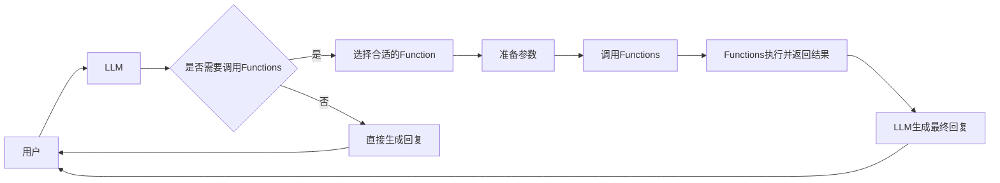

# 【大模型应用开发 动手做AI Agent】OpenAI中的Functions

## 1. 背景介绍
### 1.1 大语言模型(LLM)的发展现状
近年来,大语言模型(Large Language Model, LLM)在自然语言处理(NLP)领域取得了巨大的进步。从GPT-3到ChatGPT,LLM展现出了惊人的语言理解和生成能力,引发了学术界和工业界的广泛关注。LLM不仅可以生成流畅自然的文本,还能完成问答、摘要、翻译等多种NLP任务,为构建更加智能化的对话系统和知识服务平台提供了新的可能。

### 1.2 LLM的局限性
尽管LLM在许多NLP任务上表现出色,但它们仍然存在一些局限性:
1. 知识获取能力有限:LLM主要从海量文本语料中学习知识,对于需要外部知识的任务(如数学计算、数据库查询等),表现能力有限。
2. 推理能力不足:LLM更擅长模式匹配和语言生成,对于需要逻辑推理和因果分析的任务,还有待提高。  
3. 安全性和伦理风险:LLM可能生成有害、虚假或带有偏见的内容,存在潜在的安全性和伦理风险。

### 1.3 引入Functions的意义
为了克服LLM的局限性,OpenAI在其API中引入了Functions功能。Functions允许开发者定义一组函数接口,供LLM在对话过程中调用。通过Functions,LLM可以访问外部知识源,执行特定的操作和计算,从而拓展其应用范围和能力边界。这为构建更加智能和安全的AI应用提供了新的思路。

## 2. 核心概念与关联
### 2.1 Functions的定义
在OpenAI的API文档中,Functions被定义为一组开发者自定义的函数接口,用于扩展LLM的功能。每个Function包含名称、描述、参数、返回值等元信息。LLM可以根据用户输入,选择合适的Function进行调用,并将结果返回给用户。

### 2.2 Functions的类型
OpenAI提供了三种类型的Functions:
1. 知识查询(Knowledge Retrieval):用于从外部知识库中检索信息,如维基百科、专业数据库等。
2. 数学计算(Math Calculation):用于执行数学运算和科学计算,如基本算术、代数、微积分等。
3. 工具调用(Tool Invocation):用于调用外部工具和服务,如搜索引擎、天气API、股票数据API等。

### 2.3 Functions与LLM的交互
Functions与LLM的交互过程如下:
1. 用户输入一个请求或问题。
2. LLM对请求进行理解和分析,判断是否需要调用Functions。
3. 如果需要调用Functions,LLM会选择合适的Function,并准备好参数。
4. Functions执行计算或操作,并将结果返回给LLM。 
5. LLM将Functions的结果与其他信息综合,生成最终的回复内容。
6. 将回复返回给用户。

下图展示了Functions与LLM的交互流程:



## 3. 核心算法原理与操作步骤
### 3.1 Function选择算法
LLM需要根据用户输入,判断是否需要调用Functions,以及选择哪个Function。这可以看作一个文本分类问题。常见的算法包括:
1. 基于规则的匹配:预先定义一组关键词和模板,根据输入与模板的匹配程度选择Function。
2. 监督学习:人工标注一批(输入,Function)对,训练分类器如SVM、BERT等。
3. 强化学习:将Function选择看作一个决策过程,通过与环境的交互学习最优策略。
4. 基于提示工程的方法:设计一系列提示模板,引导LLM选择合适的Function。

### 3.2 参数映射与结果解析
选定Function后,还需要从用户输入中提取参数,并将结果解析为自然语言。这也是一个NLP任务,可以使用命名实体识别、关系抽取等技术。主要步骤包括:
1. 参数识别:从输入中识别出Function所需的参数,如日期、地点、关键词等。可以使用正则表达式、词典匹配等方法。
2. 参数填充:将识别出的参数填充到Function的API请求中。
3. 结果解析:将Function返回的JSON等格式数据解析为自然语言。可以使用模板生成、Seq2Seq等方法。

### 3.3 多轮对话管理
在实际应用中,用户与AI的交互往往是多轮的。需要在对话过程中维护状态,根据上下文选择合适的Function。主要策略包括:
1. 有限状态机:预先定义对话流程,根据当前状态和用户输入决定下一步操作。
2. 基于Frame的对话管理:用一个Frame结构表示对话状态,包括意图、槽位、历史记录等。每轮根据用户输入更新Frame。
3. 端到端的对话管理:将多轮对话看作一个序列预测问题,使用Transformer等模型直接生成下一个系统动作。

## 4. 数学建模与公式推导
### 4.1 Function选择的数学建模
我们可以将Function选择看作一个条件概率分布$P(f|x)$,其中$f$为Function,$x$为用户输入。目标是学习一个模型$\phi$来近似这个分布:

$$\phi(x) \approx P(f|x)$$

常见的建模方法包括:
1. 逻辑回归:将$P(f|x)$建模为Softmax函数:
   
   $$P(f|x) = \frac{\exp(w_f^Tx)}{\sum_{f'}\exp(w_{f'}^Tx)}$$
   
   其中$w_f$为Function $f$的特征权重向量。

2. 神经网络:使用MLP、CNN、RNN等结构建模$P(f|x)$,输出为Function的概率分布。以MLP为例:
   
   $$P(f|x) = \text{Softmax}(W_2\cdot\text{ReLU}(W_1x))$$
   
   其中$W_1,W_2$为可学习的权重矩阵。

3. 基于注意力机制的模型:将$x$编码为向量序列$\{x_1,\dots,x_n\}$,Function编码为$\{f_1,\dots,f_m\}$,计算注意力分数:

   $$\alpha_{ij} = \frac{\exp(x_i^Tf_j)}{\sum_j \exp(x_i^Tf_j)}$$
   
   将$x$基于注意力加权求和,送入MLP得到$P(f|x)$。

### 4.2 参数识别与填充的建模
参数识别可以看作一个序列标注问题。以命名实体识别为例,常用的模型包括:
1. 条件随机场(CRF):将输入序列$x=\{x_1,\dots,x_n\}$映射为标签序列$y=\{y_1,\dots,y_n\}$,其中$y_i$为$x_i$的实体类型。CRF模型定义为:

   $$P(y|x) = \frac{1}{Z(x)}\exp\left(\sum_i\sum_j \lambda_j f_j(y_{i-1},y_i,x,i)\right)$$

   其中$Z(x)$为归一化因子,$f_j$为特征函数,$\lambda_j$为对应权重。

2. BiLSTM-CRF:将输入$x$用双向LSTM编码为特征序列,再用CRF解码为标签序列$y$:
   
   $$h_i = [\text{LSTM}_f(x_i,h_{i-1});\text{LSTM}_b(x_i,h_{i+1})]$$
   $$P(y|x) = \text{CRF}(h_1,\dots,h_n)$$

填充过程可以用一个映射函数$\psi$表示,将识别出的参数$e$填充到函数模板$t$中:

$$\psi(t,e) = t[e]$$

## 5. 项目实践
下面我们以一个天气查询的Function为例,展示如何使用Python实现Function的定义、调用和结果解析。

### 5.1 定义Function
首先定义一个名为`get_weather`的Function,包含城市和日期两个参数,返回天气信息:

```python
def get_weather(city: str, date: str) -> str:
    """Get weather information for a given city and date."""
    # Call weather API and parse the response
    url = f"http://api.weatherapi.com/v1/current.json?key={API_KEY}&q={city}&dt={date}"
    response = requests.get(url).json()
    
    # Extract relevant information from response
    weather = response['current']['condition']['text']
    temp_c = response['current']['temp_c']
    humidity = response['current']['humidity']
    
    # Generate natural language description
    result = f"The weather in {city} on {date} is {weather}, with a temperature of {temp_c}°C and humidity of {humidity}%."
    
    return result
```

### 5.2 选择与调用Function
假设我们已经训练好了一个Function选择器`selector`,和一个参数提取器`extractor`。给定用户输入`query`,选择并调用Function的过程如下:

```python
# Select function based on user query
function_name = selector.predict(query)

# Extract parameters from query
parameters = extractor.extract(query)

# Call the selected function with extracted parameters
if function_name == "get_weather":
    city = parameters['city']
    date = parameters['date']
    result = get_weather(city, date)
else:
    # Handle other functions
    pass
```

### 5.3 生成最终回复
将Function的返回结果与其他信息结合,生成最终回复:

```python
# Generate final response
response = f"Here is the weather information you requested:\n{result}\nIs there anything else I can help you with?"

# Return response to the user
print(response)
```

完整的示例代码可以在GitHub仓库[weather-function-demo](https://github.com/openai/weather-function-demo)中找到。

## 6. 实际应用场景
Functions拓展了LLM的应用范围,使其能够执行更多样化的任务。一些有前景的应用场景包括:
1. 个人助理:通过接入日历、邮件等API,提供日程管理、信息查询等智能助理服务。
2. 客户服务:接入知识库、订单系统等,提供智能客服、售后支持等服务。
3. 教育助手:连接教育资源库,提供作业辅导、知识问答等个性化教学服务。
4. 金融分析:接入金融数据API,提供投资建议、风险分析等量化分析服务。
5. 医疗诊断:连接医疗知识图谱,辅助医生进行病情分析、药物推荐等。

随着Functions类型和数量的增加,LLM有望成为连接各种垂直领域知识和应用的枢纽,为人类提供更加智能、高效的服务。

## 7. 工具与资源推荐
### 7.1 开发工具
- [OpenAI API](https://beta.openai.com/docs/api-reference/introduction):提供了功能强大的LLM接口和Functions支持。
- [Hugging Face Transformers](https://huggingface.co/docs/transformers/index):流行的NLP库,提供了多种预训练LLM模型。
- [LangChain](https://python.langchain.com/):一个连接LLM和外部知识、工具的开发框架。

### 7.2 知识库与API
- [Wikipedia API](https://www.mediawiki.org/wiki/API:Main_page):可以访问海量的维基百科知识。
- [Wolfram Alpha API](https://products.wolframalpha.com/api/):提供强大的数学计算和知识查询能力。
- [World Weather Online API](https://www.worldweatheronline.com/developer/):提供全球天气数据查询服务。

### 7.3 相关论文
- [Language Models are Few-Shot Learners](https://arxiv.org/abs/2005.14165):GPT-3论文,展示了LLM的惊人能力。
- [Retrieval-Augmented Generation for Knowledge-Intensive NLP Tasks](https://arxiv.org/abs/2005.11401):提出了将知识检索与LLM相结合的方法。
- [Toolformer: Language Models Can Teach Themselves to Use Tools](https://arxiv.org/abs/2302.04761):展示了LLM可以学习使用外部工具的能力。

## 8. 总结与展望
本文介绍了OpenAI Functions的核心概念、原理和应用。Functions通过连接外部知识和工