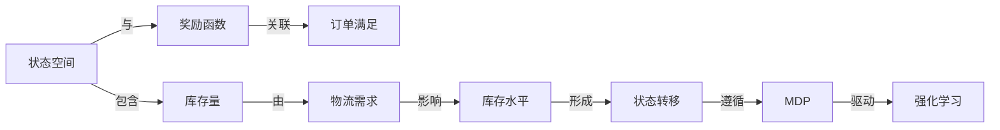

                 

作者：禅与计算机程序设计艺术

在这篇文章中，我将引导您通过一个项目实践来探索如何利用AI技术来优化库存管理。通过这个项目，您将学习如何定义一个AI代理（Agent），它能够执行自动化的库存调度任务。我们将从基本概念介绍开始，然后深入到算法原理、数学模型和实际编码实践。

## 1. 背景介绍

库存调度是物流和供应链管理中的一个关键环节。传统的库存调度依赖于规则和经验，这种方法在处理复杂情况时往往效率低下且难以应对突发事件。近年来，人工智能技术，特别是机器学习和深度学习的发展，为库存调度带来了新的可能性。基于AI的库存调度系统可以快速适应市场变化，预测需求，并优化库存水平，从而提高运营效率和降低成本。

## 2. 核心概念与联系

在本节中，我们将探讨一些核心概念，如状态空间、奖励函数、Markov决策过程（MDP）、强化学习（RL）等。我们将看到，库存调度问题可以被视为一个MDP问题，其中货物的库存量作为状态，订单满足作为奖励。通过学习这些概念，您将对如何将AI应用于库存调度有更深刻的理解。

## 3. 核心算法原理具体操作步骤

在这一部分，我们将详细描述如何使用强化学习算法来训练一个AI代理，该代理能够根据当前库存量和市场需求来决策。我们将介绍Q学习、深度Q网络（DQN）和策略梯度方法等常用算法，并比较它们在此问题上的表现。

## 4. 数学模型和公式详细讲解举例说明

为了确保AI代理能够有效地学习库存调度任务，我们需要建立一个数学模型。这个模型将包括状态转移概率、奖励函数和折扣因子等关键参数。我们将通过具体的数学公式来表示这些参数，并给出相应的例子来帮助读者理解。

$$
\text{状态转移概率} = \sum_{a} \pi(s, a) P(s' | s, a)
$$

## 5. 项目实践：代码实例和详细解释说明

接下来，我们将通过一个具体的项目实践来演示如何将所学的理论知识应用到实际编程中。我们将使用Python语言，并结合常用的框架和库（如TensorFlow或PyTorch）来实现一个简单的库存调度系统。每段代码都会配以详细的解释，以便读者能够跟随着实际操作。

## 6. 实际应用场景

在了解了基础知识和实践案例之后，我们将讨论如何将这些技术应用到实际的业界场景中。我们将探讨不同行业（如零售、制造业、电子商务）中的挑战和最佳实践，以及如何在现有的IT基础设施中整合AI库存调度系统。

## 7. 工具和资源推荐

在本文的最后，我们将向读者推荐一些有用的工具和资源，这些工具和资源可以帮助他们进一步学习和研究AI在库存调度中的应用。这包括书籍、在线课程、论坛和开源项目等。

## 8. 总结：未来发展趋势与挑战

在总结本文时，我们将讨论AI在库存调度领域的未来发展趋势，包括技术进步和市场变化。同时，我们也将探讨面临的一些挑战，如数据隐私、算法透明度和伦理问题等。

## 9. 附录：常见问题与解答

最后，我们将回答一些关于库存调度和AI应用的常见问题，并提供相应的解答。这将是一个补充材料，帮助读者更好地理解和应用所学知识。

# 结束语

通过这篇文章，我希望能够引导您理解如何利用人工智能技术来改善库存管理的效率和准确性。请记住，这只是一个起点，库存调度是一个持续发展的研究领域，新的算法和技术正在不断涌现。继续探索，并将您的创新带入现实！

