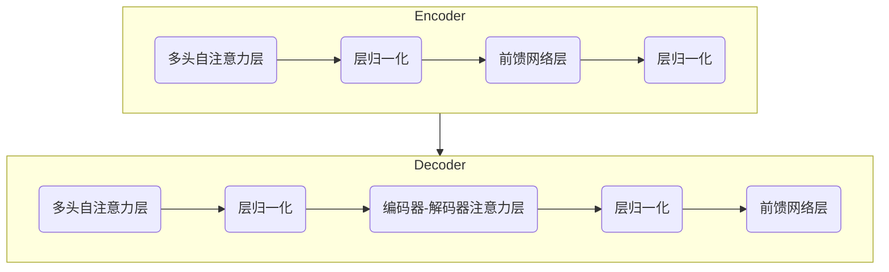
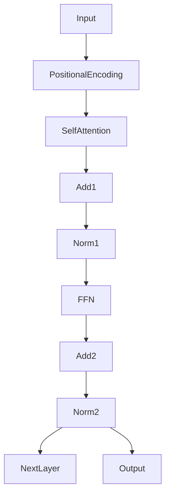
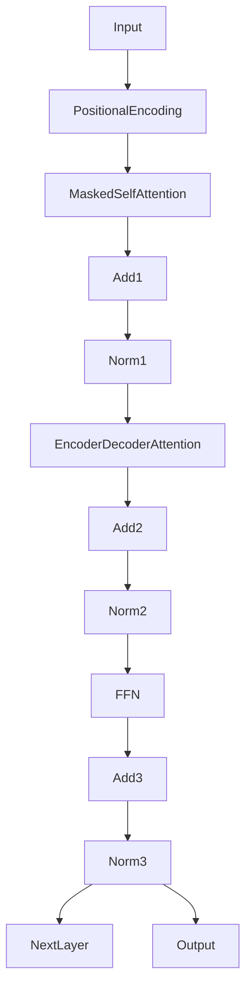

# 【大模型应用开发 动手做AI Agent】人类的大脑了不起

## 1. 背景介绍

### 1.1 人工智能的崛起

人工智能(AI)已经成为当代科技领域最炙手可热的话题之一。从语音助手到自动驾驶汽车,从医疗诊断到金融分析,AI系统正在渗透到我们生活的方方面面。然而,即便是最先进的AI系统,也远远无法企及人类大脑的强大功能。

人类大脑是一个奇迹般的器官,集成了感知、思考、学习、推理、决策等多种复杂的认知能力。它能够从有限的信息中提取规律,并对新情况做出智能判断。大脑的神经网络具有非凡的并行处理能力,可以同时处理多种任务,并通过不断学习来优化自身。

### 1.2 大模型的兴起

近年来,benefiting from大量数据、强大算力和新型机器学习算法,大规模的人工神经网络模型(通常称为"大模型")取得了令人瞩目的进展。这些大模型通过在海量数据上进行预训练,学习到了丰富的世界知识和语言理解能力。

大模型的出现为构建通用人工智能(AGI)系统带来了新的契机。AGI旨在复制人类大脑的广泛认知能力,实现真正的"智能"。虽然现有的大模型距离AGI还有一定差距,但它们已经展现出了初步的多任务学习、推理和生成能力,为未来的AGI系统奠定了基础。

### 1.3 动手做AI Agent

本文将探讨如何基于大模型开发智能AI Agent,赋予它们类似于人类大脑的认知功能。我们将介绍大模型的核心概念、训练方法,以及如何将其应用于构建多功能AI Agent。通过动手实践,读者将体会到大模型强大的能力,并了解其在推进AGI发展中的重要作用。

## 2. 核心概念与联系

### 2.1 大模型的核心思想

大模型的核心思想是通过在海量数据上预训练,使神经网络模型学习到丰富的世界知识和语言理解能力。这种预训练方式类似于人类大脑在成长过程中不断吸收新知识的过程。

预训练的目标是最大化模型对训练数据的概率,即最小化交叉熵损失。这种无监督的目标函数使模型能够捕捉到数据中的统计规律和上下文信息,而不需要人工标注的监督信号。

```latex
$$\mathcal{L}=-\sum_{i=1}^{n}\log P\left(x_{i} \mid x_{1}, \ldots, x_{i-1}\right)$$
```

其中$\mathcal{L}$是交叉熵损失函数,模型的目标是最小化这个损失。$x_i$表示序列中的第$i$个token,$P(x_i|x_1,...,x_{i-1})$是模型根据前面的上下文预测当前token的概率。通过最小化损失,模型可以学习到生成自然语言序列的能力。

### 2.2 注意力机制

注意力机制是大模型的关键技术之一。传统的序列模型(如RNN)在处理长序列时容易遇到梯度消失/爆炸的问题。注意力机制通过直接建立长程依赖关系,有效解决了这一问题。

注意力机制的核心思想是,在生成每个目标token时,模型会"注意"到输入序列中与当前token最相关的部分,并赋予更高的权重。这种选择性关注机制使模型能够更好地捕捉长程依赖关系,提高了序列建模的性能。

```latex
$$\operatorname{Attention}(Q, K, V)=\operatorname{softmax}\left(\frac{Q K^{\top}}{\sqrt{d_{k}}}\right) V$$
```

其中$Q$是查询(Query)向量,$K$是键(Key)向量,$V$是值(Value)向量。注意力分数由$Q$和$K$的点积计算得到,然后通过softmax函数归一化。最终的注意力输出是注意力分数与$V$的加权和。

### 2.3 transformer模型

Transformer是一种全新的基于注意力机制的序列模型,它完全摒弃了RNN和CNN等传统架构,纯粹依赖注意力机制来建模序列。Transformer的核心由编码器(Encoder)和解码器(Decoder)两部分组成。

编码器将输入序列映射到一系列连续的向量表示,解码器则根据编码器的输出生成目标序列。编码器和解码器内部都采用了多头自注意力(Multi-Head Self-Attention)和前馈网络(Feed-Forward Network)等关键组件。



Transformer架构的灵活性和并行化能力使其在各种自然语言处理任务上表现出色,成为大模型的主流选择。

### 2.4 大模型与人类大脑的关联

尽管大模型与人类大脑在实现机制上存在差异,但它们在认知能力上存在一些相似之处:

1. **知识获取**:大模型通过预训练吸收海量数据,类似于人脑从环境中不断学习新知识。
2. **关联推理**:注意力机制使大模型能够关注输入的不同部分,并建立联系,类似于人脑中的关联记忆。
3. **多任务处理**:大模型展现出一定的多任务能力,能够在不同任务之间迁移知识,类似于人脑的认知灵活性。
4. **语境理解**:大模型能够根据上下文生成自然语言,体现了对语义和语境的理解能力。

然而,大模型目前还无法完全复制人脑的高级认知功能,如因果推理、形象思维和自我意识等。它们更像是一个强大的"知识库",而缺乏真正的"理解"能力。发展通用人工智能仍是一个巨大的挑战。

## 3. 核心算法原理具体操作步骤

### 3.1 transformer编码器

Transformer编码器的核心是多头自注意力(Multi-Head Self-Attention)和前馈网络(Feed-Forward Network)。编码器将输入序列$X=(x_1, x_2, ..., x_n)$映射为一系列连续的向量表示$Z=(z_1, z_2, ..., z_n)$。

1. **位置编码(Positional Encoding)**

由于Transformer没有循环或卷积结构,因此需要显式地为每个token加入位置信息。位置编码向量$PE(pos)$与token embedding相加,从而赋予每个token其在序列中的位置信息。

2. **多头自注意力(Multi-Head Self-Attention)**

自注意力层的计算过程如下:

```latex
\begin{aligned}
Q &=XW^Q \\
K &=XW^K \\
V &=XW^V \\
\text{head}_i &=\operatorname{Attention}(QW_i^Q, KW_i^K, VW_i^V) \\
\text{MultiHead}(Q, K, V) &=\text{Concat}(\text{head}_1, \ldots, \text{head}_h)W^O
\end{aligned}
```

其中$W^Q, W^K, W^V, W_i^Q, W_i^K, W_i^V, W^O$为可训练的投影矩阵。多头注意力机制可以从不同的子空间捕捉不同的关系,提高了模型的表达能力。

3. **前馈网络(Feed-Forward Network)**

前馈网络由两个全连接层组成,对每个位置的向量进行独立的非线性变换:

```latex
\operatorname{FFN}(x)=\max \left(0, xW_1+b_1\right) W_2+b_2
```

4. **残差连接与层归一化(Residual Connection & Layer Normalization)**

为了缓解深层网络的梯度消失问题,Transformer采用了残差连接和层归一化。

```latex
\begin{aligned}
z_l &=\operatorname{LN}\left(x_l+\operatorname{SubLayer}\left(x_l\right)\right) \\
x_{l+1} &=z_l+\operatorname{FFN}\left(z_l\right)
\end{aligned}
```

其中$\operatorname{SubLayer}$可以是多头自注意力或前馈网络。残差连接和层归一化有助于梯度的传播,提高了模型的优化效率。

5. **编码器堆叠(Encoder Stacking)**

Transformer编码器由多个相同的子层堆叠而成,每个子层包含一个多头自注意力层和一个前馈网络层。通过堆叠多个编码器层,模型可以学习到更高层次的表示。



上图展示了单个编码器层的计算流程。输入序列首先加入位置编码,然后经过多头自注意力层、残差连接、层归一化、前馈网络、残差连接和层归一化,最终得到该层的输出向量表示。多个编码器层堆叠在一起,形成了完整的Transformer编码器。

### 3.2 Transformer解码器

Transformer解码器的结构与编码器类似,但增加了一个编码器-解码器注意力子层,用于关注输入序列的不同部分。解码器的输出是根据输入序列生成的目标序列。

1. **掩码自注意力(Masked Self-Attention)**

与编码器不同,解码器在自注意力计算时需要防止每个位置的词元关注到其后面的词元(因为生成时后面的词元是未知的)。这通过在softmax计算之前,用一个反向矩阵将所有非法连接的位置归零来实现。

2. **编码器-解码器注意力(Encoder-Decoder Attention)**

编码器-解码器注意力层使解码器能够关注输入序列的不同部分。它的计算方式与多头自注意力类似,只是查询(Query)来自解码器,而键(Key)和值(Value)来自编码器的输出。

```latex
\begin{aligned}
\text{CrossAttention}(Q, K, V) &=\operatorname{softmax}\left(\frac{QK^{\top}}{\sqrt{d_{k}}}\right) V \\
\text{head}_i &=\operatorname{CrossAttention}\left(QW_i^Q, KW_i^K, VW_i^V\right) \\
\text{MultiHead}(Q, K, V) &=\text{Concat}(\text{head}_1, \ldots, \text{head}_h)W^O
\end{aligned}
```

3. **解码器堆叠(Decoder Stacking)**

解码器由多个相同的子层堆叠而成,每个子层包含一个掩码自注意力层、一个编码器-解码器注意力层和一个前馈网络层。通过堆叠多个解码器层,模型可以捕捉到更复杂的依赖关系。



上图展示了单个解码器层的计算流程。输入序列首先加入位置编码,然后经过掩码自注意力层、残差连接、层归一化、编码器-解码器注意力层、残差连接、层归一化、前馈网络、残差连接和层归一化,最终得到该层的输出向量表示。多个解码器层堆叠在一起,形成了完整的Transformer解码器。

### 3.3 Transformer模型训练

Transformer模型的训练过程包括两个阶段:预训练(Pre-training)和微调(Fine-tuning)。

1. **预训练**

预训练阶段的目标是使模型在大量无监督数据上学习到通用的语言表示能