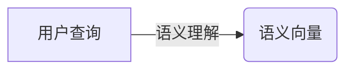
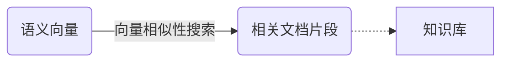
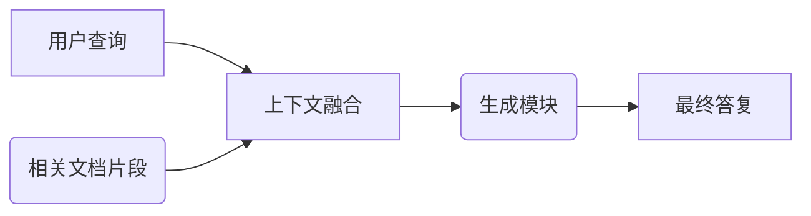
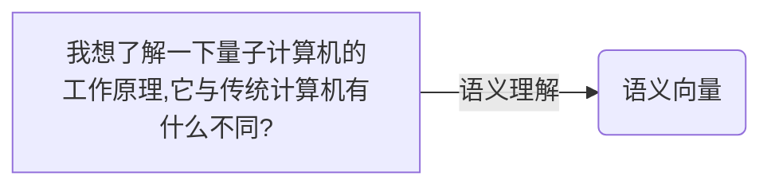
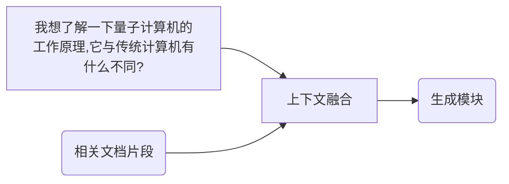
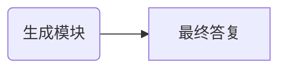

# 【大模型应用开发 动手做AI Agent】从用户角度看RAG流程

## 1. 背景介绍

### 1.1 大模型时代的到来

近年来,自然语言处理(NLP)领域取得了长足的进步,很大程度上归功于大型语言模型(Large Language Models, LLMs)的兴起。传统的NLP系统通常采用基于规则或统计方法,需要大量的特征工程和领域知识。而LLMs则是通过在大规模语料库上进行自监督预训练,学习到通用的语言表示,从而能够泛化到下游的各种NLP任务。

随着计算能力和数据量的不断增长,LLMs的规模也在不断扩大。从2018年的GPT模型(1.1亿参数)到2022年的GPT-3(1750亿参数),参数规模暴涨了近1600倍。这种参数规模的扩大使得LLMs能够展现出惊人的泛化能力,在各种NLP任务上取得了超越人类的性能表现。

### 1.2 RAG: 融合检索与生成的AI Agent

尽管LLMs展现出了强大的语言生成能力,但它们仍然存在一些局限性。由于预训练语料的有限性,LLMs对某些专业领域知识的覆盖度可能不足。此外,LLMs也容易产生不合理或者不一致的输出。

为了解决这些问题,研究人员提出了RAG(Retrieval Augmented Generation)框架,旨在将LLMs与外部知识库相结合,从而提高模型的事实一致性和知识覆盖面。RAG框架由两个主要部分组成:

1. **检索模块(Retriever)**:从外部知识库(如Wikipedia)中检索与当前查询相关的文档片段。
2. **生成模块(Generator)**:基于检索到的文档片段和原始查询,生成最终的答复。

RAG框架的核心思想是利用LLMs强大的语言生成能力,同时将其与外部知识库相结合,从而弥补LLMs在事实一致性和知识覆盖面方面的不足。

### 1.3 从用户角度理解RAG流程

虽然RAG框架在技术层面上已经得到了广泛的研究和应用,但对于普通用户来说,理解RAG流程的内在机理并不容易。本文将从用户的角度出发,通过一个具体的示例,详细解释RAG流程的各个环节,帮助读者更好地理解这一创新的AI Agent架构。

## 2. 核心概念与联系

在深入探讨RAG流程之前,我们需要先了解一些核心概念及其相互关系。

### 2.1 语义理解与知识检索

RAG框架的第一步是语义理解,即理解用户查询的语义含义。这一步骤通常由一个语义理解模块(如BERT)来完成,将用户查询映射到一个语义向量空间中。



接下来,语义向量将被用于从知识库中检索相关的文档片段。这一步骤由检索模块完成,通常采用向量相似性搜索的方法,从知识库中找出与查询语义向量最相似的文档片段。



### 2.2 上下文融合与答复生成

检索到的相关文档片段将与原始查询一起作为上下文,被输入到生成模块中。生成模块的任务是综合上下文信息,生成最终的答复。



生成模块通常是一个大型的语言生成模型,如GPT-3。它能够理解上下文信息,并基于此生成相关、连贯和事实一致的答复。

### 2.3 核心概念关系总结

总的来说,RAG流程包括以下几个核心步骤:

1. 语义理解:将用户查询映射到语义向量空间。
2. 知识检索:基于语义向量从知识库中检索相关文档片段。
3. 上下文融合:将原始查询与检索到的文档片段融合为上下文。
4. 答复生成:基于上下文,生成最终的答复。

这些步骤相互关联,共同构成了RAG框架的核心流程。

## 3. 核心算法原理具体操作步骤

现在,让我们通过一个具体的示例,详细解释RAG流程的各个环节。

### 3.1 示例场景

假设用户提出了以下查询:

> 我想了解一下量子计算机的工作原理,它与传统计算机有什么不同?

### 3.2 语义理解

首先,语义理解模块(如BERT)将用户查询映射到一个语义向量空间中,得到一个语义向量表示。



### 3.3 知识检索

接下来,检索模块将使用这个语义向量,在知识库(如Wikipedia)中搜索相关的文档片段。通常采用向量相似性搜索的方法,找出与查询语义向量最相似的文档片段。

在我们的示例中,检索模块可能会返回如下几段相关文档:

1. 量子计算机的工作原理
2. 量子比特(qubit)与经典比特的区别
3. 量子计算机的应用前景


### 3.4 上下文融合

检索到的相关文档片段将与原始查询一起作为上下文,被输入到生成模块中。



### 3.5 答复生成

生成模块(如GPT-3)将综合上下文信息,生成最终的答复。在我们的示例中,生成模块可能会输出如下答复:

> 量子计算机是一种全新的计算范式,它利用量子力学原理来执行计算。与传统的基于晶体管的计算机不同,量子计算机使用量子比特(qubit)来表示信息。
>
> 量子比特可以同时表示0和1两种状态的叠加,这使得量子计算机能够同时处理多种可能的计算路径,从而在某些问题上展现出超越经典计算机的计算能力。
>
> 量子计算机的工作原理是基于量子力学中的叠加态和纠缠态等概念。它通过对量子比特进行特定的量子逻辑门操作,实现各种量子算法。
>
> 量子计算机在一些特定领域具有巨大的应用前景,如密码破解、量化模拟、优化问题等。但同时,它也面临着诸如量子去相干、噪声等挑战,需要进一步的技术突破。



通过这个示例,我们可以清晰地看到RAG流程的各个环节是如何协同工作的。语义理解模块将用户查询映射到语义向量空间,检索模块基于语义向量从知识库中检索相关文档片段,生成模块则综合原始查询和检索到的文档,生成最终的答复。

## 4. 数学模型和公式详细讲解举例说明

在RAG流程中,语义理解和知识检索这两个步骤都涉及到向量相似性计算。下面我们将详细介绍相关的数学模型和公式。

### 4.1 向量空间模型

在自然语言处理领域,我们通常将文本映射到一个高维的向量空间中,这被称为向量空间模型(Vector Space Model)。每个文本片段(如查询或文档)都可以用一个向量来表示,向量的每一个维度对应着一个特征(如单词或者ngram)。

假设我们有一个语料库$C$,包含$N$个不同的特征项$\{t_1, t_2, \dots, t_N\}$。对于任意一个文本$d$,我们可以构建一个$N$维的向量$\vec{v}(d) = (w_1, w_2, \dots, w_N)$,其中$w_i$表示特征项$t_i$在文本$d$中的权重(如TF-IDF值)。

通过这种方式,我们可以将文本映射到一个$N$维的向量空间中,从而能够使用向量相似性度量来衡量不同文本之间的语义相似度。

### 4.2 向量相似性度量

在RAG流程中,我们需要计算查询向量与知识库中文档向量之间的相似度,从而找出最相关的文档片段。常用的向量相似性度量包括余弦相似度、欧几里得距离等。

#### 4.2.1 余弦相似度

余弦相似度是一种常用的向量相似性度量,它计算两个向量之间的夹角余弦值。对于两个向量$\vec{a}$和$\vec{b}$,它们的余弦相似度定义为:

$$\text{CosineSimilarity}(\vec{a}, \vec{b}) = \frac{\vec{a} \cdot \vec{b}}{\|\vec{a}\| \|\vec{b}\|} = \frac{\sum_{i=1}^{n}a_i b_i}{\sqrt{\sum_{i=1}^{n}a_i^2} \sqrt{\sum_{i=1}^{n}b_i^2}}$$

其中$\vec{a} \cdot \vec{b}$表示两个向量的点积,而$\|\vec{a}\|$和$\|\vec{b}\|$分别表示向量$\vec{a}$和$\vec{b}$的$L_2$范数。

余弦相似度的取值范围在$[-1, 1]$之间,值越接近1,表示两个向量越相似。在RAG框架中,我们通常选取与查询向量余弦相似度最高的文档片段作为检索结果。

#### 4.2.2 欧几里得距离

另一种常用的向量相似性度量是欧几里得距离,它直接计算两个向量之间的距离。对于两个向量$\vec{a}$和$\vec{b}$,它们的欧几里得距离定义为:

$$\text{EuclideanDistance}(\vec{a}, \vec{b}) = \sqrt{\sum_{i=1}^{n}(a_i - b_i)^2}$$

欧几里得距离的取值范围在$[0, +\infty)$之间,值越小,表示两个向量越相似。在RAG框架中,我们可以选取与查询向量欧几里得距离最小的文档片段作为检索结果。

需要注意的是,在实际应用中,由于向量维度通常很高(如几十万维),计算向量相似度时往往需要采用一些近似算法(如局部敏感哈希)来提高效率。

## 5. 项目实践:代码实例和详细解释说明

为了更好地理解RAG流程,我们将通过一个基于Hugging Face Transformers库的代码示例,演示如何实现一个简单的RAG系统。

### 5.1 准备工作

首先,我们需要安装所需的Python包:

```bash
pip install transformers datasets wikipedia
```

接下来,导入所需的模块:

```python
from transformers import pipeline, AutoTokenizer, AutoModelForSeq2SeqLM
import wikipedia
from typing import List
```

### 5.2 知识检索模块

我们将使用Wikipedia作为知识库,通过`wikipedia`包来检索相关文档片段。

```python
def retrieve_wiki_passages(query: str, top_k: int = 3) -> List[str]:
    """
    从Wikipedia中检索与查询相关的文档片段
    """
    passages = wikipedia.search(query, results=top_k)
    return [wikipedia.page(passage).content for passage in passages]
```

这个函数接受一个查询字符串`query`和一个整数`top_k`(表示要检索的最大文档数量),返回一个列表,包含与查询最相关的`top_k`个Wikipedia文档的内容。

### 5.3 生成模块

我们将使用一个基于T5模型的序列到序列生成模型,将查询和检索到的文档片段作为输入,生成最终的答复。

```python
tokenizer = AutoTokenizer.from_pretrained("t5-base