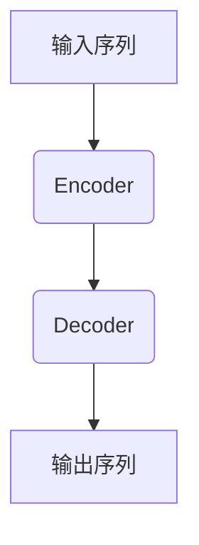

# 【大模型应用开发 动手做AI Agent】批判修正

## 1. 背景介绍

### 1.1 大模型时代的到来

近年来,人工智能领域取得了长足的进步,尤其是大型语言模型(Large Language Model,LLM)的出现,为人工智能系统带来了革命性的变化。大模型凭借其强大的语言理解和生成能力,在自然语言处理、问答系统、内容创作等领域展现出了巨大的潜力。

随着计算能力的不断提升和海量数据的积累,训练大规模的神经网络模型成为可能。这些大模型通过在海量文本数据上进行预训练,学习了丰富的语言知识和上下文信息,从而能够生成高质量、符合语境的自然语言输出。

### 1.2 AI Agent:大模型的实践应用

AI Agent是一种基于大模型的交互式智能助手,旨在为用户提供个性化的服务和支持。它能够理解用户的自然语言输入,根据上下文进行推理和决策,并生成相应的自然语言响应。

AI Agent的出现,使得人机交互变得更加自然、智能和高效。用户可以通过自然语言与AI Agent对话,获取所需的信息、完成特定任务或解决实际问题。无论是个人助理、客户服务、教育辅导还是内容创作,AI Agent都展现出了广阔的应用前景。

### 1.3 动手做AI Agent的意义

尽管大模型和AI Agent取得了令人瞩目的成就,但它们也面临着一些挑战和批评。例如,大模型的训练过程存在碳足迹过大、数据隐私等问题;AI Agent的输出可能存在偏差、不一致性或不确定性等缺陷。

通过动手实践开发AI Agent,我们可以更好地理解大模型的工作原理、局限性和潜在风险。同时,也能够探索如何优化和改进AI Agent的性能、可靠性和安全性,使其更加符合实际应用场景的需求。

因此,本文将深入探讨大模型应用开发中的关键技术和实践经验,为读者提供一个全面、系统的指导,助力他们成功地打造出高质量的AI Agent。

## 2. 核心概念与联系

### 2.1 大模型的架构

大模型通常采用基于Transformer的编码器-解码器架构,如下图所示:

其中,编码器(Encoder)负责将输入序列编码为隐藏状态表示,解码器(Decoder)则根据隐藏状态生成相应的输出序列。

大模型的核心在于通过自注意力(Self-Attention)机制,捕捉输入序列中元素之间的长程依赖关系,从而提高了模型的表现能力。

### 2.2 预训练与微调

为了获得强大的语言理解和生成能力,大模型需要在海量文本数据上进行预训练。常见的预训练目标包括:

- 掩码语言模型(Masked Language Modeling,MLM):预测被掩码的词
- 下一句预测(Next Sentence Prediction,NSP):判断两个句子是否相邻

通过预训练,大模型可以学习到丰富的语言知识和上下文信息。

在实际应用中,我们通常需要对预训练模型进行微调(Fine-tuning),使其专门适应特定的下游任务,如文本生成、问答系统等。微调过程中,模型的大部分参数保持不变,只对最后几层进行调整,从而实现了知识迁移和快速收敛。

### 2.3 Prompting

Prompting是指通过设计合适的提示(Prompt),引导大模型生成所需的输出。这种方法不需要对模型进行微调,可以直接利用预训练模型的能力,从而降低了开发成本。

常见的Prompting技术包括:

- 前缀Prompting:在输入序列前添加特定的提示词
- 示例Prompting:提供相关的示例输入-输出对,让模型学习生成类似的输出
- 指令Prompting:在输入中明确指定期望的任务,如"总结以下文本"

通过巧妙设计Prompt,我们可以指导大模型生成所需的输出,实现各种自然语言处理任务。

## 3. 核心算法原理具体操作步骤

### 3.1 Transformer架构

Transformer是大模型的核心架构,它完全基于注意力机制,不依赖循环神经网络(RNN)或卷积神经网络(CNN)。Transformer的主要组成部分包括:

1. **嵌入层(Embedding Layer)**: 将输入序列(如文本)转换为向量表示。
2. **位置编码(Positional Encoding)**: 为每个位置添加位置信息,使模型能够捕捉序列的顺序关系。
3. **多头注意力(Multi-Head Attention)**: 计算输入序列中元素之间的注意力权重,捕捉长程依赖关系。
4. **前馈神经网络(Feed-Forward Neural Network)**: 对注意力输出进行非线性变换,提取更高层次的特征表示。
5. **层归一化(Layer Normalization)**: 加速训练收敛并提高模型性能。
6. **残差连接(Residual Connection)**: 缓解梯度消失问题,促进信息流动。

Transformer的核心在于自注意力机制,它允许模型直接捕捉输入序列中任意两个位置之间的依赖关系,而无需依赖序列的顺序遍历。这种并行计算方式大大提高了模型的计算效率和表现能力。

### 3.2 自注意力机制

自注意力机制是Transformer的核心部分,它计算输入序列中每个元素与其他元素之间的注意力权重,从而捕捉长程依赖关系。具体步骤如下:

1. **查询(Query)、键(Key)、值(Value)投影**:
   将输入序列 $X$ 分别投影到查询 $Q$、键 $K$ 和值 $V$ 空间:
   $$Q = XW^Q, K = XW^K, V = XW^V$$
   其中 $W^Q$、$W^K$、$W^V$ 为可学习的权重矩阵。

2. **计算注意力分数**:
   计算查询 $Q$ 与键 $K$ 之间的点积,获得注意力分数矩阵 $A$:
   $$A = \text{softmax}(\frac{QK^T}{\sqrt{d_k}})$$
   其中 $d_k$ 为缩放因子,用于防止点积过大导致梯度消失。

3. **加权求和**:
   使用注意力分数矩阵 $A$ 对值 $V$ 进行加权求和,得到注意力输出 $Z$:
   $$Z = AV$$

通过自注意力机制,Transformer能够直接建模输入序列中任意两个位置之间的依赖关系,从而提高了模型的表现能力。

### 3.3 多头注意力

为了进一步提高模型的表现力,Transformer采用了多头注意力(Multi-Head Attention)机制。多头注意力将注意力机制分成多个独立的"头"(Head),每个头都学习不同的注意力模式,最后将所有头的输出进行拼接和线性变换,得到最终的注意力输出。

具体步骤如下:

1. **并行计算多个注意力头**:
   对于每个注意力头 $i$,计算对应的注意力输出 $Z_i$:
   $$Z_i = \text{Attention}(QW_i^Q, KW_i^K, VW_i^V)$$
   其中 $W_i^Q$、$W_i^K$、$W_i^V$ 为该头对应的可学习权重矩阵。

2. **拼接注意力头**:
   将所有注意力头的输出沿着特征维度进行拼接:
   $$Z = \text{Concat}(Z_1, Z_2, \dots, Z_h)$$
   其中 $h$ 为注意力头的数量。

3. **线性变换**:
   对拼接后的注意力输出进行线性变换,得到最终的多头注意力输出 $O$:
   $$O = ZW^O$$
   其中 $W^O$ 为可学习的权重矩阵。

通过多头注意力机制,Transformer能够同时关注输入序列中不同的位置和子空间,从而提高了模型的表现力和泛化能力。

## 4. 数学模型和公式详细讲解举例说明

### 4.1 自注意力计算示例

为了更好地理解自注意力机制的计算过程,我们以一个简单的例子进行说明。假设输入序列为 $X = [x_1, x_2, x_3]$,其中 $x_i$ 为词嵌入向量。

1. **查询、键、值投影**:
   假设查询、键、值的投影维度为 $d_q = d_k = d_v = 3$,则投影矩阵的形状为 $(3 \times 3)$。投影后的查询 $Q$、键 $K$ 和值 $V$ 为:

   $$Q = \begin{bmatrix}
   q_{11} & q_{12} & q_{13} \\
   q_{21} & q_{22} & q_{23} \\
   q_{31} & q_{32} & q_{33}
   \end{bmatrix}, K = \begin{bmatrix}
   k_{11} & k_{12} & k_{13} \\
   k_{21} & k_{22} & k_{23} \\
   k_{31} & k_{32} & k_{33}
   \end{bmatrix}, V = \begin{bmatrix}
   v_{11} & v_{12} & v_{13} \\
   v_{21} & v_{22} & v_{23} \\
   v_{31} & v_{32} & v_{33}
   \end{bmatrix}$$

2. **计算注意力分数**:
   计算查询 $Q$ 与键 $K$ 的点积,并进行缩放和softmax操作,得到注意力分数矩阵 $A$:

   $$A = \text{softmax}\left(\frac{1}{\sqrt{3}}\begin{bmatrix}
   q_{11}k_{11} + q_{12}k_{21} + q_{13}k_{31} & q_{11}k_{12} + q_{12}k_{22} + q_{13}k_{32} & q_{11}k_{13} + q_{12}k_{23} + q_{13}k_{33} \\
   q_{21}k_{11} + q_{22}k_{21} + q_{23}k_{31} & q_{21}k_{12} + q_{22}k_{22} + q_{23}k_{32} & q_{21}k_{13} + q_{22}k_{23} + q_{23}k_{33} \\
   q_{31}k_{11} + q_{32}k_{21} + q_{33}k_{31} & q_{31}k_{12} + q_{32}k_{22} + q_{33}k_{32} & q_{31}k_{13} + q_{32}k_{23} + q_{33}k_{33}
   \end{bmatrix}\right)$$

3. **加权求和**:
   使用注意力分数矩阵 $A$ 对值 $V$ 进行加权求和,得到注意力输出 $Z$:

   $$Z = \begin{bmatrix}
   a_{11}v_{11} + a_{12}v_{21} + a_{13}v_{31} & a_{11}v_{12} + a_{12}v_{22} + a_{13}v_{32} & a_{11}v_{13} + a_{12}v_{23} + a_{13}v_{33} \\
   a_{21}v_{11} + a_{22}v_{21} + a_{23}v_{31} & a_{21}v_{12} + a_{22}v_{22} + a_{23}v_{32} & a_{21}v_{13} + a_{22}v_{23} + a_{23}v_{33} \\
   a_{31}v_{11} + a_{32}v_{21} + a_{33}v_{31} & a_{31}v_{12} + a_{32}v_{22} + a_{33}v_{32} & a_{31}v_{13} + a_{32}v_{23} + a_{33}v_{33}
   \end{bmatrix}$$

   其中 $a_{ij}$ 为注意力分数矩阵 $A$ 中的元素。

通过上述示例,我们可以清晰地看到自注意力机制是如何捕捉输入序列中元素之间的依赖关系,并生成新的特征表示的。

### 4.2 掩码语言模型

掩码语言模型(Masked Language Modeling, MLM)是大模型预训练的一种常见目标,它要求模型预测被掩码的词。具体来说,给定一个输入序列 $X = [x_1, x_2, \dots, x_n]$,我们随机将其中的一些词替换为特殊的掩码符号 [MASK],得到掩码序列 $X' = [x_1, x_2, \text{[MASK]}, x_4