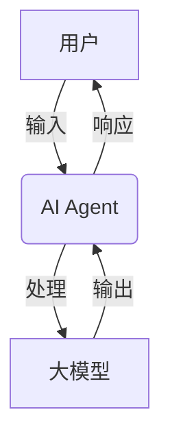
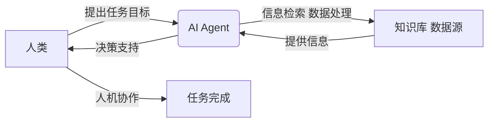
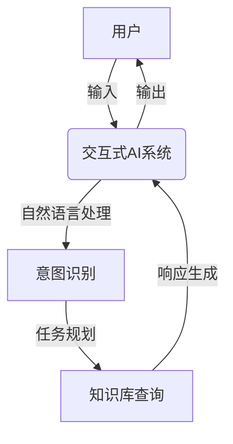
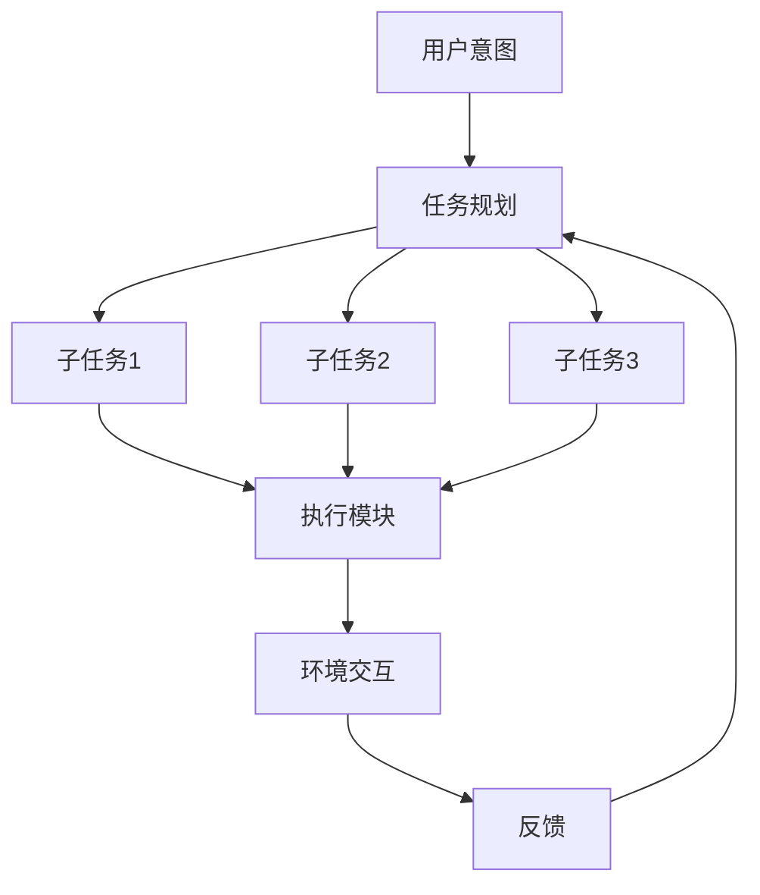

# 【大模型应用开发 动手做AI Agent】显示响应

## 1.背景介绍

### 1.1 人工智能的崛起

人工智能(Artificial Intelligence, AI)作为一门跨学科的技术,已经渗透到我们生活的方方面面。从语音助手到自动驾驶汽车,从推荐系统到医疗诊断,AI无处不在。近年来,AI取得了长足的进步,很大程度上归功于大规模预训练语言模型的兴起。

### 1.2 大规模预训练语言模型

大规模预训练语言模型(Large Pre-trained Language Models, LLMs)是一种利用海量无标记文本数据进行自监督预训练的神经网络模型。这些模型能够捕捉到语言的深层次语义和上下文信息,为下游任务提供强大的语言理解和生成能力。

代表性的大规模预训练语言模型包括:

- GPT(Generative Pre-trained Transformer)系列模型
- BERT(Bidirectional Encoder Representations from Transformers)
- XLNet
- RoBERTa
- ...

### 1.3 大模型应用的挑战

尽管大规模预训练语言模型展现出了令人惊叹的能力,但将它们应用于实际场景仍然面临诸多挑战:

- 模型参数巨大,推理效率低下
- 缺乏可解释性和可控性
- 存在偏见和不当输出的风险
- 知识库的有限性和陈旧性
- ...

## 2.核心概念与联系

### 2.1 AI Agent

为了解决上述挑战,研究人员提出了AI Agent的概念。AI Agent是一种具有感知、决策和行动能力的智能系统,能够与环境进行交互并完成特定任务。在大模型应用开发中,AI Agent可以充当用户与大规模语言模型之间的中介,实现对话式交互、任务执行和决策支持等功能。

### 2.2 Agent-Human协作

Agent-Human协作(Agent-Human Collaboration, AHC)是一种新兴的人机协作范式。在这种范式下,人类和AI Agent通过自然语言交互,共同完成复杂的任务。人类提供领域知识和创造力,而AI Agent则负责信息检索、数据处理和决策支持等工作。

### 2.3 交互式AI系统

交互式AI系统(Interactive AI System)是一种融合了人工智能和人机交互的新型系统。它能够通过自然语言与用户进行双向交互,理解用户的意图,并提供相应的响应或服务。交互式AI系统可以应用于各种场景,如客户服务、教育辅助、个人助理等。

## 3.核心算法原理具体操作步骤

构建一个交互式AI Agent系统涉及多个核心算法和模块,包括自然语言处理(NLP)、对话管理、任务规划和执行等。下面我们将详细介绍这些核心算法的原理和操作步骤。

### 3.1 自然语言处理

自然语言处理(Natural Language Processing, NLP)是使AI Agent能够理解和生成自然语言的关键技术。它包括以下几个主要步骤:

1. **分词(Tokenization)**: 将输入的文本序列分割成一个个单词或词元(token)。
2. **词嵌入(Word Embedding)**: 将每个词元映射到一个连续的向量空间中,使语义相似的词元在向量空间中靠近。
3. **编码(Encoding)**: 将分词后的序列输入到神经网络模型(如Transformer)中进行编码,获得上下文化的表示。
4. **解码(Decoding)**: 根据编码的表示,生成目标序列(如回复、摘要等)。

以GPT模型为例,编码和解码的过程可以用下面的公式表示:

$$h_t = \text{Transformer}(x_1, x_2, \dots, x_t)$$
$$P(x_{t+1} | x_1, \dots, x_t) = \text{Softmax}(W h_t)$$

其中,$h_t$是时间步$t$的隐状态向量,通过Self-Attention机制捕获上下文信息;$P(x_{t+1} | x_1, \dots, x_t)$是生成下一个词$x_{t+1}$的条件概率分布。

### 3.2 对话管理

对话管理(Dialogue Management)模块负责控制对话的流程,确定系统的响应策略。一个典型的对话管理流程包括:

1. **语义解析(Semantic Parsing)**: 将用户输入映射到一个结构化的语义表示,如意图(Intent)和实体(Entity)。
2. **对话状态跟踪(Dialogue State Tracking)**: 根据历史对话信息和当前语义表示,更新对话状态。
3. **对话策略(Dialogue Policy)**: 根据对话状态,决定系统的下一步行为,如提供响应、请求澄清或执行任务等。
4. **自然语言生成(Natural Language Generation)**: 将对话策略转化为自然语言响应。

对话管理可以基于规则或机器学习模型实现。以基于强化学习的对话策略为例,我们可以将其形式化为一个马尔可夫决策过程(Markov Decision Process, MDP):

$$s_{t+1} = f(s_t, a_t, u_t)$$
$$r_t = R(s_t, a_t, u_t)$$
$$\pi^*(s) = \arg\max_\pi \mathbb{E}\left[\sum_{t=0}^\infty \gamma^t r_t | s_0 = s, \pi\right]$$

其中,$s_t$是对话状态,$a_t$是系统行为,$u_t$是用户输入,$r_t$是即时奖励,$\pi^*$是最优策略,目标是最大化累积奖励。

### 3.3 任务规划与执行

对于涉及复杂任务的AI Agent,需要进行任务规划和执行。任务规划模块根据用户的意图,decompose任务成一系列子任务,并安排执行顺序;执行模块则负责具体执行每个子任务,可能涉及信息检索、数据处理、调用外部API等操作。

任务规划可以看作一个Classical Planning问题,使用启发式搜索算法(如A*算法)求解。设$s_0$为初始状态,$g$为目标状态,$A$为可执行动作集合,规划的目标是找到一个动作序列$\pi = \langle a_1, a_2, \dots, a_n\rangle$,使得:

$$s_n = \gamma(s_{n-1}, a_n)$$
$$s_n \models g$$

其中,$\gamma$是状态转移函数。在执行过程中,Agent需要持续监测环境状态,并根据反馈调整规划。

## 4.数学模型和公式详细讲解举例说明

在构建交互式AI Agent系统时,我们需要利用各种数学模型和算法,包括神经网络模型、概率图模型、优化算法等。下面我们将详细介绍一些核心模型和公式。

### 4.1 Transformer模型

Transformer是一种基于Self-Attention机制的序列到序列(Sequence-to-Sequence)模型,广泛应用于自然语言处理任务。它的核心思想是通过Attention机制直接捕获序列中任意两个位置之间的依赖关系,避免了RNN模型的长距离依赖问题。

Transformer的Encoder部分由多个相同的层组成,每一层包含两个子层:Multi-Head Attention层和前馈神经网络层。Attention机制的计算公式如下:

$$\text{Attention}(Q, K, V) = \text{softmax}\left(\frac{QK^\top}{\sqrt{d_k}}\right)V$$

其中,$Q$为查询(Query)向量,$K$为键(Key)向量,$V$为值(Value)向量,$d_k$为缩放因子。Multi-Head Attention通过并行计算多个Attention头,再将结果拼接,从而捕获不同的依赖关系:

$$\text{MultiHead}(Q, K, V) = \text{Concat}(head_1, \dots, head_h)W^O$$
$$\text{where } head_i = \text{Attention}(QW_i^Q, KW_i^K, VW_i^V)$$

Transformer的Decoder部分在Encoder的基础上增加了Masked Self-Attention层,用于防止注意力捕获未来的位置信息。

### 4.2 生成对抗网络

生成对抗网络(Generative Adversarial Networks, GANs)是一种用于生成式建模的框架,由生成器(Generator)和判别器(Discriminator)两个对抗模型组成。生成器的目标是生成逼真的样本以欺骗判别器,而判别器则努力区分真实样本和生成样本。两个模型通过对抗训练达到平衡,使生成器能够捕获真实数据分布。

在GANs中,生成器$G$和判别器$D$的目标函数可以表示为:

$$\min_G \max_D V(D, G) = \mathbb{E}_{x\sim p_\text{data}(x)}\left[\log D(x)\right] + \mathbb{E}_{z\sim p_z(z)}\left[\log(1 - D(G(z)))\right]$$

其中,$p_\text{data}$是真实数据分布,$p_z$是噪声先验分布。训练过程是一个迭代的对抗过程,生成器和判别器相互优化,最终达到Nash均衡:

$$G^* = \arg\min_G \max_D V(D, G)$$
$$D^* = \arg\max_D V(D, G^*)$$

GANs在文本生成、图像生成等领域有广泛应用。

### 4.3 强化学习

强化学习(Reinforcement Learning)是一种基于环境交互的机器学习范式,常用于对话管理、决策控制等任务。在强化学习中,智能体(Agent)通过与环境交互,获得奖励信号,并根据经验调整策略,最终学习到最优策略。

强化学习问题可以形式化为一个马尔可夫决策过程(Markov Decision Process, MDP),定义为一个元组$(S, A, P, R, \gamma)$,其中:

- $S$是状态空间
- $A$是动作空间
- $P(s' | s, a)$是状态转移概率
- $R(s, a)$是即时奖励函数
- $\gamma \in [0, 1)$是折扣因子

目标是找到一个最优策略$\pi^*$,使累积折扣奖励最大化:

$$\pi^* = \arg\max_\pi \mathbb{E}_\pi\left[\sum_{t=0}^\infty \gamma^t R(s_t, a_t) | s_0 = s\right]$$

常用的强化学习算法包括Q-Learning、Policy Gradient、Actor-Critic等。以Q-Learning为例,我们定义Q函数$Q(s, a)$为在状态$s$执行动作$a$后的期望累积奖励,则最优Q函数满足Bellman方程:

$$Q^*(s, a) = \mathbb{E}_{s'\sim P(\cdot|s, a)}\left[R(s, a) + \gamma \max_{a'} Q^*(s', a')\right]$$

通过不断更新Q函数,最终可以收敛到最优策略$\pi^*(s) = \arg\max_a Q^*(s, a)$。

## 5.项目实践:代码实例和详细解释说明

为了更好地理解交互式AI Agent系统的工作原理,我们将通过一个实际项目案例进行讲解。该项目旨在开发一个基于GPT模型的对话式任务助手,能够根据用户的自然语言指令执行各种任务,如信息查询、数据分析、文本生成等。

### 5.1 系统架构

该系统采用模块化设计,主要包括以下几个模块:

1. **NLP模块**: 基于GPT模型,负