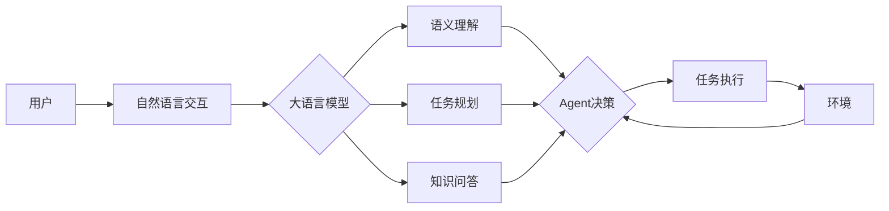

# 【大模型应用开发 动手做AI Agent】计划与执行

## 1. 背景介绍

### 1.1 大语言模型的兴起
近年来,随着深度学习技术的飞速发展,大语言模型(Large Language Model, LLM)在自然语言处理领域取得了突破性进展。从GPT、BERT到GPT-3,语言模型的参数规模不断增大,性能也持续提升。这些大模型展现出了令人惊叹的语言理解和生成能力,为构建智能对话系统、知识问答、文本生成等应用开辟了新的可能性。

### 1.2 AI Agent的概念
AI Agent是一种基于人工智能技术,能够自主执行任务、与环境交互的智能体。它们可以感知环境状态,根据设定的目标做出决策和行动,并不断从反馈中学习优化策略。AI Agent在智能客服、智能助手、自动化运维等领域有广泛应用前景。

### 1.3 大模型赋能AI Agent
传统的AI Agent通常基于规则系统或者有限的机器学习模型,难以应对复杂多变的现实场景。而大语言模型为构建更加智能、鲁棒的AI Agent提供了新思路。利用大模型强大的语言理解和生成能力,我们可以打造出更加自然、灵活的人机交互方式,让AI Agent具备更广泛的知识和更强的任务执行能力。将大模型与Agent结合,有望实现更加智能化的应用系统。

## 2. 核心概念与联系

### 2.1 大语言模型(LLM)
大语言模型是一类基于海量文本数据训练的深度神经网络模型。它们通过自监督学习方式,从大规模无标注语料中习得丰富的语言知识和常识。主流的大模型如GPT系列采用Transformer结构,利用注意力机制建模长距离语义依赖。大模型可以生成连贯、通顺的长文本,在语言理解任务上也表现出色。

### 2.2 AI Agent
AI Agent是一种具有自主性、交互性、持续性的人工智能系统。它能够感知外部环境,根据目标进行推理决策,并采取相应行动。Agent通过与环境的持续交互,不断积累知识,优化行为策略。常见的Agent有反馈式、目标导向、工具型等类型。构建AI Agent需要融合感知、规划、学习等多种AI技术。

### 2.3 大模型与Agent的结合
将大语言模型应用于AI Agent开发,可以从多个方面增强Agent的能力:

1. 丰富的语言交互:大模型能够理解自然语言指令,并以接近人类的方式进行对话,使人机交互更加自然流畅。 
2. 广泛的知识储备:经过海量语料训练的大模型蕴含了丰富的世界知识,可以为Agent提供更全面的信息支持。
3. 灵活的任务执行:大模型具备较强的语言生成能力,可以帮助Agent动态生成执行计划,灵活应对不同需求。
4. 快速的领域适应:利用少样本学习等技术,大模型可以快速适应新的应用领域,降低定制开发成本。

综合大模型的语言能力和Agent的自主性,有望实现更加智能、高效、全能的AI应用系统。下图展示了大模型驱动的AI Agent的典型架构:



## 3. 核心算法原理与操作步骤

### 3.1 大语言模型训练
大模型的训练过程通常包括以下步骤:

1. 语料准备:收集大规模高质量的文本数据,进行清洗、去重、格式化等预处理。
2. 分词编码:将文本切分为基本单元(如单词、字符、Byte Pair),并映射为数值向量。
3. 模型构建:搭建基于Transformer的神经网络结构,设置模型参数和超参数。
4. 预训练:使用自监督学习方法如MLM、CLM等,在大规模无标注语料上训练模型,让其学习通用语言知识。
5. 微调:在下游任务的标注数据上Fine-tune预训练模型,使其适应特定应用需求。
6. 推理应用:利用训练好的模型进行文本生成、文本分类等推理预测任务。

其中Transformer结构和自监督学习是大模型的核心。Transformer利用自注意力机制建模任意长度的序列依赖,并行计算效率高。自监督学习让模型从海量无标注语料中自主学习语言规律,减少了人工标注的成本。

### 3.2 基于大模型的Agent开发

利用大模型开发AI Agent,一般采用Prompt工程的范式。即通过设计适当的输入提示,引导大模型生成所需的信息或行为。主要步骤如下:

1. 任务分解:将复杂任务划分为多个子任务,明确每个子任务的输入输出。
2. Prompt设计:针对每个子任务,设计恰当的输入提示,包括指令、背景知识、任务约束等。提示需涵盖必要信息,同时避免过于限制模型的发挥空间。
3. 模型推理:将Prompt输入大模型,生成对应的结果。可通过采样、Beam Search等方法控制生成过程。
4. 结果解析:对模型生成的文本进行结构化解析,提取关键信息,转化为可执行的动作指令。
5. 动作执行:Agent根据解析出的指令,调用相应的API或工具,实际执行任务,并记录结果反馈。
6. 迭代优化:根据执行效果,收集有益的例子数据,持续Fine-tune模型,提升性能。不断迭代Prompt设计,优化任务流程。

以上是将大模型应用于AI Agent开发的基本流程。其中Prompt的设计是关键,需要在完备性和开放性之间平衡,既要提供足够的指导信息,又要给模型一定的创造空间。实践中还需要在Few-shot Learning、数据增强、知识图谱等方面进行探索,进一步提升大模型在Agent任务中的表现。

## 4. 数学模型与公式详解

### 4.1 Transformer结构

Transformer是大语言模型的主流架构,其核心是自注意力机制(Self-Attention)和前馈神经网络(Feed-Forward Network)。对于输入序列$X=(x_1,x_2,...,x_n)$,Transformer的计算过程可表示为:

$$
\begin{aligned}
Q,K,V &= XW^Q,XW^K,XW^V \\
A &= \text{softmax}(\frac{QK^T}{\sqrt{d_k}})V \\
H &= \text{LayerNorm}(A + X) \\
O &= \text{LayerNorm}(\text{FFN}(H) + H)
\end{aligned}
$$

其中$Q,K,V$分别为查询、键、值向量,$W^Q,W^K,W^V$为可学习的权重矩阵。$A$为注意力矩阵,通过查询键值向量的相似度计算得到,并归一化后与值向量加权求和。$H$为注意力子层的输出,在残差连接后进行层归一化。$\text{FFN}$为前馈网络,由两层全连接和非线性激活函数组成。$O$为前馈子层输出,也经过残差和归一化操作。

多个Transformer Block堆叠而成Encoder或Decoder。Encoder侧重于对输入的理解编码,Decoder侧重于根据编码信息生成目标序列。大模型通常采用Decoder-only或Encoder-Decoder结构。

### 4.2 自监督预训练目标

自监督学习让模型从无标注语料中自主学习语言知识。主要采用两类目标:

1. 掩码语言模型(MLM):随机Mask掉输入序列的部分Token,让模型根据上下文预测被Mask的Token。损失函数为:

$$
\mathcal{L}_{MLM} = -\sum_{i \in \mathcal{M}} \log P(x_i|X_{\setminus \mathcal{M}})
$$

其中$\mathcal{M}$为被Mask的Token位置集合,$X_{\setminus \mathcal{M}}$为去掉Mask位置后的输入序列。优化目标是最大化被Mask Token的条件概率。

2. 因果语言模型(CLM):让模型根据前缀Token预测下一个Token。损失函数为:

$$
\mathcal{L}_{CLM} = -\sum_{i=1}^n \log P(x_i|x_{<i})
$$

即最大化每个位置Token的条件概率。这相当于训练模型进行开放式文本生成。

通过MLM和CLM这类自监督任务,模型可以学习到丰富的语言知识,建立对文本的深层语义表征。在此基础上微调,可以高效地适应下游任务。

## 5. 项目实践:代码实例与详解

下面以使用GPT-3模型开发一个智能写作助手为例,演示如何将大模型应用于AI Agent的开发。

### 5.1 环境准备

首先安装必要的Python库,包括transformers、openai等:

```bash
pip install transformers openai
```

然后设置OpenAI API Key:

```bash
export OPENAI_API_KEY=your_api_key
```

### 5.2 模型加载

使用transformers库加载GPT-3模型和分词器:

```python
from transformers import GPT2LMHeadModel, GPT2Tokenizer

model_name = "gpt2-xl"
tokenizer = GPT2Tokenizer.from_pretrained(model_name)
model = GPT2LMHeadModel.from_pretrained(model_name)
```

这里加载了GPT-2的最大版本模型,也可以选择其他预训练模型如GPT-Neo、GPT-J等。

### 5.3 Prompt设计

针对写作助手任务,设计适当的Prompt,引导模型生成所需的文本。例如:

```python
prompt = f"""
请根据以下主题和要点,生成一篇文章:

主题:{topic}

要点:
{outline}

文章:
"""
```

其中`{topic}`为文章主题,`{outline}`为文章要点,由用户输入提供。Prompt中的指令明确告知模型任务目标,同时给出了必要的背景信息。

### 5.4 文本生成

将Prompt传入模型,进行文本生成:

```python
input_ids = tokenizer.encode(prompt, return_tensors="pt")

output = model.generate(
    input_ids, 
    max_length=1024, 
    num_beams=5,
    no_repeat_ngram_size=2,
    early_stopping=True
)

response = tokenizer.decode(output[0], skip_special_tokens=True)
```

这里使用`generate`函数控制生成过程,设置了最大长度、Beam Search宽度、N-gram重复惩罚等参数,以提高生成文本的质量和多样性。

### 5.5 结果解析与反馈

对模型生成的结果进行解析,提取关键信息,并根据需要进行后处理:

```python
article = response.split("文章:")[1].strip()

print(f"生成的文章如下:\n{article}")

feedback = input("请对生成的文章质量进行评分(1-5分):")
score = int(feedback)

if score >= 4:
    with open("good_examples.txt", "a") as f:
        f.write(f"Prompt:{prompt}\nArticle:{article}\nScore:{score}\n\n")
else:
    with open("bad_examples.txt", "a") as f:  
        f.write(f"Prompt:{prompt}\nArticle:{article}\nScore:{score}\n\n")
```

这里从模型输出中提取出生成的文章正文,打印呈现给用户。同时要求用户对文章质量进行评分,并将样例数据记录下来,用于后续的模型优化迭代。

以上就是利用GPT-3模型开发一个简单写作助手Agent的基本流程。通过设计恰当的Prompt,可以引导模型生成特定主题和要点的文章。在实际应用中,还可以进一步优化Prompt、引入知识库、设计交互流程等,提升Agent的性能和用户体验。

## 6. 实际应用场景

基于大语言模型的AI Agent有广泛的应用前景,下面列举几个具体场景:

### 6.1 智能客服

传统客服系统通常基于规则或检索,难以处理复杂的客户诉求。引入大模型后,可以建立一个智能客服Agent,利用其语言理解和生成能力,与客户进行自然流畅的多轮对话,解答各