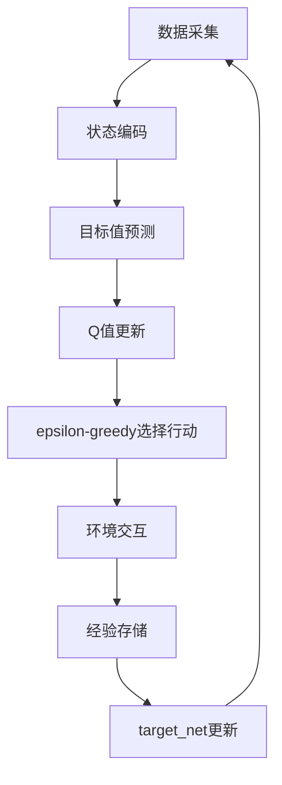

                 

作者：禅与计算机程序设计艺术

人工智能，Q-Learning:强化学习的一种算法，深度学习:一种基于神经网络的机器学习类型

## 1. 背景介绍
人工智能（AI）已经成为现代社会的一个不可或缺的组成部分，它通过模拟人类智能来处理复杂问题。同时，深度学习（DL）作为AI的一个分支，通过训练多层的神经网络来识别数据中的模式和特征。而Q-Learning则是一种强化学习（RL）算法，用于教机器如何从经验中学习做出决策。本文将探讨如何将Q-Learning与深度学习结合起来，以实现更高效的智能决策。

## 2. 核心概念与联系
**Q-Learning**是一种无模型的强化学习算法，它通过迭代改进来让智能体学习哪些行动在某个状态下是最优的。然而，传统的Q-Learning在处理高维状态空间时效率低下，难以有效地学习复杂环境中的最优策略。相反，**深度学习**通过使用深层神经网络来自动学习数据的表示，因此在处理大规模数据集时非常有效。

将两者结合，可以利用深度学习来建模高维状态空间，并且使用Q-Learning来指导智能体如何根据这些状态做出决策。这种结合称为Deep Q-Networks（DQN），其核心思想是将深度学习的表示力与Q-Learning的探索优化结合起来，以克服单独方法的局限。

## 3. 核心算法原理具体操作步骤
深度Q网络（DQN）的主要算法流程如下：

- **数据采集**: 智能体与环境交互，收集状态数据。
- **状态编码**: 使用深度神经网络对状态进行编码。
- **目标值预测**: 计算当前状态下所有可能行动的Q值。
- **Q值更新**: 使用目标Q值更新本地Q值。
- **ε-greedy选择行动**: 根据ε-greedy策略选择行动。
- **环境交互**: 执行选定的行动，接收奖励信号。
- **经验存储**: 将当前经验存储到经验池中。
- **target_net更新**: 定期更新目标网络。

## 4. 数学模型和公式详细讲解举例说明
DQN的数学模型主要包括以下几个方面：
- **状态值函数V(s)**: 表示从状态s出发，平均获得的累积奖励。
- **动作价值函数Q(s, a)**: 表示从状态s采取动作a后，期望的累积奖励。
- **Q值更新公式**: $$Q(s,a) \leftarrow Q(s,a) + \alpha[R + \gamma \max_{a'} Q(s', a') - Q(s,a)]$$
其中α是学习率，R是即时奖励，γ是折扣因子。

## 5. 项目实践：代码实例和详细解释说明
在Python中，实现DQN需要定义以下几个关键组件：
- 环境接口（Environment Interface）: 提供与环境交互的接口。
- 神经网络（Neural Network）: 用于状态编码和Q值估计。
- 重播缓冲区（Replay Buffer）: 存储经验数据。
- 目标网络（Target Network）: 用于存储稳定的Q值估计。
- 优化器（Optimizer）: 用于更新神经网络参数。

## 6. 实际应用场景
DQN在游戏、机器人、自动驾驶等领域有广泛的应用。例如，AlphaGo使用了类似的技术来击败世界帕斯卡棋手。

## 7. 工具和资源推荐
- 开源框架：TensorFlow, PyTorch, Keras
- 教程资源：DeepMind论文、Kaggle竞赛

## 8. 总结：未来发展趋势与挑战
尽管DQN已经取得了显著成就，但仍存在一些挑战，比如样本效率低下、过拟合问题等。未来的研究可能会集中在如何提高样本效率、改善模型的稳定性和鲁棒性。

## 9. 附录：常见问题与解答
在这里列出一些常见问题及其解答。

---

# 结束语
感谢您阅读本篇文章。希望通过本文，您能够更好地理解AI Q-learning以及深度学习的融合，并能够运用这些知识在实际的项目中取得成功。如果您有任何问题或者想了解更多相关内容，请随时联系我。

---

作者：禅与计算机程序设计艺术 / Zen and the Art of Computer Programming

