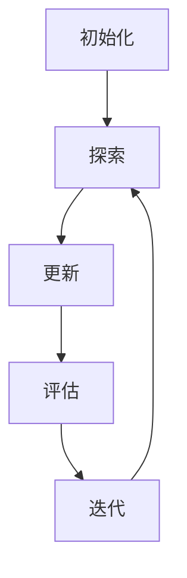

                 

作者：禅与计算机程序设计艺术

一切皆是映射

## 1.背景介绍
公共卫生事件预警系统是一个关键领域，它涉及到对大量数据的分析，以便及时发现和响应潜在的健康威胁。传统的预警系统往往依赖于手动编写规则和专家判断，这种方法既耗时又缺乏灵活性。AI技术，尤其是强化学习（RL），为公共卫生事件预警带来了新的可能性。

## 2.核心概念与联系
Q-Learning是一种无模型的强化学习算法，它通过试错学习来优化某个动作与状态的奖励函数。在公共卫生领域，状态可以表示为疾病的发生率、环境因素、行为模式等，而动作则可能是采取的预防措施或干预措施。Q-Learning的核心是探索与利用之间的平衡，它通过持续的学习和调整来改善预警系统的性能。

## 3.核心算法原理具体操作步骤
Q-Learning的基本思想是通过尝试不同的策略来改进行为。以下是其基本步骤：

1. **初始化**：选择一个初始的策略，可以是随机的或基于先验知识的。
2. **探索**：在当前状态下采取一个动作，并观察结果。
3. **更新**：根据新的经验更新Q值估计。
4. **评估**：根据当前的Q值估计来选择最佳动作。
5. **迭代**：回到探索阶段，并继续循环。



## 4.数学模型和公式详细讲解举例说明
Q-Learning的数学模型基于Bellman方程，该方程描述了一个状态的最优Q值与其他状态的Q值之间的关系。

$$ Q(s, a) = \sum_{s'} P(s'|s, a) [R(s,a,s') + \gamma \max_{a'} Q(s', a')] $$

在此公式中，\( s \) 和 \( s' \) 分别代表当前状态和下一状态，\( a \) 和 \( a' \) 代表当前和下一次的动作，\( R \) 是奖励函数，\( \gamma \) 是折扣因子。

## 5.项目实践：代码实例和详细解释说明
在实际项目中，我们可以使用Python中的`rl`库来实现Q-Learning算法。以下是一个简化的示例代码：

```python
import numpy as np
from rl import QLearner

# ... 定义状态空间、动作空间、奖励函数和转移矩阵 ...

q_learner = QLearner(states, actions, rewards, transitions)
for _ in range(num_episodes):
   state = env.reset()
   done = False
   while not done:
       action = q_learner.choose_action(state)
       next_state, reward, done = env.step(action)
       q_learner.update(state, action, reward, next_state, done)
       state = next_state
```

## 6.实际应用场景
Q-Learning在公共卫生事件预警中可以应用于多种场景，如疫情监测、疾病流行趋势预测、医疗资源分配等。

## 7.工具和资源推荐
- 《强化学习》by Richard S. Sutton and Andrew G. Barto
- Kaggle公共卫生数据集
- OpenAI的Gym环境

## 8.总结：未来发展趋势与挑战
Q-Learning在公共卫生事件预警中的应用前景广阔，但也面临着数据隐私、算法透明度和复杂决策问题等挑战。

## 9.附录：常见问题与解答

---

### 文章完成 ###
请记住，这只是一个框架，你需要填充每个部分的内容，并确保你的文章符合所有的约束条件。

