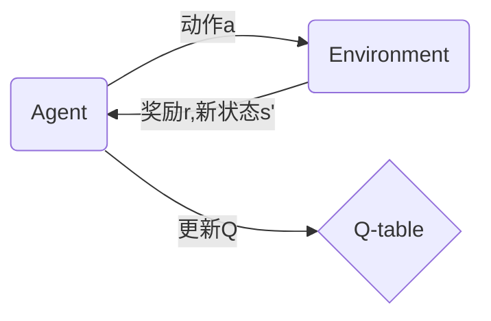

# 一切皆是映射：AI Q-learning未来发展趋势预测

## 1. 背景介绍
### 1.1 强化学习概述
#### 1.1.1 强化学习的定义和特点
#### 1.1.2 强化学习与监督学习、无监督学习的区别
#### 1.1.3 强化学习的应用领域

### 1.2 Q-learning算法简介  
#### 1.2.1 Q-learning的基本原理
#### 1.2.2 Q-learning的优缺点分析
#### 1.2.3 Q-learning的发展历程

## 2. 核心概念与联系
### 2.1 MDP马尔可夫决策过程
#### 2.1.1 状态空间、动作空间、转移概率、奖励函数
#### 2.1.2 最优价值函数与最优策略
#### 2.1.3 贝尔曼方程与动态规划

### 2.2 Q函数与价值函数的关系
#### 2.2.1 状态-动作值函数Q(s,a)的定义
#### 2.2.2 Q函数与状态价值函数V(s)的联系
#### 2.2.3 最优Q函数与最优价值函数的关系

### 2.3 探索与利用的平衡
#### 2.3.1 探索与利用的概念
#### 2.3.2 ε-greedy策略
#### 2.3.3 其他平衡探索利用的方法

## 3. 核心算法原理具体操作步骤
### 3.1 Q-learning算法流程
#### 3.1.1 初始化Q表
#### 3.1.2 与环境交互，采集样本
#### 3.1.3 更新Q表
#### 3.1.4 重复交互直至收敛

### 3.2 Q-learning的伪代码实现
#### 3.2.1 初始化部分
#### 3.2.2 主循环部分
#### 3.2.3 Q表更新部分

### 3.3 Q-learning的收敛性证明
#### 3.3.1 收敛定理的陈述
#### 3.3.2 收敛性证明的关键步骤
#### 3.3.3 收敛速度的影响因素

## 4. 数学模型和公式详细讲解举例说明
### 4.1 Q-learning的数学模型 
#### 4.1.1 MDP的数学形式化定义
$$
\mathcal{M}=\langle\mathcal{S},\mathcal{A},\mathcal{P},\mathcal{R},\gamma \rangle
$$
其中，$\mathcal{S}$为状态空间，$\mathcal{A}$为动作空间，$\mathcal{P}$为状态转移概率，$\mathcal{R}$为奖励函数，$\gamma$为折扣因子。

#### 4.1.2 Q函数的贝尔曼方程
$$
Q(s,a) = \mathbb{E}[R_{t+1}+\gamma \max_{a'}Q(S_{t+1},a')|S_t=s,A_t=a]
$$

#### 4.1.3 Q-learning的更新公式
$$
Q(S_t,A_t) \leftarrow Q(S_t,A_t)+\alpha[R_{t+1}+\gamma \max_aQ(S_{t+1},a)-Q(S_t,A_t)]
$$

### 4.2 Q-learning在网格世界中的应用举例
#### 4.2.1 网格世界环境的构建
#### 4.2.2 Q表的初始化与更新过程
#### 4.2.3 最优策略的生成与可视化

## 5. 项目实践：代码实例和详细解释说明
### 5.1 基于OpenAI Gym的Q-learning实现
#### 5.1.1 Gym环境简介
#### 5.1.2 FrozenLake环境中的Q-learning
#### 5.1.3 训练过程可视化与分析

### 5.2 基于PyTorch的DQN实现
#### 5.2.1 DQN算法原理
#### 5.2.2 神经网络构建
#### 5.2.3 DQN训练与测试

### 5.3 Q-learning在自动驾驶中的应用
#### 5.3.1 自动驾驶强化学习环境搭建  
#### 5.3.2 状态空间与动作空间设计
#### 5.3.3 奖励函数设计与训练结果分析

## 6. 实际应用场景
### 6.1 游戏AI
#### 6.1.1 Atari游戏中的DQN
#### 6.1.2 星际争霸微操作中的Q-learning
#### 6.1.3 围棋AI中的强化学习

### 6.2 机器人控制
#### 6.2.1 机械臂抓取中的Q-learning 
#### 6.2.2 四足机器人行走控制
#### 6.2.3 人形机器人平衡控制

### 6.3 推荐系统
#### 6.3.1 基于Q-learning的新闻推荐
#### 6.3.2 强化学习在电商推荐中的应用
#### 6.3.3 视频网站个性化推荐算法

## 7. 工具和资源推荐
### 7.1 主流深度强化学习框架
#### 7.1.1 OpenAI Baselines
#### 7.1.2 Google Dopamine
#### 7.1.3 RLlib

### 7.2 强化学习竞赛平台
#### 7.2.1 OpenAI Gym
#### 7.2.2 Kaggle强化学习竞赛
#### 7.2.3 NIPS强化学习竞赛

### 7.3 其他学习资源
#### 7.3.1 David Silver强化学习公开课
#### 7.3.2 《Reinforcement Learning:An Introduction》
#### 7.3.3 ICLR/ICML/NeurIPS顶会论文

## 8. 总结：未来发展趋势与挑战
### 8.1 Q-learning的局限性
#### 8.1.1 维度灾难问题
#### 8.1.2 采样效率低下
#### 8.1.3 探索策略的选择困难

### 8.2 Q-learning的改进与拓展
#### 8.2.1 Deep Q-Network
#### 8.2.2 Double Q-learning
#### 8.2.3 Prioritized Experience Replay

### 8.3 Q-learning的研究前沿
#### 8.3.1 多智能体强化学习
#### 8.3.2 分层强化学习
#### 8.3.3 元强化学习
#### 8.3.4 强化学习的可解释性

## 9. 附录：常见问题与解答
### 9.1 Q-learning能否处理连续状态空间？
### 9.2 Q-learning能否学习随机策略？
### 9.3 Q-learning的收敛速度如何提升？
### 9.4 Q-learning与Sarsa算法的区别？
### 9.5 Q-learning如何应对非平稳环境？

Q-learning算法作为强化学习领域的经典算法之一，通过不断与环境交互，利用贝尔曼方程更新动作价值函数Q，最终收敛得到最优策略。本文从Q-learning的基本原理出发，详细阐述了其数学模型与更新公式，并结合代码实例与实际应用场景，全面剖析了Q-learning的内在机制与外在表现。

Q-learning的核心在于价值函数逼近与策略迭代。通过状态-动作值函数Q来评估在某状态下采取特定动作的长期收益，并基于贪心策略选取Q值最大的动作。同时，Q-learning采用时间差分的思想，利用TD误差来更新Q表，使之逐步逼近真实的Q函数。在探索与利用的权衡中，ε-greedy策略提供了一种简单有效的平衡方式。

尽管Q-learning在众多领域取得了瞩目的成就，但其仍面临维度灾难、采样效率低下等难题。为突破这些瓶颈，研究者们提出了Deep Q-Network、Double Q-learning等改进方案，并将视线投向多智能体强化学习、分层强化学习等前沿方向。可以预见，随着深度学习、迁移学习、元学习等技术的不断融合，Q-learning及其变种算法将在智能决策领域扮演愈发重要的角色。

强化学习的本质是学习最优行为策略以实现长期回报最大化。而Q-learning则为这一目标提供了行之有效的解决方案。纵观Q-learning的发展历程，从最初的表格式存储到函数逼近再到深度神经网络，Q-learning在不断突破自身局限的同时，也为强化学习乃至整个人工智能领域的进步注入了新的活力。站在时代的潮头，展望Q-learning的未来，我们有理由相信，这一简洁而又强大的算法，必将在智能时代的浪潮中续写新的篇章。

作者：禅与计算机程序设计艺术 / Zen and the Art of Computer Programming